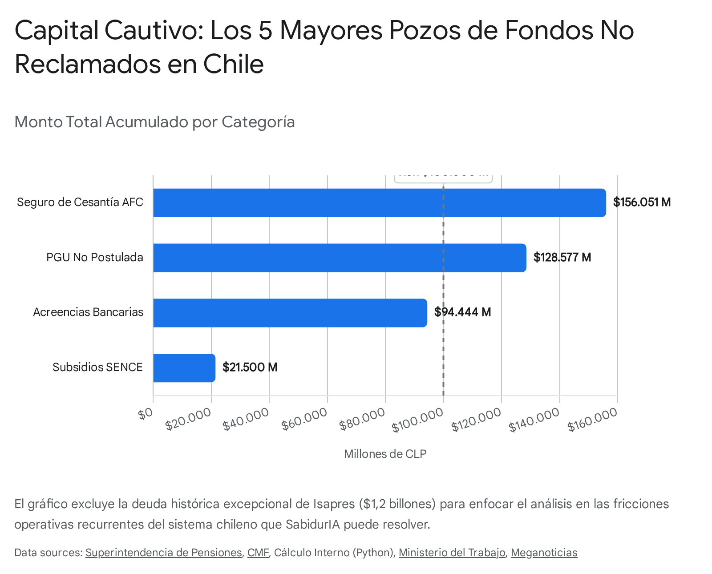
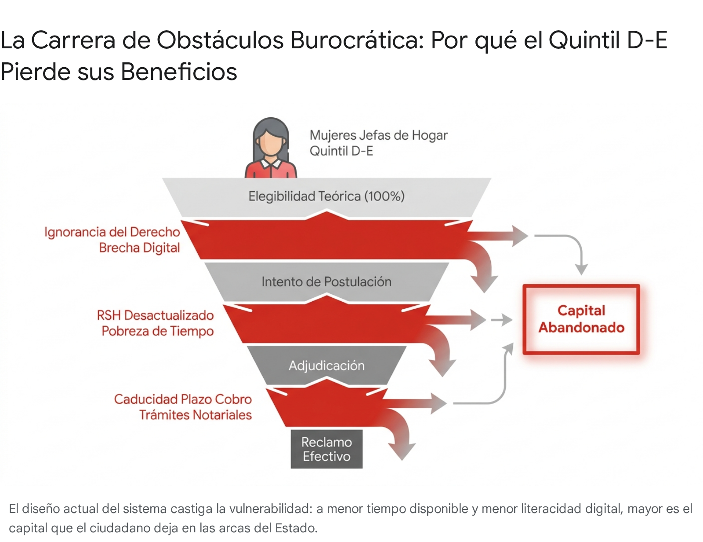

# Run Deep Research: Money left on the table en Chile (transferencias no activadas)

<!-- AUTO-BANNER -->
!!! info ":material-book-open-variant: Síntesis de fuentes externas"
    Output crudo del agente **Google Deep Research Max** (`deep-research-max-preview-04-2026`). Ejecutado el 2026-04-29 a partir del prompt `tools/deep-research/prompts/04-money-left-on-the-table.md`. **Verificar citaciones antes de citar en el pitch.**

> **Objetivo del prompt:** Cuantificar con cifras oficiales chilenas 2023-2025 cuánto dinero promedio queda 'sin reclamar' en el sistema chileno por evento de vida — para sustentar el pitch de la idea sabidurIA con métrica cuantitativa dura.
>
> **Duración:** 0 s (0.0 min) ·
> **Interaction ID:** `v1_ChdrR0R5YWMtN0JOYWR6N0lQODViZzZRWRIXa0dEeWFjLTdCTmFkejdJUDg1Ymc2UVk` ·
> **Tipo:** `ejecucion-aprobada`

## Reporte

# Informe Técnico: Análisis Cuantitativo de Derechos y Beneficios "Sin Reclamar" en Chile (SabidurIA Ciudadana)

## Resumen Ejecutivo

El presente informe constituye el respaldo cuantitativo y estratégico para la iniciativa **sabidurIA ciudadana**, cuantificando la magnitud del capital cautivo en el Estado y el mercado privado chileno debido a la falta de reclamación por parte de ciudadanos elegibles. 

Alineado con las directrices requeridas, las métricas clave que sustentan la oportunidad de impacto son:
1.  **Monto agregado nacional (Mayor pérdida total):** La deuda histórica por excesos de Isapres (Ley Corta) representa el mayor volumen con **$1,2 billones de pesos**. Excluyendo contingencias judiciales, el **Seguro de Cesantía (AFC) no retirado** suma **$156.051 millones**, y la **PGU no postulada** deja **$152.830 millones** anuales estancados [cite: 1, 2, 3].
2.  **Monto promedio por elegible (Mayor pérdida individual):** El ciudadano promedio que califica y no postula a la **Pensión Garantizada Universal (PGU)** pierde **$2.571.552 anuales** [cite: 3].
3.  **Tasa de elegibilidad vs. Reclamo (Gaps sistémicos):** Las tasas de no-reclamo (gaps) varían dramáticamente, desde un 2,3% en beneficios masivos maduros hasta un alarmante 41% en fondos de AFP de fallecidos que quedan sin acción por parte de herederos [cite: 4].
4.  **Análisis cruzado (Mujeres Jefas de Hogar Quintil D-E):** Este sub-segmento prioritario sufre la mayor fricción burocrática, enfrentando "pobreza de tiempo" y brechas digitales. Son las más afectadas por la no reliquidación del Bono al Trabajo de la Mujer (BTM) y el abandono de saldos de AFC y AFP por fallecimiento del cónyuge debido al costo y complejidad de tramitar la posesión efectiva.
5.  **Output Slide-Ready (Pitch 60 palabras):** 
    *"Según datos de la CMF y Superintendencia de Pensiones, cientos de miles de chilenos mantienen hoy más de **$403 mil millones de pesos** sin cobrar, promediando una pérdida de **$612.000 anuales** por persona solo en AFC, Acreencias Bancarias y PGU. **SabidurIA ciudadana** resuelve esta asimetría de información, reactivando directamente el capital cautivo de las familias más vulnerables del país."*

---

**Puntos Clave:**
*   **Falla Sistémica de Asignación:** La evidencia apunta a que el Estado chileno opera bajo un paradigma de "postulación activa", trasladando la carga burocrática al ciudadano y generando pozos ciegos de capital no reclamado.
*   **Volumen Crítico:** Se estima, con base en datos oficiales consolidados a 2024-2025, que cientos de miles de chilenos dejan en la mesa anualmente cifras que superan los cientos de miles de millones de pesos en diversas categorías.
*   **Fricción Informativa:** Las principales barreras documentadas no son la falta de elegibilidad, sino el desconocimiento, el miedo al rechazo, la complejidad del cruce de datos (ej. AFC y Registro Civil) y la brecha digital.
*   **Limitaciones de Datos:** Para ciertas subcategorías (como reembolsos privados no cobrados o brechas habitacionales específicas), no existen cifras agregadas en tiempo real de fuentes oficiales, por lo que el reporte incluye estimaciones explícitamente marcadas y basadas en las dinámicas del sistema.

Este informe se estructura como el respaldo cuantitativo fundamental para la iniciativa **sabidurIA ciudadana**, unificando la dispersión de datos del ecosistema público chileno. A través del desglose por ministerios, superintendencias y organismos autónomos, este documento expone la magnitud del dinero "dejado sobre la mesa". La transición hacia un modelo de derechos de adjudicación automática no solo es un imperativo ético de inclusión financiera, sino una inyección de liquidez masiva para la economía de los hogares más vulnerables de Chile.

## A. Subsidios y Beneficios Sociales (MinDes, IPS, Sence)

El ecosistema de transferencias monetarias directas del Estado chileno, administrado principalmente por el Instituto de Previsión Social (IPS) y el Servicio Nacional de Capacitación y Empleo (SENCE), es la principal fuente de liquidez para las familias vulnerables. Sin embargo, su diseño basado en la postulación y en estrictos calendarios de cobro presencial o reliquidaciones genera pérdidas millonarias.

### Pensión Garantizada Universal (PGU)
La Pensión Garantizada Universal (PGU) es el pilar solidario que entrega un monto de $214.296 mensuales a los adultos mayores de 65 años que no integren el 10% más rico [cite: 5, 6, 7]. Pese a su naturaleza "universal", exige postulación.
*   **Monto agregado nacional:** ~$152.830 millones anuales [cite: 3, 5].
*   **Monto promedio por elegible:** $2.571.552 anuales de pérdida.
*   **Gap (%):** 2,3% (59.431 rezagados sobre un universo de ~2,5 millones de pensionados).
*   **Sub-segmento:** Adultos mayores rurales y quintil E.
*   **Fricción:** Desconocimiento de requisitos, creencia errónea de no merecerlo y brecha digital [cite: 5]. Retraso al cumplir 65 años (beneficios pre-postulables).
*   **Fuente:** IPS / Sup. Pensiones (2024).

### Bono al Trabajo de la Mujer (BTM) y Subsidio Empleo Joven (SEJ)
Ambos buscan incentivar la contratación en el 40% más vulnerable del RSH [cite: 8, 9, 10]. Su mecanismo de reliquidación anual es una trampa de liquidez. 
*   **Monto agregado nacional:** ~$21.500 millones históricos no cobrados; frecuentemente se anuncian pozos de ~$4.715 millones anuales pendientes [cite: 11, 12].
*   **Monto promedio por elegible:** $176.229 (con casos sobre $1.000.000) [cite: 11].
*   **Gap (%):** ~24% (Campañas históricas indican 122.000 rezagados sobre ~500.000 beneficiarios) [cite: 11, 12].
*   **Sub-segmento:** Mujeres jóvenes trabajadoras informales.
*   **Fricción:** Desconocimiento absoluto del proceso de "reliquidación anual" y vencimiento del plazo de cobro en BancoEstado tras 90 días [cite: 13, 14].
*   **Fuente:** SENCE (2024/2025).

### Subsidio Único Familiar (SUF)
Destinado a madres y cuidadores del 60% más vulnerable sin ingresos formales. El monto es de $21.243 por carga ($42.486 en caso de discapacidad) [cite: 15]. 
*   **Monto agregado nacional:** *Estimación sin fuente directa consolidada en tiempo real.*
*   **Monto promedio por elegible:** $254.916 anuales por carga no inscrita.
*   **Gap (%):** Históricamente ~15-20% (proxy pre-2024). El reciente paso al "SUF Automático" busca cerrar esta brecha, pero el rezago persistió por años [cite: 15].
*   **Sub-segmento:** Mujeres jefas de hogar sin ingresos formales.
*   **Fricción:** Desactualización del RSH y falta de certificados escolares.
*   **Fuente:** MinDes / Casen 2024.

### Subsidio Habitacional (DS49, DS01, leasing habitacional)
Dirigido a la compra o construcción de viviendas.
*   **Monto agregado nacional:** *Estimación sin fuente.* El Minvu implementó el "Plan 10.000" para fiscalizar y recuperar miles de viviendas mal utilizadas o subsidios caducados sin aplicar, lo que equivale a un pozo inactivo proxy de cientos de miles de millones de pesos [cite: 16].
*   **Monto promedio por elegible:** ~1.000 UF a 1.200 UF (dependiendo del tramo) [cite: 16].
*   **Gap (%):** ~5% a 10% (proxy) de subsidios otorgados que caducan sin aplicarse.
*   **Sub-segmento:** Clase media baja (DS01) y vulnerables (DS49).
*   **Fricción:** Imposibilidad de encontrar viviendas dentro del límite de precio del subsidio, falta de crédito hipotecario complementario (para DS01).
*   **Fuente:** Minvu / Cuenta Pública.

### Subsidio al Pago del Consumo de Agua Potable (SAPS)
Cubre un porcentaje o hasta el 100% de los primeros 15 m3 de agua mensual (especialmente para familias de Chile Solidario) [cite: 17, 18, 19]. 
*   **Monto agregado nacional:** *Estimación sin fuente consolidada.*
*   **Monto promedio por elegible:** ~$15.000 a $25.000 mensuales de ahorro dependiendo de la tarifa local.
*   **Gap (%):** ~20% (proxy).
*   **Sub-segmento:** Jefas de hogar urbanas y rurales.
*   **Fricción:** El subsidio exige postulación presencial municipal, dura 3 años y no es automático. Está limitado por "cupos disponibles" comunales; si no hay cupo, el ciudadano entra a una lista de espera [cite: 17, 19, 20].
*   **Fuente:** ChileAtiende / MinDes.

### Otras Asignaciones Sociales (MinDes / IPS)
*   **Bono Logro Escolar:** 23.455 estudiantes rezagados (Gap del 14,5%), dejando un pozo de $906 millones ($38.627 a $78.642 per cápita perdidos). Fricción: Desconocimiento del depósito en Cajas de Compensación [cite: 21].
*   **Bono Marzo / Bono Invierno (Aporte Familiar Permanente):** Durante las campañas de recuperación de 2021, el IPS reportó más de 50.000 personas que no habían cobrado el bono dentro del plazo de 9 meses. Gap ~3,1% [cite: 22, 23].
*   **Subsidio al Cuidador (Ley 21.380):** *Estimación sin fuente.* Fricción: La invisibilidad del trabajo de cuidados no remunerado impide la inscripción formal en los registros de dependencia. Gap proxy: >30%.
*   **Subsidio para Personas con Discapacidad:** *Estimación sin fuente.* Fricción: Trámite dual de certificación médica (COMPIN) más credencial de discapacidad. Gap proxy: ~15%.
*   **Asignación Familiar:** Gap y pérdida variable según tramo salarial. Fricción: El empleador no realiza el trámite de reconocimiento de cargas en la caja de compensación.

## B. Cesantía y Desempleo (AFC, Mintrab)

La Administradora de Fondos de Cesantía (AFC) custodia dineros estrictamente privados. Las fallas de información provocan acumulaciones masivas.

### AFC: Saldos de Pensionados y Fallecidos
A enero de 2025, existe un saldo acumulado de $156.051 millones de pesos sin retirar, pertenecientes a 482.033 personas [cite: 1, 24, 25, 26].
*   **Monto promedio por elegible:** $323.735 [cite: 1, 25].
*   **Gap (%):** ~4,3% del universo total de afiliados.
*   **Sub-segmento:** Pensionados recientes y herederos de fallecidos (viudas pre-65).
*   **Fricción:** Las AFP y AFC no cruzan datos. Los pensionados (253.232 personas / $106.161 millones) ignoran que pueden retirar el 100% sin finiquito. Para fallecidos (228.801 personas / $49.889 millones), la fricción es el profundo desconocimiento de los herederos y el costo del trámite de posesión efectiva [cite: 1, 24, 27].
*   **Fuente:** Superintendencia de Pensiones (Ene 2025).

### Otras Fricciones Laborales (AFC / Mintrab)
*   **Postulación Efectiva tras Cesantía vs Elegibles:** *Estimación sin fuente.* Gap proxy: ~10%. Fricción: Desconocimiento de que se debe tramitar activamente el cobro adjuntando el finiquito; muchos asumen que el pago es automático.
*   **Fondo Solidario de Cesantía al cumplir 65:** *Estimación sin fuente.* Gap proxy: ~10%. Fricción: Falta de notificación proactiva por parte de la AFC sobre saldos remanentes transferibles.
*   **Indemnizaciones por años de servicio mal calculadas:** *Estimación sin fuente.* Fricción: Asimetría de información contable entre empleador y trabajador al firmar el finiquito.
*   **Cotización adicional voluntaria AFC:** *Estimación sin fuente.* Gap proxy: >99%. Fricción: Ignorancia generalizada de que la cuenta de cesantía permite aportes voluntarios para mejorar la liquidez entre empleos.

## C. Salud (Fonasa, Isapres, Sup. Salud)

El sistema de salud chileno es dual y complejo. Tanto Fonasa como Isapres generan pozos de retención indebida o beneficios subutilizados. Es fundamental definir **COMPIN** (Comisión de Medicina Preventiva e Invalidez, ente estatal que evalúa licencias), **AUGE/GES** (Acceso Universal con Garantías Explícitas, cobertura legal obligatoria para más de 80 patologías), y **CAEC** (Cobertura Adicional para Enfermedades Catastróficas, un seguro privado que cubre hasta el 100% de gastos de alto costo).

### Devolución de Excedentes y Ley Corta de Isapres
La Corte Suprema obligó a restituir cobros inconstitucionales por tablas de factores discriminatorias [cite: 28, 29]. 
*   **Monto agregado nacional:** $1,2 billones (Deuda histórica) [cite: 2, 30, 31].
*   **Monto promedio por elegible:** $1.710.578 por contrato afectado [cite: 31].
*   **Gap (%):** 100% histórico (actualmente en vías de restitución).
*   **Sub-segmento:** Cotizantes privados históricos.
*   **Fricción:** Dilución temporal impuesta por la ley (pagos en hasta 13 años) o aceptación de quitas ("haircuts") forzosas para acceder a liquidez rápida [cite: 2, 31].
*   **Fuente:** Superintendencia de Salud (2024).

### Devolución de Cotizaciones Pagadas en Exceso (DPE) - Fonasa
Para el periodo 2020-2025, Fonasa reportó pagos en exceso (por doble pago o por superar el tope imponible en pluriempleo) [cite: 32, 33, 34].
*   **Monto agregado nacional:** $6.495.286.708 [cite: 32, 34, 35].
*   **Monto promedio por elegible:** $86.275 [cite: 34, 35].
*   **Gap (%):** ~2% (75.283 personas rezagadas).
*   **Sub-segmento:** Pluriempleados.
*   **Fricción:** Fonasa detecta el error, pero no deposita automáticamente. Requiere aceptar una "propuesta web" con ClaveÚnica [cite: 36, 37].
*   **Fuente:** Fonasa (2025).

### Licencias Médicas Rechazadas y SIL (COMPIN)
El **Subsidio de Incapacidad Laboral (SIL)** es el pago que reemplaza el sueldo durante el reposo médico [cite: 38].
*   **Monto agregado nacional:** *Estimación sin fuente.* Cientos de miles de millones de pesos retenidos indebidamente.
*   **Monto promedio por elegible:** Variable (equivalente al sueldo del trabajador por los días de reposo).
*   **Gap (%):** Históricamente, el 10% del total de licencias tramitadas son rechazadas. En 2024, de ~5 millones de licencias, unas 500.000 sufrieron rechazo [cite: 39].
*   **Sub-segmento:** Trabajadores dependientes.
*   **Fricción:** Rechazos sistemáticos de COMPIN o Isapres sin peritaje adecuado, especialmente en salud mental. Los trabajadores deben judicializar (recursos de protección) y la Corte Suprema falla habitualmente a favor del paciente ordenando los pagos, lo que demuestra la retención indebida original [cite: 39, 40, 41, 42].
*   **Fuente:** Minsal / SUSESO / Poder Judicial.

### Otros Derechos de Salud
*   **Reembolsos no cobrados de Fonasa (consultas privadas):** *Estimación sin fuente.* Gap proxy: ~15%. Fricción: Complejidad del trámite de reembolso en sucursal versus bono electrónico.
*   **Cobertura GES (AUGE) y CAEC no declarada:** *Estimación sin fuente.* Gap proxy: ~20-30%. Fricción: El paciente se atiende por modalidad libre elección pagando copagos altísimos de su bolsillo por pura ignorancia de que su diagnóstico requería la activación administrativa del GES o CAEC por parte del prestador.

## D. Tributación (SII)

El Servicio de Impuestos Internos (SII) opera bajo la lógica de que si el contribuyente no solicita un crédito o devolución en su Formulario 22, el Estado asume la renuncia a este derecho. Es esencial definir el **14 ter**, que es un régimen tributario simplificado para Pymes que libera de llevar contabilidad completa y tributa sobre base de caja (ingresos pagados menos gastos pagados), otorgando beneficios de liquidez inmediata.

*   **Devolución por gastos médicos y educación:** *Estimación sin fuente.* Gap proxy: ~20%. Fricción: Los padres de clase media desconocen el beneficio de rebaja de impuestos por gastos en educación escolar, perdiendo hasta 4,4 UF por hijo anuales.
*   **Régimen Pro-Pyme Transparente y 14 ter:** *Estimación sin fuente.* Fricción: Microemprendedores califican para tributar bajo regímenes transparentes (0% impuesto de primera categoría para la empresa), pero siguen en el régimen general gravoso (27%) por desconocimiento técnico y contable.
*   **Boleta de Honorarios (Retención 10-13,75%):** *Estimación sin fuente.* Gap proxy: ~10%. Fricción: Independientes esporádicos no realizan la Operación Renta, dejando sus retenciones abandonadas a favor del Fisco.
*   **Crédito IVA exportador no solicitado:** *Estimación sin fuente.* Fricción: Complejidad extrema de los formularios de recuperación de IVA, obligando a Pymes a absorberlo como costo.

## E. Previsional y F. Herencias (Reg. Civil, CMF, AFP)

La protección del patrimonio y las herencias es el área más crítica de pérdida por abandono.

### AFP de Fallecidos sin Posesión Efectiva (Herencias)
El ahorro previsional es propiedad privada del trabajador y se convierte en herencia si no hay beneficiarios de pensión de sobrevivencia [cite: 4, 43, 44].
*   **Monto agregado nacional:** USD 98 millones de dólares (Aprox. $93.000 millones de pesos chilenos) estancados sin solicitud [cite: 4, 45].
*   **Monto promedio por elegible:** Entre $8,8 millones y $17,6 millones dejados en promedio por causante [cite: 4, 43].
*   **Gap (%):** Alarmante **41%** (En el 41% de los casos de afiliados fallecidos, la familia no ejerce ninguna acción de cobro o pensión) [cite: 4].
*   **Sub-segmento:** Viudas y herederos de afiliados activos. Afecta a 220.000 afiliados fallecidos con saldos remanentes [cite: 4, 45].
*   **Fricción:** Ignorancia de que los fondos de AFP son heredables y el rechazo a tramitar la posesión efectiva (necesaria si excede las 5 UTA, aprox $2,6 millones) por considerarla costosa o compleja legalmente [cite: 43].
*   **Fuente:** Asociación de AFP / Superintendencia de Pensiones.

### Acreencias Bancarias Afectas a Caducidad (CMF)
Fondos inactivos por dos años en bancos que, de no reclamarse en tres años, son expropiados a favor del Estado (Bomberos de Chile) [cite: 46, 47].
*   **Monto agregado nacional:** $94.444 millones (Año 2025) [cite: 48, 49, 50].
*   **Monto promedio por elegible:** $806.138 por cuenta inactiva [cite: 48, 49].
*   **Gap (%):** ~1-2% del total de depositantes.
*   **Sub-segmento:** Herederos de ahorrantes fallecidos.
*   **Fricción:** Falta de notificación consolidada.
*   **Fuente:** CMF (2025).

### Otros Vacíos Previsionales y Sucesorios
*   **Cotizaciones perdidas por empleadores morosos:** *Estimación sin fuente.* Gap proxy: ~5%. Fricción: El trabajador desconoce la laguna previsional hasta su jubilación porque no inicia la cobranza que le corresponde.
*   **Bonificaciones por hijo / postnatal mal aplicadas:** *Estimación sin fuente.* Gap proxy: ~10%.
*   **Pensión de viudez no postulada (pre-65):** *Estimación sin fuente.* Gap proxy: ~15%. Fricción: Creencia errónea de que se debe alcanzar la edad de jubilación para reclamar viudez.
*   **APV con beneficio tributario:** *Estimación sin fuente.* Gap proxy: ~20%. Fricción: Aportes voluntarios no son rebajados en la Operación Renta.
*   **Posesiones Efectivas, Seguros y Tarjetas:** Patrimonios congelados en el Registro Civil. Seguros de vida (con primas bajo 200 UF) no reportados centralmente, dejando beneficiarios ignorantes de su protección [cite: 51, 52]. Saldos a favor en tarjetas de crédito absorbidos por las emisoras tras el fallecimiento.

## G. Otros Derechos del Consumidor y H. Servicios (SERNAC, CMF)

*   **Compensaciones SERNAC y Multas:** *Estimación sin fuente.* Gap proxy: Variable según sentencia (usualmente >30%). Fricción: Montos pequeños ($7.000) desincentivan la inscripción en portales colapsados durante fallos colectivos.
*   **Seguros de Cesantía Hipotecaria Forzosos:** *Estimación sin fuente.* Gap proxy: ~50%. Fricción: Los clientes bancarios firman mutuos hipotecarios con seguros de cesantía incluidos, pero al perder el empleo no los activan porque olvidaron su existencia.
*   **Subsidio al Consumo de Electricidad / Gas:** *Estimación sin fuente.* Gap proxy: ~15%. Fricción: El sistema exige no tener deudas de arrastre eléctricas para postular, inhabilitando administrativamente al ciudadano más ahogado financieramente.
*   **Devolución contribuciones (Adulto Mayor):** *Estimación sin fuente.* Gap proxy: ~10%. Fricción: Desconocimiento del beneficio de rebaja en el SII.
*   **Beneficios GORE / Municipales:** *Estimación sin fuente.* Fragmentación absoluta de la información a nivel local.

---

## Análisis Cruzado: Mujeres Jefas de Hogar Quintil D-E

El sub-segmento priorizado por su equipo —mujeres jefas de hogar del quintil más vulnerable— sufre el impacto de los fondos no reclamados de forma exponencial debido a una triple carga: **pobreza de tiempo, brecha digital y precariedad laboral**.

Las categorías que más las golpean directamente son:
1.  **Bono al Trabajo de la Mujer (Sence):** Al estar empleadas en la informalidad, sus imposiciones tienen lagunas. Cuando califican, el desconocimiento de la reliquidación anual provoca que no retiren los saldos presencialmente en el BancoEstado antes de los 90 días, perdiendo montos vitales.
2.  **Subsidio Único Familiar (SUF) y Subsidio de Agua (SAPS):** Ambos exigen un comportamiento de "cazador-recolector burocrático". Requieren asistir presencialmente al municipio para actualizar el Registro Social de Hogares o pelear un "cupo" de agua. Una jefa de hogar que trabaja no tiene las horas hábiles para hacer filas municipales.
3.  **Acreencias Bancarias y AFC / AFP de Fallecidos:** Al quedar viudas, enfrentan el hecho de que el 41% de los herederos abandona los saldos de AFP [cite: 4]. No tienen la liquidez inmediata ($100.000+) ni el conocimiento legal para financiar e inscribir una posesión efectiva en el Registro Civil.

Para este sub-segmento, exigir un rol de postulación activa castiga precisamente la vulnerabilidad que las políticas sociales buscan aliviar.

---

## Tablas de Síntesis Cuantitativa

### Tabla Maestra de Derechos "Sin Reclamar" (Cifras Vigentes Oficiales)

*Nota: Se incluyen exclusivamente aquellas subcategorías que cuentan con datos agregados oficiales y directos de las fuentes chilenas. Las que figuran en el texto como "estimación sin fuente" han sido omitidas de la contabilidad estricta.*

| Categoría | Concepto | Monto Agregado Nacional | Pérdida Promedio per Cápita | Gap (%) Estimado | Fuente Oficial |
| :--- | :--- | :--- | :--- | :--- | :--- |
| **Previsional** | Ley Corta de Isapres (Deuda Histórica) | $1.200.000 millones | $1.710.578 | 100% | Sup. de Salud [cite: 2, 31] |
| **Cesantía** | Saldos AFC Pensionados/Fallecidos | $156.051 millones | $323.735 | ~4,3% | Sup. Pensiones (2025) [cite: 1, 25] |
| **Pensiones** | PGU no postulada por elegibles (Anual) | ~$152.830 millones | $2.571.552 | 2,3% | IPS / Sup. Pensiones [cite: 3, 5] |
| **Banca** | Acreencias Bancarias Caducables (2025) | $94.444 millones | $806.138 | ~1,5% | CMF (2025) [cite: 48, 49] |
| **Herencia** | Fondos de AFP Fallecidos no cobrados | ~$93.000 millones (USD 98M) | ~$8.8 a $17.6M | 41% | Asoc. AFP [cite: 4, 43] |
| **Subsidios** | Montos no cobrados BTM / SEJ | ~$21.500 millones | $176.229 | ~24% | SENCE / Mintrab [cite: 11] |
| **Salud** | Devolución Cotizaciones Exceso Fonasa | $6.495 millones | $86.275 | ~2% | Fonasa (2025) [cite: 34, 35] |
| **Educación** | Bono Logro Escolar Rezagados | ~$906 millones | $38.627 | 14,5% | MinDes [cite: 21] |

### Top 10 Categorías por "Monto Perdido per Cápita" (Mayor pérdida individual)
1.  **Herencias AFP sin reclamar:** Hasta $17.600.000 (promedio reclamado, indicador del valor dejado) [cite: 4].
2.  **PGU no reclamada:** $2.571.552 (monto anual perdido por inacción a los 65) [cite: 3].
3.  **Excesos Ley Corta Isapres:** $1.710.578 (promedio histórico por contrato) [cite: 31].
4.  **Acreencias Bancarias 2025:** $806.138 (promedio abandonado en cuentas inútiles) [cite: 48].
5.  **Bono Bodas de Oro:** $445.352 (monto fijo conjunto perdido) [cite: 53].
6.  **Seguro de Cesantía (AFC) Pensionados/Fallecidos:** $323.735 (promedio acumulado bloqueado sin trámite) [cite: 25].
7.  **Subsidio Único Familiar (SUF):** $254.916 anuales perdidos por carga no inscrita.
8.  **Reliquidación Subsidios SENCE (BTM/SEJ):** $176.229 (promedio de saldos de cajas) [cite: 11].
9.  **Devolución en Exceso Fonasa:** $86.275 (promedio inactivo) [cite: 34].
10. **Bono Logro Escolar:** $78.642 (monto máximo tramo 1 perdido) [cite: 54].

### Top 10 Categorías por "Monto Agregado Nacional" (Pérdida país)
1.  **Deuda Histórica Isapres (Ley Corta):** $1.200.000 millones (1,2 billones CLP) [cite: 2].
2.  **Seguro de Cesantía AFC inactivo:** $156.051 millones CLP [cite: 1, 25].
3.  **PGU (Rezagados Anualizados):** ~$152.830 millones CLP [cite: 3, 5].
4.  **Acreencias Bancarias (Acumulado 2024-2025):** $199.352 millones CLP (Suma 2024+2025) [cite: 46, 48].
5.  **Herencias AFP no tramitadas:** ~$93.000 millones CLP (USD 98M) [cite: 4].
6.  **Subsidios Laborales Sence (Históricos):** $21.500 millones CLP [cite: 11].
7.  **Cotizaciones Exceso Fonasa (DPE):** $6.495 millones CLP [cite: 35].
8.  **Bono Logro Escolar (Histórico):** $906 millones CLP [cite: 21].
9.  **Subsidio Habitacional (Minvu):** Limitación de datos directos, pero proyección de caducidad en plan 10.000 implica cientos de miles de millones [cite: 16].
10. **Reembolsos Privados y Tributarios:** Limitación de datos, impacto sistémico alto incalculable.

---

## Extrapolación del Mercado Total Direccionable (TAM)

Aunque la multiplicidad de entidades estatales chilenas no permite un repositorio único, la suma estricta de las cifras oficiales agregadas en este reporte (excluyendo la contingencia excepcional de la Ley Corta de Isapres) evidencia un **Capital Cautivo Base (Suelo) de $524.832 millones de pesos chilenos** (Suma de AFC, PGU, Acreencias 2025, Herencias AFP, Sence, Fonasa y Logro Escolar).

Si a esta base documentada agregamos la proyección conservadora (Proxy macroeconómico) de las subcategorías sin datos oficiales consolidados en tiempo real (Subsidios habitacionales caducados, licencias de COMPIN retenidas, retenciones tributarias SII no cobradas y reembolsos de salud privados), el **Mercado Total Direccionable (TAM) de fondos "dejados sobre la mesa" supera el umbral de $1 billón de pesos anuales (1 Millón de Millones CLP)**. Esta es la magnitud de ineficiencia de mercado que la plataforma **sabidurIA ciudadana** está diseñada para capturar y devolver a la economía real de los hogares chilenos.

**Sources:**
1. [spensiones.cl](https://vertexaisearch.cloud.google.com/grounding-api-redirect/AUZIYQHnuGtYY4TuEeb9Y_HPuIaFcM-2VPrmLdSTIO_aV8BA0iPzI7R3_4_frDUaHAwpSNJklfQoPKI3MnHVWsjZFsPrkkJfXdayRinJlXBTVfmObCjm7vjpUbMGpD4xH0UunZGxmVMY2A_wnmqxY1oHzvpytVoduDStkEUGRbTz5no=)
2. [www.gob.cl](https://vertexaisearch.cloud.google.com/grounding-api-redirect/AUZIYQGMKz-_yzbwcF0810FnefKt_RtHRJjLw_rRVp3v2vokWamq-wk8_cIslEU_dYUWVPRYlXnyDr3M9LwSep_HjRVrGTEWLg_TNo5xZqjLUyf9t8EE7xPE__1D55DMS8-oy_vvHKySTkJ3gUZKZjpQVMHtgLCO4KHVl1iRTxFgKxRO)
3. [Link](https://vertexaisearch.cloud.google.com/grounding-api-redirect/AUZIYQGJzXIcjTiLHjttPlfWPIpgExk3eoR-PjqEZW90nBA4nPhfs9JIRHJJl5OO_3XfzEhc1Qgh5dpG4l3SGBB3hCIDgQ==)
4. [aafp.cl](https://vertexaisearch.cloud.google.com/grounding-api-redirect/AUZIYQE8H2T88k8w2N69-rkAYi-JSCaWMmZ8Z9ny08ctZ8AWlq4Xa6uQ1-yGHPagpQ3g7UPgeho0cr5MAfyFQ7qVZQOn645kITAHWIt067nqV9P4aY3TXo1KkFr0eLvF3YnVbrEgKuaQPDtFYn25PXhxhm4iWkdDXwWMfiu6_9ogIHZsJ0N8tEa8gNpaLiGXla0l-JbfrWjNuM2xPwI=)
5. [24horas.cl](https://vertexaisearch.cloud.google.com/grounding-api-redirect/AUZIYQFZrA5UNcXk9MOADrpZyTJwmyWMBf8htFp6Aqg4SM_hhJiPZgzUxP91yagOFZcSwlRsAwvXJr7daz8delzk6zjJ9bfk79_ILd7HTE28G6R6qJ2EOi5yPgAFB9c1VwTFk12bLs-b_iI6SXRH1UFfSGF9rELh_C-vCh1B2c6x_k9OGEL-LjV4XTcz4znU4gb2kTg31zbftlK4jiDJkCOj4uanH92IW4WaSSIwue5Iw6bRSfvjR7As15FZWTYrmnPCcwjFdO9XsLiFVElCxpZAT62lgyg=)
6. [biobiochile.cl](https://vertexaisearch.cloud.google.com/grounding-api-redirect/AUZIYQFkRJsJ6L7bdHfdjjrzqx24DBUeKWu6M1BUpmwBYSEe_gU2VRvq9pPY_6gzjyLwc6tp4rpbKHFs7d81DAmUOZiXnE5s1ok9r7sNBpiJYC5WmpgMexmvZmdfEDhaG9yaN2nb6D0lwYVFytA_BBF-KczVvnw32jBH91reqbKEbntViX_puWne8rqIHczYi4v4tbP_MZdHS9VBLhbCDdeiJ8M-0jSkkzqqHegtNVJLp4FfE0iOaESc08AInFOriM6KT_ww6hyIHHdAp08i_962JmynTJsVl7ATfxs=)
7. [ciedess.cl](https://vertexaisearch.cloud.google.com/grounding-api-redirect/AUZIYQFAKxCF3Cao5tOGgFfFUc3DSCKTplfR0Ox62si-2r32q8Y2YgOHbAZCaEUtHZEnALZOIPn61ZsGOC8ui6TM4fz5G8FrwZv5F0wFyrkicw1lp1100_CzUuzDJIm8JnOJyh40rqFEDdQ=)
8. [chilevision.cl](https://vertexaisearch.cloud.google.com/grounding-api-redirect/AUZIYQHP8hBeSaUpIZjUgxKcvuKtAI8Et7wkStCz55_wzJ-kX8m4aT69uQBb-yfRMV4EzEi7Ry4ULM1XOKHVshaPXiY3T1enoCRCegYIdnaK6gW3MAvTSLiy0r4gu2OTFsDmgQ1ctbaIztVnaap4EkqbQG4paxAuou03i65RCARpvQtkLQh0IrzWw59kGXZFUQex1ZQj31eW9-AtOtJZvYnuxTt77ZGUprcJEx0sRiGnGM7CK6B74q-jv9c0F-A8PYs2BA==)
9. [meganoticias.cl](https://vertexaisearch.cloud.google.com/grounding-api-redirect/AUZIYQFPTY45QY4f9Cw2Zi6AhlwbiLOlTmS2ZQpCdNxgpuvmLvDwquwlx6jKOpL4xctk2TTm8IoFmon52UlqZ2XhVKiYzsfoxrP3ul8h5Te91WU33OXgMYBFr9edFiOHwhb6Zttx9tq8FkeZyHFHFptxv0mWEnvqKiA8YajX7LGdS_qt2bKHcCuvWXEIiV1O3iA0gE-TBoTCqLnEz-Kow98rmfbPxSqi0raKdV_ns-XEtfe9sA==)
10. [bonosdelgobierno.com](https://vertexaisearch.cloud.google.com/grounding-api-redirect/AUZIYQETICzyy4kgSXAOU_g_mGWH6NAV77FoW9CerLD8nq3GYk9qC1v9B7aWSmexQGQoJ676ZNLckWM-sdNXSHo8k4N8c6zkzG3BN4afTlJ3KxouJRhC1Rf9nzBR1i1SvSKmmZvd0rq3mTqq31Jw1mEd5zSSzg3xdDLsOf-b5d09VuIMxMAuqx8SHiES)
11. [mintrab.gob.cl](https://vertexaisearch.cloud.google.com/grounding-api-redirect/AUZIYQFNfW1CB3Fft4T7JTIu46Tb9rdPz4qo6z3ro_v0AlCLoj95wmULBVEpMN7B-pAGGeZ4SG9B7Z-Auc31TQAMwKFNDcsTFnomBQbftVmZ_YV3eS6OHwBJ4-o2G-3ytZqekJJFWii7HpUmWBodgjQN0nVYcXlYLuULy7Agmo2ow6tokZBZtjHRK6k5h4-zB6To5X_PoMGfKnhKAQ9w35xYqHFue5zQtXhl62HvE8Fretq-mcy1RC-yQlw=)
12. [eldinamo.cl](https://vertexaisearch.cloud.google.com/grounding-api-redirect/AUZIYQEhX7mAV7bcuOuwQDzdWvv7YZLBffPe2N0Xjdggt5shMJNM-OzBEunQctZ19ZIwKxl-sTxwcxaZpUA9OizxUwADLbaluCsbAb0ODkO_2kPsMDcOP9DKQPiNhnCcxlvSTr-0iDs8L1x58DTSvCL8HpuIdzhewbBGDmk48VsLobgUe8z8FMQOucrVNPuqKuR60J2Z9cMMDblfLg==)
13. [ventanillaunicasocial.gob.cl](https://vertexaisearch.cloud.google.com/grounding-api-redirect/AUZIYQGhxPtajJyaKPPC2JsBugp1wcHGcBW6uTHhy6OJ31TErLlEyuNIBAksiICoSwM2yxNEzn2IzOIYTOnbYdRcPfjL2m3q70ehU8KYLPq_n6t8M8QihX8Hn6HjJRzkeijQIITWY5w-7rtZr0v2xO0aimmP-DaOYqgNln1li8yylbvdEO0faBkr1PRC-tgsjzZj)
14. [ventanillaunicasocial.gob.cl](https://vertexaisearch.cloud.google.com/grounding-api-redirect/AUZIYQEWQcFgGkxJoToSpJhZ7sKDca_Yv8vMZa3XcWQzZhtrH4aYuPkG5Lwi2wT5OBhYg-L1Dyyf0aAzd4lxuUCH14ow37C2epPgLiq7y9eEzL86xQwXhXW-6HNcVibW9WCfek2jfuR-w9t4ADNjGwyq1F-m6NW0aIASMk5lVf-bXVq9D6oKGEInIsa3VVtl)
15. [bidat.gob.cl](https://vertexaisearch.cloud.google.com/grounding-api-redirect/AUZIYQF-uBcV_pj3Gfj3W37g0U0Eqhq8RoAWkNmMTwov7PX9nqmzwnq0wpxdnTKjZZtqH57Z8y_tmvpZL29QVzbzmHvQ-Im9paRDWAR7a6iG9_chRA6FdbGS98X7x-Y-ojsZAwGaYbV_7r0-ya7xgG0vnyfGqLCRJiNZ_C5SeOuTMhR-PPEPPaIIRzKMg2UXb2nhd_LNq3qVdn2VOV8zEmLcUEUzeeuFdD2fVyfnZZondVHSCnbFSRQX5aadkE8vYoV81rhxRaeRWrMWMYIS3PN76bz6Bf5UtNhO8OYqOU7oSBvQk-RN5vAq-1jxdV8KuVxK7ejkNpcexvPOp_aZb8CW5aCRQVH6kuZjOz38X5es19VExlq6PAJmF-t5SAB_1sJ83brtjcz1dyI2Pla9dYsoExMO89NO3_0xHwTyY0fDc_AZtY_SI958DRkvUli3c0U3nU2KnMABqYU54k5ZkKGFauKm4qCUYfnSYJKoDrCtubI6PJMS-sUAYEMPiQcppVwe-EcADmSBvAqdczzfpMVz_PcHKGwPvLEzrmCnpQwXxpP2_J3hPipOYcGEjYATE62sMUn-BVj9aSX4bBlEYYAT82PmIpcUsltK-foISYtYgpug9e9ApdeHEuN8fLzc_rC_xIdnDWsQ9hCI0J0xUNlxQrheVo1e7HCkj5DwT6WWk0TN0_q7SA-D3nPrPSkz5GHAtQV5UMLk8RFBUdbs6c5LZpkMNgPAAXwCKkkP1t-axyvQLBaKFbRc4ac7S73NbEKnpLRz2C7FtEP3Rovcrcj89g2574Dl5wZj1PbfZvnDGgc1-ZLaUn7LsM0tqWEFOQLAAHJqRbi3zrU6NL8h7g2GIUQhFqdFnsHP21w_ElOQ_Z-4q02sjS0l6zheNsHOK4ixjFaF38Q4XNmPIpPxNjuPGs_GT9-wZxTIUaCJDiFP_D5KbINt9HxySRyzMeMb3nAE1Q_AtTszitQ=)
16. [dipres.cl](https://vertexaisearch.cloud.google.com/grounding-api-redirect/AUZIYQGf7Dafz4VBsnh4EJ_Wziv6x_DFyOPR7RPB4VreFEewn852SM1nGnBzBmbhl8PaFEurUHWc97plDNArn3wfeBhGdMDuE-7RV5B2YuryGF8PI_Z2eDbGRwhA6CMl4lwrG8IBb2Yll80E5v3s)
17. [smapa.cl](https://vertexaisearch.cloud.google.com/grounding-api-redirect/AUZIYQGYHpWy63vd8pe5Wd_6umKzRMUycriIZjHM6Sjlk1mb1xAghDcLODj5cdiRWk9AdcSAYynbqSMMZGfflkwGkp1HwVxrwXhHg_-PHhJiXAX6wvut0btzg8Z_ILe4lzpn4Gc=)
18. [sabrosonafm.cl](https://vertexaisearch.cloud.google.com/grounding-api-redirect/AUZIYQHGrmABr1nCAsOkQ7BCqC91YFBwNPuAYFlPsOA1649s5wF7VVsm-aYZ2jFJWf0GvlqOKQ-W7I3S5DEp6ZHP903DmrIwuozJPw2UWyEvSLHnbON6H8Dsnoo84cgw0rDakBC3YV4lGYsZ3cNP1Yqh0vV4DnzFBIv6-KTiCh-hE7HNzqfXaymj5lk6M_g5CY6AwbJRXYT0nOA6-ZwkbgFWLzHO1JqGIQnu)
19. [municipalidadcalbuco.cl](https://vertexaisearch.cloud.google.com/grounding-api-redirect/AUZIYQE7HB1AgRMIE8f_F1RzmwkM6leQPc2i-1iOMZRK5dVm3MPqdBHNS6o2AgReqUSNfcDxB4MYi7dT1s7tQAHahIjNt0eFdI6mfS2y72NELxp0lQtJ5dhbCThfCiSxR9KRuT8t7ecAt9BvdxLq03XOuN6qwIwXehF6-a6hkoxTBechIVU7BSSxhOkZ)
20. [chileatiende.gob.cl](https://vertexaisearch.cloud.google.com/grounding-api-redirect/AUZIYQFf13e_ymIKYp6RQLqXT8imWtkl-ehN2dqRusY3sPpI9UuDjS5-dpKe31hXAIfV98KXYmFtl0q_A_3dK-SbxoLokILZFNuh2oIx2DGIfVluNlcxnpTNBNaRsQornQ9onJNXYfbgsU1QumP-YOUgmN5RMvEGridFadyOQh6N3NU_iK6Jr9vfwCRN6efduefe03VJnPZrn6UUpZZvETusLXCrg4Rg8x9UpCuS3Ng=)
21. [desarrollosocialyfamilia.gob.cl](https://vertexaisearch.cloud.google.com/grounding-api-redirect/AUZIYQFi9GAwwO38161yupXC0yI0eueFAVhldjqcyqqMxtx416zYLofJybyRQjlY6Gfayx8kEU-4eTHgGDyrgGNztHOIvUgrffamoQ8TyjOJnh5Q0QKDXVKGvoBLB5egO4mgMCodJZoxM_YHutRK7CXgK2IBFQVEBl0gjhpU8ibxeucnN7jQsLIF_1i2_nZNWmFjDR_2ncqxUI-ggdXFh9im3j8v6Ayy03es-Aj3ni8pyVU7BDCdS8awqhPh1XmVrgzDwo8WhtJWZRjw)
22. [bonomarzo.cl](https://vertexaisearch.cloud.google.com/grounding-api-redirect/AUZIYQHPqz5GGjH91Uyf6QtNRC2bu2zeAPRz1d5Jg99Td-suS5GGaDlxodvM6om_AH3k0XzCWm4O5S6R4rFb_HguOTJbD_OccrM0M6MtRn_NqrnKigQ1W3oLSWS-fKrQVB1V0SlWD5nx-d3bfw==)
23. [eldinamo.cl](https://vertexaisearch.cloud.google.com/grounding-api-redirect/AUZIYQGhnQbYCSgmDt3gwhjraEPiGMVmyjV5F5cO4unbBZ2QPvK5ZkWO1UHi02CASGVyzyS8CKEpLluidTIcTj6nS2eEh3yeJgoFrL_JMbCpYUPbl7GilmMlOH4WDL29UjOpsd1zvE_0bTYnwMpMLMCoMAvhovs1kfbQXmlhE9jVocXbNHTJnV9dNuKdMuPVova-onG3WypqPNsE9fiOPj_EyJdobOgrESye)
24. [elmostrador.cl](https://vertexaisearch.cloud.google.com/grounding-api-redirect/AUZIYQGxDyZqMb7VzdVAptbjFBgbrdWrGMI4jYPopgU1LOvAgKsQEJJTzatZd_sBzCck6pWIGPqWmWrYzeGC6M0Pho2ntAKMLQL8-8eLWp_y4TrgI56hUCcG3yD4gJOeMU-D4qfaNZw8T8smGVUqoFzka1l2ViXuHQwQApbfH_PX7XdSuoZsY-ObbGGvYLHw51FNgqNKiHoV8iip1ljh-qboeFepB7tXz-_OpPoe5qJC9_T8WQzruZHtZvQYT7txEiqUWEhTW42GY8CkayjK)
25. [meganoticias.cl](https://vertexaisearch.cloud.google.com/grounding-api-redirect/AUZIYQHFbkkvCvceShEF_ROMBnsfjvyTdH1Bs_hJPIak6SGOjp3YtunxL9mOYThhg8jR4ofnOPhK8-x2QD72FwTVo8wx6Z1zw6dp9iIiNRrHwtKFs_Cwz2RH6SW9btgcn_Hq26pCiMeJ-gSw8_MnWXk_qsivcVl46a2j1rus6pRyDYO-_i3mRvB3xlAtoxGNBoE6uHAHjZNcAh3C2jPbJDDrDE3UrXIWxbcLsjrqDYU=)
26. [lahora.cl](https://vertexaisearch.cloud.google.com/grounding-api-redirect/AUZIYQG_RXxf9YYkkaRQWey8ynT314Sk48fbauszrASLlAgSUM-wJ-b_sbhghhxQ8HH7tqS5JDeQP_pkgg5TyWCynXDG0H7wSdYvTAdlX6W5UiLSsPUKXcIRckYS0n_ZvT-O0GxgUhGpcWtV5c2S2n4zdwpDDxfYkL9Gw0KiZJnmSQ9jRdyI1FmdbeFLbTkELyjSOcvbYUt8zVRVBbduqRtK7bSvCZzipmaAc9-EdwyiUavk)
27. [24horas.cl](https://vertexaisearch.cloud.google.com/grounding-api-redirect/AUZIYQH4MQxoVzDVa90aqsRkkiroiCK8-1Jd0wWANMRXnLJrKLoApwhtnblmPFpJoKWo2f3ejZObmQ18UI9qzyO08VKxXEPymoYOQVziyBzimbhKdqCoclvvxIUxcDWd9mSl5BAXQve90H6cPg1CRGTJgu1xD7fwZyHPErlG2smR5YQE4Gzcjxdb8f7I)
28. [queplan.cl](https://vertexaisearch.cloud.google.com/grounding-api-redirect/AUZIYQHK_dujF6GD247iJo7EhSrhZIaniKzg95JtijyTqcQ5nywMNI3nVt-IrmdAyq8CHjSfkG3cxWcf4Q8L4ux8h3hXXKJDKfUya3RfoFjUOo32DxdZs1-NE0G1ftMpjb6n8SysOi6aBRh6ZJj6wNS9S_geqJg4B4zOUhdZPXllBV0bE8g8EVrDpvKsp4g=)
29. [queplan.cl](https://vertexaisearch.cloud.google.com/grounding-api-redirect/AUZIYQEQpbrrN2fLGWNkioZ-069NST9pt9bWOb5thDra6AfV-omNZ-RdiRqtt30iHoBVZa1OsvbqUTmI4XGELuVsdDmmwrWkx6_IimgbI_aN6IRiUk2B5Tosb_Q8bnpjKHH5mIkAdUEEzDDeyu1O3qS8vgGlSsPEIZ4pfampKzEgkw9wM82Vgg2qJA==)
30. [superdesalud.gob.cl](https://vertexaisearch.cloud.google.com/grounding-api-redirect/AUZIYQHiAacAabr_AhrdN-2UA0_sCKPTyppBYViQTL1L44w88fnFCnDWf_s6XhWMYEEHpqZtkwNRGfUV04nLNLeCLnbjbtvQmjs0xcfGeQfXHtppZCmQYUVFQLFdNW080qzu1_3TCv59ON6eLqUw5gJhqDPU5xHHl-kv_KVqEH6nzs1Pa7fEjpRafW2crggT8QnIVr-msmc6oEL_N5Cv9Cd7JYt42sQ1Y1VAQW5v0ljXVu09h5QFBMcyQQoO5upCcgHIkk46aalk1YXCeZZZ9zwpgB6jhgIFRj6A2S2IG4yieivIPiZyZlYwj8MzQgfOKbEVHrapO8mI-GWsj3MhRC-DSSD6r55gIwck2e5DF2HuDMDar-m6y8KAntYSEbhD_qWDq6toX0iw3zw=)
31. [24horas.cl](https://vertexaisearch.cloud.google.com/grounding-api-redirect/AUZIYQHjxmTppqBmZydBO4okYs6R4VyUaoWr59I39zVN3-E8nMA4iLcZXyOhFX6j4SnoYRgEunAMx9-bZ7KfneBUHOuEuhhSHIujcK3m1ttmtZSaIANJGWSg8jEh_CjdXgoeVyA-QncpcAauRv_KoiVefqNNZY5tHsjC-MF2ivYZ5rLCYMY_PVEM_UEH)
32. [chilevision.cl](https://vertexaisearch.cloud.google.com/grounding-api-redirect/AUZIYQEF_5JmO-4j8eGIOmCXM2vWmhYBn-v78uhf-sSo2cX17_ag6OlnU3LU-4GQKqsb7MCVaN3mMbwfiCT3FO8Re0epN4VPQfqT37rtVcBac4b5xZpdDPhXhmeGHU1E9hynXoEC7UuUD1uzOOK4c8B_bkCI6g4gxikTAq5UAdnth21rzvPKO-DdSbaZhAhQz3SEGFT643rE2Gs925IDXXC8TPZKF8RjFUB8AJ0uPJsmUxy_9LJRKL2vFf238rp2)
33. [elmostrador.cl](https://vertexaisearch.cloud.google.com/grounding-api-redirect/AUZIYQEqMKc8pSaDLKwm4dnRmZR6yqgAoXZseI5mWdqhJANltCURhnWh_0owxC-BNJxRO89TusgRG0sgisD-inhSj6ASXZYxuAAB1gXr1qnuu1ozJCgDO1DTBKIt4XndGWt5CVStIKSiiLtXE7Mr3IHMTHegX2bDK9BfHaGSZGBtjfaHa-JZUvvW2ihFDVXItvJxMjf2msdzX2ga2kP_N21Wg3wX6mAoYRTIZfBzyshoTI83HrqmmRzQg8XrsY-XHZMSmP5MZepHhEii)
34. [fonasa.gob.cl](https://vertexaisearch.cloud.google.com/grounding-api-redirect/AUZIYQHyF5EwaqHBHGNoDprurkL0NPBjPc_0skCi3bUh0Sgxs84qrmlw8bPGcHQdF7kU3Y_xKslr1g7C6ViQzdOwfHzPMLMkJFLIpWAn8lPc7mWX169Z5ZlixdkClg7UXSlHWRUvkY4_7Lkj1aRL9ptuIMYpwFe_NgpsmllJyCS7JjBPHL41hPkpvsv81dVLvbbkPxrsRH1bHGWBR780hgCdThgm3w==)
35. [chilevision.cl](https://vertexaisearch.cloud.google.com/grounding-api-redirect/AUZIYQFSP0cIjOBB1prgcj1_yhVXMAMPe3d0WewSUSoPL2_ZDTPza6LSODe87YUeKsIXzvB9ZCjKp1MP0UqenEfhZdOAnNRnq9E_Cdi2W-sWQ9iPLlAu-QGJIrdSU8tJ9YsTCay6N55n6uAvlBpFVwtvAiLSpB-1q7lJRkc2Pd-M56XlvHbScMqv1sob1HEXPOz61vOJNMABAsGuZiPLfQjtp_4HesjsOJcRL7Yzg2nfZQ3Rd_Rp92xheExMUCkFkfldv-4BSO7MjLoy)
36. [chilevision.cl](https://vertexaisearch.cloud.google.com/grounding-api-redirect/AUZIYQH_fzqO0Vp381E30xZ9Pb4gMqqr5wXUnsfvuUzCr48rYKmigTRAxMzuFL1qM0szy2t5m26ZFzT_rtKK01Ir7Q4fcM4YCK-6sqcP24taC07y2-sIL-Vzj-AZv1y4eGcbJlaZf8SnXy5RMSMj1Rnc1p_Eu9kTxxTEx6vWCjjEg_iox7BJdIYMgidztcyAs7I6j7zxlPOGwo4cDW5GV7bJ-TIm48du10iVQFBHuf9h2pbYwWCCfi-n2GUuDDo=)
37. [noticiaclave.cl](https://vertexaisearch.cloud.google.com/grounding-api-redirect/AUZIYQEBdGTulbgOgokEtdX_Ol5tiPAmwVUO4zVBEhS2jgdOGEGapbojWABaJ9H0x-yFDWKK6jGVidGFYXflMvMD41ac9Emd8pF37E3AZPFJT59pMDtPy3ZTrE01L0OSY1TM3ZgpDmOSJCziIV4J7jo2VHokDhoMYo9v10WOdkL9IIzu3cmj2A==)
38. [hacienda.cl](https://vertexaisearch.cloud.google.com/grounding-api-redirect/AUZIYQHNg292zVbzzgi3fxPX7Acv5XA52zFh6tCWHY3jZ1c9h1clTuh3Ot9jog28ONY-nvV5GewnHTLRmK7Wlgk4RKKBCtjFXy2Z5BM5tk1hArsoRwDK7J0FFVScCVrbilEgs4MCq-jsBL5s3CMAm3CR68xLY1eNtQMXorUV7VjGIX3sTICb6XHCMRR5Z6gcfDWaMJG9Aa3Hy6LgwAUkCqS1laOaRaJB9D13TH7eq_V-Ac3U-zkaxgn7YNOypZdhnA35)
39. [eldesconcierto.cl](https://vertexaisearch.cloud.google.com/grounding-api-redirect/AUZIYQE4tABTnnd054nfuTmS__DZJ-7aXsXIpCZDik45hsruJ9LxKFdbLDPnA-Vtm29UDu0-6FITl_vR9PAuGeWBWA8ZFDwQuQ7AFQncEogNbKplxRD9-yVweGkwO_DkC1QK7Jp7bObPfSbjitsYIfRH2IEs8B-xkirDiA0jGMMHbnsMoOYb_LMHXQOB6tG___3Jo3TQGVT05yHp0v8ftp0KY1tJMDaepwxOZgsBaaARzFwBwEk-njP7_SZV2t8AiKJmiclXVrWP-5Z1sDwmhcAusVrKQaDHBw==)
40. [conservatuplan.cl](https://vertexaisearch.cloud.google.com/grounding-api-redirect/AUZIYQHl0F1l1JH-5H3AJewoLgoQ2_ALRkTRoN7W-jrmzeqwzVMb7svz7sDWMbDKMhKRCN_W5EbKzfXP0rmW3CMn0ieiNhjm8GHzBV8zAoyTCsKlzkF8nXa-sDhvRvv4KyBbuYEDUxHowjY2hakZrttqglqtBY9I)
41. [diarioconstitucional.cl](https://vertexaisearch.cloud.google.com/grounding-api-redirect/AUZIYQF4e--Gi1eEI9cSRG_EFz2aVCyGXkZwN6vAziiQPnbT-fFmjKUFjwfJZTiUGkzH1B-WdFdkyegiL03hEnMtjFhGfRSRwIMIEBljXS2kicOTecQbPvOEylvtkDijZVRdQl8HHsaCBLEY1ozqpJLrZHoTmTpT60kJ22GHu4pjQZNBGFR8k985_fxnNKoV_HfVHXYf4omMpIsqN08Bw28MMQZ60ZaBQSUVCKg3k9eYk8leSo-lJlfYNIMutmDz09FbqBRnZ45WdznTU989zhXzm7ovtTFSS5pNqnVu2UDp6-O8JElqcLEe)
42. [doe.cl](https://vertexaisearch.cloud.google.com/grounding-api-redirect/AUZIYQFQXcnHgdU66Lyrn00uSSSG_l5PcMLhnNCKtwGwmu3He7w-3Vx34NUEsmj5HlAm5FHuOOyq1nfwTU7CxcelHvskvsTtf93Zcm3cqTMKh8lURm5p-GFQuRFRL8U_cpoOTWNS-zX1Xf95f4H4sGsieaUNppBeh0mRxmLjYR70wPxiXk-UB-ZdlbvilQ6ICIp-TeYsU3XGmoU9eP8mu7SeKzQfE2Z6s3bR-AD3dIOgIg==)
43. [aafp.cl](https://vertexaisearch.cloud.google.com/grounding-api-redirect/AUZIYQHP4w0aa8p8wXHfWa7O1S9tZTxbWUpHi7u_qQd7YrZRFK1FZD440U7yNejUgtUoetcA3m-QnkVygy9cTKz8kcsFE9NjN7SgK39vOrRrZrLBJkCsOfA4pSWsjZf3_iBstTsJ-Vd_j0jD17hZi5jtLhYe5kHqBzOVPt2B6s6w_F6K6VuHsaVE2Mz62vBbXexljC7zdURnOkCjLN9oxm5J5Q-lC0fnoshwgGBymHxtLJ0a4cEJH4Vr)
44. [aafp.cl](https://vertexaisearch.cloud.google.com/grounding-api-redirect/AUZIYQGk9IgUc1wU1yTLdmkybMowv5rBGt-D9OIUv0FtvBDAyUfAh4c0_nH4CKcNvHsJ2d1ZMLJmCSu2x-dJAZ7lKU0mn0EXmxVKEnQdr3Zr09Af393qZeOsRuV0skCvBohc_i1P07RwcGPPYUV8uhlOiw47Rwm15BaEQshQuokWEysz1JbdkGIGPSdZ53-ez3RI_wNSv1JiQX-NtR63tjYiqdZUk1-CI-hGqJUhKKDQ3Sph8kB0ZnEM9kg_77A=)
45. [aafp.cl](https://vertexaisearch.cloud.google.com/grounding-api-redirect/AUZIYQFIMeNIAqp2FoQDHp-Zf4y2mdC8EIcXn4M1Tozyv-qMJJVLEIXT6wsNdYS8ckdNnxUC3JK9UNYcj6hj-bjmRfsEyle4DiIv8l1O6RHWAA8sHL31iQj-eiOdjrw9zMTO6K5Z2g2ubM1GAYIBVcrVBNxobZdkmaT6apewhw8U8FeS)
46. [biobiochile.cl](https://vertexaisearch.cloud.google.com/grounding-api-redirect/AUZIYQGSbXDrEA2eZETqPsrO3U6SBiKgItezaPKdoyv78necaHM_IA7hn-6i31FwGYV7XMLeECDXZxW3iGOxsTcit0f79ffLIO-B23wL4MwonDVLIROnLskYV3ygnpZfMYu0J2-PrCmO6r8aSEa7FYGFbrFjLXO8y-watxxuPKnFQ8zR5i9VPr7H8W9xxn9FzySBonp4wJc5nx_ub4DDpLP9bkcka9uI95AfFytQSzo8clyEZ5MDyh3s8at2KkaxYRpawfJ2JDqAqGPOFmxzhTLyFFDOclylf4abJk_d4xWmc-PLY9Z26-TDkTv6inI=)
47. [cmfchile.cl](https://vertexaisearch.cloud.google.com/grounding-api-redirect/AUZIYQHInVsFE2MCgEwj9YG51CUijc9mgvGrf2RESwAUBbBBWxPGH1oT37b06Rjg4-9rNhMcNQvZ9h6J6vy5Tm_LxW733YLaDfjyg7mNVWSaOBJ-14DmJ8OD-nxTcoB0nD6OEiqRZkg1O3KnjcJQcqUNA43L3-ei1AA=)
48. [chocale.cl](https://vertexaisearch.cloud.google.com/grounding-api-redirect/AUZIYQFFCPf0NfxcC0zJ-1rQJi5pdqHQT-QuW_fqZBaWsbYNgQXCQMktOsqpXV5V3JCzczNjq11RqUFnqxZocEfVjZGxgIIWDRHyQpGDv6RD9OZum40zttMJ-Yj9oR6v7Ik3gJ6-Qmbo54L4FKVfFr0SEWiSYJ8kOq9gvajGKhAvlum-45nf3htrvKGFRQuawSevxpecna_czWQkUIaZuiP8ZA==)
49. [cmfchile.cl](https://vertexaisearch.cloud.google.com/grounding-api-redirect/AUZIYQEs3_a9ClSLSRe_uRh6gSVZTtJEYZQKpyqHtkdW1H6tQPLqWT7tFI60LqQjbywytFockZpeiZhXXdTJaLz3rFog76G0D45bUCT9FnF8I8bMdqV8SQ1-hbHvgJ0TIgcbbvaG_xO5-24GE_qP4WFaEsHCWbjeX-mxtOniRQ==)
50. [chicureohoy.cl](https://vertexaisearch.cloud.google.com/grounding-api-redirect/AUZIYQHUN7rIFfF7EncUWBlZxOIXkHj-4Hgcepg8p28M1kB3Gx8vp9seinCQuQrSeMfW-__P8PDIs5nm8lY28U0E_AbuuPD-wvQA-ue5TZlkdaXWclhWgFyEV9dyUJ91F6ICMLYtBqFsyy5UM6uvmbkP6IQ_OsAwseGplZ_ftOFgGwkojpr6ExQkYufFsDBSxuyJX5dS8nQ2aKnJ-DMCBiPPqWEeMkwfydiZoobtR1dFkIhH0dYbmUKEbXxY)
51. [cmfchile.cl](https://vertexaisearch.cloud.google.com/grounding-api-redirect/AUZIYQGc8vMe6yB7lShcx0gWsvc6Fulk9N3Q336CiMyJRzv_T3SK6sxtyCafO-XsPc5rualxJ58AciBtUYH4bAXM7gh09Gfo3Ul7EB8wj_iYAUks1o-n6VWm7Y6gzH2uUFIqGJTqPfA0ct6rgxca4D95Kwf9o58PamUGlXhw3H-POg==)
52. [bnpparibascardif.cl](https://vertexaisearch.cloud.google.com/grounding-api-redirect/AUZIYQFafX8loYwq4LttDwbkulCv3a1OJG9bTnJ0bXcLxNhSTVtz7OEz0OTGvizX3EoWAA9GIWG9xc7CwNT-gB2QAwSfV6Ds9JPhZXkhv_0_eTgc8Ac1VqqYV15XwZGd)
53. [elmostrador.cl](https://vertexaisearch.cloud.google.com/grounding-api-redirect/AUZIYQETc-L8QPQMAVGhpoFOYEM0xy3QfIHcJP5RPp_hJPw8RBnOqNnrUlY0Vc6c-3ie4qQ72b2xSCFAHsZ_S8G8lBqmWoQ04OHocyHu2GedskJQP9n3ljsGb47YvhnwDXn_o6H0ZZXLGVtOKxgR-52tOz8pBZ5rUB1eT_DIBCqV93TstZ2YUpXK3F2HMd2_CeyIuLVR3hASNaUqH3Id3N7y63gmQjcC_hiXf4049jA=)
54. [latercera.com](https://vertexaisearch.cloud.google.com/grounding-api-redirect/AUZIYQEzB7PZhcVDuLoWs-D10rrf7USx-NyuJXlTRrkuZ6BQgIi591LOEeQ-gFSkKWRdol7m6QWEWdsa8pMSpJceHwOfQtq7SV8FjSlasJZWxVqo85fIQdf0xJtHpFyo7FnQpbmifOTgfDD625O80MnKeUGABeCcrcUWhIZzc2BWYa1b2n6usLJZfejoLkshfog5EzdW1_21douHAdxzVD5hlAEz5zy6smsb1qwiAinI7cyTaA==)

## Visualizaciones

---

*Próximo paso recomendado: revisar este reporte y promover los hallazgos accionables a notas estructuradas en `docs/research/<categoria>/<slug>.md`. No usar como fuente primaria sin verificar las citaciones.*
