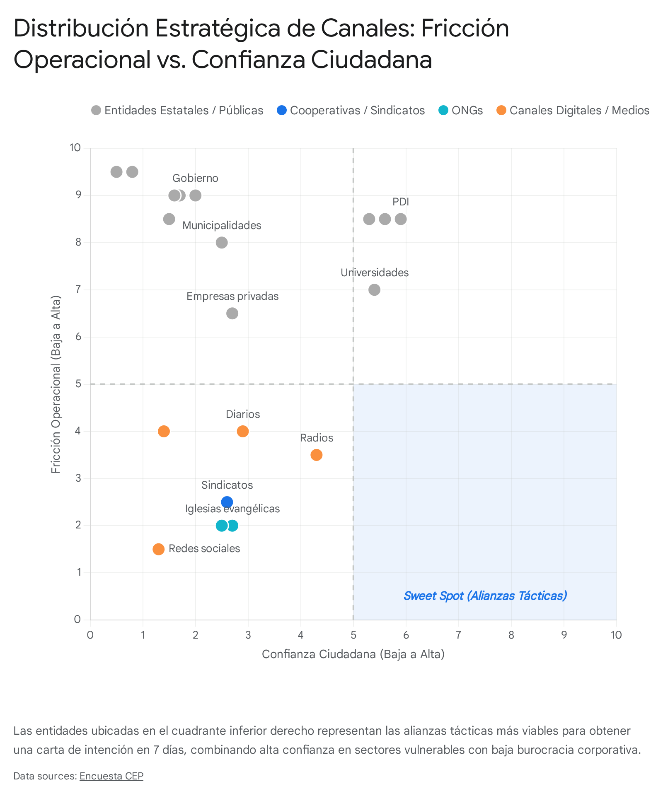

# Run Deep Research: Canales de distribución con confianza pre-instalada en NSE D-E chileno

<!-- AUTO-BANNER -->
!!! info ":material-book-open-variant: Síntesis de fuentes externas"
    Output crudo del agente **Google Deep Research Max** (`deep-research-max-preview-04-2026`). Ejecutado el 2026-04-29 a partir del prompt `tools/deep-research/prompts/05-canales-distribucion-confianza.md`. **Verificar citaciones antes de citar en el pitch.**

> **Objetivo del prompt:** Mapear redes y canales con tasa alta de adopción en quintiles 1-3 chilenos, para identificar GTM (go-to-market) que apalanque confianza pre-instalada en lugar de competirle a Tenpo/Destácame.
>
> **Duración:** 0 s (0.0 min) ·
> **Interaction ID:** `v1_ChczMl95YVlxWkx1YWN6N0lQdnA3YzhBZxIXMzJfeWFZcVpMdWFjejdJUHZwN2M4QWc` ·
> **Tipo:** `ejecucion-aprobada`

## Reporte

# Canales de Distribución con Confianza en NSE D-E: Estrategias de Go-To-Market para Impacto Cívico en Chile

*Este informe es de carácter investigativo y estratégico, elaborado específicamente para fines de diseño de proyectos e innovación cívica (como el Claude Impact Lab). Su contenido tiene fines puramente informativos y no constituye asesoría legal, técnica corporativa ni financiera profesional.*

## Resumen Ejecutivo

Para el equipo del Claude Impact Lab Chile 2026, el desafío de lograr *impacto cívico* verificable en 7 días no se resuelve construyendo un nuevo canal de distribución o compitiendo contra el alto CAC (Costo de Adquisición de Clientes) de la banca privada. Se resuelve apalancando infraestructuras de confianza preexistentes. Este reporte analiza exhaustivamente el ecosistema chileno para el Nivel Socioeconómico (NSE) D-E, concluyendo lo siguiente:
*   **Top Canales Inmediatos (Validables):** Las Organizaciones No Gubernamentales de microfinanzas (Fondo Esperanza, Banigualdad), las cooperativas (Coopeuch, Coocretal) y los sindicatos hiper-locales (ej. Manipuladoras de Alimentos de la JUNAEB). Estas entidades permiten obtener una LOI (Letter of Intent / Carta de Intención) en menos de 7 días.
*   **Top Canales para Roadmap (Escalabilidad):** BancoEstado (CuentaRUT), ChileAtiende y ClaveÚnica. Ofrecen un alcance demográfico inigualable, pero exigen una fricción regulatoria que imposibilita su activación en el corto plazo.
*   **Veredicto Estratégico:** La única vía viable de distribución digital para el NSE D-E es un **Agente Embebido en WhatsApp**. Esto neutraliza la barrera de almacenamiento en dispositivos móviles y explota el *zero-rating* (tráfico de datos liberado) provisto por las empresas de telecomunicaciones chilenas, reduciendo el costo de interacción para el usuario a cero.
*   **El Análisis de 8 Puntos:** Se evaluó sistemáticamente cada canal solicitado bajo las métricas de: Alcance, Demografía, Confianza, Casos de Éxito, Fricción Operacional (cuantificada en meses/años), Costo, Compatibilidad con Inteligencia Artificial, y Casos comparables en LATAM. El hallazgo central es que la "Confianza" es inversamente proporcional a la "Fricción Operacional" en instituciones estatales, pero directamente proporcional en organizaciones de la sociedad civil y redes territoriales.

---

El ecosistema de innovación cívica y financiera en Chile se enfrenta a un paradigma complejo. A medida que las *fintechs* comerciales saturan los canales digitales tradicionales mediante marketing agresivo y alianzas con la banca *premium*, el ciudadano vulnerable —perteneciente a los quintiles de menores ingresos (NSE D-E)— queda marginado o es abordado a través de canales que no gozan de su confianza. Para el Claude Impact Lab Chile 2026, la resolución de este problema no radica en construir un nuevo canal de distribución, sino en apalancar la confianza preinstalada de redes comunitarias, cooperativas y estatales que ya operan en el corazón de estos segmentos. 

Este informe exhaustivo analiza el inventario de canales disponibles en Chile desde una lente sociotécnica. Al evaluar el alcance, la demografía, la fricción operacional y los casos de éxito comparables en América Latina, se estructurará una estrategia de *Go-To-Market* (GTM) diseñada no para competir en presupuesto publicitario, sino para integrarse en las interacciones cotidianas de las mujeres jefas de hogar, los microemprendedores informales, los adultos mayores, los migrantes y los jóvenes sin historial crediticio.

**Puntos Clave Fundacionales:**
*   La confianza institucional en Chile está polarizada; entidades operativas como la PDI y Carabineros lideran (56-60%), mientras que el ecosistema político promedia menos del 10% [cite: 1, 2].
*   El canal digital indiscutido para el Nivel Socioeconómico (NSE) D-E es WhatsApp (>90% de penetración), viabilizado por el *zero-rating* (redes sociales libres) de las empresas de telecomunicaciones [cite: 3, 4, 5].
*   Las instituciones públicas masivas (BancoEstado, ChileAtiende) poseen un alcance invaluable, pero presentan una fricción operacional prohibitiva para integraciones a corto plazo (7 días).
*   Las alianzas estratégicas más viables para validación inmediata (LOI) residen en cooperativas (Coopeuch, Coocretal), Cajas de Compensación y ONGs de microfinanzas (Fondo Esperanza), las cuales poseen confianza preinstalada y autonomía jurídica.
*   Una estrategia de "agente embebido" en canales preexistentes superará sistemáticamente a una de "agente independiente" (app propia), dado el costo de adquisición y las barreras tecnológicas en sectores vulnerables.

---

## Sección 1 y 2 — Inventario y Documentación Analítica de Canales en NSE D-E

Para comprender la viabilidad de cada canal, es fundamental desacoplar el concepto abstracto de "alcance" de la "fricción operacional". A continuación, se presenta una matriz comparativa que antecede el desglose detallado.

### Matriz Comparativa de Canales Estratégicos (Resumen de 8 Puntos)

| Canal / Red | Alcance Mensual / Total | Demografía Principal | Confianza (NSE D-E) | Fricción Operacional | Costo de Alianza | Compatibilidad IA |
| :--- | :--- | :--- | :--- | :--- | :--- | :--- |
| **BancoEstado** | 15.5M (CuentaRUT) | Transversal, Migrantes | Alta (Operativa) | 12-36 meses (Muy Alta) | Comercial/Licitación | Alta |
| **ChileAtiende** | ~12.3M interacciones | D-E, Mayores >60 | Media-Alta (65% MESU) | 12-24 meses (Alta) | Licitación Pública | Muy Alta |
| **Coopeuch** | 1.2M socios | C3-D, Pensionados | Muy Alta | 3-6 meses (Media) | Partnership / $0 | Alta |
| **Coocretal** | +400k UF Patrimonio | C3-D, Rural (RM/Sur) | Muy Alta | 2-4 meses (Media) | Partnership / $0 | Alta |
| **Detacoop** | 6% Universo Deudores | D-E, Pensionados | Alta | 2-4 meses (Media) | Partnership / $0 | Media |
| **Fondo Esperanza** | 152k beneficiarios | Mujeres Jefas Hogar | Absoluta (Bancos Com.) | 1-4 semanas (Baja) | Partnership / $0 | Media-Alta |
| **Sindicatos JUNAEB** | Miles (Ej. Merken: 500) | Mujeres D-E ($500k liq.) | Absoluta (Pares) | 1-2 semanas (Baja) | $0 | Alta |
| **ANAMURI** | ~10k socias activas | Mujeres rurales/indígenas | Muy Alta | 2-4 semanas (Media) | $0 | Media |
| **Iglesias Evangélicas**| Masivo (periferias) | D-E, Rural, Mapuche | Muy Alta | 1-2 semanas (Local) | $0 | Media |
| **Influencers** | 100k - 500k seguidores | C2-D, Jóvenes 18-35 | Media-Alta (Depende) | Días (Muy Baja) | USD $1k-$5k/Campaña| Alta |
| **WhatsApp** | >90% Penetración | Transversal absoluto | Media (Riesgo estafa) | Inmediata (API) | ~$0.05 USD / sesión | Perfecta |
| **Instagram** | Alta en Jóvenes | Jóvenes (limitado D-E) | Media | Inmediata (API) | Costo CAC Digital | Alta |

---

### Canales Públicos Masivos e Infraestructura Estatal

Las instituciones del Estado ofrecen el mayor alcance demográfico del país, especialmente en los quintiles 1 al 3, donde la dependencia de los servicios públicos es ineludible. No obstante, la burocracia inherente a la administración estatal presenta desafíos significativos.

**BancoEstado y CuentaRUT**
La CuentaRUT de BancoEstado es la columna vertebral de la inclusión financiera básica en Chile. Al ser un producto de asignación casi universal, su alcance es inigualable en el territorio nacional.
*   **Alcance:** Existen más de 15,5 millones de clientes con CuentaRUT, abarcando al 87,2% de los habitantes mayores de 14 años, incluyendo 1,4 millones de migrantes [cite: 6, 7]. Las transacciones mensuales y límites operativos son utilizados intensivamente (con un límite de abono mensual de $4.000.000 CLP) [cite: 8].
*   **Demografía:** Transversal, pero fundamental para NSE D-E, migrantes y áreas rurales donde la banca privada no tiene incentivos para operar.
*   **Confianza:** Alta en términos de seguridad de fondos, aunque sujeta a fricciones de servicio al cliente. En términos generales, las grandes empresas y bancos mantienen una confianza neutra en la ciudadanía, con un leve repunte reciente [cite: 9].
*   **Casos documentados:** Alianzas para el pago del Bolsillo Familiar Electrónico y el Subsidio Único Familiar demuestran su rol cívico [cite: 10, 11].
*   **Fricción operacional:** Fricción Alta (12-36 meses). Integrar un nuevo servicio requiere sortear normativas de la CMF (Comisión para el Mercado Financiero), la Ley de Bancos y largos procesos de *compliance*. Inviable para cerrar en 7 días.
*   **Costo:** Modelo comercial con comisiones por API o regulado por licitación pública (miles de dólares).
*   **Compatibilidad IA:** Alta. Un asistente embebido en su ecosistema sería culturalmente aceptado, pero BancoEstado priorizará sus propios desarrollos cerrados.
*   **Caso LATAM comparables:** *Yape (Perú)*, del Banco de Crédito del Perú (BCP). Alcanzó más de 12,3 millones de usuarios activos y se transformó de una app P2P a una *superapp* de microcréditos, impulsando el Índice de Inclusión Financiera peruano [cite: 12, 13, 14].

**ChileAtiende (Instituto de Previsión Social - IPS)**
Esta red multiservicios es el rostro físico y digital del Estado para la gestión de beneficios sociales.
*   **Alcance:** Durante 2024, registró más de 148 millones de interacciones, desglosadas en 5,4 millones de atenciones presenciales, 3 millones vía *call center* y más de 138 millones de interacciones en línea [cite: 15].
*   **Demografía:** Fuerte concentración en NSE D-E y adultos mayores (>60 años), quienes dependen de la red para trámites de pensiones y subsidios [cite: 16, 17].
*   **Confianza:** La medición de satisfacción usuaria del Estado (MESU) indica que el 65% de las personas quedó conforme con su último trámite, siendo el canal presencial el mejor evaluado (67%) [cite: 18].
*   **Casos documentados:** Alianzas interministeriales. Por ejemplo, en 2024 absorbió la recepción de reclamos del SERNAC por cortes de luz prolongados [cite: 15].
*   **Fricción operacional:** Fricción Alta (12-24 meses). Cualquier integración requiere convenios marcos, revisión de la División de Gobierno Digital y procesos de Compras Públicas.
*   **Costo:** Cero para el usuario; alto costo transaccional B2G (Business-to-Government) para el proveedor tecnológico.
*   **Compatibilidad IA:** Muy alta. Ya utilizan sistemas de videoatención y un asistente IA (chatbot) podría reducir drásticamente la carga presencial [cite: 16].
*   **Caso LATAM comparables:** *Gov.br (Brasil)*. Plataforma única que integró servicios sociales con autenticación, permitiendo escalar subsidios masivos durante y post pandemia.

**ClaveÚnica**
La identidad digital del Estado chileno.
*   **Alcance:** Más de 14 a 16 millones de usuarios activos, dando acceso a más de 1.600 trámites [cite: 19, 20].
*   **Demografía:** Transversal (requerida por defecto para todo trámite cívico).
*   **Confianza:** Alta como validador. Sin embargo, la reciente implementación de un Segundo Factor de Autenticación (2FA) añade fricción, especialmente para adultos mayores [cite: 20, 21].
*   **Fricción operacional:** Fricción Alta (6-18 meses). Su API (Interfaz de Programación de Aplicaciones) es restrictiva y goza de un riguroso *pipeline* manejado por la Secretaría de Gobierno Digital.

**Oficinas Municipales de Información Laboral (OMIL)**
*   **Alcance:** Miles de atenciones mensuales dispersas a nivel municipal a lo largo del país.
*   **Demografía:** Población cesante, predominantemente de quintiles inferiores en búsqueda de oficios o subsidios de cesantía.
*   **Confianza:** Media. Depende fuertemente de la administración del alcalde de turno.
*   **Casos documentados:** Ferias laborales locales y alianzas con SENCE.
*   **Fricción operacional:** Fricción Media-Alta (3-6 meses por municipio). Su naturaleza descentralizada obliga a negociar corporación por corporación.
*   **Costo:** Gratuito o por convenios tácticos.
*   **Compatibilidad IA:** Media. Un bot para notificar vacantes vía WhatsApp sería ideal, pero la adopción tecnológica interna es lenta.
*   **Caso LATAM:** *Sine (Sistema Nacional de Empleo - Brasil)*.

**Centros de Salud Familiar (CESFAM) / Servicios de Salud**
*   **Alcance:** Millones de atenciones al año a nivel nacional (Atención Primaria).
*   **Demografía:** Pacientes Fonasa (tramos A, B, C), concentrando a la población NSE D-E.
*   **Confianza:** Alta a nivel hiperlocal (relación con personal médico), pero el sistema sufre por listas de espera.
*   **Casos documentados:** Digitalización de agendas médicas. No suele entregarse información financiera, salvo evaluaciones de la asistente social.
*   **Fricción operacional:** Fricción Alta (6-12 meses por Servicio de Salud o corporación de salud municipal).
*   **Costo:** $0 para el paciente.
*   **Compatibilidad IA:** Alta para triaje, pero compleja para temas fuera del ámbito clínico-social.

**Comisión de Medicina Preventiva e Invalidez (COMPIN)**
*   **Alcance:** Cientos de miles de trabajadores que tramitan licencias médicas anualmente.
*   **Demografía:** Trabajadores formales (en su mayoría tramos D-E y clase media vulnerable) enfrentando alta angustia económica por el impago de licencias.
*   **Confianza:** Extremadamente baja debido a la histórica lentitud en los pagos y rechazos de licencias.
*   **Casos documentados:** Modernización de plataforma web (Mi Licencia).
*   **Fricción operacional:** Fricción Alta (12-24 meses para integraciones ministeriales).
*   **Costo:** Operación estatal.
*   **Compatibilidad IA:** Alta necesidad (orquestación de reclamos), pero alta fricción institucional para externalizar el servicio.

**Servicio Nacional del Consumidor (Sernac 600)**
*   **Alcance:** Cientos de miles de llamadas y reclamos formales al año.
*   **Demografía:** Ciudadanos sobreendeudados, víctimas de fraudes, transversal pero de alto uso en clase media y NSE C3-D.
*   **Confianza:** Media-Alta institucionalmente.
*   **Casos documentados:** Plataformas como "Me Quiero Salir".
*   **Fricción operacional:** Fricción Alta (1-2 años). Funciona como receptor, no como canal de distribución proactivo.
*   **Costo:** Licitaciones públicas para modernización.
*   **Compatibilidad IA:** Alta.

**Carabineros de Chile (600 / Comisaría Virtual)**
*   **Alcance:** Millones de trámites y salvoconductos, especialmente post-pandemia.
*   **Demografía:** Transversal absoluto.
*   **Confianza:** 54-56% de confianza según CEP (y hasta 77% según Cadem) [cite: 1, 22, 23].
*   **Casos documentados:** Constancias de pérdida de documentos, salvoconductos.
*   **Fricción operacional:** Fricción Alta (12-36 meses para lobby de seguridad).
*   **Costo:** Contratación pública de alta seguridad.
*   **Compatibilidad IA:** Baja. Introducir servicios financieros cívicos en un portal de contingencia penal/civil generaría rechazo ciudadano y confusión.

**Defensoría Penal Pública (DPP)**
*   **Alcance:** Durante 2020, la DPP registró 217.881 atenciones remotas. De estas, 170.892 correspondieron a imputados, 34.617 a familiares y 12.372 a otros usuarios [cite: 24].
*   **Demografía:** Imputados y sus familias, con una altísima prevalencia de NSE D-E y exclusión social severa.
*   **Confianza:** Media, percibida con desconfianza inicial debido a la cultura carcelaria y la oposición al sistema, aunque validada procesalmente [cite: 25].
*   **Casos documentados:** Programas de defensa penitenciaria y reinserción.
*   **Fricción operacional:** Fricción Alta (1-2 años).
*   **Costo:** Licitación pública.
*   **Compatibilidad IA:** Media. Muy específica para flujos legales, inútil para finanzas preventivas generales.

### Cooperativas de Ahorro y Crédito y Cajas de Compensación

Este subsector representa el "Grial" para proyectos de impacto cívico con NSE D-E: combinan el músculo financiero de un banco con la misión social de una ONG, operando bajo derecho privado, lo que permite agilidad en los convenios.

**Coopeuch**
La cooperativa de ahorro y crédito más grande del país.
*   **Alcance:** Más de 1,2 millones de socios a lo largo del país [cite: 26]. Distribuye remanentes masivos a sus socios [cite: 27].
*   **Demografía:** Fuerte presencia en NSE C3, D, y pensionados. Gran penetración regional (cerca del 80% del remanente se distribuye fuera de la Región Metropolitana) [cite: 28].
*   **Confianza:** Muy alta. Las cooperativas gozan de lealtad por la propiedad compartida [cite: 28, 29].
*   **Casos documentados:** Becas de educación y créditos éticos [cite: 30].
*   **Fricción operacional:** Fricción Media (3-6 meses). Comités de innovación pueden firmar un LOI rápidamente.
*   **Costo:** Partnership estratégico ($0 para el startup a cambio de impacto).
*   **Compatibilidad IA:** Alta.

**Coocretal (Cooperativa de Ahorro y Crédito Talagante)**
*   **Alcance:** Pertenece a la exclusiva élite de cooperativas con un patrimonio que excede las 400.000 unidades de fomento, supervisada directamente por la CMF [cite: 31, 32].
*   **Demografía:** Alta raigambre en la zona centro y sur (ej. Talagante). Sectores de NSE C3-D, pequeños comerciantes históricos.
*   **Confianza:** Muy Alta. Se reportan casos de lealtad profunda donde la cooperativa ha sido el principal soporte financiero para familias por más de 40 años, desde crisis médicas hasta emprendimientos [cite: 33].
*   **Casos documentados:** Préstamos rotativos de emergencia sin barreras excluyentes de la banca tradicional [cite: 33].
*   **Fricción operacional:** Fricción Media (2-4 meses). Alianzas de RSE son viables.
*   **Costo:** Partnership estratégico ($0).
*   **Compatibilidad IA:** Alta, particularmente para orientar a socios tradicionales hacia plataformas digitales.

**Detacoop (Cooperativa de Ahorro y Crédito el Detallista Limitada)**
*   **Alcance:** Ocupa un 6% del universo de deudores entre las cooperativas, lo que representa un volumen crítico de actividad comercial [cite: 32, 34].
*   **Demografía:** Trabajadores del comercio detallista, dueñas de casa, pensionados.
*   **Confianza:** Alta. Destacan testimonios de apoyo financiero durante períodos prolongados de enfermedad o crisis familiar [cite: 33].
*   **Casos documentados:** Descuentos por planilla y préstamos sociales rápidos.
*   **Fricción operacional:** Fricción Media (2-4 meses).
*   **Costo:** Partnership / $0.
*   **Compatibilidad IA:** Media.

**Lautaro Rosas (Cooperativa de Ahorro y Crédito)**
*   **Alcance:** Fundada en 1963 por la Armada, se abrió al mundo civil hace décadas y superó los 11.000 socios. Administra un capital sustancial superior a 25.528 millones (al año 2019) y está regulada por la CMF al superar las 400.000 UF de patrimonio [cite: 35, 36, 37].
*   **Demografía:** Fuerte penetración territorial en Valparaíso, con expansión reciente hacia Biobío (Talcahuano) y Magallanes (Punta Arenas) [cite: 38]. Predomina NSE C3 y D, funcionarios navales en retiro y población civil porteña.
*   **Confianza:** Muy Alta, anclada en valores cooperativos y la entrega de múltiples beneficios sociales directos (bonos de nacimiento, matrimonio, cuota mortuoria) y descuentos comerciales [cite: 39].
*   **Casos documentados:** Giras de terreno (ej. Astilleros ASMAR) y redes de descuentos hiperlocales [cite: 38].
*   **Fricción operacional:** Fricción Media (3-6 meses). Tienen un enfoque proactivo hacia la expansión de servicios.
*   **Costo:** Partnership / $0.
*   **Compatibilidad IA:** Alta.

### ONGs, Sociedad Civil y Redes Territoriales

Las instituciones de la sociedad civil gozan de lo que las *fintechs* anhelan: tracción en la "última milla" de la base de la pirámide.

**Fondo Esperanza y Banigualdad (Microfinanzas Solidarias)**
*   **Alcance:** Fondo Esperanza apoya a más de 152.000 emprendedores organizados en más de 7.000 bancos comunales [cite: 40]. Banigualdad atiende a decenas de miles de microempresarios [cite: 41].
*   **Demografía:** Sectores vulnerables (D-E). En Fondo Esperanza, el 78% son mujeres jefas de hogar [cite: 40, 42].
*   **Confianza:** Absoluta. El modelo de "banco comunal" crea cohesión social (co-garantes de los préstamos).
*   **Casos documentados:** Integración de microseguros [cite: 43].
*   **Fricción operacional:** Fricción Baja (1-4 semanas). Su ADN busca herramientas que disminuyan el riesgo crediticio. LOI altamente factible.
*   **Costo:** Partnership estratégico ($0 mutuo).
*   **Compatibilidad IA:** Media-Alta.
*   **Caso LATAM:** *DaviPlata (Colombia)*.

**Sindicatos y Federaciones (Ej. Manipuladoras de Alimentos JUNAEB, Campesinos, Portuarios, Transportistas)**
*   **Alcance:** Alcance profundo en grupos laborales cohesionados. Por ejemplo, solo en Ovalle el Sindicato Merken de manipuladoras de alimentos agrupa a más de 500 trabajadoras; a nivel nacional suman miles de mujeres [cite: 44, 45].
*   **Demografía:** Predominantemente mujeres en el caso JUNAEB (Sueldo base ronda los $500.000 líquidos, llegando a $800.000 con bonos). Alta presencia de NSE D. En portuarios y transportistas, hombres NSE C3-D.
*   **Confianza:** Absoluta hacia sus dirigentes (peer-to-peer).
*   **Casos documentados:** Negociaciones colectivas para pagos de finiquitos y mejoras de infraestructura ante grandes concesionarias y el Estado [cite: 45, 46].
*   **Fricción operacional:** Fricción Muy Baja (1-2 semanas). La relación directa con las presidentas de sindicatos u organizaciones interempresas (ej. reuniones con SEREMI o parlamentarios [cite: 47]) permite firmar un acuerdo piloto de adopción con una sola reunión asamblearia.
*   **Costo:** Gratuito ($0). Aporte visto como beneficio social para las bases.
*   **Compatibilidad IA:** Alta. Excelentes candidatas para un canal B2B2C (Business-to-Business-to-Consumer), donde el sindicato es el "sponsor" de la herramienta IA para la consolidación de deudas de sus asociadas.

**ANAMURI (Asociación Nacional de Mujeres Rurales e Indígenas)**
*   **Alcance:** Fundada en 1998, cuenta con aproximadamente 10.000 socias activas distribuidas desde Arica a Punta Arenas [cite: 48, 49].
*   **Demografía:** Mujeres productoras, asalariadas agrícolas, indígenas y artesanas [cite: 48]. NSE D-E rural profundo.
*   **Confianza:** Muy Alta. La organización defiende frontalmente la "Soberanía Alimentaria" y ha sido clave en el debate público y constitucional chileno [cite: 49].
*   **Casos documentados:** Protagonismo en la Convención Constitucional (logrando representantes electas) y articulación constante con INDAP y PRODEMU [cite: 49, 50].
*   **Fricción operacional:** Fricción Media (2-4 semanas). Requiere sensibilidad cultural y política; la IA debe presentarse con una narrativa de empoderamiento rural productivo, no como "financiarización especulativa".
*   **Costo:** Gratuito ($0).
*   **Compatibilidad IA:** Media. Limitada por brecha de señal rural, pero viabilizable mediante WhatsApp *offline/asíncrono*.

**Iglesias Evangélicas y Pentecostales**
*   **Alcance:** Crecimiento explosivo sostenido; mientras el catolicismo cae, el mundo evangélico ha penetrado fuertemente, representando hoy redes masivas (se estima que 1 de cada 5 latinoamericanas es miembro de estas congregaciones) [cite: 51].
*   **Demografía:** NSE D-E profundo. Fuerte sustitución de servicios públicos en poblaciones de la periferia urbana y comunidades campesinas y mapuche empobrecidas [cite: 51].
*   **Confianza:** Muy Alta. Se basa en el carisma pastoral y la cohesión de ayuda mutua (terapia de adicciones, bolsas de empleo, guarderías informales) [cite: 52, 53].
*   **Casos documentados:** Conformación de bloques políticos (bancadas evangélicas) en Chile y LATAM [cite: 54, 55].
*   **Fricción operacional:** Fricción Baja (1-2 semanas a nivel local). A diferencia de la Iglesia Católica, su estructura descentralizada y a menudo empresarial permite que un pastor local autorice rápidamente el uso de una herramienta comunitaria.
*   **Costo:** Gratuito ($0).
*   **Compatibilidad IA:** Media. Requiere un marco ético compatible con sus visiones morales.

**Parroquias (Iglesia Católica)**
*   **Alcance:** Aún es la religión mayoritaria nominalmente, con amplia cobertura arquitectónica nacional, pero sufeligresía activa ha mermado drásticamente.
*   **Demografía:** Población urbana y rural, con sesgo hacia adultos mayores.
*   **Confianza:** Caída crítica. Encuestas recientes muestran un desplome de la confianza en la Iglesia Católica (del 51% a un 13% en una década) [cite: 56, 57]. La confianza se mantiene marginalmente más alta a nivel de "cura de parroquia" conocido [cite: 57].
*   **Casos documentados:** Trabajo asistencial de Cáritas Chile y Acción Católica. En áreas rurales, los católicos perciben desventaja frente a la capilaridad de las iglesias evangélicas [cite: 58].
*   **Fricción operacional:** Fricción Media (1-3 meses). Burocracia diocesana pesa sobre los pilotos.
*   **Costo:** $0.
*   **Compatibilidad IA:** Baja, por la demografía envejecida.

**INDAP (Instituto de Desarrollo Agropecuario) / Programa PRODESAL**
*   **Alcance:** 68.570 usuarios encuestados recientemente, de un total de casi 70.000 atendidos bajo el programa PRODESAL [cite: 59].
*   **Demografía:** Agricultura Familiar Campesina (AFC). Pequeños productores rurales de todo el país, desde Arica a Magallanes [cite: 59, 60].
*   **Confianza:** Alta. Funcionan mediante convenios territoriales directos a 4 años con las municipalidades [cite: 61].
*   **Casos documentados:** Fomento a la agroecología (más de 8.000 productores la asumen), digitalización con "Mundo Rural Online" y ferias campesinas [cite: 59, 61, 62].
*   **Fricción operacional:** Fricción Alta (1-2 años). Programa estrictamente regulado y sujeto al presupuesto nacional [cite: 62, 63].
*   **Costo:** Operación estatal.
*   **Compatibilidad IA:** Baja en la capa del usuario final (debido a severa brecha digital rural), pero Alta como herramienta B2B para los *extensionistas agrícolas* de terreno.

**Hogar de Cristo**
*   **Alcance:** Atiende a más de 38.000 personas en extrema vulnerabilidad [cite: 64].
*   **Demografía:** Extrema pobreza, situación de calle.
*   **Fricción operacional:** Baja administrativamente, pero el segmento atendido presenta barreras infraestructurales masivas.

### Redes Informales, Creadores de Contenido y Canales Digitales

Si el software requiere que un ciudadano D-E descargue una nueva aplicación de 50MB, el proyecto nacerá muerto. El almacenamiento en teléfonos de gama baja es un recurso crítico, y los datos móviles son costosos. La solución es la incrustación (*embedding*).

**WhatsApp**
El ecosistema digital de Chile gravita en torno a Meta, y WhatsApp es la infraestructura de facto.
*   **Alcance:** Más del 90% de penetración en usuarios de internet en Chile. (83,2% de usuarios activos globales la abren cada día) [cite: 3, 65, 66].
*   **El Factor Cero-Costo (Zero-Rating):** *Este es el dato más crítico para el NSE D-E.* Las telcos (WOM, Entel, Claro, Movistar) ofrecen "Redes Sociales Libres" [cite: 5]. Esto significa que usar WhatsApp no consume gigas. **Contexto logístico:** Dado que las *telcos* realizan el *zero-rating* a nivel de dominio (whatsapp.net), un bot conectado vía la API Oficial de Meta o Twilio **sí** se beneficia de esta gratuidad para el usuario final.
*   **Confianza:** Moderada-Alta para interacciones interpersonales. Requiere verificación corporativa (Green Tick).
*   **Fricción operacional:** Fricción Inmediata (horas para setear la API).
*   **Costo:** El costo de CAC para el ciudadano es $0. El costo operativo para la *startup* es de aproximadamente $0.01 a $0.05 USD por sesión de conversación en la API de Meta.
*   **Compatibilidad IA:** Perfecta.

**Instagram**
*   **Alcance:** Masivo, pero estructuralmente estratificado.
*   **Demografía:** Dominante en jóvenes (18-35). La penetración y tiempo de uso es notablemente superior en sectores socioeconómicos altos. En los sectores vulnerables (NSE bajo), el tiempo en línea es restringido por las dinámicas familiares (cuidados de hermanos menores, tareas domésticas) y escasez de planes pospago ilimitados [cite: 67].
*   **Confianza:** Media. Vulnerable a esquemas fraudulentos y a los perfiles de "confesiones" anónimas en entornos escolares [cite: 67].
*   **Fricción operacional:** Inmediata (creación de cuenta / Ads).
*   **Costo:** Alto (Costo CAC digital estándar).
*   **Compatibilidad IA:** Alta para derivación de tráfico (Ads) hacia un canal conversacional.

**Influencers Sociales y Educadores Financieros**
Son el puente moderno entre las finanzas técnicas y el usuario común, alcanzando niveles de *engagement* que la banca tradicional envidia.
*   **Romina Capetillo:** Creadora de contenidos y cofundadora de Finanfest. Autora de libros (ej. "Del desorden al orden"). Posee 165.000 seguidores en Instagram [cite: 68, 69]. Su narrativa, basada en "rehabilitación de deudas" tras deber 40 veces sus ingresos, conecta orgánicamente con sectores que buscan salir del sobreendeudamiento.
*   **Francisco Ackermann:** Ingeniero, cofundador de Capitalizarme. Supera los 400.000 seguidores en redes sociales [cite: 70, 71]. Enfocado en ahorro, bienes raíces y finanzas básicas (fondos mutuos, gastos hormiga) [cite: 72]. Su perfil solidario (donación de casas post-incendios [cite: 73]) eleva su confianza percibida.
*   **Nicolás Palacios:** Autodenominado "Mago Financiero", promueve criptomonedas y trading. Atrae fuertemente a jóvenes [cite: 74]. No obstante, genera advertencias en comunidades (ej. Reddit) por venta de componentes obsoletos para minería y ecosistemas de alta especulación, reduciendo su confianza corporativa [cite: 72].
*   **Confianza (General):** Media-Alta, dependiendo del rigor del creador. La CMF (Comisión para el Mercado Financiero) está monitoreando activamente a estos "finfluencers" para distinguir la educación financiera del consejo de inversión [cite: 68, 71].
*   **Fricción operacional:** Fricción Muy Baja (días).
*   **Costo:** Acuerdos comerciales directos (Desde cientos hasta ~$5k USD por campaña de *stories/reels*).
*   **Compatibilidad IA:** Perfecta para campañas de captación B2C.

**Programas de TV/Radio orientados al consumidor (Canal 13 "Estás A Tiempo", Mega "Ahora Noticias")**
*   **Alcance:** Audiencias nacionales (millones de televidentes).
*   **Demografía:** Amplio espectro, pero con gran anclaje en jefas de hogar C3-D durante franjas matinales y noticieros.
*   **Confianza:** Alta. Cuando la TV denuncia abusos financieros respaldados por voceros del Sernac o expertos, la conversión a herramientas de protección es inmediata.
*   **Fricción operacional:** Fricción Alta (Negociación de auspicios o trabajo de RP).
*   **Costo:** Comercial (Alto: $5k-$15k USD por mención).
*   **Compatibilidad IA:** Baja, puramente un canal top-of-funnel (difusión masiva).

**Grupos de Facebook y Redes Informales**
*   **Alcance/Uso:** Facebook sigue siendo el motor de descubrimiento para los mayores de 35 años (85,6% de penetración) [cite: 65].
*   **Dinámica:** Grupos como "Beneficios Chile" o "Salida DICOM" concentran miles de personas angustiadas por información financiera asimétrica. Operar aquí es gratis pero de baja conversión técnica y requiere navegar altos niveles de *spam*.

---

## Sección 3 — Estrategia de GTM por Sub-segmento Prioritario

Para el hackathon, la selección del sub-segmento dicta el ensamblaje de los canales. A continuación, se presenta la intersección entre demografía y vías de distribución con un plan de tres pasos.

### 1. Mujeres Jefas de Hogar (Quintil D-E)
Conforman la columna vertebral de la economía informal y la microempresa de subsistencia.
*   **Canales convergentes:** Fondo Esperanza (78% de sus 152k beneficiarios son mujeres [cite: 40]) + WhatsApp + Sindicatos de Manipuladoras JUNAEB.
*   **Estrategia GTM (3 pasos):**
    1.  **Firma de LOI con ONG/Sindicato:** Pactar un piloto con Fondo Esperanza o un sindicato base (ej. Merken) para proveer un agente IA de educación y consolidación de deudas.
    2.  **Despliegue *Zero-Rating*:** Lanzar el asistente exclusivamente vía WhatsApp. La jefa de hogar accede gratuitamente (datos libres de su telco) mediante un código QR compartido en su asamblea o Banco Comunal.
    3.  **Incentivo de Confianza:** La institución valida el uso del asistente como parte de una capacitación avalada por la organización.

### 2. Adultos Mayores (>60 años)
Segmento con alta vulnerabilidad económica (bajas pensiones) y severa brecha digital. Confían en entidades físicas.
*   **Canales convergentes:** Cajas de Compensación (Los Héroes) + ChileAtiende (canal físico) + WhatsApp (asistido por familiares).
*   **Estrategia GTM (3 pasos):**
    1.  **Piloto presencial-híbrido:** Acuerdo con Caja Los Héroes (que atiende a cientos de miles en sus sucursales de pago de pensiones [cite: 15]).
    2.  **Distribución en fila (Fricción Cero):** Promotores en las sucursales de pago enseñan al adulto mayor (o a su acompañante) a agregar el contacto de WhatsApp del Asistente Cívico.
    3.  **Diseño Conversacional de Voz:** El bot en WhatsApp debe procesar audios locales, evitando que el adulto mayor deba tipear, eliminando la barrera motriz y visual.

### 3. Microemprendedores Informales
Buscan evitar prestamistas informales (gota a gota) y formalizar sus finanzas de manera no punitiva.
*   **Canales convergentes:** Coopeuch / Coocretal (crédito ético) + Influencers (ej. Romina Capetillo) + Instagram Reels.
*   **Estrategia GTM (3 pasos):**
    1.  **Alianza de Tráfico:** Utilizar a las cooperativas para ofrecer el "Asistente de Formalización" a sus socios en riesgo.
    2.  **Atracción Orgánica (Finfluencers):** Contratar una mención de educadores financieros que enseñan "ordenamiento de finanzas" con enlaces al WhatsApp.
    3.  **Conversión:** El agente IA en WhatsApp guía el ordenamiento financiero y prepara al usuario para aplicar a un microcrédito formal.

### 4. Migrantes (Especialmente Venezolanos)
Población altamente bancarizada en la base (CuentaRUT) pero excluida del crédito formal tradicional por falta de historial en el país.
*   **Canales convergentes:** CuentaRUT (1,4 millones de migrantes la poseen [cite: 7]) + Redes de remesas + WhatsApp.
*   **Estrategia GTM (3 pasos):**
    1.  **Identificación de Nicho:** Crear contenido hiper-segmentado sobre "Cómo crear historial crediticio en Chile siendo extranjero".
    2.  **Canalización:** Derivar al agente de WhatsApp para analizar la capacidad de ahorro mediante lectura de recibos de remesas informales.
    3.  **Partnership de Datos:** (Post-Hackathon) Compartir la *data* de comportamiento con instituciones financieras locales para pre-aprobar créditos de bajo monto.

### 5. Jóvenes (18-24) sin Historial Crediticio
Segmento nativo digital, expuesto a publicidad agresiva de apuestas (*betting*) y con hábitos de uso intensivo de plataformas visuales.
*   **Canales convergentes:** TikTok + Instagram + Billeteras digitales (MACH, Tenpo).
*   **Estrategia GTM (3 pasos):**
    1.  **Hackeo de Algoritmo:** Campañas virales gamificadas en Instagram/TikTok utilizando micro-influencers que expongan esquemas de dudosa reputación financiera.
    2.  **Engagement:** El *Call to Action* lleva a un flujo automatizado en WhatsApp.
    3.  **Intervención Cívica:** El asistente perfila al joven y lo asocia con módulos de educación financiera certificados por ONGs.

---

## Sección 4 — Recomendación Final para el Claude Impact Lab

La matriz de evaluación de un hackathon penaliza los planes a 5 años y premia la ejecución táctica inmediata sustentada en una visión de impacto. A continuación, el marco resolutivo para el jurado.

### 1. Top 3 Canales para el Pitch (7 de mayo - Validables con LOI en 7 días)
Estos canales permiten que el equipo de 4 personas logre reuniones rápidas con gerencias de innovación o directivas sindicales, sorteando la asfixiante burocracia estatal.
1.  **Fondo Esperanza / Banigualdad:** Es el **mejor ancla de *storytelling***. Soluciona el acceso al quintil D-E profundo (especialmente mujeres). Un LOI aquí demuestra impacto social puro y acceso garantizado a una red comunitaria blindada en confianza.
2.  **Sindicatos de Manipuladoras de Alimentos (JUNAEB):** Una gema de distribución cívica subutilizada. Aborda directamente a miles de mujeres D-E, asalariadas formales pero precarizadas, que confían ciegamente en la directiva sindical y pueden aprobar un piloto en una sola votación de asamblea.
3.  **Coopeuch / Coocretal:** La cooperativa es el puente perfecto entre solidez financiera y agilidad de derecho privado. Tienen el mandato corporativo de ayudar a sus socios y un piloto de analítica para sus bases de datos más riesgosas es altamente atractivo para sus gerencias.

### 2. Top 3 Canales para Roadmap Post-Lab (Alto impacto, activación lenta)
El *slide* de "Visión a 2 años" debe demostrar que el proyecto escala a nivel país una vez validado.
1.  **ChileAtiende:** El *santo grial* del servicio público. Sus 148 millones de interacciones ofrecen una tracción infinita [cite: 15]. Se requerirá pilotaje con el Ministerio del Trabajo y lobby legislativo.
2.  **BancoEstado (CuentaRUT):** La infraestructura ubicua. Integrarse a su aplicación como un módulo cívico tomaría entre 1 a 3 años, pero consolidaría el producto a nivel monopólico nacional.
3.  **ClaveÚnica:** Integrar la identidad del Estado al agente permitiría que la IA realice trámites legales y postulaciones a subsidios de manera verdaderamente autónoma, reemplazando la fricción de navegación estatal del ciudadano.

### 3. Veredicto Estratégico: "Agente Embebido" vs. "Agente Independiente"

Dada la naturaleza del NSE D-E, el contexto chileno y el plazo del *Lab*, **la estrategia ganadora absoluta es la de un Agente Embebido.**

Una aplicación nativa (Agente Independiente) enfrenta fricciones insalvables:
*   **Costo de Adquisición (CAC):** Competir por clics contra bancos tradicionales y casinos *online* quemará cualquier presupuesto semilla.
*   **Barrera de Hardware/Datos:** Los teléfonos de gama baja carecen de almacenamiento. Además, navegar fuera de los planes subsidiados consume el preciado saldo prepago de los usuarios en los estratos más bajos [cite: 67].

Por el contrario, el **Agente Embebido (montado sobre WhatsApp)** aprovecha:
1.  **Fricción Cero de Adopción:** No requiere descargas; simplemente se agrega un número de contacto.
2.  **Costo de Datos Cero:** Gracias al *Zero-Rating* de las telcos chilenas [cite: 5], el usuario interactúa con la IA sin gastar su capital, y el costo de API backend ($0.05 USD) lo absorbe la *startup*.
3.  **Confianza Arquitectónica:** El usuario ya chatea con su familia y su junta de vecinos por ahí. Incorporar al asistente en su hábitat digital natural neutraliza el sesgo de desconfianza financiera.

### Hackathon Logistics: Cómo obtener el LOI en 7 días
Para un equipo compitiendo contra reloj, la táctica es vital:
1.  **Enfoque (B2B2C):** No le vendan una "app" a las gerencias, véndanles "I+D gratuita" (Investigación y Desarrollo). El pitch a Fondo Esperanza o Coopeuch debe ser: *"Somos un laboratorio de IA que reducirá el índice de morosidad de 50 de sus socios más riesgosos a costo cero para ustedes durante un mes"*.
2.  **Identificación Rápida:** Utilizar LinkedIn para contactar a roles clave: "Gerente de Innovación", "Jefe de Sostenibilidad" o "Presidente del Directorio" en el caso de ONGs o cooperativas medianas (Coocretal). En el caso de Sindicatos, buscar el contacto de la Directiva Nacional.
3.  **El Formato Legal:** Jamás enviar un contrato vinculante. Preparar un **Memorándum de Entendimiento (MoU) no vinculante** de 1 página que especifique que la entidad acepta explorar un piloto controlado post-hackathon si la tecnología demuestra ser viable. Esto remueve la parálisis legal y permite la firma inmediata que el jurado del *Lab* exige.

**Sources:**
1. [emol.com](https://vertexaisearch.cloud.google.com/grounding-api-redirect/AUZIYQHgfAqFLUgA8FeGsZQ4zE182FKF-EolJw7xgp0dtxM_Sodw1yR3cS-NCqOsvu67baGPjt0FR2yAgLQooF8mzbWtN2wGIlWwjINL1ZjzHvtT-NreL8-63ADwfAoDDweFwTKaHjLwan4gj7QzmAqwwLoF9_jPGlq-eASaf0qsQeKFooDWDxDFyOoEsafqxDYbH8VWPJ7iMx0pA8GZXCtM)
2. [adnradio.cl](https://vertexaisearch.cloud.google.com/grounding-api-redirect/AUZIYQFlvbG15yClQ1lYBzqcpycjOiZCK2dxyRirNoGO7E81lz7QShvcOnjjBOgviF_ZJYbAEG1_ZYyTN_TQ8n8EpH4zLuXGJMiFFIdDfF2x0YhPuEsBk7SlDMrTYfOaQsOw2B5g7Hd7BHQSYEcg_a8bqG_RAvv8Kxws-wvu4SI0iaFl1IeBhva4LFU65ft9dIfD5dBh_Zqs8E4yB10PvrBredEOx_VFYDJnSYmEraDJ6WyTbo0pOL4_5T_yiYlK0wDbplPeRtMiHXJAVR09O7UMWms=)
3. [onedigital.cl](https://vertexaisearch.cloud.google.com/grounding-api-redirect/AUZIYQGIN-cZ6AmG5Y6usnR8bwqT1IsD7YJtUCZKjmf_7ZBoBgJEZOqdfHviJRv8X7qKZHgVyRn7hhQZEjJuix9cTFUw7fYvPTs_tkD0Y4JRH6P20kkBnEx2osR8wsfEQIoYTd7t4PABioreiMc9CG7Q0sMp5qSv1enEH21e8DoCrrYIq7po-MQwbXH7-68=)
4. [digitalpingu.com.mx](https://vertexaisearch.cloud.google.com/grounding-api-redirect/AUZIYQH_3yddhEtC6AKxbOgIBmGno1SDZBQehc387SCWLIxYtAakj8MVW5iKsvTPrDRigzAfXRTyghCMUYfV3eUumGkjml2HyRixwrtyxDV8BAwxvjt8C8JvdjrAYvwIE3W2cRt6sh-AWAtg9rTFbNiUngsCm4BEgPCJbSK2ILzk9QCKHxrnnzC_wm3ViCIf7x6kT1SGmu5H)
5. [comparaiso.cl](https://vertexaisearch.cloud.google.com/grounding-api-redirect/AUZIYQENN3XFdEaN2f3kGITNelXTlLivYLPUKUiuTO5csrxRyUyrpVajwxnWHi9kqLbFG-5h6gzZPsnGWq47tssuE4G4ve4zirEbK507_XfnlsWIvMEQNBwBpAK-V9swaR85jloQGFIRyoS9qR3b0yMO6lmjRcmKV87csm8=)
6. [biobiochile.cl](https://vertexaisearch.cloud.google.com/grounding-api-redirect/AUZIYQGsgChi_NGFtE2v83We3_MpaSNh9uGSuSxnKam7i46kYpZGn1hgyWaxH96YV6FQr9OfFxEOCW2ytfyDIyHwsM9Qj9ZZN3ke0RByN3207025gebq0P7bDE8KRIx1AhEyUJwvOaNAeEYSx1y_D2o0FpQffwh6F-0dNBTP9-sM2x4Ue5QSezXeYjHDHoOybM4Sg4Q68R8jBMU9YCjK3g4BjA1AzHYjKseOvwX-fCeqQtTSOs5tY8jx-T6Vq9FQrZCz156BHMX0RvmJUyEks8_Hxl1kOxuMe7UmvB-4Lufra8rBJLqsugVzm-IGAQ==)
7. [24horas.cl](https://vertexaisearch.cloud.google.com/grounding-api-redirect/AUZIYQHwliFv4bUS_jRMVxPKxgyeKNC8x12BcHlBIRCKVbO507WIRJrHJedGKcxdHuMVHnnKBOxDfKwqnt_NdNHgDZ-qmuyScT1gntlGfI9HjyEdeYc9E0UIA6HMxTENTGi_44xoCJrtia5EEBpDZn7F11qXkup6fSg5mP-2sXHP3mMsfrwW1PDxVRDd-g==)
8. [chilevision.cl](https://vertexaisearch.cloud.google.com/grounding-api-redirect/AUZIYQGicRXml3iNNF0UiTvN4MvyhAkrtyFlfI2VBdScfh20w-4iM2bUGC4zp73HRx2wo0MN5Qt7HQ-bzaBAwLIOjpk-2EQ0AvVyEw0dUheHa43jZKrL_Esnx4WsPfAPzCCXDP-riVJX1TEvRxpl22If4lkhPqf7Tpj2kOFY_biLchFdq7uuDamEoc5P0KKy3rXUeaorq6I2Lfg1AJ53pN8WrTQwGRRC4YpFtClI4slRmOVUGtIL)
9. [sofofa.cl](https://vertexaisearch.cloud.google.com/grounding-api-redirect/AUZIYQG0C-4spfpH1GhJaXYlx2uO2JtkFVTAslcNBLCfW9tjA6KgvQPk5IfgB8YEkBDUu71jC9gTwIt3PC7zta0yzTvqCbXAOKYI_mCIqDSTyvXtog_QCR7c4fCCv_VC43zzdfQlsvWtGxjm8u2glInFtIzT6HkBwXcbpM3txRsP4cQ=)
10. [ips.gob.cl](https://vertexaisearch.cloud.google.com/grounding-api-redirect/AUZIYQH_xQ47jafzj3hDbfh9EvKFOgQmX7hT7R0nzxLzsm2ch6su019Buku_EsLIu_gX8BTz9_Ed6HNqt0TIKLzP94-7B5k2JazGQyd8SF-qPI7TxwKiiRB-9s1rGPk4ia2MSlGGfJYXUiGuhrO4Y9TL5QgV8jGw29VH0pMR38KzSaRSYUtDrQ==)
11. [hacienda.cl](https://vertexaisearch.cloud.google.com/grounding-api-redirect/AUZIYQFbsnhRC37CnH8XS1O5Ca_jT2WN0vCGncFCzOBB3SblWy21LJujpILjNfg5W15jo3qnpbvbFJYWiUAV0JQ5covxdcmJHVyIXRkfq5TnSeps69A52cK_ISFvC3NrmYPYr9K35cTg5635j5RBRahPP9ArTZ9MnxJseE2hOBpfx20wnB6hE0ZW0FSC-z_zLE1YHv4MW6cugM26db-tePynLnFuju45H5tH0uJEWFHyuEfG)
12. [impactotic.co](https://vertexaisearch.cloud.google.com/grounding-api-redirect/AUZIYQFhZZnGrYLyOf4aN8viMhGuDV8Gor2Mi48U4E8YxcdJHTS5ZJWHuFLNuNPilWUorTti2BoHbwQEsRZPXtVU-AIpzGjrGSmSuFSDaz7LcbD1Jaz4em8RNyEEWWBqtkH944hZwmBMalKFhcwY_wQTootv5lIrQVsvcSDmmwctO7x1R7li3-lWuh5siIPu4w3Q)
13. [grupocredicorp.com](https://vertexaisearch.cloud.google.com/grounding-api-redirect/AUZIYQHSNuLxkbDiCsg7urH76-I55ZAirBvy5epW3r-gHZXGtafUOcjmpXXGe8zDF-idjCi2IC5QTpd4Jub82_m9d5qYyrKn5yK0rA0waBEmhT8yZVAUp8aE_bupY-x9aty7ffVkCIrRaFOoZno6_-2fyYAmWO8R9-O9SBv-a_x0nC_Qrk_vt7oVjzFLraruc0U28abynWXD8HWbRXd2XQtRckZejwmaZUwqR-hL-AE=)
14. [bancodeideascredicorp.com](https://vertexaisearch.cloud.google.com/grounding-api-redirect/AUZIYQFLsuvIy3cZvFI6nb1Z_eHFWaUExdRfIhMtnktJ8bPrErTZWfhHcEmgi3tkzu6-9ZNI02zaS1DqYMln06BsZ7mg2dAfGqETJBWK-sdcP2ysM1oEO8GdQ2hTq34ag-4zfbWjW2UtQnAATiruBM1AjicKy64jbvD7fgKuczP-fc4fiDhvDC5HS0aMzVjG-j_Enwibpa_THuEmLKunoqiCrlCs0d28REfrAJS-JNaMTRU=)
15. [ips.gob.cl](https://vertexaisearch.cloud.google.com/grounding-api-redirect/AUZIYQEsbuMnXTX8uxMzIX8D73maAYFIpJOMjFpWuLXMdKAHpLspeCf4fg_W5IOGp2WrMO4azS4TpYd8h5U5O77W-SWwrG6cAloMJ63_6YmZ1DX5HNS6ZFCxhjLWWEZUBwN7MyQ-XwaoFi3D_4bYS5m827m_z4CG8WjXT6I2ww_CEju07KNGqSehqXFXnduuWSoRlL-I9rnGaGvUfvmIO7j2WqH8GtbSxGYbdmZmeYvrOM8fQcZj2Z8_T08x2rL64Gcm-8dCJRIk9aQYPQmBJH0ijGM=)
16. [theclinic.cl](https://vertexaisearch.cloud.google.com/grounding-api-redirect/AUZIYQHdTeieoktsLlboc62tIoVBFm455NLinbn1Y7ppdHm4MOoKp9nN3dcgCBAYJjGM8j_xQKxnwECuE4_RxVHPEFk2d5hso4oEMc0LM4VugufKp6p_HO-FqT3ZwYC5EVUrj3lJ1ASVlfrM_YqzjuARKARa-DvIMnNlFmMybTClXrBgAoquQbK0DDLWbNTACiV-cWKCMcaOug==)
17. [mintrab.gob.cl](https://vertexaisearch.cloud.google.com/grounding-api-redirect/AUZIYQFfJTLRXYDCh65xcwh24UN6Jd_ilXLgrUoqWR8CCNjgyj_U3I0K1LhgSTo4hCiA0YSHzR65oExLwktBFIQ06ThohSJ0EkotwEK3gNUe5u38sGh8QcfFG-a62IbO8yB5K5xafAgrTS50LZODk3RUBTQhRWmQNaCPH5xtfWIj-nw1OFvm77mCF-khTO9JYLIUJZ_TjbPbv32ztXF1SvAfhnjmNF9ooIRIISXaQMeC91XqgwCi0gwyUGpOyKfQ5w==)
18. [hacienda.cl](https://vertexaisearch.cloud.google.com/grounding-api-redirect/AUZIYQGOEJ1-mz07TwyodfKbgl36FTM4JKRVy5rcZJKtrktutFXkcENJyEMYMif51gOM9B9oIS6cO7W3P8DdV_jgsHEojc6Olk_g_taDxx-ktUahT5LwmqcbO7nLACKy7j5eFyJXHHL61pY64KQirt98FZ0ULsxfqV8l1H4QtufTyJ0huAz_gk1MxnR7bS-Y4_ltv-d8m1Xyg2OhqmunQhOk6voXYWvolR7qGXfwzsG7CSUgT1bSVA==)
19. [df.cl](https://vertexaisearch.cloud.google.com/grounding-api-redirect/AUZIYQFQY-UC7gXSiUj1tqJh58O4p545Ui0i4TsxU1ySeOC6CHWrj1IkWvepjrvRQ4Z0lhinjii56QLzjnRpXWKm8T-S_L3uoYh-4bLML3e8EFzjDrlNFuoninXN5-jUQH3h1Ui1HoZLvYKOCtEME1mw_aed5s-emyE5xEewznLPb2DVxwcQo_aOp-n1vhbbW-huQxlcEnsH3mUCZeQUnrXBN0i5N_SGUQ==)
20. [meganoticias.cl](https://vertexaisearch.cloud.google.com/grounding-api-redirect/AUZIYQE9tzTRNfSnzDzvjeLG37zTbhPXODatC9nPSRdldmB4_zWOlo1gTN0Y3WnHgta4vsZHmE2VoDza6GszsvUUckVx4C2n5G4JzkwXc7eX0-1bCTeA4h1_iddFwewUiQd-wAZFaZ-U2kWBVsDQBcQ2AeVq5Pt1baxGYunLcEaCchP_CNrcUQtA2E45gWaWNTEwiSg7ttjqJw-A56WHlX8R-Q9Fp3yMVc7pLai4vlWMmv9yFr9H2sksxT9-XxkEyO8sy7gY0m2jvT5NJfyZEuOHs4wio2xka5Ga)
21. [elmostrador.cl](https://vertexaisearch.cloud.google.com/grounding-api-redirect/AUZIYQH2b8uB8KoDduJJhbYZPTMOft-KogJW5ebr7Wdsbs9WuDPqnKQR31dfvzZSBhEotubgNuR0ixkQmA82l1Tcn-IerZ9s1u4ch-v0gdbbjYLLb8TOEoJpPkJeP37wwC8AyuSNRiB2gjcFy_McJRO0rzQLQ-JAY08j_3hmZuITXMdQsbv-6Xc9)
22. [latercera.com](https://vertexaisearch.cloud.google.com/grounding-api-redirect/AUZIYQHlK-exKLS8dTDpOOTIrjawRc9QpqkVEIRHa9rUOJdnKR3ey_pe4zkac2hbkN02lC2UYNApYjl50DlLF0JFvLThV6mKTlBIW_ybxhAdLY8sRqhzmCt_oyPM3ceqFlJ1hF9-1g07KCCY-jFlWYzoOTZIWJkKqfe6xCjoc4B7fFZxmk1Vl7cZGP7mMq99JwJK025POYM4W6NubuoN0bOZl50l3ge_8ApOm-KiIocV2bGowNmKyPRpolaxaoSJcOei2odDkGnARRk4EILgBlvbrUkBY3FTiIg=)
23. [bomberos.cl](https://vertexaisearch.cloud.google.com/grounding-api-redirect/AUZIYQHydA4Q3eYnAFErq_66jGiF36sRCXiW-Y1MuZwAzKqi5vfAR-VrpnH7g9_TcQV8f4mfegwm9iVNl4jF0esQ-WvbeX5LuIIWCDyxiNm-PSjX6ki1_D2KRn0UmRfTJ3VRUjnMc-R0M6RZhrdToD9u6Oru9gWcY-d8IGmyKvcI0LhqQyMwiX1DHIK8ocHhm2Aozg4uMPQ2-2Uv_YrqS4CxOlCSlfQ1Yu4dz0Q1CgY=)
24. [dpp.cl](https://vertexaisearch.cloud.google.com/grounding-api-redirect/AUZIYQHV_bLCuaosLGDGP-3z3FWwZNRwlrwI2j83TX9-DViOmiPNLQ4ZVnXruvGf_yeo92ofuubAviiOb0fYmCyiYMA5Kgf3IWl3DA7WNDMuz9yGts6n3ULc25oCeNYhhuJbHiIhBPIFaEEvUYLq0tDBKudn_plddtEXWRckpmhMEKYA3INRrYgtbc9acq5wMk_g)
25. [griffith.edu.au](https://vertexaisearch.cloud.google.com/grounding-api-redirect/AUZIYQHVLH3m3RamtaRcLZrfAvaCLJjgx1kzmMh2zzfOeXooJG7seNXbgjjEGhEdoDaKVfW1Hfk9YwksrWfie8MfpNkyGhv1XHcrcwTUmNSf0HhjDTVIf_Nx6HlVVxOoKmBEJL_khXJHTX9kBMNdL-bYcrAxUzaPbfQwpOoqrspor_6QRxWhK9FJBnWTxCl-NulIDYPIXpcjPjQxeh3L)
26. [coopeuch.cl](https://vertexaisearch.cloud.google.com/grounding-api-redirect/AUZIYQGhByMgYMguehh6AHrwEv-czSbA9eA1ExBlSL1TfEamrwR0BVHX08AQzAs8GPtsva38Es9Nxh0dJUc7h_WUhdFxXrFfRrqNXcGxQlMknvgo6ToukIffdWziKQ==)
27. [latercera.com](https://vertexaisearch.cloud.google.com/grounding-api-redirect/AUZIYQGq0thE8cx6h8ChKhNY8rAFFGd1ne7Nz2bFBzgujoRsC5uX8zs7s7geJ7VHEL9NTvDJMPTRyrpm_T-Kny4f0TUWaXtTcxWZBcuq_dMLG85HYgs2dZ-5LpjxZf14shFPQ4HaDXG6zeKrKYYE7Zax4LyjdZsx5xC2gA-seezNtbLCA2hLsdNoQ6Ds_olc5IAXFXQkyThUkh5S-YMJqQmnmYMLMvBPQo7IRhM=)
28. [coopeuch.cl](https://vertexaisearch.cloud.google.com/grounding-api-redirect/AUZIYQEARf-OmuPMsKnEXd7OXCIsKSW6uxElQ7UkiNRXIAlTwOxmssk3k-PYNdNzyXiyOhy1JkV2KHTSeIGCv4nbxxZRINKxU5FZXVZ39ym5RE6cljoldjWW0-czTCLAkmAv-aJbIh4okw==)
29. [coopeuch.cl](https://vertexaisearch.cloud.google.com/grounding-api-redirect/AUZIYQG8dmw0B6vuotxjaZxER8dhysXuiEHa8YdgxfI_Eqzrbxa9TJON9JRDLACSDmas29eEIIKwD3EFx1cM8tF31q6TC2ssZXCqJKCbqAoaDUZ8H4rTmlt6aVMr0D5BFwSu9nGWJtubsGzy9q5PH2TGlZzL4yw=)
30. [coopeuch.cl](https://vertexaisearch.cloud.google.com/grounding-api-redirect/AUZIYQGl53aA8VfMUu1qp4sEn1JmZs11xWZMlWmN0WTs3gzWtiJpgnGyOZOL9dSsREwa-X0Q5bBgm4W1LIWBtjiqjezjWDG3841XRNfO2TQ9OlUxaIAZoofttXlG4uGmVwwr0yQc8wLqhuCB9X9wTRWCAh5-iHKTTgnwj8ItKPbsqABoxulOgMldqiJX4gK3EbqybGEc0wO_HEwgMnTQvfs5Ru0eleKV_a0KxCZCaRwKp24kA2bVysHYuJHZ8qRTNXaWVCuO7ahCZM3xUmvOipfAmx14ebHnY8Zebv6MIB5vQb9L)
31. [bcn.cl](https://vertexaisearch.cloud.google.com/grounding-api-redirect/AUZIYQEaOJIOS3wYVxdgByYawsH6BKRmERzghr6XUA8PJHMjclxUnkgsmR3AjzmQvVt3FaNR542xlSZazgEgV9_rdvzBrW9uGhxgb3ykDwGZUT39tuSVi7QnOJ2xiBJaX1IUdRRqEy8ZH8BCzEiuOgGNYdRFsaLjKaQye48J4m31MNOAhPs=)
32. [sernac.cl](https://vertexaisearch.cloud.google.com/grounding-api-redirect/AUZIYQGkNYsGFCoxuoFvaxyfVaru5N8w9zmSKJBSwmysHtyn5vaaDMJcdTfICitH0jImXesRFX7iXpMjRA54duuTmp7C2W5I6grmhsg_wL3cmcX2fgFLZQ2ofwqO8-YcDVgQucUKPoKz5IyRS7Ekl0rqyBsfEXGU)
33. [coopera.cl](https://vertexaisearch.cloud.google.com/grounding-api-redirect/AUZIYQEdTNawfRpdkmsWxh-LY5ry6e9gbTd6Tz5rmeGq7HjFz0eeykhJc3Ns56ehVP7nRzuaLuvO6dPnK49WFBq91Ndqc0AZWTOiflmClN3AsM_om3dQSey14aKFJlMKS7BgkDFee6OcV2rs7EGjApA=)
34. [historiacoop.cl](https://vertexaisearch.cloud.google.com/grounding-api-redirect/AUZIYQFGqmatBkMoE62Ea2vgFcxQSFMxjLBplARdBPdrkyfDDRufi7tVfUubZioW37GP8HEzHVcEB5yIHLAgbhsTBXpXkd3Zyo5zRCVcg4DyVbX2fwYhBkBb8gNswLL_lSiDc_tMwmpiS3NN_W6epLs0MxVfchHl1ZMO5xErhNWbrZKjOqSJpGz5JC53nnpLt8QNX4IWVcKt09EyCmmJG3dXfhkVr-v23ogqnzOO4doynddfv2jyrgY=)
35. [cooperativasdechile.coop](https://vertexaisearch.cloud.google.com/grounding-api-redirect/AUZIYQGfo0wJuLhvqVuXm32vu4OCeJdNUTUFQpjkq3_vjYlj4MQAE0CijGEq24YfPBCcJqCLBd_HZqZ43plYs2jx6h8UXtuNqsP-L4i90gcJ32QCGVTD1nsCeXeooD-TXJoNckFVn57xL0Lj647S2RZXlZfiLdt83smwueJwFbRArBE220pS2OWS7pKa7Duv)
36. [mercantil.com](https://vertexaisearch.cloud.google.com/grounding-api-redirect/AUZIYQH0YMhe8OekU4UCc4-kkc37mY3QpyWSqJfbvTzjkEsEpPj0S7fAcuEa9fJ48ozno6vo99DS1fgxZIaXezIu8Nlw6Dw--JK4P6s4QjDkHS13ahE1nlOL4jB5vERaIC99MhycB5RAwQMAi5AGTUEdy4kw0HwMZBuFccL6ikamtnBt)
37. [asiva.cl](https://vertexaisearch.cloud.google.com/grounding-api-redirect/AUZIYQFKAC8irYClnteLT1Wm-BxcfIiQRJ4ZBDT4PTKZaM5wr8T3eygSnyi__Lut2CW8z0B5IhQaKPMYQRDa1Ppf8LrMpqQJBqGjMnrfOcenF1XiaCjVs7B7I2190WfskOq7Yw5_-en5dHkOOsLDB-pBPPjriTre9ZPTGTcnP60MEAqk)
38. [coopera.cl](https://vertexaisearch.cloud.google.com/grounding-api-redirect/AUZIYQFwpm8n04rJqO842X9_LwvHSOjXLU-kmf8qLWGP9rSgkOxLvtFk1P7X03umw8f8CrqEB4t5trJrrsTjttgZOEn2S_rgLLCmRyTUxZkxz1aROid65iztwZg0fZ4vADuUKGYgAB5yH6cEMZh2HOt9UjcWe1-nonobwv24xVTXRdc=)
39. [decoopchile.cl](https://vertexaisearch.cloud.google.com/grounding-api-redirect/AUZIYQF5bY54RON40-9f6pvF0X11Sw2q5_-mkjNb-NUbjmOPNfD7mItBkLTaLpCbApqWAr46IQOtb6L8szPEHRPKv_UFmuXIvwcs3pD7SRdEo9YSJkTFDTPd8LhvPHUUjnSXL4sjS5p3gxDDvKn1DQlnGTSBFnxhLYm_aPBB4NbCFDvtw5_0mga3S5BE6hLgLYWPh4bMSKpJ9Is4)
40. [elmostrador.cl](https://vertexaisearch.cloud.google.com/grounding-api-redirect/AUZIYQGHUxO7T0BhoA9UkU-DZA9Hl0Fu62Q8aAch9QMgIYP69LG-jm_ks_yina0DAmQHDCj4JSkD3UzvXLODckXvc98o47dlPoNtgxZAvQhoy7tdLhKrPLRMiZ0_J4EW9dGe5eUu7_D8wU0hLwaovNmjrdPKXfllq6duKf9NqMHddng5cgkIzr8Ly5_E-JA0ezoEqQxjDzXai08t6jA8YS0qtbYNSUPG6lOKiZ7iTx5JgVCAeJUKNuV4tRKn5431pG4CozHCK8bZDNBvb3tkkrSFFw2wp1ySjJrPt94I)
41. [banigualdad.cl](https://vertexaisearch.cloud.google.com/grounding-api-redirect/AUZIYQHCuydVCV0P3SXemliywrCOBxr8EKd51XodohfYnIPhEg-2QoCrbdpfUIIMpNMAZfQuUUL_U6aHkEQP-omy5jIlyrAwZPmllvxEfq58wg==)
42. [df.cl](https://vertexaisearch.cloud.google.com/grounding-api-redirect/AUZIYQHSr5Lhe6aqUeYlJn6My00hSkbj2wpMsYyyEXU6DnnVqysgjz5pkw0v0bKy_x-BCWQ7W3c9pFaCoUzIAvy3LygZZ_74ssIUcKpSOtlssT6JjXH1lRZZMcJ5TBhg83aAzv2nJhWHTKUuJfq3FFwPm8WUgJZQ4RtHvFrxC33DqXo=)
43. [banigualdad.cl](https://vertexaisearch.cloud.google.com/grounding-api-redirect/AUZIYQH4Ud5XUQ9uN-XGGaZsAVMoaNflgZWOJIdNp96VVwvQmchZz0pAaV5Lmjm3petGA0QpihsgU8s4Kgrewi3LKJb0nvjemzefFRY2P__RvA_UtbBxL6fVwX_5RQ5JgmYdpBPdD8-Wqwv6XqY_sr7zqiHKldYLV3yDx2ReKxNKW9_0m0ePAWD8stM1gMAOTEtqLBpIVQ==)
44. [elovallino.cl](https://vertexaisearch.cloud.google.com/grounding-api-redirect/AUZIYQHw7I-klYFcAB1bCWcMKmV1xjzQTm5wRu88JWcXSXPbtDsTXQDNdHXNIjoW-8i_BvsL_byXJhYt6uIIpMVROLS9AzAHvRRRPnL7ABQ5cA5kAt0eIlF1l0YwtbEf3ENSRVtAMIWEDu_De9fnhp9mK-HGzCvWqX0NseT_lAkln9LIISUb12QqzYM2aono_LnR5oxNGAO0r6nZIbaehiznulA6_jQ=)
45. [amazonaws.com](https://vertexaisearch.cloud.google.com/grounding-api-redirect/AUZIYQE_NQ2MLi4jwmT0nbqAoLstrC2t9cql1WvD-n8qOGp8qHkUJc83bMG6mIp9T0xZZChOYkxuyPpjG6EHVkYxeEzKLh09LTzbUMm82ZND9eut60qghN4Zob8fS18ZvTjHJNNO_ZlMInSkCpgWI5lmhjl80yd666YrgmRREcj92Z7OxXDIjGQm8LuZTibRNXvYryQoVtqpq0ZOKxoLboMGj4CC-lPfgxFfV9NzL0In4bgqSecyhmn081Cnbz6RQEASFr_0JQ==)
46. [radiofmmas.cl](https://vertexaisearch.cloud.google.com/grounding-api-redirect/AUZIYQEkTWjiWQEmD0OAUtOuPzGqxF-CMOnF7iOFunJ27DIJevwh1acPGKD0QfpSGQ9BGP__kqFaE8Nww9vcIlCBcTdaaQBpXb73MNKwycOTX2TYtbcFrjsNu_3AjhVzebmyjY_dA3K1te2EgsNDoPXw-B3g4PHJMn0B_sSBNi6usQERFiFg2TDhaRkrXKFTjbR3G78E6FxP0_4kcQz-FQV5ZVMts6szBNorWSWQN7NpF_fgjRO3PzT2RWNBAOxJb1ysgIY5jxc3ZPBWmAm0tP4we58JzDw=)
47. [mintrab.gob.cl](https://vertexaisearch.cloud.google.com/grounding-api-redirect/AUZIYQE0VK9WQ25ylnWtNNAw5g2dRLkXUljNPz3zac8gzFfuh2YHTE21LWcTFAdK__FO2lv9qr-ZRAeR33LyQUl29PUa6XgXxfJxxQkcxrRiXpQKNEG1Q9SMOIVrt3MHG-laRnfDbfqQM0G61SlkRJpYuvXvOja_SMFC8eIsxlbQ1Qq9tBXKs2h6gvP0M_2LVdbOwJv1Qvu6xAo-9dxGUevv_fkjQ4OA-C_EQajUYjsuFNtRsQZRljQ13tqmHlDy04IrHTunmJwR0shvsp-Xi5Cbj2rpEicsvH7UmEs=)
48. [odepa.gob.cl](https://vertexaisearch.cloud.google.com/grounding-api-redirect/AUZIYQHQfXrvTbzKEQmG2G50r9llgLYwua5ikGun4fcsKpXlbu-Zr5F9ves_Oqbne7eOUBKTQEDEI-2WUd0I6JSWzCS9FMqqGhMdbnZox4JCIO1qNwrGr9ZPY0mTijVbY4h3ghqcgFdQP6u-o2mCwzTSrwkZBEVjNuuNkEoPyQO-5GCp)
49. [cloc-viacampesina.net](https://vertexaisearch.cloud.google.com/grounding-api-redirect/AUZIYQEP3Ucg91_gAxresF_VUb_LqdFSihERwwBRY_lxEpaDHqgBKSfHgl5a0Z7kccpWTQYu8sG7li30fH-DgeflG61SMVYCKXX1p8FluIfuBnRIzlrvA2aBenXcr9EdEjy6rFk7N9mMFK6l_Yr0AnMwqc1isr1L)
50. [archivonacional.cl](https://vertexaisearch.cloud.google.com/grounding-api-redirect/AUZIYQG7oOjDGAdG8nyh8keZEM69KZ5wALQs3uOW5QiJpMoN-cPCC4jo3HcmzLEoQZFIVIt06PXs3kuweBMHr7O7bs3D4osZDM9JAKjJu94AGMRE2jewiSK-zNn-nnSHCy8gQbhHN7xELfQO4fqteMlMNT6Cvmp7gjHwBJIJn2LVkmeGDBZOnxhEWhnq9jJN1CdwmmFVup_brQsq81r2YYMbdTLAqdhJpNA0E3d2fdh0q-ohjSHDV31VU-5QqS81c56BLg3_YncwRyrizsDkxbZ5p4u6rzBoEYoB-dxDWr3JSBMg8Oj8vxw=)
51. [desinformemonos.org](https://vertexaisearch.cloud.google.com/grounding-api-redirect/AUZIYQE-sNm4NF4qjy5Oe5HznoEA7ux8D0J4UMmNDcMSyHci8RPW5J1Ewg7i-tb_ypVqGhTQn-XlfyTVffN6FdYzWz29MNA58tcla3Jnn6EekPdv-AfTPSG_c5Fk7fJO5FimFyD5fxKzcYMVThn3C6qa-KD6rXUGe59ggMWvsQ4lJrw_mHZ-S6tyxTtU09xMVZ4u2bZ74Bv2Xdg=)
52. [ieee.es](https://vertexaisearch.cloud.google.com/grounding-api-redirect/AUZIYQG2XAyhwGdfeyaTlEbWh9n4gyDXXpvUT4IQr1tXsU43MJwZKyJKCZ-8YbE3PTduTXd8NwLI1up1YJmQmm971EwehpbGDVEjthJOwrs9vZaKVCquotmYFh3trVemIjIU27VeIl_3Vnn9FrdJT2qWqWUWkFBHv-Y9VoUwRl4wi3d4Be7RD7qdVjOFdwU=)
53. [realinstitutoelcano.org](https://vertexaisearch.cloud.google.com/grounding-api-redirect/AUZIYQEi0kKIrJEdAuEIv8wXHB81PRsYXhe5BZEcjoe03XplGAY38eYpPlrztFnKZYVTbTFc4G8N4U-g1gbgvRR72vaH8wbBCTU2PIKSZwDZJ94KtLoMFboVZuSX07tdXzvBtCJjjaho4vJvg0XBIlv_lxqWlC3p7-f-U5gAomyJrC17Y8WR7IisU8Oo6Fq6gT2E3iWRFGDtns9kQYjFrZ2lxKQ0ntllyTTaZQ==)
54. [ei-ie-al.org](https://vertexaisearch.cloud.google.com/grounding-api-redirect/AUZIYQFLieIucFWkiyNHUGwEgT4O__WjJ2Or-I5Js8Ax8CZQtLi86m8E-UgFPyIzYQxziTzYgQ5pHdnquY5GafPE852hhQ1M9bjwB_IQb2mDyt2lXH34_nAHxYfcU1ZVJwO7kqyR-F5aFx1VSjR_1tXnqZmeO0AylPtGFb4CI_LK-M8XwdJLyfoaPUyJtraEatGmYVz9GCulerQ_T3H7zIaNDZOE88gD-8ffcRA4zVsj19M6zxc=)
55. [chilecristiano.cl](https://vertexaisearch.cloud.google.com/grounding-api-redirect/AUZIYQHpk1RG3YDOa24EGAGiQ0xP7yVAbtcoQSFvDdNcsIhpJ2GSlD2Z-Gi-rM93wdXYnUdbe2u9Yzc_5q3hguQpAeV5fxq7HpsLfyB-v7j3nwpR_RljmsdJkqg31L2N3FuVwgmAvsDbqmTbeSkGoStzGzP5YgoGUpw1D4kuuq1dkwRn0m8=)
56. [emol.com](https://vertexaisearch.cloud.google.com/grounding-api-redirect/AUZIYQE3DFgsGI8BS6qljGle1tKeSUm1OjhaQUEAOOIdHFCZewAFsYEinJaHE3RMJk8-IZN4R7rjUzDhHZWaiAgvbVk0RIzJGM6iq4G-f7uTf4grTjPaM9iMhlmNVaTqNMzw6Fp3oGhszDxBshCP_mkUggrHNzADRzjrRN4KJ0X7W2ebm-asWGCxJiC41IbSmiOULzBbRnvuXxK4ufqzlKz__cyimdrSVp0vCECfgPPSSJQGm7x86wYNgq0Maso=)
57. [uc.cl](https://vertexaisearch.cloud.google.com/grounding-api-redirect/AUZIYQEdW0YY6W7khpkCauno9k90-Xfr1dqLiAvFT5DJdi5r2c9k8BcrVHGbFwVhgWYTDz22j-W025-CVjcWHkhyWhtCWMWcjyYLFUD9-iTO26HacV-8rt4qkdT1ByCiXhYo6viAjKHPRfUVmnopVhxVqGReR64VezX272R9eudpv64kI0a9ZAsZ-fYlmxjd4SZMltyY-MrMOyapb5epyA4AQVDvF_UsI-QNcsQvTvXTsaiTtclUFw-n1tFRuj43An_JPoGP8Q==)
58. [archive.org](https://vertexaisearch.cloud.google.com/grounding-api-redirect/AUZIYQHWOL7JKt-sooVv9htSVv-9I7buOq0_0iC4oAIPgnmYPj9aYgADhaFHUVWrUb5eRBlZQ_Lp2WBszhd1rNILPgMXbzlgoPZd0PiKXnbbX4w-wKdDb_slaZqRS0f27EAXM_2fYH9mV52wucs7_HeIUxQ76lmgkRyVmmFLxmdR2KmyyOKFMCo=)
59. [indap.gob.cl](https://vertexaisearch.cloud.google.com/grounding-api-redirect/AUZIYQH3pjRxTwt4FpgLS0my35-RfHT5sJJHNbM1VpkWDhht4zGmjS7Ht8v92nmrM0DHrpsFkdAzdeI7dOHuTv53Ysvz6hTI9eZLSaexTzSBBTnHu-2CSpoPa2lUsPCpfJ2pcmeEfU-H5GI8HL1tV5oYEM3Br3JX_h7RfHQ9iLYl57jimE21C3pz1nJn3Bj8Qedt6w2DmEZZLKLvTpWv9F5XbdBTgetfXSTBPa3JnYBRGw==)
60. [indap.gob.cl](https://vertexaisearch.cloud.google.com/grounding-api-redirect/AUZIYQEp60Kc_3gaIcluepuXMpZ0zhF_aZqj7vqJP6oU9zUZgtvVUF2mLItjNeN1GfyqqGlBHTc5W_Qc0ULAUIvGbIcgBnyYwRlbpXKGtsQqBbEgYAlcyahBU2LJlkAvB29357ogBy3DB663o_p_ddqD)
61. [reporteagricola.cl](https://vertexaisearch.cloud.google.com/grounding-api-redirect/AUZIYQE4mggoe5FL-oV-3PBMAvV78kUgk8j61AeNMeBqs4kUWCnzoWvVvlNWyZvX4OO-hXe30eUkGkpsxPo7OtBqIoyULaD4CCVYdlRaAbWHUnRrtHVvzFR-QC1RKXlF5XzvHT1n5rbGojgXEiOjW5JOC2mcZoYFdUmcBxlDs3o_CkFfteQRQzWsSef5Rs917cvq4xMVmBjQRUMfaOMQnMXR_00xQSiKg-nhI97_YpE1SWdscJHgVeXAbMbh5HaAviXhnfn3KA==)
62. [indap.gob.cl](https://vertexaisearch.cloud.google.com/grounding-api-redirect/AUZIYQHWTjJWWxMjkSonTKIiWXgp2ck-NG7Qilk3tIBPfzO95lnfAccWTPb6HG1zXSNaBdi_yQ-zyhoz9BamSS7SvjNgSPTWqRMLPkphvLgSge5S2mFXrC-4mNJ7UVPJPF1Tnu1IgQY7H9U0jtQKiDk0mUp7AHvDVANvFPDllxRmaKH5E_U_Gxema7gjep5WVaO9mNDSpsE=)
63. [dipres.gob.cl](https://vertexaisearch.cloud.google.com/grounding-api-redirect/AUZIYQFK09IOJr2CD36v9TXzl9wigL2d89dXXbNY5Wdse6IsNT5PQ61nh3inz6owkHVeMXbTz30GiOLB7hZbVSy2FHmrun2S7lf9kuQZKvVbe5zRM69H6m07yVUpmyARK7F_zEnI7C6i9nkFv-dkmSJ3DA==)
64. [hogardecristo.cl](https://vertexaisearch.cloud.google.com/grounding-api-redirect/AUZIYQE8_VIJjkfIK7rss23BYdynko8LnZFyvX16B8XTbH0tIbJ1WCIbbvxNoP-pA9tlZNqzEoVAPYv9d9kzYoKGb7AJr17VXJAGuchsV4NnLMaIJunxo5TT6Wxmvednr-KOg1DY6yspQ6iKJci_bmbBuQcbPxGT7gt6_Fl2c_PmI8bYnrQna-xNTW8AFg==)
65. [entel.cl](https://vertexaisearch.cloud.google.com/grounding-api-redirect/AUZIYQG3xGvarRRSa5xq2KfJbPYV5moKqZVoQ1Kxt3kUuPqTUthv71v5Nkvtwf1n_Zso7Gr_yIrul1hg9iQS_xAyX8obJ7MVVfHtajW2Hv-Fm-H3bl0vkHAU1tBbSHDlOXIztDJ4tszEhZM8EVlOuz-UvfqW)
66. [datareportal.com](https://vertexaisearch.cloud.google.com/grounding-api-redirect/AUZIYQHh1cUyxp2iuHHkE08HGGWnQIKJNBnY958cHl3I1EO7dSLw3w9uS3mCjuT45ibSvUq7EJfsMUeIL9_xu68Qdu6rXyfpCOSJgN5wczLIXkh-cvJbJIbwBPeVVAvmbTh9_XOPTzo-HJ73qYSqbqivQ0zDYqBSAMrssqnKpsnlNsdGhlVtgK1k4h4=)
67. [uai.cl](https://vertexaisearch.cloud.google.com/grounding-api-redirect/AUZIYQE4sF2LV_kZ-tuW_C_c5i6lAGoU7vxX0tvscvXpkPMTtJ8ySK_7cghfXWzyMnMrT_tKCdsrnJfOvCgqdeGjgAlHxtZfN3x66geEXJN9VRw-rBZuut86Y287_50SZVU8aFIryBWPw9E1OxU1vmFSwhEgRSuI6DC7lRq06zmpfgJjd1-nzDI30u_vWclDg_qdKuLHBNPYXgOG3lt1gwEXTuSzKCbCip8pZ-jaUUs4ODiYGQ==)
68. [emol.com](https://vertexaisearch.cloud.google.com/grounding-api-redirect/AUZIYQGd23a6IGrAdiQFaC8y2B8VweLq3cspHfUxQOR8gcdOR-gb37XZL9MctZdyd84cQtq9enYiVx3ECsSrXcHViJMgkHZt0q5wNthpeHSMlQeWIXRAlHCeiZQsMq9wUDNIMz620kQbw6MXoCbCdUmCtvjWKUdHPJKoZt4OJxf6H9oyioA0dFCskGiWh2Hv2bs=)
69. [libreriadelgam.cl](https://vertexaisearch.cloud.google.com/grounding-api-redirect/AUZIYQGT5Dqzh9XFp2YW0Jca8BE6L84sNf65ECiSpbnxkFd_BLbe0zw5i03ExZFU76hdyypXIxG_sXzNyQcvuDHaKem3nfHtfncYnHQ1k85sYuKYH7qNzaWFzIAtwf6yNuQxIiKoEcjUJvq3D_LyW3V1L9OKi7nYLjgL2hE6LdYqiBRJ7w==)
70. [chocale.cl](https://vertexaisearch.cloud.google.com/grounding-api-redirect/AUZIYQE5LfhNR6AB5aPO6uyo0r4NGuR4t7ePPHh0UbX7fveF8LL1K9iohx7sy64icdchWCqDbWSnnoGIO1FqkYT_j2uR2duydIgqP2jclCoa5Ux4Q56FaGrgv9WOUq743ZV5ThyaVYq_OEN2QMyA)
71. [tierramarillano.cl](https://vertexaisearch.cloud.google.com/grounding-api-redirect/AUZIYQEfTtQ2GsleLsiy94YWyOzsS7LJgq2W0VNddgaHd_Vnn8g0vM1655YuDyvJeLBGDeMC9Asutsro29e_GmJgB68uPHrDCqdxjnjGl4ZM97xcdqzTsvRXYOXO6qkAGMZHL_bN0pS25I0Ck061tDOtkCkNraWjsa8h3tKg_Eg72HC4)
72. [reddit.com](https://vertexaisearch.cloud.google.com/grounding-api-redirect/AUZIYQHQie_E5Wp1BYzQeiy_GgSL-Xx34uiEhBoNJNZ9Qvxef0NZxA01A2FNRhkMBwr8npoDEJJZELnvcpsENsOSz7GQ0boKQ0xloAlueDqawT7Vjr8eEL6BtzHDN9eebY8Uo3cKcr_pV7-43mxJRIATZ-8aHIfYaE8bPRm7T3E9XRJVX_LelWxJJjXNUJNu3Q2s9JHdFn9Lnz8AdHY=)
73. [chocale.cl](https://vertexaisearch.cloud.google.com/grounding-api-redirect/AUZIYQEB3CZuU6NLxtrj0tS407e6bMmo53Ob4xN4fFy4Uh7afQv0LroUGka-he0cRT7eYoxZMZNolnjGGS6g-NV4o0MIaztGhxkAfeIqGSXkal2ToxNhWbQPfKitAURbuXnYip1EEwTxI2uXUUAesOkg0lKZ84xTTG1BZzqzMXCm8s4evDRXW6IHt9e--hD8A0fLkNe54Ytk2Uo7-CyflSx8mt3rF3BzDyDopjrxvSemaig9Npo=)
74. [df.cl](https://vertexaisearch.cloud.google.com/grounding-api-redirect/AUZIYQEcO_C1aNqNsVe25m5CVYwFj2BOf_rhwGvQ51HUJ-Mb__GptaIQR1C1FmkGUFjAz3Ue4bRS9XDJ0Fjw4AKkj7cqSjxuDo8QbbIpM5nAVLMUElmEoQnL5nAo0zlOXmjrks0Z8BabJ-z5YLmnA453BmrvRXfmkQlSMZYSTp8fl0Si7-UDU54ubVacLm7A9czvcgCvjCeMJf7gWdtwj1UW1zR9CMLV)

## Visualizaciones

---

*Próximo paso recomendado: revisar este reporte y promover los hallazgos accionables a notas estructuradas en `docs/research/<categoria>/<slug>.md`. No usar como fuente primaria sin verificar las citaciones.*
