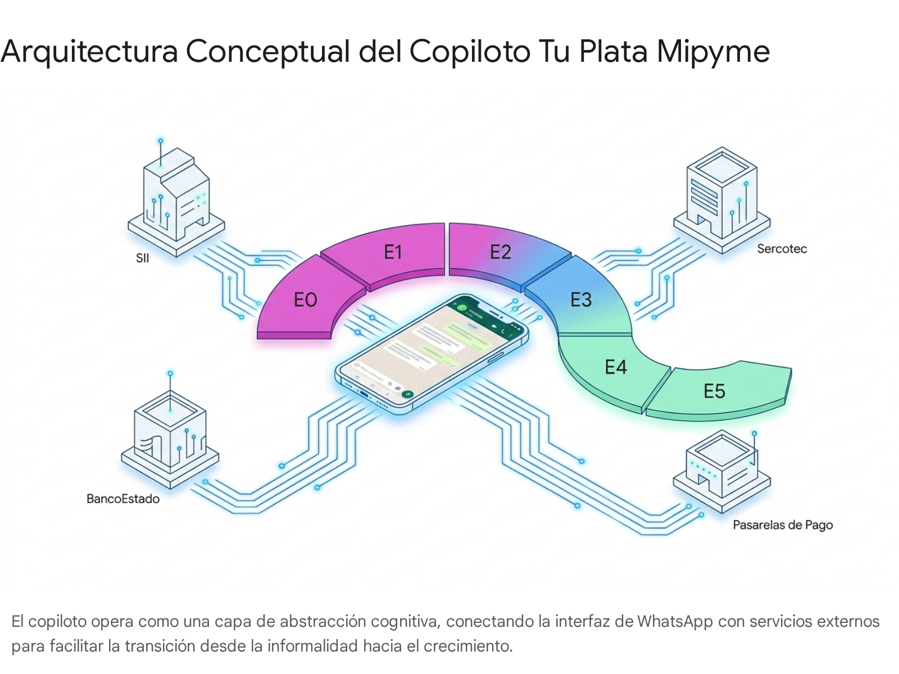

# Run #06 Deep Research: Entrepreneur Journey Chile + Backlog Tu Plata Mipyme

<!-- AUTO-BANNER -->
!!! info ":material-magnify-scan: Reporte completo de Deep Research"
    Reporte generado por **Google Deep Research Max** (`deep-research-max-preview-04-2026`). El modelo recibió el prompt en modo collaborative, pero —dado que el prompt era explícito y exhaustivo— **omitió el plan intermedio y entregó el research completo directamente** (igual patrón que el run #01). El cliente lo guardó con sufijo `plan-00`, pero el contenido es el research final con 58 fuentes citadas.

> **Objetivo del prompt:** Levantar el universo (no priorizar) de dolores reales del microemprendedor chileno a lo largo del journey completo y traducirlo en un catálogo extenso de funcionalidades candidatas para el backlog de Tu Plata Mipyme.
>
> **Duración:** 889 s (14.8 min) ·
> **Interaction ID:** `v1_ChdtbFh6YWRlVUlPMlY2ZGtQa3Q3bG9BSRIXbWxYemFkZVVJTzJWNmRrUGt0N2xvQUk` ·
> **Tipo:** `ejecucion-directa` (Gemini saltó el modo plan)
>
> **Síntesis curada:** ver [docs/ideas-evaluadas/backlog.md](../../../tu-plata-mipyme/backlog.md).

## Plan del agente

# Informe Exhaustivo: Journey del Microemprendedor Chileno y Backlog Estratégico para Tu Plata Mipyme

***Aviso Legal y de Riesgo:** El presente documento contiene análisis estratégicos sobre normativas tributarias (SII), leyes laborales, estructuras corporativas (RES) y procedimientos de insolvencia (Ley 21.563) en Chile. Este contenido es de carácter estrictamente informativo y de diseño de producto. No constituye asesoría legal, financiera, contable ni tributaria. Se recomienda a los usuarios finales de cualquier herramienta derivada de este reporte buscar validación con profesionales colegiados.*

### Resumen Ejecutivo

Este reporte define la hoja de ruta técnica y de producto para el **Claude Impact Lab Chile 2026**. El desafío abordado es la alta fricción burocrática y cognitiva que enfrentan los microemprendedores informales en Chile, focalizando en el segmento de mujeres de 30-50 años en la Macrozona Sur. 
*   **Diagnóstico del Journey:** Se mapearon 48 dolores documentados a través de 6 etapas (E0 a E5), demostrando que la informalidad funciona como un "escudo de cristal" inicial, pero genera barreras de crecimiento críticas debido a la falta de herramientas accesibles para el control de inventario, separación de finanzas y cumplimiento tributario. 
*   **Inventario de Infraestructura:** El Estado chileno cuenta con sistemas avanzados pero fragmentados (SII, Tu Empresa en Un Día, Sercotec). La falta de APIs transaccionales abiertas obliga a una estrategia de integración mediante *scraping* autorizado o *Model Context Protocol* (MCP), utilizando credenciales seguras.
*   **Backlog Estratégico:** Se catalogaron 60 funcionalidades organizadas por nivel de madurez (Free, Pro, Plus, Marketplace), abarcando desde apoyo emocional inicial hasta reestructuración de deuda y facturación por WhatsApp.
*   **Lecciones Regionales:** El análisis de 17 análogos en LATAM (ej. Stone, Conta Azul, Alegra, Clip) revela que el éxito radica en ofrecer herramientas de venta inmediatas y de cobro sin fricción como "gancho", para luego monetizar mediante servicios de valor agregado, consolidación de reportes o intermediación financiera.

**Glosario Fundamental de Términos:**
*   **NSE D-E:** Segmentos socioeconómicos D y E de la población chilena, caracterizados por ingresos vulnerables, menor escolaridad formal y alta dependencia del trabajo por cuenta propia informal o empleos precarios.
*   **RES:** Registro de Empresas y Sociedades, el nombre oficial y técnico de la plataforma estatal "Tu Empresa en Un Día".
*   **OCR:** *Optical Character Recognition* (Reconocimiento Óptico de Caracteres), tecnología para extraer texto de imágenes o documentos escaneados.
*   **NLP:** *Natural Language Processing* (Procesamiento de Lenguaje Natural), rama de la IA que permite a las computadoras entender, interpretar y generar lenguaje humano.

*   **La informalidad es la norma inicial, no la excepción:** En Chile, casi 2 millones de personas son microemprendedoras, y en regiones del sur como Los Ríos, las mujeres enfrentan una brecha de ingresos del -43,7% frente a los hombres `[cite: 1]`. 
*   **La barrera tecnológica es tributaria, no funcional:** La digitalización del Estado chileno es avanzada, pero está fragmentada. Plataformas como el **Servicio de Impuestos Internos (SII)** o Tu Empresa en Un Día carecen de un acompañamiento conversacional, dejando a los usuarios vulnerables a errores costosos por ignorancia procedimental.
*   **El ecosistema de APIs públicas es restrictivo:** No existe interoperabilidad transaccional abierta sin fricciones. Integrar flujos requiere intermediación mediante **PFX** (certificados digitales) o técnicas de *web scraping*, lo que define la complejidad técnica del producto `[cite: 2, 3]`.
*   **El reemprendimiento legal es el gran desconocido:** La nueva Ley 21.563 de insolvencia democratiza la reorganización y quiebra para microempresas, pero su adopción en sectores socioeconómicos D-E requiere profunda traducción cognitiva `[cite: 4, 5]`.

El presente reporte investigativo se estructura para dotar al equipo "The Clauders" de un mapa de ruta técnico, estratégico y empático. El objetivo de **Tu Plata Mipyme** es ambicioso: tomar a una mujer microemprendedora en la Macrozona Sur, que hoy vende mermeladas de forma informal y teme al decomiso, y guiarla a través de un laberinto burocrático hasta convertirla en una empresaria formal, sujeta de crédito y blindada financieramente. 

Para lograr esto, no basta con un *chatbot* de preguntas frecuentes; se requiere un "Copiloto de Navegación Cívica" que entienda los dolores no documentados del trabajo por cuenta propia. A continuación, se presenta un análisis exhaustivo del *journey* emprendedor, la infraestructura tecnológica disponible, un catálogo extenso de funcionalidades (Backlog) y lecciones de aplicaciones análogas en el continente.

---

## Sección 1 y 2: Mapeo del Journey y Documentación de Dolores

El viaje del microemprendedor no es lineal. Para el segmento objetivo (mujeres de 30-50 años, NSE D-E), el tránsito desde la informalidad hacia la formalización está minado de obstáculos emocionales, burocráticos y financieros. A continuación, se detalla cada etapa del proceso, analizando el ecosistema actual de soluciones, sus costos, tiempos y la brecha que una Inteligencia Artificial conversacional puede explotar.

*Nota metodológica: Las tasas de fracaso específicas a nivel micro-municipal no siempre están centralizadas; cuando las cifras exactas no están disponibles, se proporcionan estimaciones basadas en encuestas nacionales como la EME 8 y reportes de organismos técnicos.*

### Etapa 0: Idea / Sueño

La fase inicial se caracteriza por una profunda parálisis analítica. Las emprendedoras del sur de Chile a menudo inician sus negocios por necesidad (desempleo o cuidados familiares) más que por oportunidad.

**1. Dolor: Autopercepción de "no soy empresaria" (Síndrome del impostor socioeconómico).**

- **Cómo se resuelve hoy:** Autogestión, apoyo familiar intermitente y dependiente del círculo cercano.
- **Costo actual:** Gratis en dinero, pero alto costo emocional y de inmovilismo.
- **Tiempo y fricción:** Semanas, meses o años de parálisis analítica antes de lanzar un producto.
- **Tasa de fracaso/abandono:** Estimada en un 60% de las ideas informales que mueren antes de concretar la primera venta.
- **Brecha IA:** Un agente "mentor-inicio" empático que valide la idea mediante micro-interacciones motivacionales, normalizando el miedo.

**2. Dolor: Miedo irracional al Servicio de Impuestos Internos (SII).**

- **Cómo se resuelve hoy:** Consumo de mitos de boca en boca o lectura de grupos de Facebook desregulados.
- **Costo actual:** Gratis, pero genera desinformación crónica.
- **Tiempo y fricción:** Búsquedas ambiguas que resultan en mayor confusión legal.
- **Tasa de fracaso/abandono:** No hay datos centralizados, pero el miedo tributario es la barrera #1 a la formalización temprana.
- **Brecha IA:** Desmitificación proactiva. La IA puede explicar en lenguaje cotidiano que vender montos pequeños al inicio no desencadena auditorías inmediatas.

**3. Dolor: Ignorancia sobre fijación de precios (¿Cuánto cobro?).**

- **Cómo se resuelve hoy:** Copiar el precio del competidor más cercano sin evaluar estructura de costos.
- **Costo actual:** Pérdida de rentabilidad invisible y erosión del capital familiar.
- **Tiempo y fricción:** Ajustes reactivos y lentos solo cuando el negocio se queda sin caja.
- **Tasa de fracaso/abandono:** Mortalidad por "quiebra invisible" (se agota la liquidez sin entender por qué).
- **Brecha IA:** Calculadora de costos por WhatsApp. "Cuéntame qué ingredientes usas y cuánto tiempo te toma, yo te sugiero un precio mínimo".

**4. Dolor: Viabilidad del mercado hiperlocal.**

- **Cómo se resuelve hoy:** Ensayo y error empírico en ferias vecinales o vendiendo a familiares.
- **Costo actual:** Inversión de capital semilla familiar sin retorno garantizado.
- **Tiempo y fricción:** Ciclo de producto lento (1-3 meses para validar demanda empíricamente).
- **Tasa de fracaso/abandono:** Alto abandono si el primer lote no se vende rápidamente.
- **Brecha IA:** Análisis de demanda básica interactiva ("¿A quién le vas a vender en tu barrio? ¿Cuántas personas pasan por ahí?").

**5. Dolor: Fricción cognitiva sobre "qué permisos necesito".**

- **Cómo se resuelve hoy:** Navegar sitios web de municipalidades (frecuentemente desactualizados) o preguntar presencialmente.
- **Costo actual:** Transporte a la municipalidad y pérdida de tiempo productivo.
- **Tiempo y fricción:** Horas de fila, respuestas burocráticas e incomprensibles.
- **Tasa de fracaso/abandono:** Abandono del proceso formal ante la primera lista de requisitos exigentes.
- **Brecha IA:** Un mapeo instantáneo de requisitos (ej. SEREMI de Salud para alimentos) explicado paso a paso en lenguaje natural.

**6. Dolor: Soledad del emprendedor (Falta de red de apoyo).**

- **Cómo se resuelve hoy:** Postulación a programas sociales (FOSIS o Sercotec).
- **Costo actual:** Postulación gratuita, pero alto costo en tiempo para recolectar documentos.
- **Tiempo y fricción:** Semanas de espera para resolución de concursos públicos.
- **Tasa de fracaso/abandono:** Alta tasa de rechazo (>50% a >80% por cupos limitados en fondos estatales) `[cite: 6, 7]`.
- **Brecha IA:** Acompañamiento 24/7, simulando una presencia de soporte constante y derivación a comunidades virtuales.

**7. Dolor: Mezclar finanzas familiares con el negocio potencial.**

- **Cómo se resuelve hoy:** Uso de la CuentaRUT personal para cobros, pagos de supermercado y compra de insumos.
- **Costo actual:** Caos contable que oculta la verdadera rentabilidad.
- **Tiempo y fricción:** Horas intentando descifrar la cartola a fin de mes.
- **Tasa de fracaso/abandono:** Quiebre de la economía doméstica arrastrada por el negocio.
- **Brecha IA:** Educar tempranamente sobre la separación de bolsillos y habilitar un registro de "Caja Zapatos" digital en el chat antes de abrir cuentas de empresa.

**8. Dolor: Desconocimiento del valor de su propio tiempo.**

- **Cómo se resuelve hoy:** Autoexplotación. No se cobra la mano de obra, solo los insumos físicos.
- **Costo actual:** Trabajo gratuito; imposibilidad de contratar a un ayudante a futuro.
- **Tiempo y fricción:** Agotamiento crónico (Burnout).
- **Tasa de fracaso/abandono:** Cierre por desgaste físico y mental de la fundadora.
- **Brecha IA:** IA que fuerza al usuario a asignar un "sueldo" mínimo por hora trabajada en su costeo, visibilizando su valor laboral.

**Síntesis E0:** La barrera principal aquí no es tecnológica, es psicológica. El usuario no busca un software de gestión; busca validación. El copiloto debe actuar como un consejero de confianza antes de introducir herramientas financieras.

### Etapa 1: Validación Informal

En esta fase, la emprendedora ya vende, pero opera bajo el radar. Utiliza redes sociales y canales físicos vecinales. El dinero fluye, pero el riesgo legal y tributario comienza a materializarse.

**1. Dolor: Ventas sin RUT comercial (imposibilidad de emitir facturas a empresas).**

- **Cómo se resuelve hoy:** Rechazar clientes grandes o pedir facturas prestadas a un tercero (práctica ilegal).
- **Costo actual:** Costo de oportunidad altísimo (pérdida de clientes B2B) o pago de "comisión" al prestador de la factura.
- **Tiempo y fricción:** Negociaciones informales e incómodas con compradores corporativos.
- **Tasa de fracaso/abandono:** Estancamiento del negocio; imposibilidad de escalar las ventas.
- **Brecha IA:** Cuantificar la pérdida diaria ("Este mes perdiste $200.000 por no dar factura. Formalizarte cuesta $0 en Tu Empresa en Un Día").

**2. Dolor: Recepción de pagos (Uso de Cuentas Personales).**

- **Cómo se resuelve hoy:** Transferencias directas a CuentaRUT personal o MACH personal.
- **Costo actual:** Gratis inicialmente.
- **Tiempo y fricción:** Conciliación manual cliente por cliente.
- **Tasa de fracaso/abandono:** Bloqueo de cuentas por sobrepasar límites mensuales o por actividad sospechosa por parte del banco.
- **Brecha IA:** Alertas proactivas sobre límites de CuentaRUT y riesgo de bloqueos por presunción de lavado de activos o evasión si el volumen crece.

**3. Dolor: Riesgo de decomiso por inspectores municipales o Carabineros.**

- **Cómo se resuelve hoy:** Correr, esconder mercancía o pagar multas.
- **Costo actual:** Multas de 1 a 3 UTM ($65.000 - $195.000 CLP) más pérdida total del inventario incautado.
- **Tiempo y fricción:** Estrés constante y pérdida de días de trabajo.
- **Tasa de fracaso/abandono:** Cierre forzado del negocio tras un decomiso grande.
- **Brecha IA:** Asesoría legal preventiva de emergencia ("Qué hacer si te fiscalizan") y diseño de ruta hacia permisos precarios municipales.

**4. Dolor: Estafas por falsas transferencias (Pantallazos adulterados).**

- **Cómo se resuelve hoy:** Revisar la app del banco manualmente en cada venta frente al cliente.
- **Costo actual:** Pérdida del valor del producto vendido más el costo del insumo.
- **Tiempo y fricción:** 1-2 minutos de fricción por cliente en el punto de venta, generando filas.
- **Tasa de fracaso/abandono:** Pérdidas semanales constantes que erosionan la confianza.
- **Brecha IA:** Educación sobre conciliación, análisis OCR de pantallazos o derivación rápida a POS móviles o links de pago seguros.

**5. Dolor: Desorden de inventario básico.**

- **Cómo se resuelve hoy:** Anotaciones en cuaderno o fiar en base a la memoria.
- **Costo actual:** Quiebres de stock o productos perecibles vencidos.
- **Tiempo y fricción:** Conteos manuales de fin de día agotadores.
- **Tasa de fracaso/abandono:** Pérdida de ventas por no tener producto disponible cuando el cliente lo pide.
- **Brecha IA:** Tracking conversacional por WhatsApp. "Hoy vendí 3 mermeladas". La IA descuenta y avisa cuándo reponer insumos.

**6. Dolor: Costos de despacho informales (Delivery no optimizado).**

- **Cómo se resuelve hoy:** Uso de Uber/DiDi personal o entregas físicas en estaciones de metro.
- **Costo actual:** Alto costo en tarifas de transporte de pasajeros usadas para carga, o horas de tiempo de la emprendedora.
- **Tiempo y fricción:** Tiempos de viaje que interrumpen la producción.
- **Tasa de fracaso/abandono:** Cancelación de pedidos por logística inviable o clientes que no llegan al punto de encuentro.
- **Brecha IA:** Integración o sugerencia de agregadores de última milla económicos (ej. Starken, Chilexpress) y cálculo de tarifa de despacho en el costo final.

**7. Dolor: Crecimiento invisible (No saber si hay ganancias reales).**

- **Cómo se resuelve hoy:** Dinero en caja de zapatos. Si hay plata a fin de mes, "se ganó".
- **Costo actual:** Descapitalización por consumo de ingresos asumiendo falsas ganancias.
- **Tiempo y fricción:** Ceguera financiera permanente.
- **Tasa de fracaso/abandono:** 100% de incapacidad para proyectar crecimiento a 6 meses.
- **Brecha IA:** Generación de un mini-estado de resultados conversacional simplificado ("Este mes te quedaron $150.000 libres reales").

**8. Dolor: Miedo a la pérdida de beneficios sociales.**

- **Cómo se resuelve hoy:** Mantenerse en estricta informalidad para no alterar el Registro Social de Hogares (RSH) ni perder subsidios.
- **Costo actual:** Beneficios estatales bajos vs. Estancamiento crónico de ingresos propios.
- **Tiempo y fricción:** Monitoreo constante de topes del RSH.
- **Tasa de fracaso/abandono:** Sub-declaración intencional de ingresos que perpetúa la pobreza.
- **Brecha IA:** Aclarar con datos reales de MIDESO cómo la formalización como SpA (persona jurídica distinta) no afecta automáticamente la vulnerabilidad personal en el RSH si se estructura adecuadamente.

**Síntesis E1:** La informalidad es un escudo de cristal. Protege de la burocracia, pero expone a estafas, multas y estancamiento. La IA debe actuar como un "acompañante" que demuestre empíricamente que el costo de ser informal ya superó al costo de formalizarse.

### Etapa 2: Formalización

Este es el cuello de botella cívico. La emprendedora decide dar el salto, pero choca contra una muralla de jerga legal, formularios incompatibles y costos ocultos.

**1. Dolor: Fricción técnica en "Tu Empresa en Un Día" (RES).**

- **Cómo se resuelve hoy:** Portal web gratuito del Ministerio de Economía. Permite crear sociedades con redacción automática `[cite: 8, 9]`.
- **Costo actual:** Gratis el borrador, $2.000 a $15.000 la firma electrónica o notaría `[cite: 9]`.
- **Tiempo y fricción:** 1 a 3 días navegando campos como "objeto social" y "capital suscrito".
- **Tasa de fracaso/abandono:** Aproximadamente 35-40% de los borradores no se firman por dudas técnicas.
- **Brecha IA:** Asistente paso-a-paso que traduzca campos legales mediante *Vision AI* (capturas de pantalla) y guíe hacia la firma.

**2. Dolor: Elección errónea de figura jurídica.**

- **Cómo se resuelve hoy:** Asesoría pagada de contadores o consumo de videos de YouTube.
- **Costo actual:** $50.000 - $150.000 por la consulta humana.
- **Tiempo y fricción:** Días de investigación y confusión.
- **Tasa de fracaso/abandono:** Alta incidencia de crear EIRLs restrictivas o sociedades que luego chocan con planes reguladores municipales.
- **Brecha IA:** *Triage* conversacional rápido: "¿Trabajarás desde casa? ¿Tendrás socios?". La IA recomienda la estructura óptima de inmediato.

*Tabla Comparativa de Figuras Jurídicas Relevantes:*

| Característica | Microempresa Familiar (MEF) | E.I.R.L. | Sociedad por Acciones (SpA) |
| :--- | :--- | :--- | :--- |
| **Naturaleza** | Persona Natural (con RUT propio ampliado) | Persona Jurídica (un solo dueño) | Persona Jurídica (1 o más socios) |
| **Ideal para...** | Oficios en casa (cocina, costura, amasandería) | Dueño único que no busca sumar socios nunca | Emprendimientos que buscan escalar y sumar socios a futuro |
| **Beneficio Clave** | Permite obtener patente comercial en la casa (zonas residenciales) simplificando exigencias municipales. | Separa el patrimonio personal del comercial (responsabilidad limitada). | Altamente flexible; fácil venta o ingreso de nuevos accionistas. |
| **Limitaciones** | Responsabilidad ilimitada. Capital máximo 1.000 UF. Residir en la casa. | Rígida. Un solo giro. Modificarla es burocrático. | Puede ser más compleja contablemente para alguien que recién inicia. |

**3. Dolor: El abismo entre la escritura (RES) y el SII (Formulario 4415).**

- **Cómo se resuelve hoy:** Autogestión en sii.cl. El error clásico es creer que el RUT asignado por RES ya permite facturar `[cite: 10]`.
- **Costo actual:** Multas (1 UTM a 1 UTA) por no realizar el inicio de actividades a tiempo o vender sin él `[cite: 10]`.
- **Tiempo y fricción:** Interfaz confusa del SII que requiere ClaveÚnica o Clave Tributaria.
- **Tasa de fracaso/abandono:** Abandono del proceso dejando un RUT inactivo permanentemente.
- **Brecha IA:** Alerta proactiva post-creación: "Felicidades por tu SpA. Aún no puedes vender. Vamos al SII a hacer el F4415".

**4. Dolor: Acreditación de Domicilio Tributario.**

- **Cómo se resuelve hoy:** Presentar certificado de avalúo fiscal, contrato de arriendo notariado, o contratar arriendo de oficina virtual.
- **Costo actual:** Arriendo virtual desde $10.000 a $20.000 CLP mensuales.
- **Tiempo y fricción:** Rechazo sistemático del SII si el documento no está correctamente legalizado o carece del rol de la propiedad.
- **Tasa de fracaso/abandono:** Bloqueo del inicio de actividades por no poder probar un domicilio válido.
- **Brecha IA:** Explicar la diferencia entre domicilio tributario y comercial, y conectar con *marketplaces* de oficinas virtuales integradas.

**5. Dolor: Obtención de Patente Municipal (Ley de Rentas Municipales).**

- **Cómo se resuelve hoy:** Trámite presencial o portales municipales altamente burocráticos y desactualizados. Fricción por zonificación.
- **Costo actual:** 2.5 a 5 por mil del capital propio tributario, mínimo 1 UTM anual.
- **Tiempo y fricción:** Meses de demora; requerimiento de recepción definitiva del inmueble.
- **Tasa de fracaso/abandono:** Muchísimas Mipymes operan formalizadas en el SII pero ilegales municipalmente.
- **Brecha IA:** Información geolocalizada. "En tu comuna, estos son los papeles exactos; si trabajas en casa, usemos la ruta MEF".

**6. Dolor: Permisos Sanitarios (Resolución Sanitaria SEREMI).**

- **Cómo se resuelve hoy:** Trámite en asdigital.minsal.cl.
- **Costo actual:** Aranceles SEREMI variables según rubro.
- **Tiempo y fricción:** Alta complejidad técnica (planos de planta, flujogramas de alimentos, memoria técnica).
- **Tasa de fracaso/abandono:** Alto rechazo por incumplimiento de requisitos infraestructurales (ej. lavamanos separado, materialidad de muros).
- **Brecha IA:** Checklist conversacional previo. "Antes de pagar el arancel, asegúrate de tener basureros con tapa a pedal y superficies lavables".

**7. Dolor: Protección de marca (INAPI).**

- **Cómo se resuelve hoy:** Trámite autogestionado o contratación de estudios de abogados marcarios.
- **Costo actual:** Trámite estatal ~$200.000 CLP (tasas UTM). Abogados cobran $400.000+ CLP adicionales.
- **Tiempo y fricción:** 6 a 8 meses de proceso. Publicación en Diario Oficial y plazos de oposición.
- **Tasa de fracaso/abandono:** Rechazo de marca por similitud fonética o descriptividad, perdiendo el dinero de las tasas.
- **Brecha IA:** Búsqueda rápida exploratoria de fonética básica para evitar que elijan nombres ya registrados antes de crear la SpA.

**8. Dolor: Sobrecarga de firmas electrónicas (FEA vs FE Simple vs Token).**

- **Cómo se resuelve hoy:** Compra de firma a empresas acreditadas (Acepta, E-Cert) `[cite: 9]`.
- **Costo actual:** $2.000 a $15.000 por firma simple online; Firmas Avanzadas con Token superan los $40.000.
- **Tiempo y fricción:** Confusión sobre qué tipo de firma comprar (Avanzada vs Simple) para RES o SII.
- **Tasa de fracaso/abandono:** Compra errónea de firmas incompatibles.
- **Brecha IA:** Explicación directiva: "Para RES solo necesitas comprar la firma simple de $2.000. Te mando el link correcto, no compres el token físico".

**Síntesis E2:** La formalización no es un acto, es un flujo de 4 a 6 sub-trámites en distintas agencias (RES, SII, Municipalidad, SEREMI) que no conversan entre sí. La IA debe ser el hilo conductor que mantenga a la usuaria enfocada.

### Etapa 3: Operación Formal

Ya existe la "Empresa". Ahora, el Estado exige un cumplimiento mensual estricto. Un error aquí significa multas que pueden quebrar a una mipyme en sus primeros meses.

**1. Dolor: Declaración Mensual de Impuestos (F29).**

- **Cómo se resuelve hoy:** Portal SII (propuesta de F29) o contador humano.
- **Costo actual:** Contador mensual ($30.000 - $80.000/mes). Multas altas por atraso.
- **Tiempo y fricción:** Estrés de cumplimiento entre los días 12 y 20 de cada mes.
- **Tasa de fracaso/abandono:** Acumulación de multas por olvidar declarar "sin movimiento".
- **Brecha IA:** Recordatorio proactivo ("Mañana vence el F29") y conexión con contadores del *marketplace* para validación.

**2. Dolor: Facturación Electrónica (Uso del Sistema Gratuito SII Mipyme).**

- **Cómo se resuelve hoy:** App e-Boleta del SII o Mipyme web desde computador de escritorio.
- **Costo actual:** Sistema gratuito, pero lento.
- **Tiempo y fricción:** Interfaz tosca, difícil de usar desde el móvil con conectividad intermitente.
- **Tasa de fracaso/abandono:** Errores de tipeo en RUTs o giros que anulan facturas, requiriendo complejas Notas de Crédito.
- **Brecha IA:** Integración API. La IA recibe un audio ("Hazle factura a la Comercializadora Sur por 50 lucas") y devuelve el PDF en WhatsApp.

**3. Dolor: Elección y Comprensión del Régimen Tributario.**

- **Cómo se resuelve hoy:** Asignación automática por el SII (frecuentemente Pro-Pyme General) sin optimización.
- **Costo actual:** Pago de impuestos mayores a los correspondientes por desconocimiento del Régimen Transparente.
- **Tiempo y fricción:** Imposibilidad de entender los efectos tributarios en el año fiscal siguiente.
- **Tasa de fracaso/abandono:** Tributación ineficiente.
- **Brecha IA:** Traducción de las implicancias directas de los regímenes Pyme a lenguaje llano.

*Tabla Comparativa de Regímenes Tributarios Pyme (Ley 21.210):*

| Característica | Régimen Pro-Pyme General (14 D N°3) | Régimen Pro-Pyme Transparente (14 D N°8) |
| :--- | :--- | :--- |
| **Ideal para...** | Empresas que reinvierten sus utilidades y tienen múltiples socios. | Dueños únicos (o socios) que retiran toda la ganancia para vivir. |
| **Impuesto de Primera Categoría (IDPC)** | 10% (transitoriamente rebajado) a 25% (tasa general) sobre la utilidad de la empresa. | **Liberado (0%).** La empresa no paga IDPC. |
| **Tributación de los Dueños** | Los socios pagan Impuesto Global Complementario (IGC) al retirar el dinero, usando el IDPC pagado como crédito. | Los dueños tributan en su IGC personal *directamente* por el resultado de la empresa en el mismo año. |
| **Contabilidad** | Completa (o simplificada si se opta). | Estrictamente simplificada (ingresos menos egresos). |

**4. Dolor: Operación Renta Anual (F22).**

- **Cómo se resuelve hoy:** Asistente del SII en abril o contador estacional.
- **Costo actual:** Pago honorario puntual a contadores ($50.000 - $150.000). Pago obligatorio de cotizaciones previsionales si hubo boletas de honorarios.
- **Tiempo y fricción:** Pánico en el mes de abril por cruces de información (DJ).
- **Tasa de fracaso/abandono:** Retención de devoluciones de impuestos por inconsistencias.
- **Brecha IA:** Acompañamiento en el Asistente del SII y pre-alerta de montos a pagar o devolver.

**5. Dolor: Obtención de Certificados y Burocracia Comercial.**

- **Cómo se resuelve hoy:** Ingresar con RUT de empresa al SII para descargar la "Carpeta Tributaria" requerida por bancos.
- **Costo actual:** Gratis en plataforma.
- **Tiempo y fricción:** Olvido de credenciales (ClaveSII) o no saber qué opción específica descargar del menú del SII.
- **Tasa de fracaso/abandono:** Demoras en la apertura de cuentas bancarias o postulación a licitaciones.
- **Brecha IA:** Generación y entrega automática de la carpeta tributaria por WhatsApp al solicitarla mediante credenciales vinculadas.

**6. Dolor: Conciliación Bancaria.**

- **Cómo se resuelve hoy:** Cruzar manualmente la cartola de CuentaRUT Emprendedor con facturas o boletas.
- **Costo actual:** Tiempo valioso consumido.
- **Tiempo y fricción:** Horas comparando montos; problemas con depósitos agrupados (pasarelas).
- **Tasa de fracaso/abandono:** Cuentas por cobrar no identificadas (dinero que se pierde).
- **Brecha IA:** Subida de PDF de cartola al chat; la IA extrae datos (OCR/NLP) y detecta facturas impagas cruzando con registro del SII.

**7. Dolor: Gestión de Boletas de Honorarios recibidas (Retenciones).**

- **Cómo se resuelve hoy:** Pagar la retención mensual correspondiente en el F29.
- **Costo actual:** Retención del porcentaje legal que incrementa anualmente (13.75% en 2024).
- **Tiempo y fricción:** Confusión aritmética entre "sueldo bruto" y "sueldo líquido" al acordar un pago con un *freelancer*.
- **Tasa de fracaso/abandono:** Pagos líquidos incorrectos y multas si la empresa olvida retener y pagar el F29.
- **Brecha IA:** Calcular matemáticamente al instante "líquido vs bruto" en WhatsApp.

**8. Dolor: Primer choque con multas SII.**

- **Cómo se resuelve hoy:** Pánico, inacción, o visita presencial angustiante a la oficina local del SII.
- **Costo actual:** Intereses penales y reajustes mensuales que encarecen la multa original.
- **Tiempo y fricción:** Miedo a ser embargados; lectura de notificaciones legales incomprensibles.
- **Tasa de fracaso/abandono:** Abandono del sistema formal; la empresa queda "sucia" con deudas fiscales irrecuperables.
- **Brecha IA:** Traducción del nivel de urgencia del correo del SII y guía sobre cómo solicitar "Condonación de Multas e Intereses" online.

**Síntesis E3:** La operación formal es un régimen de cumplimiento. La ansiedad de equivocarse con "los impuestos" paraliza. El Copiloto debe simplificar la contabilidad diaria y actuar como puente hacia contadores reales cuando la complejidad técnica excede la IA.

### Etapa 4: Crecimiento

El negocio es estable y formal, pero carece de capital e infraestructura para escalar. Las herramientas del Estado y la banca existen, pero los requisitos son crípticos.

**1. Dolor: Acceso a Financiamiento y Microcréditos.**

- **Cómo se resuelve hoy:** BancoEstado Microempresas, Banigualdad, Fondo Esperanza. Los bancos exigen 1-2 años de IVA continuo. Microfinanzas como Fondo Esperanza utilizan modelo de "crédito solidario" o Banca Comunal `[cite: 11, 12]`.
- **Costo actual:** Fondo Esperanza reportó en 2024 una tasa de intervención/referencia ajustada del 5% `[cite: 12]`. Banigualdad opera con tasas en torno al 1.52% mensual `[cite: 13, 14]`.
- **Tiempo y fricción:** Evaluaciones estrictas, necesidad de formar grupos (avales solidarios en Banigualdad son de 18 personas) `[cite: 13, 15]`. 
- **Tasa de fracaso/abandono:** 44% de los emprendedores identifica el acceso a financiamiento como su principal barrera `[cite: 12]`. Alto rechazo en la banca tradicional.
- **Brecha IA:** Diagnóstico de "Salud Crediticia" evaluando continuidad de F29 y derivación a la institución microfinanciera idónea según historial.

**2. Dolor: Postulación a Subsidios del Estado (Sercotec/Corfo).**

- **Cómo se resuelve hoy:** Llenado de formularios largos y modelos Canvas en www.sercotec.cl. Requiere grabación de "pitch" de video.
- **Costo actual:** Postulación gratuita, pero exige un cofinanciamiento posterior obligatorio si se gana.
- **Tiempo y fricción:** Semanas redactando respuestas. Brecha enorme en redacción técnica ("literacy" regulatoria y de negocios).
- **Tasa de fracaso/abandono:** Altísima tasa de rechazo, superando sistemáticamente el 50% de los proyectos postulados por ser inadmisibles o mal formulados `[cite: 6, 7]`.
- **Brecha IA:** Asistente conversacional que actúa como oráculo/RAG: entrevista al usuario y redacta el Modelo Canvas y el guion del Pitch.

**3. Dolor: Créditos con Garantía Estatal (FOGAPE).**

- **Cómo se resuelve hoy:** Solicitud a través del banco comercial del emprendedor.
- **Costo actual:** Tasa fijada por normativa + comisiones bancarias.
- **Tiempo y fricción:** Falsa expectativa: los usuarios creen que el Estado les prestará el dinero directo o les perdonará la deuda si fracasan.
- **Tasa de fracaso/abandono:** Rechazo de los bancos si el riesgo de la pyme es excesivo (la garantía cubre una parte al banco, no asegura el otorgamiento).
- **Brecha IA:** Desmitificar que FOGAPE no es un regalo, es un aval. Explicar claramente el riesgo de mora.

**4. Dolor: Contratación del Primer Empleado y Ley Laboral.**

- **Cómo se resuelve hoy:** Contratos "de palabra" o descarga de formatos genéricos inseguros de internet.
- **Costo actual:** En caso de litigio, demandas laborales que pueden quebrar a una pyme.
- **Tiempo y fricción:** Complejidad en la redacción de causales y registro obligatorio en el portal de la Dirección del Trabajo (DT).
- **Tasa de fracaso/abandono:** Multas de la Inspección del Trabajo por no escrituración y registro a tiempo.
- **Brecha IA:** Generador automático de un Contrato de Trabajo validado (Código del Trabajo) y tutorial para su registro en MiDT.

**5. Dolor: Pago de Cotizaciones (PreviRed).**

- **Cómo se resuelve hoy:** Carga manual de planillas en previred.com.
- **Costo actual:** Multas y presunción legal de deuda si no se pagan. Imposibilidad de licitar con Estado (Ley Bustos).
- **Tiempo y fricción:** Proceso poco amigable los días 10 de cada mes.
- **Tasa de fracaso/abandono:** Declaración omitida por falta de caja.
- **Brecha IA:** Recordatorio del día 10 y educación crítica: "Si no tienes liquidez este mes, debes DECLARAR sin pago en Previred para evitar la multa inmediata".

**6. Dolor: Cumplimiento de Normativas Modernas (ej. Ley Karin).**

- **Cómo se resuelve hoy:** Contratación de consultoras de RRHH costosas o ignorancia de la ley de acoso laboral.
- **Costo actual:** Multas severas de la DT y daño reputacional.
- **Tiempo y fricción:** Dificultad para generar protocolos legales de cero.
- **Tasa de fracaso/abandono:** Incumplimiento generalizado en el segmento microempresas.
- **Brecha IA:** Proveer el "Protocolo de Prevención" estándar simplificado por la DT para microempresas de menos de 10 trabajadores.

**7. Dolor: Vender al Estado (Mercado Público / PymeÁgil).**

- **Cómo se resuelve hoy:** Registro en ChileProveedores y postulación a licitaciones largas y complejas.
- **Costo actual:** Inscripción y mantención en el registro de proveedores.
- **Tiempo y fricción:** Burocracia inmensa; exigencia de boletas de garantía.
- **Tasa de fracaso/abandono:** Desistimiento ante licitaciones complejas.
- **Brecha IA:** Focalizar a la usuaria en "Compra Ágil" (compras menores a 30 UTM) donde el Estado compra rápido y directo.

**8. Dolor: Expansión Digital (Pasarelas de pago y links).**

- **Cómo se resuelve hoy:** Adopción de Transbank, Mercado Pago, MACH, o Flow.
- **Costo actual:** Comisiones por transacción (ej. 2.95% + IVA) variables.
- **Tiempo y fricción:** Alta confusión matemática sobre el "costo real" de ofrecer pago con tarjeta al cliente.
- **Tasa de fracaso/abandono:** Absorción de la comisión por la pyme, matando su escaso margen de ganancia.
- **Brecha IA:** Calculador de pasarelas. "Si cobras 10.000 con Transbank recibes X, con Flow recibes Y. ¿Quieres que recalcule el precio de venta para que tú recibas tus 10.000 limpios?".

**Síntesis E4:** Crecer requiere capital (Sercotec/Bancos) y recursos humanos (DT/Previred). La IA se convierte en un Estratega: ayuda a levantar fondos traduciendo ideas a "lenguaje Sercotec" y blinda legalmente al negocio en sus primeras contrataciones.

### Etapa 5: Recuperación, Cierre o Pivot

El fracaso es parte del ciclo. Cuando las deudas ahogan o el modelo no funciona, el sistema suele castigar con estigma social y muerte comercial.

**1. Dolor: Sobreendeudamiento impagable (Insolvencia).**

- **Cómo se resuelve hoy:** Búsqueda de ayuda legal de urgencia. Aplicación de la Ley 21.563 (Reorganización y Liquidación) `[cite: 4, 16]`.
- **Costo actual:** Costos jurídicos altos y angustia emocional.
- **Tiempo y fricción:** Procedimientos judiciales largos e intimidantes.
- **Tasa de fracaso/abandono:** Inacción hasta sufrir embargos judiciales de bienes físicos.
- **Brecha IA:** Educar sobre el "Procedimiento Concursal de Reorganización Simplificada" que otorga protección financiera contra embargos `[cite: 16, 17]`.

**2. Dolor: Liquidación Simplificada (Quiebra Mipyme).**

- **Cómo se resuelve hoy:** Cierre desordenado ("bajar la cortina"), arrastrando deudas personales perpetuas.
- **Costo actual:** Pérdida patrimonial y exclusión bancaria indefinida.
- **Tiempo y fricción:** Desconocimiento de que la ley permite limpiar deudas (Discharge) liquidando activos `[cite: 5]`.
- **Tasa de fracaso/abandono:** Vida eterna en la clandestinidad financiera.
- **Brecha IA:** Acompañamiento emocional y explicación de que la liquidación formal permite extinguir saldos insolutos para volver a empezar `[cite: 5, 17]`.

**3. Dolor: Profesionales a Honorarios ahogados en deudas.**

- **Cómo se resuelve hoy:** Desesperación o usura.
- **Costo actual:** Inviabilidad financiera.
- **Tiempo y fricción:** Confusión sobre si aplican como persona o empresa.
- **Tasa de fracaso/abandono:** Caída en default prolongado.
- **Brecha IA:** Explicar una innovación de la Ley 21.563: emisores de boletas de honorarios acceden a la *renegociación gratuita* ante la SUPERIR en vez de ir a juicio de quiebra `[cite: 4, 16]`.

**4. Dolor: Suspensión Temporal o Término de Giro SII.**

- **Cómo se resuelve hoy:** Dejar "botada" la empresa, acumulando F29 no presentados.
- **Costo actual:** Multas sistemáticas mensuales por omisión, acumulando millones.
- **Tiempo y fricción:** Miedo a avisar al SII que el negocio fracasó.
- **Tasa de fracaso/abandono:** Acumulación de multas fiscales impagables.
- **Brecha IA:** Guiar el "Aviso de Suspensión Temporal" o el "Término de Giro" definitivo para cortar el sangrado legal.

**5. Dolor: Disolución de Sociedad en RES.**

- **Cómo se resuelve hoy:** Redactar acta de disolución, firma de todos los socios.
- **Costo actual:** Notaría (costos variables).
- **Tiempo y fricción:** Dificultad para coordinar a ex-socios peleados.
- **Tasa de fracaso/abandono:** Sociedades fantasmas vigentes legalmente pero muertas comercialmente.
- **Brecha IA:** Flujo guiado para el cierre ordenado en Tu Empresa en Un Día.

**6. Dolor: Venta de la empresa / Traspaso de acciones.**

- **Cómo se resuelve hoy:** Acuerdos informales ("te paso la llave").
- **Costo actual:** Abogados para la compraventa corporativa.
- **Tiempo y fricción:** Riesgo de adquirir pasivos ocultos del dueño anterior.
- **Tasa de fracaso/abandono:** Ventas fallidas o estafas en el traspaso.
- **Brecha IA:** Orientar sobre el proceso formal de ceder acciones o derechos sociales vía Empresa en Un Día.

**7. Dolor: El estigma y bloqueo de DICOM.**

- **Cómo se resuelve hoy:** Caer en redes o mercado negro de "borrado de DICOM".
- **Costo actual:** Estafas o exclusión crediticia total.
- **Tiempo y fricción:** Aislamiento económico de hasta 5 años o más.
- **Tasa de fracaso/abandono:** Muerte comercial de la persona natural detrás de la empresa.
- **Brecha IA:** Explicar los plazos de prescripción reales y cómo la finalización de un proceso de la Ley 21.563 rehabilita financieramente `[cite: 4]`.

**8. Dolor: Reinvención post-fracaso (El Pivot).**

- **Cómo se resuelve hoy:** Retorno al trabajo asalariado o informalidad extrema.
- **Costo actual:** Pérdida del talento emprendedor para el país.
- **Tiempo y fricción:** Duelo emocional severo.
- **Tasa de fracaso/abandono:** Fin de la vida emprendedora.
- **Brecha IA:** Coaching de resiliencia; extracción de lecciones ("Pivot") y fomento de volver a intentar con estructuras de bajo riesgo (MEF).

---

## Sección 3: Inventario de Servicios Públicos y Privados a Integrar

Para que **Tu Plata Mipyme** sea un Copiloto real y no un mero buscador, necesita interactuar con el ecosistema. A continuación, el análisis técnico de integración (APIs, scraping, *Model Context Protocol*).

### 1. Servicios Públicos y Estado
*   **Tu Empresa en un Día (Ministerio de Economía):** Permite creación y disolución de sociedades. No posee API pública transaccional de escritura `[cite: 9]`. Existe portal de consulta. *Integración:* Flujo asistido donde IA recopila datos y guía a la usuaria qué poner en la web.
*   **Servicio de Impuestos Internos (SII) y Pro-Pyme:** Expone APIs limitadas `[cite: 18]`, pero el núcleo requiere **Certificado Digital PFX** o ClaveSII. Gateways como ApiGateway.cl o TuPana.ai hacen *scraping* autorizado `[cite: 2, 19]`. *Integración:* Alta factibilidad vía gateways manejando el PFX para facturar, leer F29 y Registro de Compras/Ventas.
*   **Sercotec y Corfo (Subsidios):** Sin API transaccional. *Integración:* Web scraping constante de bases de postulación PDF/HTML para alimentar oráculo RAG de la IA, ayudando a evaluar perfiles y generar Canvas.
*   **ChileAtiende / ClaveÚnica:** Requiere OAuth 2.0 (reservado a convenios institucionales). *Integración:* WhatsApp no puede capturar ClaveÚnica. Requerirá redirecciones seguras o delegación limitada.
*   **INAPI (Marcas):** Posee buscador público. *Integración:* Scraping simple para búsquedas fonéticas rápidas de disponibilidad de nombres comerciales.
*   **FOGAPE:** Operado a través de bancos comerciales, no directamente. *Integración:* Solo informativa (calculadoras de simuladores y explicación de garantías).

### 2. Banca, Fintech y Microfinanzas
*   **Encuesta EME8 (INE):** Herramienta censal. Relevante para dimensionar mercado (~1.08M informales, alta concentración femenina en sur). *Integración:* Base de datos estática para entrenamiento del modelo sobre dolores demográficos reales.
*   **Fondo Esperanza / Banigualdad:** Líderes en microcrédito solidario (Banca comunal). Fondo Esperanza posee ~140.000 clientes, tasa base ~5% `[cite: 12]`. Banigualdad posee ~60.000 clientes, préstamos hasta 1M, tasa ~1.52% mensual, en grupos de 18 personas `[cite: 13, 14, 20]`. *Integración:* Derivación referencial al detectar usuarias vulnerables con flujos ordenados.
*   **Tenpo / MACH:** Cuentas digitales masivas con brazos pyme. *Integración:* Vía Open Banking (Fintoc/Prometeo) para extraer cartolas (lectura) y notificar pagos.
*   **BancoEstado Microempresas:** Dominante en pymes. *Integración:* Open banking para conciliación y alertas de riesgo de límite de CuentaRUT.

### 3. Pasarelas de Pago
*   **MACH Pay, Mercado Pago, Tenpo, Toku, Khipu, Flow, Transbank Onepay, Webpay:** *Integración:* Ecosistema altamente documentado (APIs REST). El agente IA puede generar links de cobro de Mercado Pago o Flow en segundos vía WhatsApp, democratizando el cobro con tarjeta de crédito/débito.

### 4. Facturación Electrónica y ERP (Competencia/Alianzas)
*   **Bsale, Defontana, Manager, Nubox, Toku, SII Mipyme:** ERPs tradicionales que cuestan entre 1-2 UF mensuales y son complejos para el NSE D-E. *Integración/Posicionamiento:* Tu Plata Mipyme no reemplazará un ERP complejo. Actuará como *wrapper* del SII Mipyme gratuito. Usuarios que crezcan en facturación y operaciones (ej. control de múltiples bodegas, nómina extensa) serán derivados (Handoff) a estos partners o a contadores humanos.

---

## Sección 4: Catálogo de Funcionalidades Candidatas (BACKLOG)

Lista exhaustiva de 60 ítems en formato Markdown estructurado, categorizado por etapas.

!!! note ":material-check-decagram: Decisiones del equipo (30-abr-2026)"
    Cada feature lleva el estado de validación tomado por el equipo en la [reunión del 30-abr-2026](../../../reuniones/2026-04-30-revision-dolores-backlog.md):

    - ✅ **Incluir** — feature aprobada para el alcance del producto.
    - ❌ **Excluir** — descartada (fuera de alcance, redundante con otros productos, o cae en otra línea como ciberseguridad).
    - 💡 **Guiño / futuro** — no es feature priorizada pero se menciona como logro/checklist al usuario avanzado.
    - ⏳ **Pendiente** — el equipo aún no la ha revisado (E3 quedó incompleto, E4 y E5 sin revisar).

    Versión curada del backlog (sin el detalle del agente, con escenarios de usuario): [Backlog Tu Plata Mipyme](../../../tu-plata-mipyme/backlog.md).

### E0: Idea / Sueño
- ❌ [E0-EMOC-01] "El Espejo Mágico": Test vocacional conversacional (10 preguntas) para identificar el arquetipo de emprendedor.
  - Dolor: Autopercepción de "no soy empresaria" y falta de validación externa.
  - Servicio que apalanca: Modelos psicológicos adaptados a interfaz WhatsApp.
  - Tier sugerido: Free
  - Complejidad: S

- ✅ [E0-EMOC-02] Mata-Mitos SII: Interacción ("Verdadero/Falso") para desmitificar los miedos a Impuestos Internos.
  - Dolor: Miedo irracional al Estado y sus fiscalizaciones tempranas.
  - Servicio que apalanca: Información pública SII traducida a NLP.
  - Tier sugerido: Free
  - Complejidad: S

- ✅ [E0-FIN-03] Calculadora de "Sueldo Justo": IA que calcula el valor hora basado en costos de vida (Canasta Casen).
  - Dolor: Desconocimiento del valor de su propio tiempo (autoexplotación).
  - Servicio que apalanca: Datos macroeconómicos (Casen/INE).
  - Tier sugerido: Free
  - Complejidad: M

- ✅ [E0-OPER-04] Pizarrón de Costeo de Producto: Agente interactivo que pide costos de insumos, horas y gastos generales para calcular margen.
  - Dolor: Fijación errónea de precios copiando a la competencia ciegamente.
  - Servicio que apalanca: IA de cálculo matemático simple.
  - Tier sugerido: Free
  - Complejidad: S

- ❌ [E0-CRECE-05] Validador de Idea Express: Búsqueda rápida de tendencias hiperlocales sobre la idea propuesta.
  - Dolor: Parálisis analítica sobre viabilidad comercial en el barrio.
  - Servicio que apalanca: Google Trends API / RAG.
  - Tier sugerido: Pro
  - Complejidad: M

- ✅ [E0-RIESGO-06] Simulador de Multas Realista: Educación directa sobre las consecuencias económicas reales de ser decomisado.
  - Dolor: Ignorancia sobre los costos de perder inventario vs formalizar.
  - Servicio que apalanca: Datos de rentas municipales (Ley de Rentas).
  - Tier sugerido: Free
  - Complejidad: S

- ⏳ [E0-EMOC-07] Comunidad de Pares (Audio-Foro): IA distribuye testimonios cortos (audio) de mujeres exitosas del sur.
  - Dolor: Soledad de la emprendedora rural.
  - Servicio que apalanca: Base de datos propia comunitaria.
  - Tier sugerido: Free
  - Complejidad: M

- ✅ [E0-OPER-08] Separador Financiero Conceptual: Juego educativo sobre por qué no mezclar la CuentaRUT personal.
  - Dolor: Caos financiero domiciliario-comercial.
  - Servicio que apalanca: Educación financiera básica (CMF).
  - Tier sugerido: Free
  - Complejidad: S

### E1: Validación Informal
- ✅ [E1-OPER-09] Caja Zapatos Digital (NLP): Registro de ingresos/gastos diarios por notas de voz ("vendí 2 mermeladas a 5 lucas").
  - Dolor: Crecimiento invisible y ceguera financiera por falta de registros.
  - Servicio que apalanca: Base de datos estructurada propia generada vía NLP.
  - Tier sugerido: Free
  - Complejidad: S

- ✅ [E1-OPER-10] Alerta de Tope CuentaRUT: Conexión bancaria que avisa cuando los abonos mensuales superan umbrales de riesgo tributario o límites del banco.
  - Dolor: Bloqueo de cuentas personales o alarmas de lavado de activos/evasión.
  - Servicio que apalanca: Fintoc/Prometeo (Open Banking).
  - Tier sugerido: Pro
  - Complejidad: M

- ⏳ [E1-FIN-11] Generador de Link de Pago Rápido: Creación instantánea de links para cobrar con tarjeta desde WhatsApp.
  - Dolor: Alta fricción de cobro y pérdida de ventas a clientes sin efectivo/transferencia.
  - Servicio que apalanca: API Mercado Pago / Flow.
  - Tier sugerido: Free (monetiza la pasarela).
  - Complejidad: M

- ❌ [E1-RIESGO-12] Botón del Pánico Fiscalizador: Flujo de emergencia si llega inspección, dictando derechos y qué firmar.
  - Dolor: Desprotección jurídica ante decomisos y multas inminentes.
  - Servicio que apalanca: Base de leyes municipales y carabineros.
  - Tier sugerido: Free
  - Complejidad: S

- ⏳ [E1-CRECE-13] Catálogo Web Instantáneo: Generación de una URL simple con foto y precios extraídos de la conversación.
  - Dolor: Desgaste mandando fotos individuales a clientes por WhatsApp.
  - Servicio que apalanca: Cloud storage propio + UI web básica.
  - Tier sugerido: Pro
  - Complejidad: M

- ⏳ [E1-OPER-14] Emisor de Cotizaciones Formales/Comprobantes Internos: Genera un PDF de comprobante de venta o cotización con un *Disclaimer Legal Estricto* ("Documento no válido como boleta SII"). **Riesgo y mitigación:** *El sistema IA y la empresa creadora incurrirían en riesgo legal (facilitación de evasión tributaria) si emitiera documentos similares a facturas falsas. Por ende, todo PDF debe tener una marca de agua ineludible.*
  - Dolor: Necesidad de profesionalizar la entrega a un cliente informal sin acceso a e-Boleta.
  - Servicio que apalanca: Generador PDF dinámico.
  - Tier sugerido: Free
  - Complejidad: S

- ✅ [E1-EMOC-15] Reporte de Pérdida B2B: Análisis mensual indicando "Cuánto dinero dejaste de ganar por no dar factura".
  - Dolor: Imposibilidad de vender a empresas medianas/grandes por informalidad.
  - Servicio que apalanca: Nudging conductual / IA analítica.
  - Tier sugerido: Pro
  - Complejidad: S

- ❌ [E1-OPER-16] Caza-Estafas Visual (OCR): Análisis de comprobantes de transferencia (pantallazos) detectando pixelado, fechas o fuentes tipográficas alteradas.
  - Dolor: Epidemia de estafas en el comercio de barrio por pantallazos falsos (MACH/BancoEstado).
  - Servicio que apalanca: Vision AI (Claude 3.5 Sonnet / OCR).
  - Tier sugerido: Pro
  - Complejidad: L

### E2: Formalización
- ✅ [E2-FORM-17] Triage Jurídico MEF vs EIRL vs SpA: Árbol de decisión rápido para escoger estructura.
  - Dolor: Elección equivocada de empresa que choca con planes reguladores a futuro.
  - Servicio que apalanca: Lógica legal Ley 19.749 y RES.
  - Tier sugerido: Free
  - Complejidad: S

- ✅ [E2-FORM-18] Traductor de Tu Empresa en Un Día: Acompañamiento donde usuaria manda foto de la pantalla web que no entiende y el bot explica el campo.
  - Dolor: 35-40% de abandonos por jerga incomprensible (Ej. "Objeto social").
  - Servicio que apalanca: Vision AI sobre portal web del Ministerio de Economía `[cite: 9]`.
  - Tier sugerido: Free
  - Complejidad: M

- ✅ [E2-FORM-19] Redactor de Objeto Social Amplio: Dictas "hago pan" y redacta un párrafo legal blindado.
  - Dolor: Bloqueo de futuras líneas de negocio por restricción en estatutos.
  - Servicio que apalanca: LLM generación de textos legales.
  - Tier sugerido: Free
  - Complejidad: S

- ✅ [E2-FORM-20] Buscador de Giros SII (Diccionario Inverso): Match entre "vendo ropa" y el código numérico técnico del SII.
  - Dolor: Errores catastróficos de clasificación que impiden patente.
  - Servicio que apalanca: RAG base de datos oficial de actividades SII.
  - Tier sugerido: Free
  - Complejidad: S

- ✅ [E2-FORM-21] Acompañamiento Inicio de Actividades (F4415): Guía paso a paso para activarse tributariamente en SII.
  - Dolor: Creer que crear empresa en RES habilita automáticamente para vender `[cite: 10]`.
  - Servicio que apalanca: Portal sii.cl `[cite: 10]`.
  - Tier sugerido: Free
  - Complejidad: M

- 💡 [E2-FORM-22] Búsqueda Fonética INAPI: Chequeo expreso para evitar plagio accidental.
  - Dolor: Perder plata en marca, publicidad y tasas por choque de nombres.
  - Servicio que apalanca: Web scraping / API INAPI.
  - Tier sugerido: Pro
  - Complejidad: M

- ✅ [E2-FORM-23] Asesor de Domicilio Tributario: Guía de acreditación (contrato vs avalúo vs virtual).
  - Dolor: Rechazo del SII por papeles inmobiliarios mal notariados o sin rol.
  - Servicio que apalanca: Conexión a portales de Oficinas Virtuales.
  - Tier sugerido: Free / Pro
  - Complejidad: M

- ✅ [E2-FORM-24] Handoff a Contador Pyme: Derivación y agendamiento 1:1 con un humano si el trámite colapsa.
  - Dolor: Casos borde técnicos imposibles de resolver para un emprendedor sin estudios.
  - Servicio que apalanca: Marketplace propio de expertos auditados.
  - Tier sugerido: Marketplace (fee).
  - Complejidad: M

- ✅ [E2-FORM-25] Simulador de Gastos de Formalización: Estimación en CLP de firma electrónica, notario y capital mínimo.
  - Dolor: Sorpresa financiera en medio del proceso que desmotiva a continuar.
  - Servicio que apalanca: Calculadora interna de costos registrales.
  - Tier sugerido: Free
  - Complejidad: S

- ✅ [E2-FORM-26] Pre-chequeo SEREMI Alimentos: Checklist higiénico y burocrático previo a pedir hora.
  - Dolor: Rechazo recurrente del SEREMI de Salud por faltas arquitectónicas mínimas.
  - Servicio que apalanca: Normativa Minsal / AS Digital.
  - Tier sugerido: Pro
  - Complejidad: M

- ✅ [E2-FORM-27] Asesor de Patentes Municipales: Buscador de normativas zonales según la municipalidad específica.
  - Dolor: Falta de transparencia en regulaciones comunales arcaicas.
  - Servicio que apalanca: Base RAG de ordenanzas municipales.
  - Tier sugerido: Plus
  - Complejidad: L

- ✅ [E2-FORM-28] Orientador de Firmas Electrónicas: Instrucción clara de cuál comprar (evitando hardware caro).
  - Dolor: Compra errónea de Token Avanzado para trámite de firma simple.
  - Servicio que apalanca: Empresas proveedoras E-Cert / Acepta `[cite: 9]`.
  - Tier sugerido: Free
  - Complejidad: S

### E3: Operación Formal
- ❌ [E3-OPER-29] Facturador WhatsApp ("Pana/ApiGateway"): Orden natural ("Factura 50 mil al RUT X") y emite PDF `[cite: 2, 19]`.
  - Dolor: Interfaz tosca y poco móvil del SII Mipyme, que impide facturar en la calle.
  - Servicio que apalanca: PFX + Integración ApiGateway / SII Mipyme `[cite: 2]`.
  - Tier sugerido: Pro
  - Complejidad: L

- ❌ [E3-OPER-30] Emisor de e-Boletas exprés: Flujo rápido para emisión diaria de comprobantes de ventas retail.
  - Dolor: Alta fricción con la aplicación actual e-Boleta del Estado.
  - Servicio que apalanca: SII e-Boleta API / PFX.
  - Tier sugerido: Pro
  - Complejidad: L

- ✅ [E3-OPER-31] Recordatorio Empático F29: Notificación "push" en WhatsApp días previos al vencimiento.
  - Dolor: Olvido de declaración por estar operando la pyme; multas automáticas.
  - Servicio que apalanca: Calendario Tributario SII.
  - Tier sugerido: Free
  - Complejidad: S

- ⏳ [E3-OPER-32] Declarador "Sin Movimiento" (F29 cero): Guía para despachar rápido un mes sin ventas.
  - Dolor: Acumulación irracional de multas porque el negocio no vendió y "no hizo nada".
  - Servicio que apalanca: SII Portal.
  - Tier sugerido: Free
  - Complejidad: M

- ⏳ [E3-FIN-33] Calculador Boleta Honorarios (Líquido a Bruto): Respuesta instantánea para saber el monto bruto de una retención.
  - Dolor: Confusión aritmética de la pyme al contratar talento esporádico (freelance).
  - Servicio que apalanca: Lógica SII retenciones 2024 (13.75%).
  - Tier sugerido: Free
  - Complejidad: S

- ⏳ [E3-OPER-34] Monitor de Compras RCV: Aviso de facturas recibidas de proveedores cargadas al RUT de la empresa.
  - Dolor: Facturas sorpresa no reconocidas a su RUT (posible fraude).
  - Servicio que apalanca: RCV del SII vía web scraping autorizado PFX `[cite: 2]`.
  - Tier sugerido: Plus
  - Complejidad: L

- ⏳ [E3-RIESGO-35] Traductor de Notificaciones (Correos Rojos) SII: Usuario sube captura del correo y la IA explica su gravedad en lenguaje coloquial.
  - Dolor: Pánico ante la terminología fiscalizante del Servicio.
  - Servicio que apalanca: Vision AI + RAG tributario.
  - Tier sugerido: Free
  - Complejidad: S

- ⏳ [E3-FIN-36] Simulador de Pro-Pyme Transparente: Proyección del IGC personal para la dueña del negocio.
  - Dolor: Ceguera frente al impuestazo del mes de abril por tributación final del socio `[cite: 9]`.
  - Servicio que apalanca: IA de cálculo de tablas de impuestos Global Complementario.
  - Tier sugerido: Plus
  - Complejidad: L

- ⏳ [E3-OPER-37] Descargador de Certificados/Carpeta Tributaria: Generación de la carpeta con 1 mensaje para enviarla al banco.
  - Dolor: Perder créditos porque el ejecutivo bancario exige historial que la dueña no sabe cómo bajar.
  - Servicio que apalanca: SII Carpeta Tributaria PFX.
  - Tier sugerido: Pro
  - Complejidad: M

- ⏳ [E3-OPER-38] Handoff Operación Renta (F22): Derivación directa y temprana (marzo) a contadores para el balance anual.
  - Dolor: Errores en F22 causan retención de devoluciones, y es muy complejo para IA resolver 100% de la contabilidad sin humano.
  - Servicio que apalanca: Marketplace Tu Plata Mipyme.
  - Tier sugerido: Marketplace.
  - Complejidad: M

- ⏳ [E3-FIN-39] Conciliador Bancario Visual: Subida de cartola CuentaRUT en PDF para cruce con ventas declaradas.
  - Dolor: Dinero perdido o cobros olvidados por desorden.
  - Servicio que apalanca: Open Banking o OCR de cartolas.
  - Tier sugerido: Plus
  - Complejidad: L

### E4: Crecimiento
- ⏳ [E4-FIN-40] Scout de Subsidios (Sercotec/Corfo): Alerta personalizada cuando se abren ventanas (Semilla, Crece).
  - Dolor: Desconocimiento de los calendarios regionales de fomento.
  - Servicio que apalanca: Calendarios públicos Sercotec.
  - Tier sugerido: Free
  - Complejidad: M

- ⏳ [E4-FIN-41] Borrador Modelo Canvas Sercotec: Entrevista que extrae propuesta de valor y rellena el formato exigido.
  - Dolor: Tasa de rechazo brutal (>50%) por mala formulación de proyectos viables `[cite: 6, 7]`.
  - Servicio que apalanca: Frameworks teóricos empresariales.
  - Tier sugerido: Pro / Plus
  - Complejidad: M

- ⏳ [E4-FIN-42] Asistente "Pitch" Video: Rol de juez para practicar las preguntas del video de 90 segundos que pide Sercotec.
  - Dolor: Vergüenza escénica y desorden narrativo en el video postulante.
  - Servicio que apalanca: IA de voz (Voice Mode).
  - Tier sugerido: Pro
  - Complejidad: S

- ⏳ [E4-FIN-43] Recomendador de Microcréditos: Si el SII muestra flujo estable, sugiere fondo y estima cuota de créditos como Fondo Esperanza (tasa base ~5%) o Banigualdad (1.52% mensual) `[cite: 12, 13]`.
  - Dolor: Miedo a las tasas usureras o rechazo bancario (44% no accede) `[cite: 12]`.
  - Servicio que apalanca: APIs o links referenciales de microfinancieras chilenas.
  - Tier sugerido: Free / Marketplace
  - Complejidad: M

- ⏳ [E4-FIN-44] Desmitificador FOGAPE: Explicación y cálculo de amortización de créditos con aval del Estado.
  - Dolor: Creencia popular de que el FOGAPE "no se paga" si a uno le va mal.
  - Servicio que apalanca: BancoEstado Microempresas.
  - Tier sugerido: Free
  - Complejidad: S

- ⏳ [E4-LEGAL-45] Generador de Contrato de Trabajo Seguro: Entrega PDF legal validado según Código del Trabajo para el primer garzón/vendedor.
  - Dolor: Exposición grave a demandas de tutela laboral por contratos copiados de Google.
  - Servicio que apalanca: Código del Trabajo (Biblioteca Congreso).
  - Tier sugerido: Pro
  - Complejidad: M

- ⏳ [E4-LEGAL-46] Guía Previred Exprés: Ayuda paso a paso para enrolar trabajadores y pagar leyes sociales.
  - Dolor: Altísima fricción del portal Previred para nóminas pequeñas.
  - Servicio que apalanca: Portal Previred.
  - Tier sugerido: Pro
  - Complejidad: S

- ⏳ [E4-LEGAL-47] Simulador de Finiquito (básico): Estimador matemático del mes por año y vacaciones proporcionales (Art 161).
  - Dolor: Pymes que no pueden despedir por no saber cuánto cuesta realmente hacerlo.
  - Servicio que apalanca: Calculadoras laborales (DT).
  - Tier sugerido: Plus
  - Complejidad: M

- ⏳ [E4-LEGAL-48] Generador de Protocolo Ley Karin: Plantilla estándar para evitar sanciones por acoso laboral.
  - Dolor: Consultoras de RRHH cobrando en exceso a negocios de barrio por PDFs genéricos.
  - Servicio que apalanca: Modelos públicos DT.
  - Tier sugerido: Free
  - Complejidad: S

- ⏳ [E4-CRECE-49] Bot Analista de Precios Proveedores: Compara variaciones de precios (si la usuaria sube fotos de facturas de harina) para sugerir subir precios finales.
  - Dolor: Pymes absorben la inflación de insumos, quebrando silenciosamente.
  - Servicio que apalanca: IA Analítica (Series de tiempo cortas).
  - Tier sugerido: Pro
  - Complejidad: L

- ⏳ [E4-CRECE-50] Creador de Textos para Instagram/Redes: RAG que toma la descripción cruda de la mermelada y crea un "Copy" de venta con emojis.
  - Dolor: Emprendedores no saben redactar publicaciones magnéticas.
  - Servicio que apalanca: Prompt engineering de marketing digital.
  - Tier sugerido: Pro
  - Complejidad: S

- ⏳ [E4-CRECE-51] Filtro de Mercado Público PymeÁgil: Traductor que indica qué licitaciones de "Compra Ágil" < 30 UTM existen en el rubro del usuario.
  - Dolor: Burocracia monstruosa de ChileProveedores auyenta a la microempresa.
  - Servicio que apalanca: API Mercado Público.
  - Tier sugerido: Plus
  - Complejidad: L

### E5: Recuperación y Cierre
- ⏳ [E5-LEGAL-52] Asesor Ley 21.563 Reorganización Mipyme: Preguntas diagnósticas para ver si califica para protección de 40 días (prorrogables) contra embargos y remates `[cite: 4, 5, 17]`.
  - Dolor: Juicios ejecutivos bancarios que destruyen el patrimonio personal de la pyme.
  - Servicio que apalanca: Superintendencia de Insolvencia (SUPERIR).
  - Tier sugerido: Free
  - Complejidad: M

- ⏳ [E5-LEGAL-53] El "Torniquete" (Término de Giro Asistido): Checklist para suspender la empresa temporalmente en el SII y no acumular multas.
  - Dolor: Las Mipymes "mueren" de facto, pero siguen vivas en el SII acumulando multas F29 por años.
  - Servicio que apalanca: Portal de cese de actividades SII.
  - Tier sugerido: Pro
  - Complejidad: M

- ⏳ [E5-EMOC-54] Botón de la Vergüenza (Educación DICOM): Traducción legal sobre prescripción de deudas y borrado.
  - Dolor: Estigma paralizante y vulnerabilidad ante mafias de "borrado de deudas".
  - Servicio que apalanca: Ley de Boletín Comercial y protección financiera `[cite: 4]`.
  - Tier sugerido: Free
  - Complejidad: S

- ⏳ [E5-LEGAL-55] Derivación Quiebra Simplificada: Acompañamiento en el duelo y handoff a un abogado especializado para extinguir pasivos insolutos ("Discharge") `[cite: 5, 16, 17]`.
  - Dolor: Muerte económica de por vida por no saber ejecutar un cierre ordenado.
  - Servicio que apalanca: Abogados Marketplace + SUPERIR `[cite: 5, 17]`.
  - Tier sugerido: Plus / Marketplace
  - Complejidad: M

- ⏳ [E5-EMOC-56] Diario Post-Mortem (Lecciones): Flujo reflexivo para documentar el fracaso y extraer el "Pivot".
  - Dolor: Duelo emocional severo no procesado.
  - Servicio que apalanca: IA de contención emocional (Psicología).
  - Tier sugerido: Free
  - Complejidad: S

- ⏳ [E5-LEGAL-57] Guía Renegociación 2da Categoría (Honorarios): Flujo específico para usuarios de honorarios excluidos de liquidación de empresa pero aptos para la renegociación gratuita personal `[cite: 4, 16]`.
  - Dolor: Profesionales en default por falta de liquidez post-pandemia.
  - Servicio que apalanca: Plataforma Mi SUPERIR (Renegociación) `[cite: 16]`.
  - Tier sugerido: Free
  - Complejidad: S

- ⏳ [E5-LEGAL-58] Disolución de Sociedad RES: Guía de los pasos de firma en "Tu Empresa en un Día" para liquidar legalmente el RUT.
  - Dolor: Sociedades zombis legales sin actividad comercial.
  - Servicio que apalanca: Portal RES del Ministerio de Economía.
  - Tier sugerido: Pro
  - Complejidad: S

- ⏳ [E5-FIN-59] Invocación Sernac Financiero: Asistencia en la redacción de reclamos ante usura o renegociaciones bancarias abusivas vinculadas a créditos de la empresa `[cite: 4]`.
  - Dolor: Abuso de agencias de cobranza judicial sobre Mipymes caídas.
  - Servicio que apalanca: Portal Reclamos SERNAC.
  - Tier sugerido: Free
  - Complejidad: S

- ⏳ [E5-EMOC-60] Ruta de Reinvención (Onboarding Secundario): Sugerencias de cómo re-iniciar operando a escala menor bajo figura MEF para disminuir riesgo futuro.
  - Dolor: El trauma del fracaso impide volver a intentarlo y formalizarse.
  - Servicio que apalanca: Retorno a Etapa 1 del Journey.
  - Tier sugerido: Free
  - Complejidad: S

---

## Sección 5: Casos Análogos LATAM y Métricas

El ecosistema Latinoamericano comparte las deficiencias burocráticas del Estado y la escasa bancarización inicial, resolviéndolas con tecnología de arrastre. Analizamos exhaustivamente las 17 referencias regionales.

### Brasil
1.  **Stone:**
    *   *Features y Modelo:* Originalmente un adquirente (POS físicos), transitó hacia un modelo de ERP integrado, software SaaS modular tras adquirir Linx y "Banca digital" (StoneBank). Rentan equipos y otorgan crédito por ventas `[cite: 21, 22]`.
    *   *Qué funcionó / No funcionó:* Su foco en las micro, pequeñas y medianas empresas con centros de soporte hiperlocales ("Hubs") generó profunda confianza `[cite: 23]`. Cobrar de forma escalonada por pagos (MDR) fue más exitoso que vender software puro `[cite: 21]`.
    *   *Métricas de adopción:* Reporta 4.2 millones de clientes activos en pagos y 2.6 millones de usuarios activos bancarios (2025). ~1.9 millones de merchants pyme transaccionando `[cite: 21, 23, 24]`.
2.  **MEI Fácil (Neon):**
    *   *Features y Modelo:* Focalizado en los autónomos. Plataforma que permite al *Microempreendedor Individual* (MEI) en Brasil pagar sus impuestos mensuales (DAS), emitir notas fiscales y manejar su cuenta `[cite: 25]`. Modelo freemium (gestión fiscal gratuita, monetiza prestando y emitiendo tarjetas).
    *   *Qué funcionó:* Abordó un segmento olvidado mediante publicidad empoderadora ("Era empleado, ahora soy dueño") y resolviendo el estrés burocrático inicial para amarrar al usuario `[cite: 25]`.
    *   *Métricas de adopción:* Pioneros en el segmento micro formal (Neon tiene decenas de millones de clientes consolidados, con millones en ecosistema MEI).
3.  **Bling (Adquirida por Locaweb):**
    *   *Features y Modelo:* Software ERP enfocado en integración e-commerce, omnicanalidad, emisión de notas fiscales y finanzas `[cite: 26, 27]`. Modelo SaaS con suscripción (ej. R$ 55/mes) `[cite: 27]`.
    *   *Qué funcionó:* Resolver de forma limpia la compleja fiscalidad brasileña para pequeños vendedores online y marketplaces `[cite: 26]`.
    *   *Métricas de adopción:* Más de 300.000 usuarios / SMEs activos. Fue adquirida por cerca de $97.5 millones USD `[cite: 26, 28, 29]`.
4.  **Conta Azul (Adquirida por Visma):**
    *   *Features y Modelo:* ERP cloud enfocado en gestión y estrecha colaboración entre la PYME y su contador externo `[cite: 30, 31]`. Facturación, inventario, finanzas.
    *   *Qué funcionó:* La integración de "Open Banking" que permitía aprobar créditos en 4 horas (en lugar de 15 días) fue brutalmente exitosa `[cite: 32]`. El foco en que el contador colabore en el mismo software genera altísima retención `[cite: 30, 31]`.
    *   *Métricas de adopción:* Más de 100.000 negocios pequeños. Adquirida por el grupo Visma europeo en 2025 `[cite: 33]`.
5.  **Sebrae Digital:**
    *   *Features y Modelo:* Entidad brasileña de fomento que ofrece una inmensa base de educación, cursos, y consultorías sin fines de lucro (similar a un mix Sercotec/Corfo digitalizado).
    *   *Qué funcionó:* Democratización de contenidos educativos formales con validación estatal. Sin embargo, no transacciona capital.

### México
6.  **Konfío:**
    *   *Features y Modelo:* Proveedor financiero y ERP (Kira). Otorga crédito a las pymes evaluando directamente las facturas electrónicas emitidas en el SAT (órgano tributario equivalente al SII) utilizando algoritmos automatizados que reducen el tiempo de evaluación a minutos.
    *   *Qué funcionó:* Reemplazó los avales y el papeleo histórico que pedían los bancos tradicionales por el análisis puro de data tributaria en tiempo real (modelo a imitar con el PFX chileno).
7.  **Clip:**
    *   *Features y Modelo:* Líder en terminales de Punto de Venta móvil (mPOS) y cobros remotos con links `[cite: 34, 35]`.
    *   *Qué funcionó:* Simplificaron a cero la adquisición del equipo físico (venta en farmacias y quioscos sin burocracia bancaria). La habilitación de *Tap to Pay on iPhone* eliminó hasta la necesidad de comprar hardware, un golazo para microcomercios `[cite: 34, 36]`.
    *   *Métricas de adopción:* Redujo radicalmente la barrera histórica de penetración (donde había solo ~1,000 POS por cada 100k habitantes en México) `[cite: 37]`.
8.  **MEX-EPS (Esfuerzos Similares Simplificados / RESICO):**
    *   *Features:* México impulsó los Regímenes Simplificados de Confianza, disminuyendo las tasas del impuesto sobre la renta para micro negocios, a cambio de su formalización absoluta. Funciona atrayendo al usuario con bajo costo impositivo para que quede mapeado en el SAT.
9.  **Bind ERP:**
    *   *Features y Modelo:* ERP y sistema de facturación en la nube (CFDI 4.0) mexicano, con control de inventarios y contabilidad sincronizada `[cite: 38, 39]`.
    *   *Qué funcionó:* Simplificó operaciones con el SAT y mejoró la visibilidad del flujo de caja en un formato muy amigable para dueños sin conocimiento contable, a diferencia del CRM tradicional `[cite: 39, 40]`.
    *   *Métricas de adopción:* Más de 6.000 usuarios corporativos confían en la plataforma `[cite: 38]`.
10. **Crehana Empresas:**
    *   *Features y Modelo:* Originada en Perú, pero con fuerte impacto en México. Plataforma SaaS enfocada en capacitación, desarrollo y gestión de RRHH y talento `[cite: 41, 42]`.
    *   *Qué funcionó:* Durante la pandemia y post-pandemia, el modelo B2B viró exitosamente al reskilling, encuestas de clima y retención de personal remoto en lugar de solo venta unitaria de cursos `[cite: 41, 43]`.

### Colombia
11. **Bold:**
    *   *Features y Modelo:* Solución mPOS y facturación para emprendedores colombianos excluidos por bancos.
    *   *Qué funcionó:* Entregar maquinitas (datafonos) a informales con RUT provisorio. Solucionaron el dolor principal ("vender hoy") antes de forzar la contabilidad y gestión.
12. **Sempli:**
    *   *Features y Modelo:* Fintech que ofrece préstamos, seguros y la primera tarjeta de crédito de negocios (Visa) 100% enfocada a PYMES y freelancers, sin cuota de manejo `[cite: 44, 45]`.
    *   *Qué funcionó:* Separar el gasto personal del comercial de forma física y digital. Han recaudado ~36M de dólares resolviendo la sequía de capital de trabajo en el rango "desatendido" de créditos de USD $10k a $100k `[cite: 44, 46]`.
13. **Alegra:**
    *   *Features y Modelo:* Contabilidad "inteligente" en la nube, facturación POS y gestión impulsada por Inteligencia Artificial (más de 30 herramientas IA nativas, sin requerir "prompts" externos de los contadores) `[cite: 47, 48, 49]`.
    *   *Qué funcionó:* Foco extremo en alianzas (Cámara de Comercio Bogotá, Mastercard) y automatización que le quita el peso burocrático al contador `[cite: 50, 51]`.
    *   *Métricas de adopción:* Más de 40.000 pymes activas en Colombia, 100.000 en México y ~300.000 - 400.000 usuarios en LATAM `[cite: 47, 48]`.
14. **Siigo Mipyme:**
    *   *Features y Modelo:* Gigante ERP colombiano que ha devorado el mercado absorbiendo a competidores. Su éxito radica en su agresivo proceso de masificación corporativa, pero suele ser más robusto (y complejo) que el target informal temprano al que apunta "Tu Plata Mipyme".

### Perú
15. **Yape Empresas (BCP):**
    *   *Features y Modelo:* Inició como billetera P2P gratuita y explotó. Cobran ~2.95% por ventas QR exclusivas del negocio o mayores montos `[cite: 52]`.
    *   *Qué funcionó:* La separación de usuarios (dueño / cajero) para que el empleado reciba el pago sin el celular del jefe. La ubicuidad es absoluta en Perú.
    *   *Métricas de adopción:* Yape cuenta con más de 14 millones de usuarios a nivel general, dominando el ecosistema transaccional `[cite: 52]`.
16. **Culqi:**
    *   *Features y Modelo:* Pasarela de pago y POS `[cite: 53]`. Permite aceptar tarjetas y billeteras digitales, generando links de pago con comisiones del 3.44% + S/0.20 `[cite: 53]`.
    *   *Qué funcionó:* Depositan el dinero el mismo día (POS CulqiFull) o en un máximo de 2 días hábiles en cuentas online `[cite: 54, 55, 56]`. Velocidad de caja brutal para la supervivencia pyme.
17. **Niubiz Solo (VendeMás):**
    *   *Features y Modelo:* Dominante corporativo histórico (Visa Perú) transicionando a pymes con "Niubiz VendeMás".
    *   *Qué funcionó:* En pandemia, el comercio digital creció abruptamente; integraron links y códigos QR masivos apalancados en alianzas con billeteras establecidas `[cite: 57]`. Abarca múltiples entidades bancarias en Perú `[cite: 58]`.

---

## Sección 6: Recomendación Final

Para el **Claude Impact Lab Chile 2026**, el MVP debe balancear la utilidad cívica profunda con el asombro del GenAI.

### 1. Top 15 Features Diferenciadoras + Factibles (Mayor Impacto Cívico)
*Funcionalidades con alta resonancia en mujeres rurales/sur D-E y factibilidad real.*

1.  **[E0-FIN-03] Calculadora de "Sueldo Justo":** Humaniza y dignifica el trabajo de la mujer, atacando directamente la brecha de género (-43.7% `[cite: 1]`).
2.  **[E3-OPER-29] Facturador WhatsApp ("Pana/ApiGateway"):** El "Killer Feature". Facturar 50 lucas con un simple texto desde WhatsApp cambiaría las reglas del mercado `[cite: 2, 19]`.
3.  **[E2-FORM-18] Traductor de Empresa en Un Día:** Uso intensivo de *Vision AI* `[cite: 9]`. Fricción real y alta tasa de abandono burocrático (35-40%).
4.  **[E2-FORM-17] Triage Jurídico MEF vs SpA:** Resuelve una asesoría de $50.000 CLP en 3 minutos.
5.  **[E2-FORM-21] Acompañamiento F4415 (SII):** Evita la trampa cognitiva donde la usuaria cree que ya puede vender solo por crear la SpA `[cite: 10]`.
6.  **[E4-FIN-41] Borrador Modelo Canvas Sercotec:** Empareja la cancha intelectual, permitiendo a personas sin universidad redactar planes de negocio de alto estándar, atacando directamente el >50% de rechazo `[cite: 6, 7]`.
7.  **[E1-OPER-16] Caza-Estafas Visual (OCR):** Combate directo a la delincuencia vecinal detectando pantallazos falsos de transferencias. Genera altísima fidelidad temprana.
8.  **[E1-RIESGO-12] Botón del Pánico Fiscalizador:** Altísimo valor emocional (contención en tiempo real ante inspectores o carabineros).
9.  **[E3-FIN-33] Calculador de Honorarios Bruto/Líquido:** Herramienta matemática aritmética sencilla pero usada semanalmente en todo Chile.
10. **[E1-OPER-09] Caja Zapatos Digital (Registro NLP):** Control financiero por notas de voz para la feria, sin tocar pantallas Excel.
11. **[E3-RIESGO-35] Traductor de Notificaciones SII:** Reduce el estrés y pánico de los "correos rojos" de Impuestos Internos.
12. **[E5-LEGAL-52] Asesor Ley 21.563 Reorganización:** Evita embargos; educa sobre derechos post-pandemia a los excluidos del sistema `[cite: 4, 5]`.
13. **[E5-LEGAL-57] Renegociación para Emisores de Honorarios:** Atiende a un segmento recién beneficiado por la ley que no sabe que puede salvarse del remate acudiendo a la Superir `[cite: 4, 16]`.
14. **[E1-EMOC-15] Reporte de Pérdida B2B ("Lo que estás perdiendo"):** Motor de "Nudging" conductual que motiva económicamente a dar el salto a la formalidad.
15. **[E2-FORM-24] Handoff a Contador Pyme (Marketplace):** Validador de modelo de ingresos para la herramienta. Pasa el "cacho técnico" al humano cobrando una comisión.

### 2. 5 Features que "parecen obvias" pero NO se recomiendan (Trampas de MVP)
1.  **Reemplazar 100% al Contador (Auto-F29 complejo):** Legalmente suicida. Si la IA declara IVA con errores o descuadra notas de crédito, el SII multa a la empresa, destruyendo la reputación del Copiloto.
2.  **Sistema de Gestión de Inventario Complejo (SKUs y Bodegas múltiples):** Las microempresarias D-E no tienen cultura ni tiempo de mantener bases de datos sincronizadas al milímetro. Es mejor algo referencial.
3.  **App Móvil Nativa Descargable:** El espacio de almacenamiento en un teléfono Android gama media es sagrado en el NSE D-E. Forzar una descarga romperá el embudo. Debe vivir nativo en WhatsApp.
4.  **Lectura automatizada vía ClaveÚnica para todos:** Extraer la ClaveÚnica y pasarla directamente al LLM por WhatsApp rompe todos los protocolos de seguridad del Estado. 
5.  **Red Social de Emprendedores dentro de la Plataforma:** Construir la base de usuarios ("cold start") de una red desde cero consumirá el presupuesto. Los usuarios ya habitan en Grupos de WhatsApp/Facebook territoriales.

### 3. Las "3 Sleeper Features" (Joyas ocultas para el Pitch)
*Funciones poco glamurosas comercialmente, pero que aseguran el "Impacto Cívico" exigido por el Claude Lab.*

1.  **El "Torniquete" (Término de Giro / Suspensión Asistida - `[E5-LEGAL-53]`):** Ninguna startup hace marketing ayudando a cerrar negocios porque no es sexy. Enseñar a "congelar" la empresa en el SII evita el "impuesto a la ignorancia" (deudas de $2.000.000 por acumular omisiones en F29). 
2.  **Buscador de Giros Inverso - `[E2-FORM-20]`:** Si una Mipyme elige "Agricultura" en el SII en vez de "Elaboración de Alimentos", el SEREMI de Salud la paralizará 6 meses. La IA que cruza NLP con el diccionario oficial del SII previene un cuello de botella fatal antes de que ocurra.
3.  **Alerta de Tope CuentaRUT - `[E1-OPER-10]`:** BancoEstado impone topes estrictos de depósitos mensuales. Un negocio informal que "pega un palo" en ventas por Instagram, de pronto se encuentra con su cuenta congelada, bloqueando su liquidez vital. Avisarle 24 horas antes es un salvavidas que generará una tasa de retención brutal.

**Sources:**
1. [soychile.cl](https://vertexaisearch.cloud.google.com/grounding-api-redirect/AUZIYQEBeAHuW3ZZc31i6kCUGUWjvswkX1oR0yxQH7W0-FSsA9utx1_Fdm7gp2hOxXVMToX60VXNTBAW7oqIY7JSvzWBtTkw40f9ddpweR1LqT7Ec6vKNs82zZ-vI0Tb7NXAofGc0h5oehNeBdyfhmyLDhvvlgM0bpuwA8kT5EOBXmvCN9q1W1oYw7sPEEGvXr5EDQ==)
2. [apigateway.cl](https://vertexaisearch.cloud.google.com/grounding-api-redirect/AUZIYQHqKR8TIGEnGzeeuavHZOQVomUC1Lc4HQmR2X_Lxre4Py32k70xQsAyUiDd_P79n50_KxRjdrgUqqG0bp-YB-mEqyvpRcQE8_aa4QlhlvWu)
3. [facto.cl](https://vertexaisearch.cloud.google.com/grounding-api-redirect/AUZIYQFFja5uUMW1C2ghsu26t3YI1_4HbpimPVqJ659n0im9b64TLntAziYbMPMxoBO0AMCcm-mxGCvCyBlCIVpnbT7vkZtNVUmWY8RQYzFYV2PvOHBSerf9jLfEwNwWETR2Elv27dBKkCe0F1XZL5dkjvBLg5TeEDaVNpuqLWc=)
4. [economia.gob.cl](https://vertexaisearch.cloud.google.com/grounding-api-redirect/AUZIYQGJras5pvqhJlxAqkuI9Roh6ByUsfXDeh7n3KH9S5T7Q8p3eFPYqENMS69pHOgs17RH8iruINMI6KqtQp__o_x61coyGkmQsYZcMP_uF1uk5Ab0clVDnlUjf5F4y6A3fpFoAgk905qhiFspUDuMpouDIBsGtmFXYL2L56M8u_WsZsSlZf3o_PbvEwlDOT_zrNU3XMgieOlPMNV5V30C_8eSgChinqdz6EKaW-3G3HM=)
5. [superir.gob.cl](https://vertexaisearch.cloud.google.com/grounding-api-redirect/AUZIYQH8Xy1WWohpVLGIy3qRt2Bu5Zh1q7tGkiIQJMfyMFRsHaz6VPZ26GUFnJQkB51TNE5IPbkzpFNgl8PrZnAzwKGg7r4GJ3xqktJuRPeCoxlynbIisgMuOR7A95WBAmGSe9mCkomiZhVVWKAFfIyqdTLO25hCcqwhcHuuV3mpL4G0txyuliJY_kFdPgStTdgl30pwkV6ehLg=)
6. [dipres.cl](https://vertexaisearch.cloud.google.com/grounding-api-redirect/AUZIYQHhnd7Px5sKBvGEJTPPEEffZoHhnhFaqDgI8kqcrEn83g2WaCicTPboVU7aysronjaZeOKWsDyFVPlNAuByO7oz7iRkOJ6-GnRTIbtDnAnQlrxCn1z3xUecfMn1j6jzP8MjnEimWjW6WAXDUBXwkQg=)
7. [dipres.gob.cl](https://vertexaisearch.cloud.google.com/grounding-api-redirect/AUZIYQHN30VLhbsFhY9MH0onqqiet39J6PTsYYG9wsoXk1i4-eTTNb-g5W80RkxojW7F8Xr_fDMmbpbD9I1xP60MgOozv8z-E_r8rFU3jPthsBICa7lSi3Do8XEAC9n92ojgaij5QBCFKLd087TL1uMtVrKsSg_MyA==)
8. [bsale.cl](https://vertexaisearch.cloud.google.com/grounding-api-redirect/AUZIYQElFfxnxi8kRUJrB6CdY0Fqd7eDcitB-_PCKKU-1hDk3ZiZmc82Qi1TskgcZmnwLKd2Y8QnxbMpIjRIcVguA4LkEbD7J9AxlpwMdEfDNkdWCBqs2Y7sWuQq1JRCk7sqUtGIp2uheEz1uqWJ_8AeWDG2MPgfgCMiZdw5fl5AWsaCUsCfbBowLJT0761717QL0YKSCQ==)
9. [chileatiende.gob.cl](https://vertexaisearch.cloud.google.com/grounding-api-redirect/AUZIYQHVHNHyGdHGoAdmX556ExRwXP5nxoa_eEeeuj0VstQApXUxMwMryWlpbFHOo_nECyVYDLu4lSCPKb1SYPdgm-ngg0eLckKoqNfTXQn2Sf1GI1r929Tfkc3YUiQMAbGQoTUmiNCwGjOEc4QzLDLd0eOKs7Cpj-HZ)
10. [oficinavirtual.cl](https://vertexaisearch.cloud.google.com/grounding-api-redirect/AUZIYQEgIzS01ujvr8XpGdTdC0rUKdfFPWnhCpg3w-GaIJma9Bpmr5oASa2A0T9rgH7ccC38GRQ0NKAHJtELLTO5aYCK1BfIfsmVFVngbU5HsyNDrowvMIzZyqpIiKH4IQucT3Ngii0blWQcoioxRKh9bLvvwOGvtKtV5jAEpQAajI_tr9HPCBp40YaczFNk5WO_RPU1AGZKvB3rmBaKtLapjnfX__35Sz-vhxFPVggj9uVdMUg=)
11. [povertyactionlab.org](https://vertexaisearch.cloud.google.com/grounding-api-redirect/AUZIYQHwrChnz4JaHUNu10ipGtoMxrOjN2VagM3hQb8voC4YCGEv7kyu6LtLQKpHOTvQbly3kmuNG-_bTy5DIo1ud362fVWs7-w3Ab0zuq7LQr2NkVAl7zrnCRjpNiKDuTUM_pmPWhVxxdyi-TWi5RNQUTxIKzSVpipaqL28RCy3k3yxeRLV8xx4xhnnY1tRqg7ooL3zUvTTrx5_SpKrTfBfrwNYJ_9JX_x7hjLH_AHOY5jmMZVw2jkT5lHhKwMzZA==)
12. [fundacionmicrofinanzasbbva.org](https://vertexaisearch.cloud.google.com/grounding-api-redirect/AUZIYQH5T7eaH2NzBTvs-U9q07bnEuYFMkzOaj2qyhNo61ERw_2PL5MmM7gppZ1Q5TtwZfUOxU_fnlXW-oDI_YbcVag6ryH77RtYqiFF-GAdPebppW0ubQggvryhmuoKMdf0WGRhKRDz9_soS6tB3YvlkIflSnxnAlvVKWSQt0L4LKWGf291Ul-6zwgd_pK5VZS96kb_da6pYnMvdM0=)
13. [df.cl](https://vertexaisearch.cloud.google.com/grounding-api-redirect/AUZIYQHl-Ge1XfKwyaw1tRaG0CQ3V4gH8qJhHTHScpqtczeHJGmlxOzFAQbBqrHoiCV__l6ELknDPXqRcT4ebqAE4v637z5Ok0vgx6llmbEEI55WzU51OXLyonWN3oXIdDq_1tsLj_qFKR2j9VxWgC8hv0LwswKuk_kpzYIh05vJ-d6TbsMZ6ZdaObPY8Ss=)
14. [jotmi.org](https://vertexaisearch.cloud.google.com/grounding-api-redirect/AUZIYQFMI0sXSTWlDr5A998yWwJz1dG99NFzvmLN_COPDDYNWp6cEiktLq8m0DtGy92Y3DLDR_bFn3bS_UgcSMAwYLT6xhfyHpDBT3yHVG-dIRgc27v_AiwwaEbCS8fka9j-6TMqegswcq60OGKye8hRKUMxvN7dhA==)
15. [cerise-sptf.org](https://vertexaisearch.cloud.google.com/grounding-api-redirect/AUZIYQE_ugYNwBwK0LgJ0iRUXabuXOF58oENVj4NkdrXL1Wdc9gYQ00nyniKwyFbCN-DVhf-yJ6BKwboBKQST2hBOQOgomN6KCIQkj1EBBwed0QWRR50CI3T8RZ9mOpiYu8bHOWi_Yk_asipcr3y1IpGc_BYqZMEDBqobbCEu5SZ7u0re7ZNVAZG5g==)
16. [moralesybesa.cl](https://vertexaisearch.cloud.google.com/grounding-api-redirect/AUZIYQGV3EO9DFQG0ThpEyfapoDDt5Y8moWPKcphs6WgqxeCgLlJA2OEoQpWmUSd3Beh-6MbeI2NVzFUSAPwck6biE89Z1Lm8isQBMZssmMkFRwmyitoqJmKXAS49Aa8p3g5jh27kfLmI1B7AkuTu_HPgj-cK9gOHCR6e8Y1kcKvzkow6NlB2GbudS8yKM4lq_RtyvM-Xbgiz5uafqeTflR96cfMUZuv4MW74ltWCYTxs3DkqMGRE2tiYcidyBS1hEsisE8GL_Qy3WTnf_paGApyFzpehisMIKprv95F6KO849o2r4h5rAwuBcFr-L7cV0Z_oGtp3XU6-B90MW4J9qTv6lk=)
17. [portalmetropolitano.cl](https://vertexaisearch.cloud.google.com/grounding-api-redirect/AUZIYQET-A7dv4u0pkil_qsWFsSGPm2lJrM67VDhxxsJMgHb8e5RDI3FVSJZ2Sq1q3gMRqwCfGXRZBuP7LlOk7ggn8uQT9k2PzFWsr27-UWYZ1V0wABW6fjRFhjuHQBTHkebox35B0kt_ZZfMYj8aiChhzJb9jsck8RI1LC_nndCXLWW28NZjmIANzLOm99PXjppjOjHm13b7AtmY64B_9ioUAloY6_3gJtzWqOtDP8au1UCNCuT8IQYP2CN3Ybk_ctzOfLlv79OPW3LUCRcBz6mYJ-s1oU=)
18. [sii.cl](https://vertexaisearch.cloud.google.com/grounding-api-redirect/AUZIYQF5hPKhUKjlo7AAIuSJmEudEGMMqKiqHRy_-sabWj7OfDVOrgLVCszihgvJaiMZDIHK_Fpvh4tThSgfCraoE40mJKVLvTNuyoOTSMmxGThrndAsJIRiQwpP71Mu9Jj8G6g=)
19. [tupana.ai](https://vertexaisearch.cloud.google.com/grounding-api-redirect/AUZIYQGIH0CCn_U3y9Z9fxs6z7uADOXet3QV8xmFSGSejSRjww0wFX1Xsyu6dWndGAKlfV9V9OZansMzzkew9H5XctRkr7QJ_REWskvsifMVeDajLwuXRmXB6A==)
20. [banigualdad.cl](https://vertexaisearch.cloud.google.com/grounding-api-redirect/AUZIYQHlRI-ArljTDeVvTwrgyPl-A6hL4xKJYezvQo0Vh4vaPTl6k_WqFARu9M3EnUFLudQDlkNbJSn4az9rY_AiYjAOjjpNwL-Sw2qGPaydK4m5lm1w3pXA2Sh9LobqZ_DZAsgzKmdR6H0fJrFEE9AxJNwA2e8__aB7JZfWt3vkIynmAxezu2epMs8lBTerEew=)
21. [matrixbcg.com](https://vertexaisearch.cloud.google.com/grounding-api-redirect/AUZIYQEMSjMR-FkasOIlU9dYZS_Xd6X-RuPA29s1ZusZ-KGR41FdSe-yRgJM-eIC2_0lKogr__R78GyTXVhLn2piI9WRjyjlwHrrfTN4j_glvXGk3gpcADJHoLm6E6gsk0GwrVSimzodjpnx)
22. [substack.com](https://vertexaisearch.cloud.google.com/grounding-api-redirect/AUZIYQHftiZsvnWgmIVXufNm8LsQOitgBbt1oW4P6fFkvWWdFceM3xOgf7I7TEDvezK1_Dx1FcEdxVuvug6aj93mtTo_edpZeyye7IlqrVoD6Vg6TzUYQyE5Eh9fJ1IX-l5kxRoMOreyiKGzwD5PqjvZskNeZHkzi3yey9Ek34BZNMattkCncA==)
23. [matrixbcg.com](https://vertexaisearch.cloud.google.com/grounding-api-redirect/AUZIYQEXAUfZO4JH5NiRB00nFx78rTb90ykfuCqAKKiCcdKk7qCJFekqvLZEJ7kCWdrto96JASLxJGyJFMdB9-eoROZCP-Bz7rcbB29vGw57MnvscyRC1geaGXwg1lpTInQwttlyPpX9)
24. [mordorintelligence.com](https://vertexaisearch.cloud.google.com/grounding-api-redirect/AUZIYQGUDgES8ppuYqsh7iOmbTBuWjLW_PHlejp4DGmsDt8PuS4ZHIx0ixRYKKJA8PNnUmkyejKNQ8pEhNaKld7oiS7oBZ4-NkO6CtHuJc1aoJessFsZvue_yIx9xfiqE_xpTEbBzQatgMm1wcr9wErVgSxQhyyjMsvjhLzaBjqTEQqTNdHC9Q==)
25. [upb.edu.co](https://vertexaisearch.cloud.google.com/grounding-api-redirect/AUZIYQHk_Gu8GMugZIGuRpK3t1fjS-ZXyJj2MU_ZqbGb2XAddI8DngXqzbNoLYJuKkfbWGFwWwY-EiQnxyzbsjTWhtx6mnOOZhc48azUh9Yas-Rlx1fhpkFh81Gs2MHaLrBMxoalBHjvU-8SLNf3B9ikV62Y_eM0U579X4eZkoLRYvv7jDbpdtw7L-sezD_32w6G9ef5UQ7oJa2s_ymrTxCJjntH3g1o2iT_A483kR8JDs_jAKNjDYT0HNh_a5yT)
26. [startupintros.com](https://vertexaisearch.cloud.google.com/grounding-api-redirect/AUZIYQGPpb-WJhUec0ltsh4e1AVbhmJe4aq1Fgnxai_mru9bJxRXH9eoG_xLLdGh6nfYXA7t8xeYDqNvgqMsM0_LZzIsTEredKKj-V9t-BTZmbmfQ4h_bqsLsAuuOw==)
27. [capterra.com](https://vertexaisearch.cloud.google.com/grounding-api-redirect/AUZIYQGgu1Bkij-RdFPfhZlZ8ztIgJ4SU9_Fsapk3UndbBsmpFwP__pRNRFZjxMhwTcFuzQ2zo6l6tE7be4TMNFyfEA0ce4YYMI-yQtrR5NEAyIV02f_RI5J7mYClHsJDiBTkVgiNrFaf73pxg1SnK6JkZKmew==)
28. [forbes.com](https://vertexaisearch.cloud.google.com/grounding-api-redirect/AUZIYQEDRnymYTkqSYZPHapshKk_ytDkxLsMoUdKtYdo2-UT5MxhWWUYsWGn584lRoeY1TKpN00eXC4UnmkhJVKQUc8rayQGn2YozRIFF4vbZcGkav23BXkSqUi2AQhUYKSuV6DyGcZmBWeoqc0ymMJnnjSGequppdY24OOuangzuShoLazcUDm2sr4_3aksnn4i2ccF-nUwIXogeTImZFaz3E8fBXpFtIFOjCeHFyEKbOWXGYVITLLkie3NKXuwOx3Dy1xgBqHd0-esMt_dvIf6JLby84UDnDJI2VwbvI0=)
29. [ecommerceupdate.com.br](https://vertexaisearch.cloud.google.com/grounding-api-redirect/AUZIYQFq_nYjpJ7sIDe66xryVhBOpjBJGHhdXbMQjdGkGxoQiFmGURsJkvMCJF-VSHox4lxEaepQd8d-yIAmCAskPOshllbbTxF8rKkorHnXOy_auO1xgmoNHpTy7qOWvJKOEyfnWwm2YnGNDatqXj2vmsdnxVKw11asX-ICVLSglR7UqQ6vEXRyQcZhcEwfpWj59JWbezKScLwjHZNPpgUXRmB6vWs-5sOdX-idQA==)
30. [fitgap.com](https://vertexaisearch.cloud.google.com/grounding-api-redirect/AUZIYQHLr1X2ApnhrowKJtiquVr9TGlwgOHvjx3JBPiBI4Pesj_dcmCzndQ7oEXQBgQqCWiehVkpxCLTtBTd7Dgs4yxgdYVNp7pU_mo6rF6NbybPS4tQPBtZkgxd_qoXuWlb1hcx18RV)
31. [medium.com](https://vertexaisearch.cloud.google.com/grounding-api-redirect/AUZIYQFaS5RKbK6I3I47CltQc1Xyrbk_EUsG8_ucZJOGl04k6URAVYV2J7LxfzRwTdf_jwbR2TqQcqU96OJICLwX6nwV8No3EpFu1ISK7L4Mfqq_RsozMLQnGPVZ2ESQQJ_luePlWHxi727XVPTlZmRDAMPlsrxtYTrwL_gM1rU=)
32. [paylume.com](https://vertexaisearch.cloud.google.com/grounding-api-redirect/AUZIYQHGlACxtv1YW3VpjYaQimZxillEiVK74sV0txSsk9xH_z1FpYzdThZE-7COl7I_B8An6m_SULqnYFi8ttEgyiTQooEM7bkNaVi05uAX-3qdWDBVKic65wlETD4YGya4iERYf09PwrevrDAIU_txPJkNuJXdw8Rvng5Ot_YCdg==)
33. [website-files.com](https://vertexaisearch.cloud.google.com/grounding-api-redirect/AUZIYQHUa3Y6guaq8O50K-QpCzo3aGo5mJ592iY38b_cYH6JacZfRmLXrsz13sa4q-owQLRlGJ47VkGOmlwUddZ_cPP-DnLm1beNjKV1PGtE5fIpPjz-Ke9h1o5D_P1WApn4W84xVVlV399Q7j-IDYt7gCR3uimEInhoq_8Dk3mr_CXnWp6e1x1YLE_QywKBSG6KZDKvsKb2yzFfFZjpdPFo95x-IAQ0ZGD1J_YU9OyvQBQKmHVLSN00bapEBgemc9qqaPJeO4YWZ9HQGfDj6Q==)
34. [paymentmedia.com](https://vertexaisearch.cloud.google.com/grounding-api-redirect/AUZIYQHm2w9e9TNO0Ug-i-QqBXArO8y26BhqADKcLfQPMxMqycUzshNGDdEsZpmQA_gigSM-BIhm7k2S9vVHZRgd-2RvSRdTzt0y07hHhhfAVFAlZ61_GDOLttcGrW3C0mBDNWh0Eyo4w_0vGRaRNI0P8BpCn8rq_ENbeWFZ-d8LdPeO6xXlFfOi_nKRrHATEL7GdH-x-c_bwAMvQYdYAdcAB_AvctgZDw==)
35. [clip.mx](https://vertexaisearch.cloud.google.com/grounding-api-redirect/AUZIYQHU4-U23tGZ64iF2Ey4_5_3Vwo0Yb63Fyo4genQwcHUtHen0Geeq85Mze8Nc6v0WF2DyrhYG3llyqe0ir-wytILgVyJq_nHR_k7)
36. [clip.mx](https://vertexaisearch.cloud.google.com/grounding-api-redirect/AUZIYQHkn2ZDvTzMcDG4H-Y69S33turVQXLuXu8YG-_wYH7Vm0T-f0qDlFJ2S5lnUio_i7MN0XsjTapaXdMbo2qGAKdAjDKbMqoJSxMH1Zu1kQEMqymXvvLWijPt3VNTzwZdHa3BUgHkr9AAeVc2Nz1a1XeCH1yAgdVpSJsCXmnc7zb7KWwjGzQ_F1OaIiw_xA0cJZKX)
37. [visa.com.tt](https://vertexaisearch.cloud.google.com/grounding-api-redirect/AUZIYQFlEDbkgTYtxm-waSnQsRX1ypuU33e9YmTN8_gCWVnm32rOUjlNfUFf2eJyoANcjDRPdPChyJakboHLCTJngWKXFJEXiMUIXXOP8PknTCJpuN3KklDCVXE3-6iKmG8xQTbQBqlhrzlqgLR4C7wEv2EClRtzW5V55LEIbGFuTDlUDKsA7t9VVdAKnmSD0Qmb65OTWh9SZvNotv4=)
38. [capterra.com](https://vertexaisearch.cloud.google.com/grounding-api-redirect/AUZIYQEtzYtSnQcQUeTh2-DclBP_YrPbq6sHxb_7T12lF-Uqy1Q94o1M5Bee91wyqQ0iE0Iun_VzwM-oi7FIfECVCPK9qToyFgyWbJsOukbGKSJfWf3tN7ZqXv9dhfrXoslZKJw=)
39. [bind.com.mx](https://vertexaisearch.cloud.google.com/grounding-api-redirect/AUZIYQFm1C7eNWufQ0E8lISSkxG-AYZ-2A7O2_cYS4C5pHmFYLx8ZpOEm7ENyg1RcxRha44bQsUjNxNaJmk06fZ81Vb5LD6GuzvmaWNa)
40. [bind.com.mx](https://vertexaisearch.cloud.google.com/grounding-api-redirect/AUZIYQF2cYLMIjTi_yrG0nkNcE_qynkUztstje5IpA4UELFTDw9dCXhKAEH3FpbmD92OcQVpJsOZgeYTwwKSacvVWiCwolId9hfiU_CkDBJ77rRSN9xQswPlIzMwPvSSECCZltkXS8f2MtGjAXOgcO5OTYAHFYtktxY4t5xleRCX5PwS)
41. [businessempresarial.com.pe](https://vertexaisearch.cloud.google.com/grounding-api-redirect/AUZIYQFIkJmY8wRnfP0FxaR9IirC0mwI9LejVBBvpmmUt8sB0SDMNpSO5dOvdX48V4f6RxqunfzCMUoQx4-cExVxFhp6V2GJ5x8pvyFt_TCZc5lfqkf_Qdldx0Pr47eWQ3uaZOlgtCSvxXsm5qyLCshnHcXdLzl8_avA1Yq9NRfZ6sPZwsljtA7-xxjHGygb0BGPeSOtzjhMkMupTjV9DLrhHu5KhVBNHGuxJxRi_v-tcTQ_282wgfk6JzMA)
42. [businessempresarial.com.pe](https://vertexaisearch.cloud.google.com/grounding-api-redirect/AUZIYQEEQB3a_2vYxm1wFraNmlfPyEHmKhIfhA-V5_zNy1Ag4Jok9ANLqe5cCuVlp6aOlPD5wZJ5O-rVN7Nfc6vZzGdHu-4PYygICYNg_P14cX85pQmC-VrJCY-BLvunVceewshQgFx-U0ALnA4Tyl7tYJ0U6SFroDXFPlZl5nKz4pqjSU1LCK2JrCalsXcPnrYnuEGdvEHyKVA-ztDl_fxdSxVVBPpAgiRJdqFx29PSf7OaXKKp5srEZsiHF77VraZnwcmTMbIyfS6JTb0jQKHnnQ==)
43. [crehana.com](https://vertexaisearch.cloud.google.com/grounding-api-redirect/AUZIYQHs5o0AD9o6PsiVWzuGR5sddIMbhxhogzsNUd4fib-8O-szdTg1PxR-ccP-bmknMQLARVvI6Oyvi2Ex1WH888DC98uS_85husHRbptOjH6UGhs2Mf_YCHz3klGUiTlPv9ib2mkFeF90a1WrUDmk3wjBo5xIKSVwDhBa_H3A_bQJhdCo2AX-JYDsARA=)
44. [forbes.co](https://vertexaisearch.cloud.google.com/grounding-api-redirect/AUZIYQE4Jg5d4Aas9hICJWTun2yJTaBPf5rdj0iWAeox3L6aIGnIYIu-gLFs9dpXUvmF4z8cJVKMupS3tBbd9xBpp4x3xY5rysrgHmNoSX_UNhNK6CxlawAYV5mANaKEwYCYaK6BclGAphdTcbeESijl7N6XTtD8hmgsVRrL1rJSsay25M7Q2QsXYYuR-_-TY74-lZuh-_HzItGvzWOY97CPOEcZ8t2nzsuJ1qwWyM_Z34DeL7knUrwgK4jW5g==)
45. [sempli.co](https://vertexaisearch.cloud.google.com/grounding-api-redirect/AUZIYQE2wM2IMtER9Ub4YFn2znpdcT6vsoAfTD0ivSH64dRYv8xBtYNOlYIPQ-DM6x_RihFXtYq0UUulkS89akd3jPuAK5jVxE-lHoRtr6wZfbaitFv-sXpv5tyZ)
46. [siliconweek.com](https://vertexaisearch.cloud.google.com/grounding-api-redirect/AUZIYQEC1bFVRg-IfD5BmnHU3rhQbMlLTLdFEbz7d8ls8Qhb6_FwwJFAqSfdbbqD7fu2tUWu6AvOlNF_h1rXkro8EP5IinFfg9tse35M90E46aoQw4quoqvWbOsebozq0egBoolWJldsesPqk0t2rFRa32-URMvNQM-3AurO0r6UAHja7VLv2Zyv4Puvh2LcwEWopWQVF72HViYAww==)
47. [alegra.com](https://vertexaisearch.cloud.google.com/grounding-api-redirect/AUZIYQFD926tEddHscqItXieE7obhcyRO6ZAPM0zEBMd5gU09w2OL0FgLMUej_FpFU04-T2aaq6mLFprI6Z8bWH-XkiZdrBDWFLTHZfQR63ziWH9uZol00Ia)
48. [computerweekly.com](https://vertexaisearch.cloud.google.com/grounding-api-redirect/AUZIYQFZv4nVCURsaZjzalZabSmuEomQ9pdPwjLzUn8GkadRnwz8_rygWpPaB5FZxRhbQxxduoNY6vEWlQsXYEdF3dmz-QYq0U8G0ghYSNKkuvkZPj6WuNyoCVq0pdPVMU1FLyGZBJ3Hj-clIZW5jMwFLuOnYiABRXqIfJ2PMPwYx1f_io5Qg46XrZy1snlIFhUQZG9hivB8qhdTVbamkOeaJOSdc9QOxQ==)
49. [alegra.com](https://vertexaisearch.cloud.google.com/grounding-api-redirect/AUZIYQHf7Fn1b5pODuykwUhzsOkttsXoS7IBhJ_wbWGx7i7EGr0Zm_3v9YgN3kJjBbHnLDCtpgilM-SSBNOLkQKfTrMpQtui1rpd0gIav6FxxDpQFjMi_Q==)
50. [ccb.org.co](https://vertexaisearch.cloud.google.com/grounding-api-redirect/AUZIYQEF2VgtJRw1KhBMajeQZM-Fr7VHCrL1e43DYLu4SZAJr2_JMcXrBE3S1XnkomJ7Wm1K49Mick4fVpkVZDVSs766Qj8Zn-7jniKRbAXA3hxWxBphMF950XvxXjW3CGFYh40BZM2G5C-Y3ZtGeDqZ7scHCsHWExrEZSjdJBicr5sx0CwFTKojmkPEFppqVgG6u1X8QgM=)
51. [mastercard.com](https://vertexaisearch.cloud.google.com/grounding-api-redirect/AUZIYQEz40BXFA8PTC3QfeVuQYwprd3sz0waxkSQa8ujy8rGzvtLnheK9e_tXE0Mimlw8fTEvwKQIQjXS9xCizL7PkhHNNYH-JylOO_HR7MyMDDK39RmW3g2d-eSbvrDnykpUoexY3_Uy1HMBsq1KpERmzphEEepxMYBbGXu4v0_L6Epf7A05ga6fvuOgQEw6gevx2Keiex9TaNgVNptiE8Ii9V7ktG-HqqVi9B4KbEi3S_6SiK47YjKV2QM33DNNDmK7Zqfhe5OsXtMSH7CBuzeJmUHD1fPcGptDCXSko-N9Xg67XjbgkCCqMbM9HSz4vW6RULulgrRJMQRFCM9uzSRkQpCC8aW7PMUhsgnYRAibL7TSbtT)
52. [adratechsystems.com](https://vertexaisearch.cloud.google.com/grounding-api-redirect/AUZIYQGMC2e32pdRAV9-wQLKreOKDZ2oDl5ogdOxEcwDGZoEdGTrlV78zP7GDUFWeQ9EqK2dBoWhmV_qm5CMK1fcw3xjCFnCkj8z7n3n7t5kJHnRDHzLPdqC3VeZrNkLU76TG5hkb5hGF5qfPo8SxdZqeSI8yJw9YLa4VV_Qax31IBGMgA==)
53. [culqi.com](https://vertexaisearch.cloud.google.com/grounding-api-redirect/AUZIYQGAaaXhpF1yX3FvmLhxL3XObwA5pQY7P8tY3tizF7D0a7OmxtpO01tM8GBmA87oWo8wt_j_o6IGc1yiygYaCWbZlmizvljtww==)
54. [mibanco.com.pe](https://vertexaisearch.cloud.google.com/grounding-api-redirect/AUZIYQHQbqs1znO68ylu4PfxM3VcyHIpRS5fKF_NH4NFuZ_SIQ1iDI3kTjBLLpUxVDV30-6iY9plzcWaPCRGl7UFD4OwDOZTDGpWHAOz-u8mdqFHHInt2bKQIj9gUNfKvWZgdS_BtRN_JxlxLC9V5EgZHyph3xd8)
55. [culqi.com](https://vertexaisearch.cloud.google.com/grounding-api-redirect/AUZIYQFs50_MpreuYE1TEe1DIc0-gfPIFqjOkTj7kkIvY6Q9NUN2uG1Yk-SJ1D7bvUxGVx_5nYpO9VZZoBWU2Vezwvy7eNAuN9s2UDcQHtb2RZptDd0VL40F-BN3bjdrfOtTXS5aqvxvdM2h6cbF)
56. [culqi.com](https://vertexaisearch.cloud.google.com/grounding-api-redirect/AUZIYQGp6oq14tc4sMVudszQLut7sVQQIAgOjF7Ng_QozC1PD10yHDMd0jn9Ks7pa5k0peGc0GXngO2_fl8lyZaJQ5pc7kWx6g0NTok79qi17F86mJe9XfxtqZ_ePrQP)
57. [esan.edu.pe](https://vertexaisearch.cloud.google.com/grounding-api-redirect/AUZIYQEfAoWmdmMyaVPrCFEm5l3cUBs54gea-K3l_zt8Dx5LfY205D0E54mIWWJltv-__kZjo7AW3VS9gM6xEcbHQHRlsTkclLZHKTFuECmotZhbmkrdWv3glo6uSoyOpAx5_C0kj-Rhwt_yrlA9F25EOx3q0uOY0y0aWeWgxpffYTQEh_JsWtlU)
58. [fluyez.com](https://vertexaisearch.cloud.google.com/grounding-api-redirect/AUZIYQEM-2DahUOzt4vjsybNBE2vicw0bDAVKJODITsZGrciLZujsTVQnDuz0mvV7C-LAJIyaA8Z68GvuLCmi6moigvtIxBPQLNAZReYJh6uK42AJi6ojLGDowr6Fxmvcaxn56g2FCCKOXoPWw02U1AqhUW-diIHT1cDgDOB8mFeZT3bY38aTEw=)

## Visualizaciones

---

*Este archivo registra solo el plan inicial/refinado del agente. El reporte completo aprobado vive en el archivo `YYYY-MM-DD-<slug>.md` (sin sufijo).*
