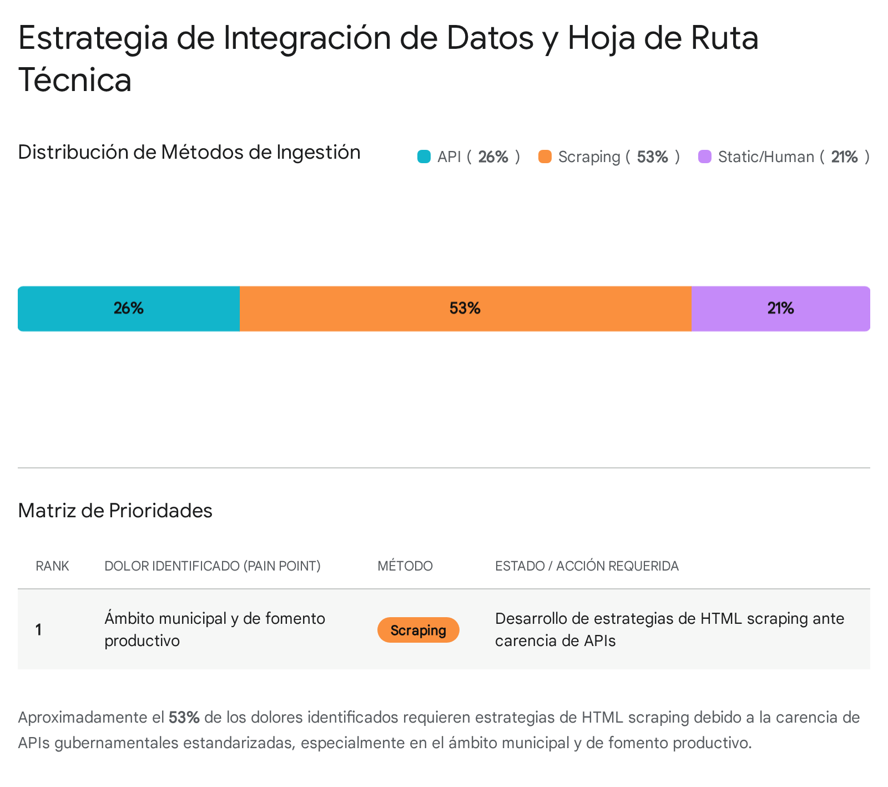

# Run #07 Deep Research: Documentación oficial chilena para los 19 dolores priorizados

<!-- AUTO-BANNER -->
!!! info ":material-magnify-scan: Reporte completo de Deep Research"
    Reporte generado por **Google Deep Research Max** (`deep-research-max-preview-04-2026`). El modelo recibió el prompt en modo collaborative pero —como ya pasó en runs #01 y #06— **omitió el plan intermedio y entregó el research completo directamente**. Ejecución única, ~USD 5.

> **Objetivo del prompt:** Por cada uno de los 19 dolores marcados como ✅ Incluir, identificar la documentación oficial chilena que el asistente IA necesita ingerir para resolver el dolor con autoridad. Distinguir entre API pública, HTML scrapeable y trámite presencial. Identificar brechas.
>
> **Duración:** 718 s (12.0 min) ·
> **Interaction ID:** `v1_ChducVB6YWJ6MExQRFF6N0lQLXBmczRRcxIXbnFQemFiejBMUERRejdJUC1wZnM0UXM` ·
> **Tipo:** `ejecucion-directa` (Gemini saltó el modo plan)
>
> **Consumo curado:** cada dolor en [tu-plata-mipyme/dolores.md](../../../tu-plata-mipyme/dolores.md) tiene un bullet **"Documentación oficial requerida"** con el doc principal + link a este reporte para el detalle completo.

## Reporte del agente

# Documentación Oficial Chilena para los 19 Dolores Priorizados: Tu Plata Mipyme

## Executive Summary

El análisis exhaustivo de la documentación oficial chilena requerida para mitigar los 19 dolores críticos del microemprendedor revela un ecosistema estatal con niveles de digitalización profundamente asimétricos. Del total de la arquitectura de información mapeada, aproximadamente un **26%** puede ser consumido directamente mediante APIs públicas estructuradas (fundamentalmente LeyChile BCN y ChileAtiende), un **53%** requerirá motores de *scraping* en HTML dada la volatilidad de portales sin endpoints públicos (calendarios de fomento y ordenanzas locales), y un **21%** dependerá de la ingesta de PDFs estáticos o flujos de *handoff* humano para trámites exclusivamente presenciales.

Para el segmento objetivo (mujeres microemprendedoras de 30-50 años en la región de La Araucanía, con un 38% de informalidad), la barrera tecnológica se agrava por el aislamiento territorial. En consecuencia, las **recomendaciones operativas definitivas** y la hoja de ruta de construcción de subagentes (MCPs) deben priorizar los 5 atascos normativos más severos antes del desarrollo general:

1.  **Motor de Ordenanzas Municipales [E2-D5]:** Es el agujero negro de datos más crítico. Se debe construir manualmente un dataset priorizado de las 50 comunas principales del sur de Chile antes del lanzamiento.
2.  **Clasificador de Riesgo SEREMI [E2-D6]:** Desarrollar un subagente de heurística condicional exclusivo para el rubro de alimentos, dado que el Reglamento Sanitario (Decreto 977) paraliza las ventas B2B.
3.  **Matriz de Decisión Societaria [E2-D2]:** Ingestar estáticamente las diferencias de responsabilidad patrimonial y tributaria entre figuras jurídicas.
4.  **Scraper Automatizado de Fomento Productivo [E0-D6]:** Construir *Cron Jobs* semanales para leer y parsear las páginas de Sercotec, Corfo y FOSIS, cruzando automáticamente las fechas de postulación con el perfil de la usuaria.
5.  **Acompañamiento Híbrido RES-SII [E2-D3]:** Configurar el agente para advertir preventivamente el "abismo" entre la creación de la empresa y la activación del timbraje, guiando el Formulario 4415 paso a paso.

**Disclaimer Legal y Tributario:** **Este documento constituye una guía de investigación e integración de arquitectura técnica orientada a la ingeniería de software y el diseño de agentes de inteligencia artificial. No constituye, bajo ninguna circunstancia, asesoría legal, tributaria, contable o financiera profesional. Las directivas técnicas e interpretaciones normativas aquí expuestas están diseñadas exclusivamente para enmarcar el alcance del producto (software) y deben ser validadas por contadores y abogados habilitados en Chile antes de su exposición al usuario final.**

*   **Alta fragmentación local:** La descentralización de ordenanzas municipales y reglamentos sanitarios menores impide una integración mediante Interfaces de Programación de Aplicaciones (APIs) únicas, requiriendo estrategias de extracción de datos (*scraping*) y validación humana.
*   **Centralización estatal robusta:** Ejes tributarios y de constitución de empresas (Servicio de Impuestos Internos y Registro de Empresas y Sociedades) ofrecen una estructura documental predecible y conectable, aunque densa en lenguaje jurídico.
*   **Impacto de nuevas normativas:** La reciente Ley de Cumplimiento Tributario altera drásticamente los incentivos hacia la formalización, haciendo crítico el monitoreo de límites transaccionales informales.
*   **Brecha cognitiva como barrera principal:** Para el segmento objetivo, el desafío técnico debe decodificarse hacia un lenguaje empático, mitigando el miedo al Estado.

El desarrollo de un asistente conversacional avanzado (copiloto) orientado a microemprendedores exige fundamentar sus respuestas en fuentes legales irrebatibles para evitar alucinaciones (*vibe answers*). El sistema "Tu Plata Mipyme" utilizará arquitecturas de Generación Aumentada por Recuperación (RAG, por sus siglas en inglés) y protocolos de contexto de modelo (MCP) para conectar subagentes de inteligencia artificial directamente con el acervo documental del Estado chileno. 

Este informe mapea exhaustivamente la documentación oficial requerida para resolver los 19 "dolores" o fricciones críticas identificadas en el viaje del emprendedor. El enfoque prioriza la integración de datos gubernamentales, considerando las barreras tecnológicas y territoriales inherentes al ecosistema de La Araucanía. Se evalúan los métodos de ingesta técnica para cada hito, estableciendo las acciones operativas necesarias antes de iniciar la fase de programación.

```json


```

## E0 — Idea y Sueño: Desmitificación y Primeros Pasos

La etapa inicial del emprendimiento está dominada por bloqueos emocionales y desinformación. Las emprendedoras temen las represalias estatales, desconocen el valor de su tiempo y confunden sus finanzas personales con las del negocio. En esta fase, la inteligencia artificial debe actuar como un agente educador, utilizando documentación oficial no para normar, sino para desmitificar. A continuación, se detalla la estructuración documental para los dolores de esta etapa.

### [E0-D2] Miedo irracional al SII

**Resumen del dolor:** Pánico infundado a una fiscalización temprana y multas por parte del Servicio de Impuestos Internos (SII) al dar los primeros pasos.

**Documentación esencial (orden de prioridad):**

!!! example ":material-file-document: Doc 1 — Carta de Derechos del Contribuyente"
    - **URL:** [https://www.sii.cl/sobre_el_sii/derechos_contribuyentes.pdf](https://www.sii.cl/sobre_el_sii/derechos_contribuyentes.pdf)
    - **Qué cubre:** Establece los límites de la acción fiscalizadora, garantizando un trato cortés, la no dilación injustificada y el respeto a la buena fe (Art. 8 bis del Código Tributario) [cite: 1, 2].
    - **Vigencia:** Permanente (actualizado con últimas reformas).
    - **Acceso técnico:** `PDF descargable` — formato fijo, ingestable a RAG.
    - **Notas:** Es el documento central para que el agente responda desde la empatía legal ("El SII tiene reglas que te protegen").

!!! example ":material-file-document: Doc 2 — Normativa sobre Auditorías y Fiscalización"
    - **URL:** [https://www.sii.cl/destacados/sii_educa/contenidos/contribuyentes/derechos_del_contribuyente/94-GA-201405290650.pdf](https://www.sii.cl/destacados/sii_educa/contenidos/contribuyentes/derechos_del_contribuyente/94-GA-201405290650.pdf)
    - **Qué cubre:** Define qué es una fiscalización preventiva y aclara que el control del cumplimiento suele enfocarse en procesos masivos, reduciendo el temor a la "persecución personal" [cite: 3].
    - **Vigencia:** Permanente.
    - **Acceso técnico:** `PDF descargable` — formato fijo, ingestable a RAG.
    - **Notas:** Documento educativo (SII Educa) con un lenguaje más digerible.

**Documentación complementaria** (no esencial pero recomendada):
- Guías de "Educación Fiscal" del SII (sii.cl/siieduca) para contextualizar el rol de los Tribunales Tributarios y Aduaneros [cite: 4].

**Brechas detectadas:**
- La ley bruta genera más ansiedad. La documentación del SII suele ser técnica; no existen bases de datos oficiales orientadas a "calmar" al usuario.

**Acciones técnicas concretas que requiere el equipo:**
- Descargar y curar los PDFs de "Derechos del Contribuyente" en un RAG estático.
- Entrenar el *system prompt* del agente para que, al detectar miedo, cite el Artículo 8 bis garantizando la "presunción de buena fe" [cite: 2].

La correcta ingesta de estos derechos permite al agente cambiar el paradigma de la usuaria, transformando al SII de un ente punitivo a un organismo regulado por la ley. Al abordar el dolor estructural del precio, la estrategia cambia, ya que el Estado chileno ofrece escasa información analítica sobre finanzas privadas.

### [E0-D3] Ignorancia sobre fijación de precios

**Resumen del dolor:** Desconocimiento absoluto sobre cómo calcular costos fijos, variables y márgenes para cobrar correctamente.

**Documentación esencial (orden de prioridad):**

!!! example ":material-file-document: Doc 1 — Manuales y Capacitaciones Sercotec - Centro de Negocios"
    - **URL:** [https://capacitacion.sercotec.cl/](https://capacitacion.sercotec.cl/)
    - **Qué cubre:** Materiales educativos oficiales sobre gestión financiera básica, cálculo de costos y fijación de precios teórica para microempresas.
    - **Vigencia:** Permanente (se actualiza por programa).
    - **Acceso técnico:** `HTML scrapeable` — sin login (cursos abiertos) o `PDF descargable`.
    - **Notas:** No existen leyes ni APIs de precios. Sercotec es la única entidad estatal que enseña esto formalmente.

**Documentación complementaria** (no esencial pero recomendada):
- Guías de educación financiera de la Comisión para el Mercado Financiero (CMF Educa).

**Brechas detectadas:**
- El Estado no dicta cómo fijar precios. La información oficial disponible es puramente teórica y dispersa en portales de capacitación.

**Acciones técnicas concretas que requiere el equipo:**
- Habilitar un *crawler* manual para extraer currículos de "Estructura de Costos" de Sercotec y Sence.
- Construir un RAG estático y limitarlo a teoría ("No te calculo, te enseño"). El agente debe requerir explícitamente que no ejecuta operaciones matemáticas directas complejas.

En paralelo a la estructuración de precios, las emprendedoras chocan contra la densa red de permisos burocráticos. La multiplicidad de entidades reguladoras genera una fricción cognitiva que el agente debe desenredar en pasos lógicos.

### [E0-D5] Fricción cognitiva sobre permisos

**Resumen del dolor:** Confusión paralizante frente al abanico de permisos (municipales, sanitarios, uso de suelo) que se perciben como un muro inexpugnable.

**Documentación esencial (orden de prioridad):**

!!! example ":material-file-document: Doc 1 — API ChileAtiende - Fichas de Trámites"
    - **URL:** [https://www.chileatiende.gob.cl/api/fichas/{fichaId}](https://www.chileatiende.gob.cl/api/fichas/{fichaId})
    - **Qué cubre:** Repositorio centralizado que explica los requisitos, costos y canales de atención para obtener patentes y certificados de zonificación [cite: 5].
    - **Vigencia:** Tiempo real.
    - **Acceso técnico:** `API pública disponible` — endpoint: GET `https://www.chileatiende.gob.cl/api/fichas/{fichaId}` [cite: 5]. Requiere token de acceso [cite: 5].
    - **Notas:** Permite extraer el paso a paso simplificado (JSON) de la mayoría de los trámites estatales.

**Documentación complementaria** (no esencial pero recomendada):
- Documentación de la plataforma Tu Empresa en un Día (Registro de Empresas y Sociedades).

**Brechas detectadas:**
- ChileAtiende centraliza trámites nacionales, pero pierde resolución a nivel de la ordenanza comunal específica.

**Acciones técnicas concretas que requiere el equipo:**
- Construir un MCP "ChileAtiende" que consuma el endpoint de fichas mediante *access_token* [cite: 5] para traer requisitos genéricos antes de derivar al trámite específico territorial.

Una vez superada la barrera de los permisos, el aislamiento psicológico se convierte en un riesgo operativo. Vincular a la emprendedora con la oferta estatal mitiga esta soledad.

### [E0-D6] Soledad del emprendedor / red de apoyo

**Resumen del dolor:** Sensación de aislamiento y desconocimiento total de los fondos y ecosistemas de apoyo estatal (capital semilla, asesorías, equipamiento).

**Documentación esencial (orden de prioridad):**

!!! example ":material-file-document: Doc 1 — Calendarios y Convocatorias Sercotec (Servicio de Cooperación Técnica)"
    - **URL:** [https://www.sercotec.cl/](https://www.sercotec.cl/)
    - **Qué cubre:** Fechas, requisitos y aperturas de programas clave enfocados en Mypes, tales como "Digitaliza tu Almacén" (subsidios de hasta $3 millones) [cite: 6], fondos "Crece" [cite: 7], y convocatorias regionales específicas como el FNDR Economía Circular para emprendimientos de reciclaje (ej. en Los Lagos) [cite: 8, 9].
    - **Vigencia:** Volatilidad alta (cierres de postulación continuos durante el año).
    - **Acceso técnico:** `HTML scrapeable` — sin login.
    - **Notas:** La información cambia radicalmente por región; requiere monitoreo territorial específico.

!!! example ":material-file-document: Doc 2 — Convocatorias y Programas Corfo (Corporación de Fomento de la Producción)"
    - **URL:** https://www.corfo.cl/ y https://programadps.gob.cl/Convocatorias/ [cite: 10, 11]
    - **Qué cubre:** Fondos para innovación, resiliencia productiva y eficiencia hídrica (específicamente orientados a la macrozona centro-sur incluyendo La Araucanía) [cite: 12], así como apoyos para institutos tecnológicos públicos [cite: 10].
    - **Vigencia:** Volatilidad alta.
    - **Acceso técnico:** `HTML scrapeable` — sin login.
    - **Notas:** Los subsidios de Corfo apuntan a negocios con potencial de escalabilidad o desafíos productivos mayores [cite: 10, 12].

!!! example ":material-file-document: Doc 3 — Programas de Emprendimiento FOSIS (Fondo de Solidaridad e Inversión Social)"
    - **URL:** [https://www.fosis.gob.cl](https://www.fosis.gob.cl)
    - **Qué cubre:** Programas estructurales orientados a población vulnerable (ej. "Emprendamos Semilla", "Emprendamos Básico/Avanzado" e "Innova FOSIS") que otorgan capacitación y financiamiento directo que oscila entre $430 mil y $800 mil [cite: 13, 14, 15].
    - **Vigencia:** Anual/Semestral (Postulaciones masivas usualmente abren en marzo-abril) [cite: 13, 15].
    - **Acceso técnico:** `HTML scrapeable` — sin login.
    - **Notas:** Requiere cruce indispensable con la ficha del Registro Social de Hogares de la usuaria para calificar.

!!! example ":material-file-document: Doc 4 — Aceleradora Start-Up Chile"
    - **URL:** https://startupchile.org/postula/ [cite: 16]
    - **Qué cubre:** Programas de aceleración tecnológica y acceso a redes de contacto de alto nivel, visas tech y apoyo estratégico [cite: 16].
    - **Vigencia:** Ventanas de postulación específicas (ej. hasta noviembre para arrancar en enero) [cite: 16].
    - **Acceso técnico:** `HTML scrapeable` para fechas, pero la postulación opera en una plataforma externa (`charly.io`) [cite: 16].

**Documentación complementaria** (no esencial pero recomendada):
- Portal FOGAPE (Fondo de Garantía para Pequeños Empresarios) para acceso a crédito bancario con aval del Estado.

**Brechas detectadas:**
- Cero interoperabilidad. Ninguna de estas cuatro instituciones cuenta con una API pública para consultar programáticamente sus calendarios. Dependen de *banners* en HTML y plataformas cerradas.

**Acciones técnicas concretas que requiere el equipo:**
- Montar un motor de *scraping* diario o semanal (Cron Job) programado para leer las secciones de "Convocatorias Abiertas" de las 4 URLs mencionadas.
- Extraer estructuradamente: Título, Regiones Aplicables, Fechas de Cierre y Monto.
- Almacenar estos datos en una base de datos vectorial para que el agente cruce el perfil sociodemográfico de la usuaria de La Araucanía con las fechas activas.

Mitigar la soledad con fondos es inútil si la arquitectura financiera de la emprendedora es caótica. El agente debe intervenir en la delimitación estricta de las finanzas personales y comerciales.

### [E0-D7] Mezclar finanzas familiares con negocio

**Resumen del dolor:** Inexistencia de separación entre el presupuesto de la casa y el de las ventas informales.

**Documentación esencial (orden de prioridad):**

!!! example ":material-file-document: Doc 1 — Educación Financiera CMF (Comisión para el Mercado Financiero)"
    - **URL:** [https://www.cmfeduca.cl/](https://www.cmfeduca.cl/)
    - **Qué cubre:** Definición y beneficios de cuentas a la vista y cuentas RUT (instrumentos básicos de separación financiera sin costo de mantención).
    - **Vigencia:** Permanente.
    - **Acceso técnico:** `HTML scrapeable` — sin login.
    - **Notas:** Información normativa y neutral del Estado sobre la oferta bancaria disponible.

**Documentación complementaria** (no esencial pero recomendada):
- Sitio de BancoEstado sobre condiciones de la CuentaRUT Comercial/Personal.

**Brechas detectadas:**
- El Estado no prescribe bancos específicos. El agente no debe actuar como asesor de inversiones ni favorecer un banco privado.

**Acciones técnicas concretas que requiere el equipo:**
- Ingestar como texto plano en el RAG los tipos de cuenta (Cuenta Vista, Cuenta Corriente, CuentaRUT).
- Configurar al agente para realizar una "Pregunta diagnóstica" en el onboarding y recomendar opciones de mercado (como BancoEstado o Banco de Chile FAN) solo como ejemplos genéricos validados por la CMF.

El último dolor de la ideación es un corolario del problema de precios, pero profundamente arraigado en la precarización del segmento objetivo.

### [E0-D8] Desconocimiento del valor del propio tiempo

**Resumen del dolor:** La emprendedora no asigna un salario a su esfuerzo, asumiendo que su tiempo "es gratis" y distorsionando la rentabilidad.

**Documentación esencial (orden de prioridad):**

!!! example ":material-file-document: Doc 1 — Datos del Sueldo Mínimo y UF - Servicio de Impuestos Internos"
    - **URL:** [https://www.sii.cl/valores_y_fechas/](https://www.sii.cl/valores_y_fechas/)
    - **Qué cubre:** Valor oficial de la Unidad de Fomento (UF), UTM (Unidad Tributaria Mensual - índice reajustable utilizado en Chile para el cobro de impuestos y multas) y el Sueldo Mínimo vigente [cite: 17].
    - **Vigencia:** Tiempo real (mensual/diario).
    - **Acceso técnico:** `HTML scrapeable` — sin login (o consumir APIs públicas alternativas como Mindicador).
    - **Notas:** El SII publica las métricas [cite: 18]; usar el sueldo mínimo horario como referencia obligatoria de valor/tiempo.

**Documentación complementaria** (no esencial pero recomendada):
- Estadísticas del Instituto Nacional de Estadísticas (INE) sobre ingreso medio en La Araucanía (para contexto geográfico empático).

**Brechas detectadas:**
- No hay documento legal que obligue a la dueña a pagarse, es un principio financiero que requiere ser inyectado como heurística al sistema.

**Acciones técnicas concretas que requiere el equipo:**
- Scrapear el valor del Sueldo Mínimo Mensual oficial.
- Programar en el RAG la heurística matemática:
  $$\text{Costo Hora Base} = \frac{\text{Sueldo Mínimo Mensual}}{180 \text{ horas}}$$
- Inyectar este cálculo invisible en el flujo de E0-D3 (Fijación de precios).

Esta estructuración de la etapa de "Idea" permite al sistema actuar con firmeza empática. Sin embargo, al pasar a la etapa de Validación Informal, los riesgos dejan de ser teóricos y adquieren peso fiscalizador y penal.

## E1 — Validación Informal: Sombras del Crecimiento

Una vez que la emprendedora empieza a operar sin constitución legal formal, los sistemas financieros y tributarios comienzan a detectarla. Aquí el rol del agente "Tu Plata Mipyme" se vuelve crítico: cuantificar pérdidas comerciales reales y alertar sobre bloqueos inminentes provocados por normativas recientes.

### [E1-D1] Sin RUT comercial / no factura B2B

**Resumen del dolor:** Pérdida de ventas corporativas B2B (Business-to-Business, es decir, ventas de empresa a empresa, instituciones o colegios) por no poseer RUT jurídico ni capacidad de emitir factura electrónica.

**Documentación esencial (orden de prioridad):**

!!! example ":material-file-document: Doc 1 — Sistema de Facturación Gratuito del SII"
    - **URL:** [https://www.sii.cl/preguntas_frecuentes/factura_electronica/](https://www.sii.cl/preguntas_frecuentes/factura_electronica/)
    - **Qué cubre:** Requisitos normativos para acceder a la facturación electrónica, explicitando que la persona natural o jurídica debe tener Inicio de Actividades en Primera Categoría [cite: 17].
    - **Vigencia:** Permanente.
    - **Acceso técnico:** `HTML scrapeable` — FAQ del SII [cite: 17].
    - **Notas:** Sirve como base técnica para explicarle a la usuaria lo que se "pierde" al estar fuera del sistema.

**Documentación complementaria** (no esencial pero recomendada):
- Guía SII sobre los beneficios del Crédito Fiscal IVA (Impuesto al Valor Agregado).

**Brechas detectadas:**
- No existe un documento que "cuantifique" económicamente las oportunidades perdidas. El modelo IA debe hacer la correlación heurística entre la imposibilidad técnica de dar boleta/factura y la restricción absoluta del mercado B2B.

**Acciones técnicas concretas que requiere el equipo:**
- Ingestar FAQs sobre cómo funciona el IVA crédito/débito para poder generar respuestas situacionales (ej. "Si al director del colegio le vendes una torta de $200K y no das factura, el colegio no puede descargar su propio IVA, por lo que elegirán a otro proveedor").
- Configurar el agente para traducir un requerimiento legal tributario a un argumento comercial.

La informalidad sostenida ya no es invisible. La nueva legislación somete las cuentas bancarias personales a un escrutinio automatizado que puede bloquear la operación de la emprendedora.

### [E1-D2] Recepción de pagos en CuentaRUT personal

**Resumen del dolor:** Alto riesgo de fiscalización o presunción de evasión/lavado debido a transferencias comerciales constantes a cuentas bancarias personales.

**Documentación esencial (orden de prioridad):**

!!! example ":material-file-document: Doc 1 — Ley 21.713 de Cumplimiento Tributario ("Ley de las 50 transferencias")"
    - **URL:** [https://www.bcn.cl/leychile/navegar?idNorma=1207746](https://www.bcn.cl/leychile/navegar?idNorma=1207746)
    - **Qué cubre:** Modificaciones al Código Tributario que exigen a los bancos reportar al SII a contribuyentes que reciban más de 50 transferencias de emisores distintos en un día, semana o mes, o 100 transferencias en un semestre [cite: 19, 20, 21].
    - **Vigencia:** Entró en vigencia en enero de 2025 [cite: 20].
    - **Acceso técnico:** `API pública disponible` — Biblioteca del Congreso Nacional (BCN).
    - **Notas:** Es un CRITERIO CRÍTICO. El agente debe monitorear y alertar este umbral como un "Warning" máximo. Actualmente los bancos reportan esta anomalía de manera semestral [cite: 20].

**Documentación complementaria** (no esencial pero recomendada):
- Circular N° 2 del SII que regula cómo las instituciones financieras entregan esta información [cite: 20].

**Brechas detectadas:**
- El usuario ignora por completo cuándo alcanza el límite. La ley es clara, pero la contabilidad mental de la usuaria es opaca.
- **La variable temporal crítica (Open Banking 07/2027):** La llegada programada del Open Banking estatal (Sistema de Finanzas Abiertas de la Ley Fintec) para julio de 2027 agravará drásticamente este panorama. La interoperabilidad financiera permitirá cruces de datos transaccionales de extremo a extremo, eliminando el rezago semestral actual y transformando la fiscalización de las cuentas personales en un proceso programático y casi instantáneo.

**Acciones técnicas concretas que requiere el equipo:**
- Integrar MCP LeyChile: Ingestar el texto base de la Ley 21.713 [cite: 21] y la Circular 2 del SII.
- Desarrollar un prompt condicional estricto: Si el usuario reporta recibir pagos por transferencia informal sistemáticamente, activar un *Warning IA* preventivo sobre el límite de las 50/100 transferencias [cite: 20] y la inminencia de cruces de datos más estrictos.

Paralelo al riesgo fiscal, el crecimiento orgánico pero desordenado impide evaluar la salud real del micro-negocio.

### [E1-D7] Crecimiento invisible (sin balance real)

**Resumen del dolor:** Operar "a ciegas", sin un registro de caja básico, generando la falsa impresión de liquidez o pérdida.

**Documentación esencial (orden de prioridad):**

!!! example ":material-file-document: Doc 1 — Obligaciones de Contabilidad Simplificada SII (Art. 14 D LIR)"
    - **URL:** [https://www.sii.cl/destacados/modernizacion/tipos_regimenes_mt.html](https://www.sii.cl/destacados/modernizacion/tipos_regimenes_mt.html)
    - **Qué cubre:** Bases de la tributación según ingresos percibidos menos gastos pagados, y el deber de llevar un control de caja bajo régimen Pro Pyme [cite: 22, 23].
    - **Vigencia:** Permanente.
    - **Acceso técnico:** `HTML scrapeable` — sin login.
    - **Notas:** Utilizar la normativa de "ingreso/gasto" del SII como marco metodológico para justificar el hábito diario que el agente pedirá por WhatsApp.

**Documentación complementaria** (no esencial pero recomendada):
- Formatos de Libro Caja de Sercotec.

**Brechas detectadas:**
- No se requiere documentación legal compleja para solucionar esto, sino la creación tecnológica de un hábito.

**Acciones técnicas concretas que requiere el equipo:**
- No requiere MCP de leyes pesadas, sino crear un flujo cronometrado en WhatsApp que envíe mensajes diarios pidiendo ingresos y gastos del día, simulando el modelo de "Ingresos percibidos y gastos efectivamente pagados" que utilizará el Régimen Transparente en el futuro formal [cite: 22].

Finalmente, el dolor más grande para las emprendedoras de estratos vulnerables en La Araucanía no es la evasión, sino el terror a perder subsidios de supervivencia familiar.

### [E1-D8] Miedo a perder beneficios sociales

**Resumen del dolor:** Resistencia extrema a formalizar las ventas por temor a perder los beneficios del Estado asociados a la calificación de pobreza.

**Documentación esencial (orden de prioridad):**

!!! example ":material-file-document: Doc 1 — Reglamentos y Guías del Registro Social de Hogares - RSH"
    - **URL:** [https://www.registrosocial.gob.cl/docs/04_Solicitud_de_actualizacion_de_ingresos_y_situacion_ocupacional.pdf](https://www.registrosocial.gob.cl/docs/04_Solicitud_de_actualizacion_de_ingresos_y_situacion_ocupacional.pdf)
    - **Qué cubre:** Criterios de evaluación del Estado para actualizar ingresos laborales (dependientes e independientes). Explica exhaustivamente cómo las boletas de honorarios informadas por el SII o los ingresos de capital afectan la cartola de vulnerabilidad del RSH [cite: 24, 25, 26].
    - **Vigencia:** Permanente.
    - **Acceso técnico:** `PDF descargable` (Manuales de actualización) [cite: 25].
    - **Notas:** El trámite real requiere de forma obligatoria la modalidad `Requiere ClaveÚnica` en ventanillaunicasocial.gob.cl [cite: 25, 27], pero los criterios teóricos son públicos en PDF.

**Documentación complementaria** (no esencial pero recomendada):
- Portal de Beneficios del Ministerio de Desarrollo Social y Familia (MIDESO).

**Brechas detectadas:**
- El algoritmo matemático ponderado exacto que utiliza el RSH para calcular y mover a un ciudadano entre tramos (ej. del 40% al 60% de vulnerabilidad) es opaco y el Estado no dispone de una API pública de simulación.

**Acciones técnicas concretas que requiere el equipo:**
- Ingestar los PDFs de actualización del RSH [cite: 25] y crear un bloque de información estática tranquilizadora y transparente en el RAG.
- Programar el agente con la limitación explícita de que no puede predecir matemáticamente el tramo exacto post-formalización, pero sí puede explicar los mecanismos de Declaración Jurada Simple N°1 y N°2 ante el municipio [cite: 24].

Avanzar de la informalidad a la formalización (Etapa E2) exige cruzar el "valle de la muerte" administrativo chileno, donde los agentes MCP serán exigidos al máximo para articular instituciones desvinculadas.

## E2 — Formalización: El Salto Legal

La formalización comprende la barrera más densa de fricción técnica. Constituir una sociedad civilmente y dotarla de capacidades tributarias y operativas cruza instituciones que, frecuentemente, no conversan entre sí. Aquí se alojan los 5 dolores prioritarios.

### [E2-D1] Fricción técnica en Tu Empresa en Un Día (RES)

**Resumen del dolor:** Dificultad para comprender y completar los campos técnicos del formulario de constitución de sociedad en línea.

**Documentación esencial (orden de prioridad):**

!!! example ":material-file-document: Doc 1 — Ley 20.659 (Simplifica Régimen de Sociedades Comerciales)"
    - **URL:** [https://www.bcn.cl/leychile/navegar?idNorma=1048718](https://www.bcn.cl/leychile/navegar?idNorma=1048718)
    - **Qué cubre:** Base legal del Registro de Empresas y Sociedades (RES), que permite constituciones sin notario convencional (usando firma electrónica) y asigna un RUT provisorio inmediato [cite: 28, 29, 30].
    - **Vigencia:** Actualizado (01-feb-2023) [cite: 28].
    - **Acceso técnico:** `API pública disponible` — BCN LeyChile.
    - **Notas:** Documento fundamental para entender legalmente que la fecha de constitución del acto es, a efectos prácticos, la firma del primer socio [cite: 29].

!!! example ":material-file-document: Doc 2 — Manuales de Usuario del RES"
    - **URL:** www.registrodeempresasysociedades.cl (Portal RES).
    - **Qué cubre:** Guías paso a paso de los formularios web (capital, objeto social, facultades y poderes de administración) [cite: 30].
    - **Vigencia:** Permanente.
    - **Acceso técnico:** `HTML scrapeable` / `PDF descargable`.

**Documentación complementaria** (no esencial pero recomendada):
- Borradores estandarizados de objetos sociales comunes (ej. venta al por menor de alimentos en puestos, comercio electrónico).

**Brechas detectadas:**
- El RES no tiene API abierta para autocompletar formularios desde plataformas de terceros. La asistencia de la IA debe ser netamente conversacional e instructiva ("side-by-side").

**Acciones técnicas concretas que requiere el equipo:**
- Ingestar en RAG los PDFs tutoriales y FAQs del RES.
- Crear una taxonomía de objetos sociales curados manualmente (Dataset interno) para que el bot sugiera el texto exacto a copiar y pegar en la plataforma del Estado.

Antes de llenar el formulario, el dolor radica en una decisión estructurante que perseguirá a la usuaria por años: qué tipo de sociedad y régimen tributario elegir.

### [E2-D2] Elección errónea de figura jurídica

**Resumen del dolor:** Seleccionar un tipo de sociedad comercial o régimen contable que genera exceso de costos, carga administrativa inmanejable o incompatibilidades a futuro.

**Documentación esencial (orden de prioridad):**

!!! example ":material-file-document: Doc 1 — Características de Regímenes Pro-Pyme SII (Art 14 D)"
    - **URL:** [https://www.sii.cl/destacados/renta/2025/regimenes_renta2025.html](https://www.sii.cl/destacados/renta/2025/regimenes_renta2025.html)
    - **Qué cubre:** Diferencias vitales entre los regímenes tributarios orientados a microempresas [cite: 22, 23, 31]. Define la estructura de tributación y la obligación de PPM (Pagos Provisionales Mensuales - un anticipo mensual obligatorio contra el impuesto a la renta anual).
    - **Vigencia:** Actualizado a la Operación Renta 2025 [cite: 22].
    - **Acceso técnico:** `HTML scrapeable` — portal SII [cite: 22].
    - **Notas:** Documento clave para Pymes nuevas que condiciona la carga contable (contabilidad completa vs. simplificada) [cite: 23, 32].

   > **Decodificación Empática de Regímenes para el Sistema:**
   > *   **Técnica:** El régimen *Pro-Pyme General (14 D N°3)* aplica una tasa de Impuesto de Primera Categoría (IDPC) del 12,5%, con tributación basada en ingresos menos gastos. El régimen *Pro-Pyme Transparente (14 D N°8)* libera a la empresa del IDPC; las utilidades se atribuyen directamente a los dueños, quienes tributan en su Impuesto Global Complementario [cite: 22].
   > *   **Analogía en el prompt:** Para el bot, el **Pro-Pyme General** debe explicarse como: *"La empresa es una alcancía con llave. Gana dinero, paga sus propios impuestos corporativos, y lo que sobra se queda guardado ahí hasta que decides sacarlo formalmente para ti."* Por el contrario, el **Pro-Pyme Transparente** debe explicarse como: *"La empresa es un embudo. Todo el dinero que entra y queda como ganancia limpia fluye directo a tu bolsillo personal al final del año, y eres tú (no la empresa) quien rinde cuentas al Estado. Esto te libera de hacer balances y registros complicados mes a mes."*

!!! example ":material-file-document: Doc 2 — Leyes de Sociedades y Estructura Jurídica - BCN"
    - **URL:** [https://www.bcn.cl/leychile](https://www.bcn.cl/leychile)
    - **Qué cubre:** Las diferencias legales y estructurales de las entidades constitucionales más comunes para el segmento micro [cite: 29].
    - **Vigencia:** Permanente.
    - **Acceso técnico:** `API pública disponible` — BCN.

**Tabla Comparativa Procedimental de Figuras Jurídicas:**

Para estructurar la información en el modelo, se debe ingestar la siguiente matriz de contraste:

| Característica Legal | Microempresa Familiar (MEF) | Empresa Individual de Resp. Limitada (EIRL) | Sociedad por Acciones (SpA) |
| :--- | :--- | :--- | :--- |
| **Responsabilidad Patrimonial** | **Ilimitada.** El emprendedor responde con sus bienes personales y los de la familia frente a deudas. | **Limitada al capital aportado.** Protege los bienes personales del dueño. | **Limitada al monto de las acciones.** Alta protección del patrimonio personal de los socios. |
| **Costo y Complejidad** | Muy baja. Se tramita en el municipio con la patente y RUT personal. | Baja. Creación gratis en RES; requiere firma y trámite SII básico. | Media. Creación en RES; más flexible pero requiere actas para cambios futuros. |
| **Ideal Para (Casos de Uso)** | Vender desde la cocina/casa sin socios, testear una idea inicial barata. | Emprendedora solitaria que quiere separar aguas y proteger su casa de posibles embargos o quiebras. | Emprendedora que busca escalar rápido, postular a Corfo, o sumar socios/inversionistas a futuro. |

**Documentación complementaria** (no esencial pero recomendada):
- FAQ SII sobre el tope de ingresos (50.000 UF para la tasa especial de PPM del 0.2%) [cite: 31].

**Brechas detectadas:**
- La ley es completamente modular. Para una respuesta integral, el agente debe cruzar el Código de Comercio, las Leyes de Sociedades y la Ley de Impuesto a la Renta de manera invisible para el usuario.

**Acciones técnicas concretas que requiere el equipo:**
- Integrar MCP LeyChile para extraer y referenciar las definiciones duras de EIRL vs. SpA.
- Curar manualmente la tabla comparativa (Dataset expuesto arriba) inyectándola al *System Prompt* del Agente E2.

La falla de experiencia de usuario más común en la formalización chilena ocurre en el "abismo" de sincronización entre el portal del Ministerio de Economía y el portal de Impuestos.

### [E2-D3] Abismo RES↔SII (Formulario 4415)

**Resumen del dolor:** El profundo atasco técnico y cognitivo posterior a la creación de la SpA en el RES, al enfrentarse al trámite informático de "Inicio de Actividades" y habilitación para emitir documentos.

**Documentación esencial (orden de prioridad):**

!!! example ":material-file-document: Doc 1 — Circular N°38 de 2025 del SII"
    - **URL:** [https://www.sii.cl/normativa_legislacion/circulares/2025/circu38.pdf](https://www.sii.cl/normativa_legislacion/circulares/2025/circu38.pdf)
    - **Qué cubre:** Instrucciones consolidadas sobre el Rol Único Tributario (RUT) y el Aviso de Inicio de Actividades (Formulario 4415) [cite: 33].
    - **Vigencia:** 30 de abril de 2025 [cite: 33].
    - **Acceso técnico:** `PDF descargable` — desde sii.cl [cite: 33].
    - **Notas:** El documento obliga a realizar la declaración jurada de inicio de actividades de manera estrictamente electrónica a través de la carpeta tributaria [cite: 30, 33].

!!! example ":material-file-document: Doc 2 — Guías SII para Timbraje y Emisión DTE"
    - **URL:** sii.cl/preguntas_frecuentes/factura_electronica/
    - **Qué cubre:** Pasos técnicos para autorizar y emitir Documentos Tributarios Electrónicos (DTE, el estándar técnico y legal del SII que agrupa facturas, boletas y notas de crédito digitales) [cite: 30].
    - **Vigencia:** Permanente.
    - **Acceso técnico:** `HTML scrapeable`.

**Documentación complementaria** (no esencial pero recomendada):
- Resolución sobre certificación de sistemas de facturación gratuitos del Mipyme SII.

**Brechas detectadas:**
- El flujo inter-sistemas (Economía -> SII) no está documentado linealmente por el Estado. Las usuarias asumen ingenuamente que el acto de firmar la empresa en "Tu Empresa en un Día" implica automáticamente poder facturar, lo cual es falso [cite: 30].

**Acciones técnicas concretas que requiere el equipo:**
- Curar el "Journey" de formalización manualmente. Unir los PDFs de asistencia del RES [cite: 30] con la Circular 38/2025 del SII [cite: 33].
- Configurar al bot para que advierta y fraccione la explicación en hitos imperativos: 1) Creación y RUT provisorio RES, 2) Obtención de Clave Tributaria, 3) Envío del Form 4415 en sii.cl [cite: 30], 4) Acreditación.

El atasco del F4415 es frecuentemente provocado por un rechazo sistémico al intentar demostrar dónde opera comercialmente la empresa.

### [E2-D4] Acreditación domicilio tributario

**Resumen del dolor:** Imposibilidad técnica de iniciar actividades formales por no contar con un inmueble comercial propio, un contrato de arriendo notarial o un rol de avalúo adecuado a la actividad.

**Documentación esencial (orden de prioridad):**

!!! example ":material-file-document: Doc 1 — Circular N°31 de 2007 / Circular N°38 de 2025 y Guías SII"
    - **URL:** https://www.sii.cl/preguntas_frecuentes/rut_inicio_actividades/001_105_0136.htm / https://www.sii.cl/material_inf/acreditar_domicilio.pdf
    - **Qué cubre:** Las reglas estrictas de acreditación para facturadores de 1ra Categoría (que venden afectos a IVA). Exige contrato de arriendo firmado expresamente ante Notario, un certificado de dominio vigente, o autorización jurada del propietario si el inmueble es cedido (ej. casa de los padres) [cite: 33, 34, 35].
    - **Vigencia:** Actualizado a mayo de 2025 [cite: 34, 36].
    - **Acceso técnico:** `HTML scrapeable` / `PDF descargable`.
    - **Notas:** El agente debe recalcar que para emitir facturas, un contrato simple no sirve, DEBE estar firmado ante notario o con firma electrónica avanzada autorizada [cite: 35]. El SII admite acreditar inmuebles que simultáneamente ejercen otra actividad comercial, previo análisis [cite: 36].

**Documentación complementaria** (no esencial pero recomendada):
- Ley de Microempresa Familiar (MEF) para justificación de uso de domicilio habitacional.

**Brechas detectadas:**
- La brecha no es documental, es material. Si la usuaria vive de allegada o sin contrato formal (realidad prevalente en Araucanía), el sistema del SII bloquea el flujo sin alternativas flexibles online.

**Acciones técnicas concretas que requiere el equipo:**
- Levantar un RAG estático con las opciones y excepciones de acreditación del SII [cite: 34, 35].
- Añadir heurística de "Casos Reales": Si el flujo conversacional detecta trabas por domicilios informales de familiares, el agente debe estar autorizado a ofrecer activamente la alternativa legal de contratar temporalmente servicios privados de "Oficinas Virtuales/Tributarias" para destrabar el proceso.

Superado el SII, la carga regulatoria pasa al terreno físico de los municipios. Aquí es donde la automatización centralizada fracasa estructuralmente.

### [E2-D5] Patente municipal

**Resumen del dolor:** Trámite arcaico, territorializado y altamente burocrático, con un laberinto de requisitos de zonificación y tasas que varían radicalmente según la municipalidad y las sucursales.

**Documentación esencial (orden de prioridad):**

!!! example ":material-file-document: Doc 1 — Ley sobre Rentas Municipales (Decreto Ley 3063)"
    - **URL:** [https://www.bcn.cl/leychile](https://www.bcn.cl/leychile)
    - **Qué cubre:** La obligación a nivel nacional de pagar patente comercial por el ejercicio de la actividad gravada, estableciendo el cobro independiente de la patente por cada municipalidad si se tienen sucursales [cite: 21].
    - **Vigencia:** Permanente.
    - **Acceso técnico:** `API pública disponible` — BCN.
    - **Notas:** Marco jurídico general nacional; no resuelve el detalle pragmático local (precios, horarios, formularios).

!!! example ":material-file-document: Doc 2 — Ordenanzas Municipales Locales (Top Comunas Araucanía y Sur)"
    - **URL:** Sitios institucionales `.muni.cl` (ej. Temuco, Villarrica, Padre Las Casas).
    - **Qué cubre:** Tasas específicas por mil sobre el capital, zonificaciones exactas (planos reguladores), y exigencias de recepción definitiva de las direcciones de obras municipales (DOM).
    - **Vigencia:** Varía por comuna anualmente.
    - **Acceso técnico:** `HTML scrapeable` / `PDF descargable` / **`Trámite presencial`**.
    - **Notas:** Fragmentación extrema y crítica. Muchas comunas rurales de la región no tienen esta información digitalizada en ninguna plataforma.

**El caso del comercio 100% digital (Domicilios Virtuales):**
La siguiente pregunta lógica e ineludible de una emprendedora moderna es: *"Si mi negocio es 100% digital (ej. vendo mermeladas o servicios por Instagram) y opero exclusivamente desde la mesa de mi casa sin recibir público, ¿necesito patente municipal y cómo la tramito?"*. 
*La respuesta oficial es sí, la requiere.* Las ordenanzas municipales estipulan que incluso el comercio electrónico (sin local comercial físico) necesita una patente (usualmente catalogada como patente comercial o patente de oficina administrativa). Para destrabarlo, la documentación debe enseñar que la emprendedora puede acogerse a la Ley de Microempresa Familiar (MEF) que permite usar el domicilio habitacional propio para fines productivos inofensivos sin alterar el plano regulador, o en su defecto, operar alquilando una "Oficina Virtual" con patente municipal ya otorgada y tramitada en esa comuna.

**Documentación complementaria** (no esencial pero recomendada):
- Ley N° 19.749 de Rentas de Microempresa Familiar.

**Brechas detectadas:**
- **CRÍTICA:** No existe API consolidada de ordenanzas municipales de rentas en Chile. La geolocalización es inútil sin los datos duros locales pre-ingestados.

**Acciones técnicas concretas que requiere el equipo:**
- Instanciar MCP LeyChile para recuperar la Ley de Rentas (nacional).
- **Cura manual ineludible (Dataset):** El equipo de operaciones debe montar una tabla de tasas, exigencias digitales y requisitos web del Top 50 comunas (priorizando Sur de Chile/Araucanía). 
- **Handoff Humano:** Si la usuaria consulta por una comuna no indexada (ej. Cholchol, Melipeuco), el flujo de IA debe derivar al mensaje: "Para tu comuna, debes ir presencialmente al Departamento de Rentas de la Municipalidad".

Si el emprendimiento es de manipulación de alimentos, el municipio congelará la entrega de la patente hasta exigir la autorización sanitaria, la cual posee su propio ecosistema digital.

### [E2-D6] Permisos sanitarios SEREMI

**Resumen del dolor:** La elaboración de comida (desde tortas caseras hasta conservas) requiere el cumplimiento estricto de reglamentos densos, y el ingreso de expedientes sanitarios es complejo y aterrador.

**Documentación esencial (orden de prioridad):**

!!! example ":material-file-document: Doc 1 — Reglamento Sanitario de los Alimentos (Decreto 977)"
    - **URL:** [https://www.bcn.cl/leychile](https://www.bcn.cl/leychile)
    - **Qué cubre:** Requisitos técnicos de infraestructura, flujos sucios/limpios, manipulación y etiquetado para cualquier productor de alimentos [cite: 37].
    - **Vigencia:** Permanente.
    - **Acceso técnico:** `API pública disponible` — BCN.

!!! example ":material-file-document: Doc 2 — Plataforma ASDIGITAL - SEREMI de Salud"
    - **URL:** [https://seremienlinea.minsal.cl/asdigital/](https://seremienlinea.minsal.cl/asdigital/)
    - **Qué cubre:** El portal de Autoridad Sanitaria Digital donde se tramita la solicitud real. Permite solicitar la "Resolución Sanitaria" que autoriza instalaciones productoras [cite: 37, 38]. Contiene los instructivos de saneamiento y formularios PDF [cite: 39].
    - **Vigencia:** Permanente.
    - **Acceso técnico:** `Requiere ClaveÚnica` para operar transaccionalmente [cite: 38]. Existen secciones de `HTML scrapeable` en las Seremis regionales (ej. Seremi Salud Ñuble/Araucanía) con aranceles actualizados [cite: 39, 40].
    - **Notas:** Para operar formalmente como empresa (SpA/EIRL), se debe registrar a la "Persona Jurídica" bajo un rol de operador en la plataforma vinculándola al representante legal [cite: 38].

**Documentación complementaria** (no esencial pero recomendada):
- Guías de Buenas Prácticas de Manufactura (BPM) elaboradas por el Ministerio de Salud.

**Brechas detectadas:**
- AsDigital no tiene API pública para consultar los formularios técnicos de autoevaluación sin entrar con ClaveÚnica. El reglamento 977 es excesivamente técnico para una usuaria sin formación industrial.

**Acciones técnicas concretas que requiere el equipo:**
- MCP LeyChile para ingestar los títulos relevantes (Infraestructura, Manipulación) del Decreto 977.
- Descargar y montar en un RAG estático todos los instructivos PDF y tablas de aranceles de SeremiEnLinea / Asdigital [cite: 39].
- Configurar el *router* semántico: Activar este sub-árbol de análisis *solo* si el clasificador de intenciones del agente detecta que la actividad comercial es del rubro "Alimentos".

Finalizando la formalización administrativa, la necesidad de firmar los actos electrónicos conlleva confusión técnica y un gasto innecesario de recursos para una Mype.

### [E2-D8] Sobrecarga de firmas electrónicas (FEA vs simple)

**Resumen del dolor:** Compra inducida por desinformación de Tokens (Firma Electrónica Avanzada) sumamente costosos cuando un certificado digital simple basta para la operación diaria contable.

**Documentación esencial (orden de prioridad):**

!!! example ":material-file-document: Doc 1 — FAQ SII - Firma Electrónica Avanzada y Simple"
    - **URL:** https://www.sii.cl/preguntas_frecuentes/factura_electronica/001_003_6497.htm / https://www.sii.cl/preguntas_frecuentes/factura_electronica/001_003_6495.htm
    - **Qué cubre:** Aclara taxativamente que la plataforma "Tu Empresa en un Día" (RES) exige Firma Electrónica Avanzada (FEA) para constituir sociedades [cite: 17], pero detalla que para emitir Facturas y Boletas en el portal Mipyme del SII de manera recurrente *basta con un Certificado Digital Simple* (FES) [cite: 17, 18, 41].
    - **Vigencia:** Febrero/Mayo 2025 [cite: 17, 18].
    - **Acceso técnico:** `HTML scrapeable` — portal FAQ del SII [cite: 17, 18].
    - **Notas:** Documento resolutorio: El propio Estado (SII) recomienda la firma Simple porque "es más simple y efectiva" para los fines de facturación masiva [cite: 17].

!!! example ":material-file-document: Doc 2 — Catálogo Entidades Certificadoras (Ministerio de Economía)"
    - **URL:** [https://www.entidadacreditadora.gob.cl/](https://www.entidadacreditadora.gob.cl/)
    - **Qué cubre:** Listado de los proveedores oficiales (Acepta, E-cert, Firma.cl, etc.).
    - **Acceso técnico:** `HTML scrapeable`.

**Documentación complementaria** (no esencial pero recomendada):
- Ley 19.799 sobre Documentos Electrónicos, Firma Electrónica y Servicios de Certificación.

**Brechas detectadas:**
- Existe una fuerte confusión semántica en el usuario entre el acto de "firmar una empresa" (Notario/FEA) y "firmar una factura" (SII/Simple).

**Acciones técnicas concretas que requiere el equipo:**
- Ingestar las URLs directas del SII [cite: 17, 18].
- Generar un *Quick Win* programático en el agente WhatsApp: Explicar expresamente que para la firma notarial inicial (Empresa en un día) la usuaria puede pagar una FEA de "Un solo uso" (aprox $1.000 pesos) y luego comprar una "Firma Simple" (aprox $15.000 por varios años) [cite: 41] centralizada para operar en el SII, evitando tajantemente la compra innecesaria del USB/Token Avanzado comercial (aprox $40.000+ anuales).

## E3 — Operación formal: Sostenibilidad del Modelo

La formalización ya no es el destino, es la línea de partida. La carga recurrente de tributación requiere acompañamiento implacable para evitar multas, intereses e infracciones.

### [E3-D1] Declaración mensual F29

**Resumen del dolor:** Alto riesgo de multas e intereses penales por el olvido o la ejecución incorrecta de la declaración mensual de impuestos (Formulario 29), incluso si el negocio no tuvo ventas.

**Documentación esencial (orden de prioridad):**

!!! example ":material-file-document: Doc 1 — Guía para Declarar F29 por Internet (SII)"
    - **URL:** [https://www.sii.cl/pagina/iva/guia_f29.htm](https://www.sii.cl/pagina/iva/guia_f29.htm)
    - **Qué cubre:** Instrucciones de declaraciones de retenciones legales (IVA, retenciones de boletas de honorarios y los obligatorios PPM). Distingue crucialmente entre operaciones "Con pago", "Sin pago con movimiento" y "Sin pago sin movimiento" (declaración obligatoria en código 91 igual a cero) [cite: 42].
    - **Vigencia:** Permanente.
    - **Acceso técnico:** `HTML scrapeable` — Portal SII [cite: 42].
    - **Notas:** Calendario de vencimientos estricto: Día 20 de cada mes para facturadores electrónicos que realizan el pago mediante la web [cite: 43, 44].

**Documentación complementaria** (no esencial pero recomendada):
- Guías del SII sobre la Postergación del Pago de IVA a dos meses (Ley de ayuda a Pymes) [cite: 44].

**Brechas detectadas:**
- Acceder al RCV (Registro de Compras y Ventas) requiere ClaveSII obligatoria para ver la "Propuesta automática" [cite: 43]. El agente no puede ni debe pagar ni firmar transaccionalmente por el usuario, su límite técnico es recordar, auditar y guiar.

**Acciones técnicas concretas que requiere el equipo:**
- Construir un cronograma en el agente: Eventos agendables *Push* para WhatsApp los días 12 y 18 de cada mes recordando enfáticamente procesar el F29 [cite: 43, 44].
- Habilitar MCP para consultar el calendario tributario y cruzarlo con feriados bancarios (que mueven legalmente los plazos de pago si el día 20 cae en fin de semana).

Finalmente, las reglas bajo las cuales la emprendedora debe regir la contabilidad estructural de este F29 y del cierre de año quedan definidas por el régimen que se seleccionó previamente.

### [E3-D3] Régimen tributario

**Resumen del dolor:** Desconexión operativa severa: la usuaria sabe superficialmente en qué régimen está, pero ignora qué declaraciones juradas anuales (F22) y obligaciones de registros diarios exige normativamente ese régimen.

**Documentación esencial (orden de prioridad):**

!!! example ":material-file-document: Doc 1 — Características y Obligaciones de los Regímenes Pro Pyme (SII)"
    - **URL:** [https://www.sii.cl/destacados/renta/2025/regimenes_renta2025.html](https://www.sii.cl/destacados/renta/2025/regimenes_renta2025.html)
    - **Qué cubre:** Detalla operativamente las tasas de PPM para inicio de giro (0.2% obligatorio o 0.25% si no excede 50.000 UF a futuro) [cite: 31]. Además, especifica la carga administrativa de registros (Registro de Rentas Afectas, Registro de Saldo Acumulado de Créditos) que exige el régimen General, o la liberación total de los mismos en el régimen Transparente [cite: 22].
    - **Vigencia:** Vigente (Operación Renta 2025) [cite: 22].
    - **Acceso técnico:** `HTML scrapeable` — SII [cite: 22].

**Documentación complementaria** (no esencial pero recomendada):
- Resoluciones Exentas del SII referidas al formato técnico de llenado de las DJ 1948 (Pro Pyme General) y DJ 1947 (Pro Pyme Transparente) [cite: 22].

**Brechas detectadas:**
- El SII tiene esta información altamente fragmentada y sumergida en circulares y resoluciones muy densas, inaccesibles para quien no posee formación de contador auditor.

**Acciones técnicas concretas que requiere el equipo:**
- Ingestión directa de los cuadros resumen "Pro-Pyme General vs. Pro-Pyme Transparente" del SII desde HTML a la base vectorial del RAG [cite: 22, 23, 32].
- Crear validación heurística inicial: El agente debe confirmar ineludiblemente al inicio del flujo conversacional qué régimen específico tiene el usuario (ingestándolo desde la API pública de consulta tributaria del SII o preguntándolo directamente) y a partir de ese instante limitar rígidamente sus respuestas a las reglas de ese universo legal.


**Sources:**
1. [sii.cl](https://vertexaisearch.cloud.google.com/grounding-api-redirect/AUZIYQEGNKh6DkVV2JHuIqjAcIgO_Cu_xpzHvZLWp6b1OML8nX_Nnk7PyzA9ua6Sc-lEyVVkeCreCnlPk41x9XiwFwP4XTvMxjZUxM9X2tkFNcYaBAk6YYiTVRlmEGaV5JDcQXnHAIFzRsvZNCnz9cYEK5EROg==)
2. [sii.cl](https://vertexaisearch.cloud.google.com/grounding-api-redirect/AUZIYQHiX6w3tZBx-8ayW9yG-bK5kOjLGQ2LMvgZeEKr3l2OuuXbojdq2P88wiIOQ_HRtJyTWKUAppPUAncoCFKY74jlumqHR6UnLxPqhYpt699SY8rb7GW_FUPacWaMPXbN5J2PehZeBSTlCk9aRA==)
3. [sii.cl](https://vertexaisearch.cloud.google.com/grounding-api-redirect/AUZIYQHGNL_C9FGa4JBQl6H_W2yxelRtM3fsM7jHzcfrdGcNWlwtDdQxrMjFeR03awrEA_KTYqtmjDOE1Ij8pDd2-ZL511Kz7eniWb2yU8Cq8zkLz49OeysYfXHKTEVoQY85i2JsilGQAgbR5cUDnPqRwmSVe_IMnUbWsimzemthMvh8LUE8XRaMfScn4xXbFAPnLbumPuvQUlwnI0w0Kybah50TjK8aBhmkf_Ef)
4. [sii.cl](https://vertexaisearch.cloud.google.com/grounding-api-redirect/AUZIYQE4NHxG7eC4K1TJaNJmzv3pXhzHw1p4AfD8m2cv13ayLzDhmNP-7Ceq-nkblIUmK_zBNzD3Z5C-YEdEoQV7HffkdGYeBdumiBB-yA1SfYYgqcUeTvcvHcYQqPedW9mQ3mNFtZNGQyBz-tr52nI65rrprbpNaN2Q0hSJBubSb1JgUd1Zh23_c46FrkX8oNKemVEEtknQPx3r2q9Ugo32KHdK9XSpVuRrWeR0)
5. [chileatiende.gob.cl](https://vertexaisearch.cloud.google.com/grounding-api-redirect/AUZIYQHPCvH-VgwaDQJXo9_PiHY2jG06CNNE13OnIKzXvO6ytfdKbUTUzIe_Fwrvj0aarDztmiZ8FKVP9xuayBjnk5v91Wk9HFR8U7fca2BvLhr8oU6CN1rAub2AZPmQwRajCQ88qlKZRg==)
6. [laserenaonline.cl](https://vertexaisearch.cloud.google.com/grounding-api-redirect/AUZIYQFVE56UrijZv4yeTn3NmFKwOhDvM6x0UDHeeJdoYLEpLadil8jBYCoZTETrsMHWKRSwTrXrEl9bX0_mbVPRHN5bW6akAJyFNKvuMTv6nwQJGTGBVGJggYfaBTOdmLIQGgUTtg4wIURu5cD8_-u_oxQCNRbaNHFTQ2NUtwPOIQ0V3_iq00RyJnE49BWBVqw=)
7. [universo.cl](https://vertexaisearch.cloud.google.com/grounding-api-redirect/AUZIYQF6w9hO-taTVU7gSp0UKPwBdch0HRW7W12f9ckKoENsDvuZSzdXIkxscLV-1d-pnUVa8GDNIOm84KRbgBVZJBMhJqxe-kTUaUu0kzC_jNuqhKs8fA4Hn9OJHF1L4PO-CP4zy1ZmoHswUFV3_7ODXMPS0tbetA6OcQ44iQPL4RBaPczCCVJSN_MCzUCg29bW58pNoejcZMYl-5i73YbOuB_zI4-t8HtdkP9dT7mUUrVxKYv7terr3za_GNZOdJ8=)
8. [elcalbucano.cl](https://vertexaisearch.cloud.google.com/grounding-api-redirect/AUZIYQEq064VaUcV6lk36rrD09KMn-BriUhaN4g8dKHb1wMfHvD1qQbzCuqUK20XP94ugtZeT3STg4s6ZdlR6rJMlfG1mrJchJ1EFue7z2QADjXFhcnCjgZiNhRV6-lA57FZpTqeZC3ivlpDllU9wnSaZTPkxMzQ9t0ETg3bAQj86UcxP8BBguUlgXEU4-xQWpPnlru0pW7njUnyRNaG2nNejLgefeClSU34WFfit0WbHpUiRGSD)
9. [sercotec.cl](https://vertexaisearch.cloud.google.com/grounding-api-redirect/AUZIYQHu_lD5x-BLQBYUoCJX1-WwNX-_0G8nRb4wQoZ9moQ7dY3EOteaNfHLTvWiOOxun9cTog9J1w8WSz9aapt4gtxemVYaWgQaH50V0uat0Ao=)
10. [ine.gob.cl](https://vertexaisearch.cloud.google.com/grounding-api-redirect/AUZIYQFa8HQmOVGZLOl9cibgiawK2Jwn6eQEylOS_miQ8UogSqJ6OLbaHCWp_mvq40sFCVLnb75uC-zUp4T_oJWYq1WuTsTKXgdymd0FWxnLCGG_6TQQJo0L8DhCrr4TO51cB0Scd07QRe4kfZ-zLq7gIFCnRGpfQvpuRfo-By8PzUz6S7tJBlbR23TZHip1U7TK8fdFCl_6tDfPhbum2BRwnPn1-mRpWQzByVBpH7oMxIFZDN_0pWLoFbA3Yj9yOUUeYzdEgpprdivzsw7W0TyyR1cEBg4=)
11. [programadps.gob.cl](https://vertexaisearch.cloud.google.com/grounding-api-redirect/AUZIYQGgqGA6mDnSVePTNXruGmxANH2SwVjW_GivVyAAa1JaDUQJinHogUtR7pnqQTHY2GA7JB-G5gG1oqMhDaa3yKj4S4tGHTd3g2Fi-GL3_jgH652eTjyBlUfwrnvsyXhq-w==)
12. [chillanonline.cl](https://vertexaisearch.cloud.google.com/grounding-api-redirect/AUZIYQF7puykiWyMCI6WeSzSTKDg2crEOW-2pOdPwBchXjgNntX0XpiBkw-wGulrONOsKKkkCwugNio4P3DPdp225iONPygZDZNM87qvPpdCDNpy475PV6wkWH9aq1nNgGk9EbLUYl-rIVGw6vsfxwZvpT-2_XkskvOr1NLSyRU0sAETuiV3HdD7NEq90qRfKR1oj8EaNjosjDXxFT52gaOvUvP0zNs6gvHmpHMTZufk8tzBxJ3EjO7dbVo4yEHBQMKA0bned2TYGY_iMyqnqYwkj7dqRjmNn2Y_tvelOwLouARn)
13. [chillanonline.cl](https://vertexaisearch.cloud.google.com/grounding-api-redirect/AUZIYQGycAtb_39ZtK7sQvNEE1tXG6h9sVyfA-mzr3XhTlxihANTFWKOFAGK2DBpNvVi4UzRlUcMiYl_D8JzBN5yiGCX-_q6v4nW7ePPeZ9N9BbdExgIC3ht_Crbir4uFMrEZ6x9CFmHATqgqKLmIB1Zkr_iE3QWZfNKKEH0ELjz2Mf-rha0Bs0RIdiNJovyHNoS43WowHsTDzXfRnRrF8r0EvymvqyBAZSWgIPwpZk52A==)
14. [servicioproteccion.gob.cl](https://vertexaisearch.cloud.google.com/grounding-api-redirect/AUZIYQHiRDpH4efLn04kd5da6M17B20FBCqw1x9Xp1dNXKwspftrDcxpycE5f0wz3ohpIDioAcjnRvzI87BumAUs_dIXI7PYP_VA6cKMRL6EvCdEiV8YsQqqSRnSsIMarGqKcTsz-vuDsCyd1sGQUaDFRKPW6rIYeg==)
15. [elcalbucano.cl](https://vertexaisearch.cloud.google.com/grounding-api-redirect/AUZIYQERzqTXQsMlR6k0EnyeGTEeK0JAox2F55vC0cm6IGIxNcyHArsnll-7AUGZk5iGAk3HkjyKDy8ABiwe1nhaFLdNZ92hgrb_nXF9YDYHeDgZI3XjYssshwXELdGukFvv3L4kZqiHcXFQCBuOWwRBhLXisbOXu545Pa3pka_Ee0or5GHjAmKECbnvCKQ=)
16. [startupchile.org](https://vertexaisearch.cloud.google.com/grounding-api-redirect/AUZIYQGfIunDmMNXz9hdottDF8bWx3Hl3eP3yF4einIxdm3e6DdYmBesPKtX1beWVwnQUgIVC_ppcBymuk-KXho4zMli4I1fFZq3zOrJZZX9-_MPBH1lQyAE2G0=)
17. [sii.cl](https://vertexaisearch.cloud.google.com/grounding-api-redirect/AUZIYQExj4tyZOmV6Ect_8U3Yab66DhLIl3WFkYf2-ZzEYz_PvXpDBXwu16dFbKxVlBAhW9eZzs0TYDWmDi22H4EXxfEZvWnNOuby7hs4dKIyS8E0hhQoYTs6WQ5oz_HWKwjVeQARliD7e55uMFXt-EqQgxuDhgxLE63DQgafLsNEjuG0jAL)
18. [sii.cl](https://vertexaisearch.cloud.google.com/grounding-api-redirect/AUZIYQHhJlqYW_4fSpYGndkZRh3JjPPL1yzKeT6LZQ6J7iF_JVIX1D1gAkYP_SYvDUrmnCitvjGaznzq2wxO7nNQAhq7qrPnU76lDbecjs4as_kJc1WiLyQx_nqYM2cXkBbqVe1fcUrmZie-8vkiBILMBFH0w_rtzOE7RbSvCn8i09sNRJtR)
19. [bcn.cl](https://vertexaisearch.cloud.google.com/grounding-api-redirect/AUZIYQF7XYuCbu45oEKYqFUAvZUwVq1UQe4RI8b4_rDbRqwXrfgQbE6SYf7LjoNY_Xa3mOzAtY6XTiES3k01g97j-61lANT1qq5d4yd83GnGdfoecM8o-JBzYkFaMxTVwzXQOtXqKg7e-q2-LhsHARfzko7GoJyYqVoSIEqekFNsAACgQXLKqg==)
20. [valorpyme.cl](https://vertexaisearch.cloud.google.com/grounding-api-redirect/AUZIYQHZqn04PKvzqugXzb_OIe33ZdRFSLaKcyOIxD3PSNFOgpC7SCvB0ulx7OC1nnb2sJkTNLLUdkeQgqjhludSLjUzJcoCCuvKpxVh0F8sgsMn00eW892rdwXYrNccm2kwzluD91F7_jl1-uc=)
21. [bcn.cl](https://vertexaisearch.cloud.google.com/grounding-api-redirect/AUZIYQG7MrKLc-b8RGKltOvMfnEyfOJfv5LrXf0beSrFTA6Stn-2IMhU56i6UtiQ6pS-IteUrsbKv51YTlqjorc3mLlBADIVnPG2imiwtHZ7-gwJ0PFIWouixqC6hmyXCRZs-8yMnK1byTtuXdo=)
22. [sii.cl](https://vertexaisearch.cloud.google.com/grounding-api-redirect/AUZIYQHZyW7YIl9MbFrlZRKNS2fZVHj3DNuvJJC_IqTTWej8NHib_dhFRuo9UUeNR1iOspq1f-OsVakssDxe9-5QBmCqiuWe8ybzyh6EoqS0xydwJzEusb41e5P5EHcHnupw6PPrUNIQcUJ73bxPeGlnFWEaA_gLOgjqOg==)
23. [sii.cl](https://vertexaisearch.cloud.google.com/grounding-api-redirect/AUZIYQFldavb6tFykEb6-_xTmfAKDohnxrjnLz0griZ0VXunixt9vNhdM9i0Mni974WMqMSh8j93xhwOil8QbwgJ3yfkY9vYlzxpSTcS6GlA5GwRTcPKIsqKdAlWQtHr_YyuvSK-TeYqJqEoY0XtREo1Llww-rCQR3fAtVcM)
24. [registrosocial.gob.cl](https://vertexaisearch.cloud.google.com/grounding-api-redirect/AUZIYQE8R9_jOUPdNCKfe-zZmxu9waR_CdlN_nrrHsWpUGIWq6FSoBFnv0IIyiyLt-AXqY-UUzfORXHQ9a94Hd3vC6FVzY2Ok2htiDMI-JrwivauD7LHiyf6aCOFkJTo60_kvDZLnRtMQ9cAzSnUBIzi9_1ba4_efqk3IXoOhjkM7ljJOD0C)
25. [registrosocial.gob.cl](https://vertexaisearch.cloud.google.com/grounding-api-redirect/AUZIYQFzdybobXtQgTazIfhs3vjm85CddY9r5cfCv6yQ-nlIzKxbcUv31W_e_9oVU6fbl2v5CAFHyVVxHcsfVUosyzAghjIEQimo4cweOt_WI7fESFqf9hyaZAJzQVDBoKhk0FrW2F0PmfxWhKIO2sO7fdbE5pzZl7dZcaDpgrPHOYscEGkgGoFYZh8Esfq3Kq9AD76coKTQdT2CaTqeYhDNPUrMLI0=)
26. [registrosocial.gob.cl](https://vertexaisearch.cloud.google.com/grounding-api-redirect/AUZIYQFLX7VJct8G9SWGVOOi78k-16aeO8odht3LGC8l7Rlhb0_Mx8pJsZKxc1MpL2-8CIqU8S2Lpou7dV_ar75jf-zga6g9U1-y91yTiLpWpU-yZqiCQaZm9yrG0FrPZcOh2hd7qWDeA92buyCN_fvdIgYnbvfQc17dgVb6RdteSzdW01EmP7ssCkS4TYGY62QvRIFPim5Y594=)
27. [registrosocial.gob.cl](https://vertexaisearch.cloud.google.com/grounding-api-redirect/AUZIYQE0a8cFGle6iGlrDEGdnvaAp7wDwUL5ENNnAdJ6vzUV5NoXJXX6dVPLjC3OQH1Y0JkPDVrNs06yzQHRJe1COWFqf7qbOFZjrCM8GTCxOfI-7rKf9X4vl2VtEGDjlYVuSdlF_oc01QPkKY2kU6fxGg==)
28. [bcn.cl](https://vertexaisearch.cloud.google.com/grounding-api-redirect/AUZIYQG9Pk6DVbTEofchIqxmM81otm64roHWjJtAtB52QSc6A-WTRcJ51ljjVPZ4RDQCevIwudjmvrVsRCsw93ORCUGcjwJI7hn03ij4SKoqtCJIqgYtsVQmfXxB3ZGVtPeEpYC89Xf8lmWSplM=)
29. [oas.org](https://vertexaisearch.cloud.google.com/grounding-api-redirect/AUZIYQFoML7k39ualnsN4rHRRr3bAwyDlKgPlBREoUKA_Z4BPw6z4vHxmc606EHyHniM9aOXjxAj9vxCMW-RhVXf2sICHESptiyI356c5f7AxjvIcHH4cY-8SJ1rVukpGyt0RiUAJebm2g==)
30. [sietelagos.cl](https://vertexaisearch.cloud.google.com/grounding-api-redirect/AUZIYQFLatVCjM3YRyVoAZbAnecoYmNKUtoij4Tkb_f7Z8cjYrthlSc5SFF4FiWL6XHpNjnxIbjZD5kYeogKadC4Er7OFkl8c3N74BXh8hgxc_VcFIZBDQEdqlFegZR0PUywC513qRy4GFZjCZ-yI1fwmstuK_Nx_bK1q_fFlT2aVZh6fhzDKauq9EfjyoA6k8l2acezZ4Q5i1g=)
31. [sumup.com](https://vertexaisearch.cloud.google.com/grounding-api-redirect/AUZIYQFrZ9udZqLu218XXopxvBk3Yfda04wvraK-wjiCFl6dK4uavfLN4NPOPpVfPWF-S7YTGCAX235Ua5j2cxVLPg57ZDOXhVS0vmuBjxLAx_6Cjs6jmM2a_aBgU4zeLkJMakTcGZF-XmQmNbc5Bsd4rRdAagif_jPkkG1o-UNyYWTjwQGEHsmQsnY1wAWly3UpuhAJ)
32. [bicevida.cl](https://vertexaisearch.cloud.google.com/grounding-api-redirect/AUZIYQF98L19FZxz_zwKRVGQb7FijRyC_c5OB3DZo--9ex60NIFh-Qb20XOsA1gFyorWk3XpDkUSZu6PVpCCMXgd29NM1ZM8fHJhRvbQBuOm_TNJoFbQWh2wWPOOy66MMKCgKA4C30UJnyr-JS_hv6DYJn26h_iRLbo3vRc=)
33. [sii.cl](https://vertexaisearch.cloud.google.com/grounding-api-redirect/AUZIYQEFv6-bPQgGBKKav0kDzLQGXAQrGF2DMGW2APBVaWGXb3kTIQNhXAq2qiXVaigDvZ5EoCTe65piZAg4Ln_XBYHeTqj18NhCa8m5kPGOmP_DBugSgg6eX5g54izZFw4ox4xYr3vNjRXizrDIYEH5s8SxwiIWdy1ADWZN8A==)
34. [sii.cl](https://vertexaisearch.cloud.google.com/grounding-api-redirect/AUZIYQHwcguehjUgxuVPYNxYRU4L6yMiRjZU78P7YpMtOdBDUyXGvkMltzxSQSA2inpDfC77LBgNgNfXRMUVJ5j1PZhlfejOqMPZyiAPASk_lpXQVZlQte_kmCXi-tlmt4EKCCSsYQdF_ANQCiDBwGrBgWPICEXoIfXh5zWsigSbtrLQiCjIlTlo)
35. [sii.cl](https://vertexaisearch.cloud.google.com/grounding-api-redirect/AUZIYQHjqG48pdhkdbyh5mD8iAf6y1vKFL56H8qrIUalTQm0Y4YyN-qMLS4AHeN567qm94pfdzn61Lp6-3SzNNtTirdzOIKowJA_vRKbzR8NZRvZB4bBlHm3QFSFEXuNDhc5jadEMHOj7NcZrz3ofhm_)
36. [sii.cl](https://vertexaisearch.cloud.google.com/grounding-api-redirect/AUZIYQFc5gBmneVX6bNMdWN8j4dr0vweC-u_HO4n4yUF_FQs9QoOk4D4uMVb9Ul7b2O28vF_Oet8d7AZWzwcy-FZ_hWQ_nJLlUlchBbPBB8MSIRWlhbdYgpIIsmkqCvHPNAeBbVY_S3U3bunilNRQEZQNx1wq2EEXoXN2kDX-FnmhP7dZQEHeu_m)
37. [consultoraserpyme.cl](https://vertexaisearch.cloud.google.com/grounding-api-redirect/AUZIYQGyDXMpbS_MPZaTH3su0NxMGolPYKyROaMeqBkYTIEbeXOwj_xxY1P5JnnRTj4TekT4i6l3QRk3NLQmjtOu7BcIxjYbyYBky6ovI0loO_7XJn5d_K_lTIoV-x00IU-TJHcfN6_4xEIYDuo-6nNSKt_MICplQ-g39u2mw-DSWR1f-X5IFWtEINiW3Ida)
38. [ecostandard.cl](https://vertexaisearch.cloud.google.com/grounding-api-redirect/AUZIYQEN3c2OG8zK9J78kfQf2nG2ra4_YKVlbq9aYprM_T8kkRcGla_yKYtD11Y2WgUdr-y4RukPw84gxqtzklbFBlGBBbtXADTXuH-S1JzrMFa0AkF18TYrLse359YNNyDeH-pSMPdiTTKjr2zYQBSKydLslR93)
39. [seremidesaludnuble.cl](https://vertexaisearch.cloud.google.com/grounding-api-redirect/AUZIYQEUWiHi_lrwBtyPqsLBwQjV8rzU0TWE13wbwC2V9Ayo4v_ZRRzEgDB_gujUnlW4Pe9uvB97xK-khDwGqgieqdJ71Wz29uMfIIVzh56zGrZqoZp9xhQARbeqWERgHfd5iR9WgyyvtSdkA3r4iuaDVK7f6_-pCG6yW91R)
40. [seremidesaludbiobio.cl](https://vertexaisearch.cloud.google.com/grounding-api-redirect/AUZIYQFOwFKjlpV-AAyAqcMTT8v1gEa03W-AP1d5JH5Y8prFCCluLQ9Cdjxc-qU7tPCGiI2GWXfZGI-ycZzrhWNGC7nHixe9-mVYpILKD4eN5PLNa7EYwg6DNhwt40AwWsKKbkO1inu44qnfii1mi1b6TawXXjeOv2fCVg-n1RDWEtBeya8i2p4txnS1fEC1XXzV79QhzoiLf_7m-pCErrbpfc2jhQPDLUc4fXBfAXI=)
41. [oficinavirtualchile.cl](https://vertexaisearch.cloud.google.com/grounding-api-redirect/AUZIYQEvPfpeH0Udp1H4T7lK9WptYZOorWel5dN5_P3EpGs_FoIHRf90_WhJOKDa7ppip3cJBeT30ldRenXmDWYSKdHZJ1Ccf8WPl51mIQMSeNnokb_qJOoP6IG64dUyC5X3fVbyS8yyr5fTG4aqkWbut7aTxCfDjz9Xd9c=)
42. [sii.cl](https://vertexaisearch.cloud.google.com/grounding-api-redirect/AUZIYQHfaeURjrfroxlbgrURqCgQLRDdU2fplSAvzrKMVRWcQv4URGa-5U7bDF-wIEsrgAxvYB2rL5dXzVZylaxPUmTg9AwmtL-8Cvz6DmFFBHM1UFBmicH7sR0omLlcqQK_6H4=)
43. [chita.cl](https://vertexaisearch.cloud.google.com/grounding-api-redirect/AUZIYQESaTKT42_QirEm3CyfEj-4BXdIipOc5_wlJ-9t7GhW0A6oHTppg8rAohIpaTYItNCk3EyPD-By_o0A10z_DXp8IZ_KM_T9USLHpoiH9iovf9G74nnBnzlg9Y-X0Sd1ugPwo59f5btn9zZrF9AOI0DjuerBvj0WHwB-59YX8g==)
44. [xepelin.com](https://vertexaisearch.cloud.google.com/grounding-api-redirect/AUZIYQGjLbe0FVGkavPqqUuOfH4i2hCYYFJTudZ8uXCCEof8f5BPTgweU6HQ3d5yvS2Q1EvCSAw9awcOPG-0D1oVdBgNtdZqjbwGw05_ZP9so87ARJmaUrdsVK-didJxy9337BIyJuC8z94-A80m5Vtl173spp_erjindMk=)


## Visualizaciones



---

*Este archivo registra solo el plan inicial/refinado del agente. El reporte completo aprobado vive en el archivo `YYYY-MM-DD-<slug>.md` (sin sufijo).*
