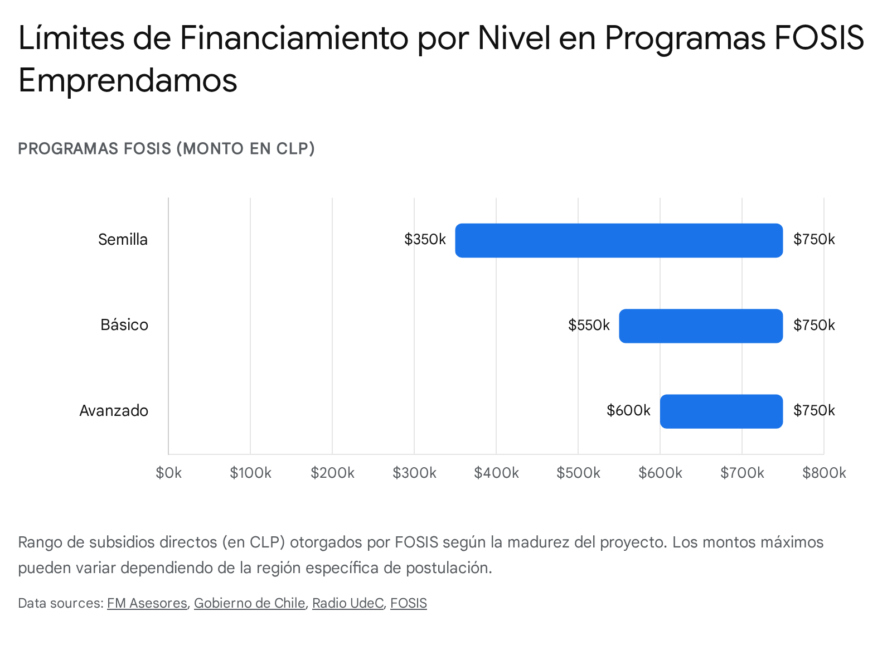
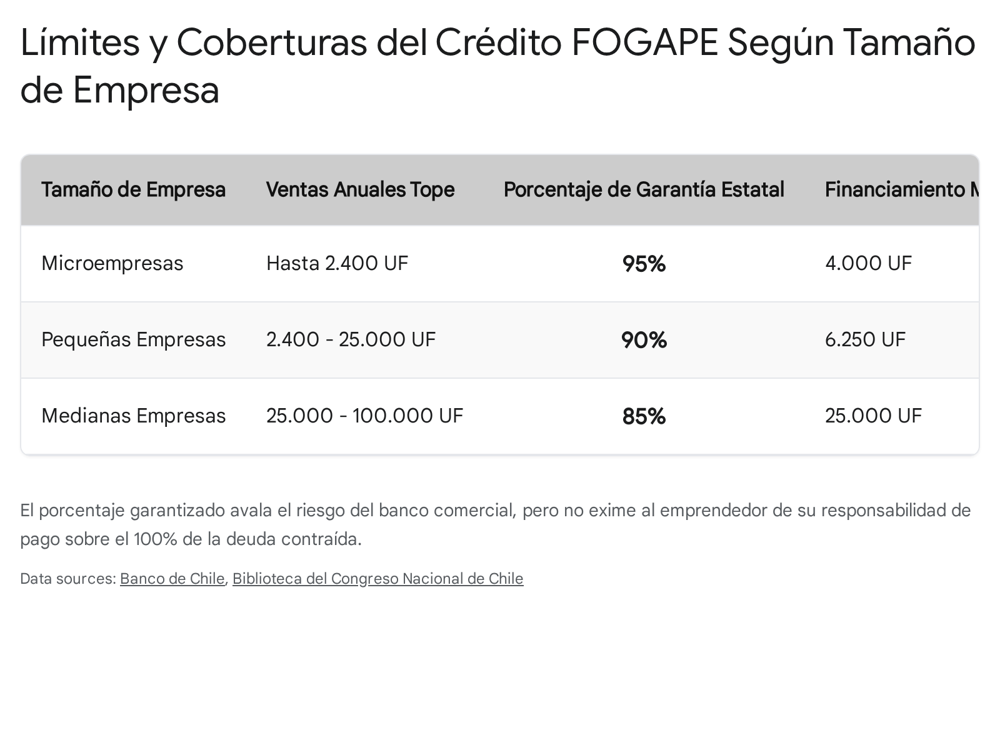

# Run #08 Deep Research: Documentación oficial para los 6 dolores complementarios

<!-- AUTO-BANNER -->
!!! info ":material-magnify-scan: Reporte completo de Deep Research"
    Reporte generado por **Google Deep Research Max** (`deep-research-max-preview-04-2026`). El modelo recibió el prompt en modo collaborative pero —patrón consistente con runs #01, #06 y #07— **omitió el plan intermedio y entregó el research completo directamente**. Ejecución única, ~USD 5.

> **Objetivo del prompt:** Mapear la documentación oficial chilena para los 6 dolores ✅ Incluir agregados en la sesión complementaria del 30-abr (no cubiertos por el [run #07](2026-04-30-07-documentacion-oficial-dolores-incluidos.md)).
>
> **Duración:** 687 s (11.4 min) ·
> **Interaction ID:** `v1_ChdSUmYwYWJiTkRJX1h6N0lQeElXTnNBURIXUlJmMGFiYk5ESV9YejdJUHhJV05zQVE` ·
> **Tipo:** `ejecucion-directa` (Gemini saltó el modo plan)
>
> **Consumo curado:** los 6 bullets `Documentación oficial requerida` correspondientes en [tu-plata-mipyme/dolores.md](../../../tu-plata-mipyme/dolores.md) referencian este reporte para detalle.

## Reporte del agente

# Documentación oficial para los 6 dolores complementarios: Tu Plata Mipyme V1

**Atención: La información contenida en este documento, así como las directrices técnicas para la construcción del Agente IA, tienen un propósito exclusivamente informativo y preparatorio. En ningún caso sustituyen la asesoría profesional formal de contadores auditores, abogados corporativos, asesores tributarios o ejecutivos financieros certificados. Las decisiones patrimoniales, fiscales y legales derivadas del uso del producto final son de exclusiva responsabilidad del usuario.**

## Executive Summary

El presente reporte consolida los hallazgos documentales y las directrices técnicas para integrar los 6 dolores complementarios al Agente IA "Tu Plata Mipyme". A continuación, se presenta un resumen ejecutivo con los datos críticos y las acciones tecnológicas de base para cada dolor:

*   **[E3-D8] Primer choque con multas SII:** El agente debe traducir la jerga punitiva y calcular la deuda en tiempo real, considerando que la inacción genera recargos por intereses penales diarios. *Acción técnica clave:* Creación de un MCP (`CalcularDeudaEstimada`) y curación de un dataset traductor para el sistema RAG.
*   **[E4-D2] Postulación a Subsidios (Sercotec/Corfo/FOSIS):** Más del 50% de las postulaciones fracasan por deficiencias de formulación. Se han parametrizado los límites de cofinanciamiento, destacando las líneas FOSIS Emprendamos (Semilla, Básico y Avanzado) con subsidios que oscilan entre $350.000 y $750.000 CLP. *Acción técnica clave:* Implementación del MCP `EntrevistadorCanvas` para generar postulaciones competitivas mediante diálogo socrático.
*   **[E4-D3] Créditos FOGAPE:** Es imperativo desmitificar la garantía estatal. FOGAPE avala entre el 85% y 95% del crédito para el banco, pero el emprendedor mantiene la responsabilidad civil sobre el 100% de la deuda. *Acción técnica clave:* Desarrollo del `SimuladorEducativoFOGAPE` para proyectar el riesgo patrimonial real frente al impago.
*   **[E4-D5] Pago de Cotizaciones (PreviRed):** El impago y no declaración activa multas de 0,75 UF por trabajador al mes y gatilla la nulidad de despidos bajo la Ley Bustos. Se han parametrizado las tasas de AFP (10,49% a 11,45%), SIS (1,54% a 1,78%) y AFC. *Acción técnica clave:* Construcción del MCP `GeneradorNóminaTXT` para automatizar el llenado posicional (105 campos) y alertas *push* para la "Declaración y No Pago" (DNP).
*   **[E5-D4] Suspensión o Término de Giro SII:** El abandono del negocio acumula multas automáticas. Se estructuró la bifurcación decisional entre pausar el RUT (F2125) o liquidarlo definitivamente (F2121), destacando que la suspensión bloquea la emisión de facturas pero mantiene las cuentas jurídicamente activas. *Acción técnica clave:* Trigger `EvaluarEstadoSalida` interconectado al intento de eliminación de cuenta del usuario.
*   **[E5-D5] Disolución de Sociedad (RES):** Las empresas inactivas acarrean un pasivo latente. Se mapeó el procedimiento de liquidación societaria para entornos digitalizados y notariales tradicionales. *Acción técnica clave:* Integración del MCP `GeneradorActaDisolucion` para proveer el andamiaje legal preliminar a los ex-socios.

La construcción de la versión inicial (V1) de **Tu Plata Mipyme** por parte del equipo *The Clauders* requiere una base documental técnica exhaustiva. Los siguientes puntos clave resumen los hallazgos de esta investigación complementaria:
- **Alta dependencia de autenticación:** La mayoría de los trámites críticos (SII, PreviRed, RES [Registro de Empresas y Sociedades]) operan detrás de muros de autenticación (ClaveÚnica o ClaveSII), lo que impide la integración mediante APIs públicas y obliga a la IA a operar como un oráculo preparatorio.
- **Fragmentación de formatos:** Brechas significativas en formatos legacy, como el archivo de texto plano de 105 campos posicionales de PreviRed, requieren ingeniería de datos específica para estructurar *Model Context Protocols* (MCPs).
- **Rol emocional de la IA:** La documentación recabada confirma que el Agente IA tendrá un fuerte impacto en la reducción de la ansiedad frente a notificaciones punitivas (multas SII) y protección patrimonial (Ley Bustos y disoluciones societarias).

A continuación, se presenta la síntesis de la investigación y la arquitectura documental estructurada bajo la metodología requerida, diseñada para mapear la documentación oficial de los 6 dolores adicionales aprobados en la sesión del 30 de abril de 2026. 

Para presentar la información, se ha utilizado el enfoque de análisis contextual, detallando la documentación técnica, las brechas operativas y las implicancias de ingeniería por cada dolor específico.

## Arquitectura Documental y Técnica de Dolores Complementarios

La gestión de multas del Servicio de Impuestos Internos (SII) es uno de los eventos de mayor estrés cívico para un microemprendedor. El desconocimiento de la jerga tributaria agrava la inacción, activando tasas de interés penal diario que multiplican exponencialmente la deuda original. La siguiente documentación estructura el flujo para que el Agente IA decodifique el "correo rojo" y asista en la condonación.

### [E3-D8] Primer choque con multas SII

**Resumen del dolor:** El microemprendedor recibe notificaciones punitivas del SII con jerga incomprensible, paralizándose por el pánico, lo que genera intereses moratorios diarios y bloqueos operativos.

**Documentación esencial (orden de prioridad):**

!!! example ":material-file-document: Doc 1 — Circular N° 50 (2016) - Política de Condonación de Intereses y Multas"
    - **URL:** [https://www.sii.cl/como_se_hace_para/solicitar_condonaciones/solicitar_condonaciones.pdf](https://www.sii.cl/como_se_hace_para/solicitar_condonaciones/solicitar_condonaciones.pdf)
    - **Qué cubre:** Establece los porcentajes de condonación (hasta 70% online) para infracciones tributarias e impuestos no declarados. Detalla el procedimiento paso a paso para acceder al beneficio vía web [cite: 1].
    - **Vigencia:** Permanente (vigente desde 2016).
    - **Acceso técnico:** PDF descargable / HTML scrapeable.
    - **Notas:** Es crítico educar al usuario en que el pago online otorga automáticamente el mayor porcentaje de condonación posible [cite: 2].

!!! example ":material-file-document: Doc 2 — Resoluciones Exentas SII N° 75 (2025) y N° 205 (2025) - Tasa de Interés Penal Diario"
    - **URL:** [https://www.sii.cl/normativa_legislacion/resoluciones/2025/reso75.pdf](https://www.sii.cl/normativa_legislacion/resoluciones/2025/reso75.pdf)
    - **Qué cubre:** Fija la tasa de interés penal diaria (ej. 0,025444% para ciertos semestres) que se aplica sobre la deuda reajustada. Define el cálculo del recargo por mora [cite: 3, 4, 5].
    - **Vigencia:** Actualización semestral.
    - **Acceso técnico:** PDF descargable.
    - **Notas:** Requiere actualización de parámetros financieros del RAG (Retrieval-Augmented Generation, mecanismo para conectar la IA con bases de datos externas) cada mes de junio y diciembre [cite: 4].

!!! example ":material-file-document: Doc 3 — Guía de Notificaciones, Citaciones y Giros (Código Tributario)"
    - **URL:** [https://www.sii.cl/principales_procesos/auditoria_tributaria.htm](https://www.sii.cl/principales_procesos/auditoria_tributaria.htm)
    - **Qué cubre:** Diferencia las etapas de apremio: Notificación (solicitud de información), Citación (ampliación de plazos), Liquidación (determinación de deuda) y Giro (orden de cobro) [cite: 6, 7].
    - **Vigencia:** Permanente.
    - **Acceso técnico:** HTML scrapeable.
    - **Notas:** Crucial para que el Agente IA clasifique la gravedad del "correo rojo".

!!! example ":material-file-document: Doc 4 — Procedimiento de Reclamo ante el Tribunal Tributario y Aduanero (TTA)"
    - **URL:** [https://www.tta.cl/como-presentar-reclamo/](https://www.tta.cl/como-presentar-reclamo/)
    - **Qué cubre:** Instructivo para interponer reclamaciones (hasta 90 días hábiles) cuando el contribuyente considera injustificada la liquidación del SII. Opera a través de la Oficina Judicial Virtual del TTA [cite: 8, 9, 10].
    - **Vigencia:** Permanente.
    - **Acceso técnico:** HTML scrapeable / PDF descargable.
    - **Notas:** Requiere un handoff humano (abogado tributario) si se inicia litigio.

**Documentos complementarios:**
- Circular N°1 de 2025: Armoniza el cálculo de intereses moratorios a tasas de mercado publicadas por la Comisión para el Mercado Financiero (CMF) incrementadas en 3,5% [cite: 4, 5].

**Brechas detectadas:**
- La API de consulta de deudas fiscales está cerrada tras la autenticación con ClaveSII. El agente no puede consultar la deuda exacta del usuario de forma autónoma.
- La jerga del Código Tributario (ej. "omisión sustantiva") no cuenta con un glosario oficial unificado orientado a Mipymes.

**Acciones técnicas concretas que requiere el equipo:**
- **MCPs específicos:** Crear un MCP `CalcularDeudaEstimada` que utilice la tasa de interés penal vigente (scrapeada de las resoluciones del SII) para mostrar el costo de la inacción diaria.
- **Scrapeos a montar:** Scrapeo semestral automatizado sobre el dominio `sii.cl/normativa_legislacion/resoluciones/` para actualizar las tasas de mora.
- **Datasets a curar:** Curar un dataset que traduzca 50 términos legales/punitivos del SII a lenguaje cotidiano (NSE [Nivel Socioeconómico] D-E).
- **Casos de handoff humano:** Derivación a contadores/abogados si la notificación corresponde a una Citación del Artículo 63 del Código Tributario o requiere defensa TTA.

***

El acceso a financiamiento estatal es un punto de quiebre para el crecimiento de la microempresa. Sin embargo, la asimetría de información y la barrera en la redacción técnica (especialmente el Modelo Canvas) excluyen a los sectores más vulnerables. La IA debe actuar como un traductor estratégico.

### [E4-D2] Postulación a Subsidios del Estado (Sercotec/Corfo/FOSIS)

**Resumen del dolor:** >50% de las postulaciones se rechazan por mala formulación debido a la incapacidad técnica de los emprendedores para redactar Modelos Canvas, grabar *pitches* y formular presupuestos estructurados.

**Documentación esencial (orden de prioridad):**

!!! example ":material-file-document: Doc 1 — Bases Técnicas Capital Semilla Emprende 2026 (Sercotec)"
    - **URL:** [https://www.sercotec.cl/wp-content/uploads/2026/04/Bases-Semilla-EMPRENDE-2026-Metropolitana-VB%C2%B0.pdf](https://www.sercotec.cl/wp-content/uploads/2026/04/Bases-Semilla-EMPRENDE-2026-Metropolitana-VB%C2%B0.pdf)
    - **Qué cubre:** Define requisitos de admisibilidad (sin inicio de actividades), montos (hasta $3.500.000), estructura de cofinanciamiento (aporte empresarial del 3%) y rúbricas de evaluación del pitch y formulario [cite: 11, 12, 13].
    - **Vigencia:** Anual (renovada en cada convocatoria, típicamente abril/mayo).
    - **Acceso técnico:** PDF descargable.
    - **Notas:** Sercotec exige que las personas no tengan deudas tributarias ni laborales al postular [cite: 13].

!!! example ":material-file-document: Doc 2 — Bases Técnicas Semilla Inicia 2026 (Corfo)"
    - **URL:** [https://www.chileatiende.gob.cl/fichas/67002-semilla-inicia](https://www.chileatiende.gob.cl/fichas/67002-semilla-inicia)
    - **Qué cubre:** Cofinanciamiento de hasta 75% ($15.000.000) o 85% para empresas lideradas por mujeres. Exige un prototipo funcional y antigüedad máxima de 18 meses ante el SII sin ventas [cite: 14, 15, 16].
    - **Vigencia:** Convocatorias periódicas anuales.
    - **Acceso técnico:** HTML scrapeable / PDF descargable.
    - **Notas:** El foco es innovación escalable, muy distinto al fomento productivo tradicional de Sercotec [cite: 17].

!!! example ":material-file-document: Doc 3 — Material Académico y Plantillas Modelo Canvas Sercotec"
    - **URL:** [https://capacitacion.sercotec.cl/portal/capacitacion/canvas-diseno-de-modelos-de-negocio/](https://capacitacion.sercotec.cl/portal/capacitacion/canvas-diseno-de-modelos-de-negocio/)
    - **Qué cubre:** Desglose oficial de Sercotec de los 9 bloques del Canvas, incluyendo un enfoque particular en la "Sustentabilidad" [cite: 18, 19, 20].
    - **Vigencia:** Permanente.
    - **Acceso técnico:** PDF descargable (tras registro en portal).
    - **Notas:** El agente debe alinear el Canvas generado estrictamente con los criterios de evaluación del manual de Sercotec [cite: 19].

!!! example ":material-file-document: Doc 4 — Programas FOSIS: Líneas Emprendamos (Semilla, Básico y Avanzado)"
    - **URL:** [https://www.ventanillaunicasocial.gob.cl/ficha/57/programa-emprendamos-semilla](https://www.ventanillaunicasocial.gob.cl/ficha/57/programa-emprendamos-semilla)
    - **Qué cubre:** Conjunto de programas orientados a los NSE más vulnerables (exigen estar dentro del tramo del 40% del Registro Social de Hogares - RSH), ofreciendo alternativas precisas de subsidios según la madurez del negocio [cite: 21, 22, 23, 24]. Se desglosa de la siguiente manera:

     *   **Emprendamos Semilla:** Apoya a personas mayores de 18 años que poseen una idea de negocio incipiente. Exige compromiso de participar en ~30 horas de capacitación. Otorga un subsidio exacto que fluctúa entre **$350.000 y $600.000 CLP** (llegando hasta $750.000 CLP en ciertas regiones) [cite: 24, 25, 26].
     *   **Emprendamos Básico:** Dirigido a negocios ya en funcionamiento que buscan crecimiento. Contempla hasta 40 horas de formación técnica. Entrega un capital exacto que varía entre **$400.000 y $750.000 CLP** [cite: 24, 25].
     *   **Emprendamos Avanzado:** Enfocado en la consolidación de negocios en funcionamiento con mayor tracción operativa. Aporta un subsidio que oscila entre **$550.000 y $750.000 CLP** y requiere cofinanciamiento base (aporte mínimo del 5%) [cite: 24, 25, 27].
   - **Vigencia:** Anual (postulaciones aprox. abril/mayo).
   - **Acceso técnico:** HTML scrapeable.
   - **Notas:** Excelente alternativa de "fallback" (plan B) si la usuaria no califica para Sercotec, brindando no solo capital sino soporte integral en el ciclo de vida temprano del negocio.

**Documentos complementarios:**
- Cuestionario de Preselección Sercotec: Instrumento que evalúa el perfil emprendedor antes del Canvas [cite: 28].

**Estudio de Caso: Falla Común en Modelo Canvas Sercotec**
Para ilustrar la brecha en redacción técnica: un emprendedor formula su Propuesta de Valor indicando simplemente *"Ofrecemos comida de calidad y buen servicio"*. Este enfoque genérico es la principal causa del >50% de rechazos. Un Canvas fondeable (traducido por la IA) debe especificarse como: *"Suscripción B2B de viandas saludables para empresas corporativas, garantizando trazabilidad de huella de carbono y despachos consolidados antes de las 12:00 PM, reduciendo los tiempos de colación del personal"*. Esta especificidad es la que el Agente IA debe extraer y construir.

**Brechas detectadas:**
- No existe un calendario único y estandarizado mediante API (como `programadps.gob.cl` o similar) que consolide las fechas exactas en tiempo real. 
- Las bases varían a nivel regional (ej. Sercotec Araucanía vs. Metropolitana).

**Acciones técnicas concretas que requiere el equipo:**
- **MCPs específicos:** Desarrollar `EntrevistadorCanvas` que, mediante un diálogo socrático, extraiga la propuesta de valor del usuario y genere un JSON con la estructura oficial requerida por Sercotec.
- **Scrapeos a montar:** Scraper periódico (semanal) a los portales `sercotec.cl` y `corfo.cl` rastreando la palabra "Convocatoria Abierta".
- **Datasets a curar:** Alimentar el RAG con los manuales de capacitación de Sercotec para emular el lenguaje esperado por los evaluadores públicos.
- **Casos de handoff humano:** Ninguno en formulación, pero la carga de documentos en la plataforma del Estado deberá ser hecha manualmente por el usuario.

***

El financiamiento bancario con aval del Estado suele malinterpretarse. Educar a la Mipyme sobre sus obligaciones contractuales es una herramienta vital para evitar la quiebra inducida por desinformación.

### [E4-D3] Créditos con Garantía Estatal (FOGAPE)

**Resumen del dolor:** Microemprendedores asumen que el crédito FOGAPE es un subsidio estatal condonable. Al quebrar, descubren que el banco ejecuta garantías contra su patrimonio y que el Estado solo avala al banco.

**Documentación esencial (orden de prioridad):**

!!! example ":material-file-document: Doc 1 — Reglamento de Administración FOGAPE (CMF)"
    - **URL:** [https://www.fogape.cl/wp-content/uploads/2016/10/Reglamento-FOGAPE-actualizado.pdf](https://www.fogape.cl/wp-content/uploads/2016/10/Reglamento-FOGAPE-actualizado.pdf)
    - **Qué cubre:** Estatuto legal que estipula que FOGAPE es un fondo para garantizar un porcentaje del crédito a las Mipymes (ventas < 100.000 UF). Deja explícito que el deudor sigue siendo responsable del 100% de la deuda frente al banco [cite: 29, 30].
    - **Vigencia:** Permanente (actualizado por leyes específicas como Chile Apoya).
    - **Acceso técnico:** PDF descargable.
    - **Notas:** Documento clave para "desmitificar" la naturaleza del aval.

!!! example ":material-file-document: Doc 2 — Tipos de Garantía FOGAPE y sus Límites (Ley de Renta / Chile Apoya)"
    - **URL:** [https://www.fogape.cl/2023/06/30/preguntas-frecuentes/](https://www.fogape.cl/2023/06/30/preguntas-frecuentes/)
    - **Qué cubre:** Define la estructuración escalonada de coberturas dependiendo del volumen de facturación y del programa específico activado para reactivación [cite: 31, 32, 33]:

     *   **FOGAPE Pyme / Microempresas:** Orientado a empresas con ventas anuales de hasta 2.400 UF. El Estado garantiza hasta un **95%** del saldo adeudado, permitiendo financiar un límite máximo de **4.000 UF** [cite: 31, 33].
     *   **FOGAPE Pequeñas Empresas:** Para empresas con ventas sobre 2.400 UF y hasta 25.000 UF. La garantía cubre hasta el **90%**, con un financiamiento tope de **6.250 UF** [cite: 31, 33].
     *   **FOGAPE Medianas Empresas:** Cubre a entidades con ventas sobre 25.000 UF y hasta 100.000 UF. La garantía avala hasta el **85%** de la deuda, permitiendo un crédito máximo de **25.000 UF** [cite: 31, 33].
     *   **FOGAPE Reactiva / Mujer Emprendedora:** Instrumentos especiales donde se flexibilizaron los requisitos. En el esquema de reactivación (y en cruces de apoyo para liderazgo femenino en intermediarios financieros), la cobertura puede forzarse positivamente (ej. garantizando hasta el 90% para ciertos rubros afectados severamente, como el turismo) eliminando restricciones sectoriales, acoplado a tasas tope limitadas a la Tasa de Política Monetaria (TPM) + 5% [cite: 32, 34, 35].
   - **Vigencia:** Operativo y sujeto a renovaciones (ej. extensiones hasta finales de 2024).
   - **Acceso técnico:** HTML scrapeable.
   - **Notas:** Muestra cómo el banco evalúa el riesgo y que el FOGAPE no obliga al banco a prestar, solo reduce su exposición al riesgo [cite: 36].

!!! example ":material-file-document: Doc 3 — FOGAPE vs. FOGAIN (Corfo)"
    - **URL:** Documentación mixta (bancos comerciales / Corfo).
    - **Qué cubre:** FOGAIN (Corfo) también garantiza hasta el 80% pero enfocado fuertemente en inversión a largo plazo y está abierto a intermediarios financieros no bancarios [cite: 37, 38].
    - **Vigencia:** Permanente.
    - **Acceso técnico:** HTML scrapeable.
    - **Notas:** Precisión de limitación: Las comparativas exactas suelen residir en simuladores de bancos (ej. Scotiabank, BancoEstado) [cite: 37, 39].

A continuación se detalla la tabla comparativa exigida para contrastar las naturalezas de ambos instrumentos de fomento:

| Criterio de Comparación | FOGAPE (Administrado por BancoEstado) | FOGAIN (Administrado por Corfo) |
| :--- | :--- | :--- |
| **Público Objetivo** | Micro, Pequeñas y Medianas Empresas (ventas hasta 100.000 UF). | Mipymes y empresas más grandes enfocadas en inversión a largo plazo (hasta 600.000 UF en algunas de sus líneas). |
| **Enfoque de Uso** | Fuerte énfasis en Capital de Trabajo y Reactivación inmediata. | Orientado a Proyectos de Inversión y escalamiento productivo. |
| **Intermediarios** | Principalmente Bancos Comerciales y Cooperativas. | Bancos, y amplia participación de Intermediarios Financieros No Bancarios (IFNB) y Factoring. |
| **Cobertura Máxima** | Hasta 95% (para Microempresas bajo planes focalizados como Chile Apoya). | Hasta 80% (dependiendo del tamaño y los montos involucrados). |
| **Límite de Tasas** | Frecuentemente topeadas por ley (ej. TPM + 5% en líneas contingentes). | Tasas fijadas comercialmente por la institución intermediaria según el riesgo. |

**Estudio de Caso: El Riesgo del Default bajo FOGAPE**
Para graficar el riesgo real patrimonial: Una SpA (Sociedad por Acciones, entidad donde la responsabilidad se limita al monto aportado por los socios) solicita un crédito con 90% de garantía FOGAPE. Al quebrar la empresa y entrar en mora, el banco comercial primero intenta cobrar a la SpA. Como la empresa carece de liquidez, el banco activa la garantía estatal para recuperar el 90% de su propio riesgo. Sin embargo, en la firma original, el banco exigió que el fundador firmara como "Aval Personal o Fiador Solidario" (práctica estandarizada). Consecuentemente, el banco (y a veces el Estado por subrogación) iniciará juicios ejecutivos de embargo contra los bienes personales (casa, auto) de la persona natural para recuperar el 100% de la deuda. FOGAPE garantizó al banco, no blindó al ciudadano. 

**Documentos complementarios:**
- Boletines de la CMF sobre ajustes normativos y apalancamiento del fondo [cite: 40].

**Brechas detectadas:**
- Cada banco comercial implementa sus propias políticas de riesgo para aprobar un crédito con FOGAPE. La IA no puede predecir la tasa exacta o la aprobación.

**Acciones técnicas concretas que requiere el equipo:**
- **MCPs específicos:** `SimuladorEducativoFOGAPE`. Calculará una tabla de amortización teórica, explicitando qué parte está cubierta por la garantía y recalcando en UI que "el cobro recae sobre el emprendedor".
- **Scrapeos a montar:** Scrapeo mensual de la Tasa de Política Monetaria (TPM) del Banco Central para ajustar el límite legal (TPM + 5%) de la tasa Fogape [cite: 32, 41].
- **Datasets a curar:** Casos de uso de embargo o cobranza judicial para ejemplificar didácticamente las consecuencias del no pago [cite: 39].
- **Casos de handoff humano:** Consultas sobre negociaciones directas con ejecutivos bancarios.

***

El correcto pago de las obligaciones laborales previene la acumulación de pasivos ocultos en las Mipymes. La Ley Bustos es implacable y el Agente IA debe anticiparse a los quiebres de caja.

### [E4-D5] Pago de Cotizaciones (PreviRed)

**Resumen del dolor:** Carga manual tediosa los días 10 de cada mes. Ante la falta de liquidez, la Mipyme no paga ni declara, enfrentando la nulidad de despidos por Ley Bustos, multas a beneficio fiscal de 0,75 UF por trabajador al mes e imposibilidad de licitar con el Estado.

**Documentación esencial (orden de prioridad):**

!!! example ":material-file-document: Doc 1 — Ley 19.631 (Ley Bustos) y Régimen de Multas Previsionales"
    - **URL:** [https://www.bcn.cl/leychile/Navegar?idNorma=144318](https://www.bcn.cl/leychile/Navegar?idNorma=144318)
    - **Qué cubre:** Modificación al Código del Trabajo que estipula que si las cotizaciones no están íntegramente pagadas al momento del despido, este es nulo, y el empleador debe seguir pagando remuneraciones hasta subsanar la deuda [cite: 42, 43, 44, 45]. Detalla las infracciones de la Dirección del Trabajo estableciendo multas a beneficio fiscal de **0,75 UF por mes no cotizado** por cada trabajador (en el caso de trabajadoras de casa particular, la multa oscila entre **0,2 y 0,5 UF**) [cite: 46, 47].
    - **Vigencia:** Permanente.
    - **Acceso técnico:** API BCN / HTML scrapeable.
    - **Notas:** Base argumentativa para la alerta push: *"declara aunque no tengas plata"* [cite: 45].

!!! example ":material-file-document: Doc 2 — Indicadores Previsionales Vigentes (Parámetros de Cálculo 2024-2025)"
    - **URL:** [https://www.previred.com/wp-content/uploads/2026/01/Indicadores-Previsionales-Previred-Enero-2026.pdf](https://www.previred.com/wp-content/uploads/2026/01/Indicadores-Previsionales-Previred-Enero-2026.pdf)
    - **Qué cubre:** Establece los coeficientes matemáticos obligatorios para estructurar las planillas de pago [cite: 48, 49, 50, 51, 52]. El Agente IA debe integrar las siguientes tasas específicas:

     *   **Tasas de AFP (Cotización Obligatoria + Comisión):** Provida (11,45%), Capital (11,44%), Cuprum (11,44%), Habitat (11,27%), PlanVital (11,16%), Modelo (10,58%) y Uno (10,49%) [cite: 51, 52, 53].
     *   **Seguro de Invalidez y Sobrevivencia (SIS):** Tasa variable administrada con cargo al empleador. Durante los períodos reportados se ha situado entre un **1,54% y un 1,78%** [cite: 48, 52].
     *   **Seguro de Cesantía (AFC):** Para contratos a Plazo Indefinido: 2,4% empleador y 0,6% trabajador. Para contratos a Plazo Fijo: 3,0% íntegro a cargo del empleador [cite: 51, 52].
     *   **Salud:** FONASA estructurado en la base legal del 7% [cite: 54].
   - **Vigencia:** Actualización mensual (topes imponibles y tasas SIS varían regularmente).
   - **Acceso técnico:** PDF descargable.
   - **Notas:** Necesario para el cálculo algorítmico de las planillas de pago (TXT de 105 campos).

!!! example ":material-file-document: Doc 3 — Manual PreviRed: Procedimiento de Declaración y No Pago (DNP)"
    - **URL:** [https://www.previred.com/documents/80476/80730/DNP.pdf](https://www.previred.com/documents/80476/80730/DNP.pdf)
    - **Qué cubre:** Instructivo sobre cómo ingresar a PreviRed e informar los movimientos del mes (ausencias, sueldos) sin realizar el abono financiero, cumpliendo con la presunción de deuda para evitar la Ley Bustos [cite: 55, 56].
    - **Vigencia:** Permanente.
    - **Acceso técnico:** PDF descargable.
    - **Notas:** Explica que el trámite debe hacerse antes del día 10 (o 13 si es electrónico) [cite: 57].

**Guía Operativa: Procedimiento de Declaración y No Pago (DNP)**
Para garantizar la inmunidad ante la nulidad del despido (Ley Bustos), el Agente IA debe guiar al usuario a través de los siguientes pasos exactos:
1. Acceder al portal oficial Previred.com e ingresar con RUT de la Empresa y clave de acceso antes del día 13 del mes.
2. Ingresar al módulo de Remuneraciones, seleccionar el mes correspondiente y subir o validar la nómina de trabajadores activos.
3. Al momento de procesar el pago final en la plataforma, ignorar las opciones de transferencia bancaria y seleccionar el botón oficial "**Declaración y No Pago (DNP)**".
4. Imprimir o descargar el comprobante digital de DNP en formato PDF y respaldarlo legalmente como comprobante ante la Inspección del Trabajo. 

**Respuesta a la pregunta de contingencia: Plazos del Juicio Ejecutivo**
*"Si uso la DNP, ¿cuánto tiempo gano antes del Juicio de Cobranza?"*
Al realizar un DNP, el empleador está reconociendo formalmente la deuda previsional, lo cual constituye título ejecutivo directo. Cuando se retiene el 10% del sueldo del trabajador y no se paga a la AFP (DNP Automática), esta retención puede asimilarse a la figura penal de apropiación indebida. Tras la declaración, la AFP transfiere periódicamente sus nóminas morosas a departamentos de cobranza. El inicio del "Juicio Ejecutivo de Cobranza" bajo la Ley 17.322 puede detonarse en el corto plazo (meses venideros) a discreción de los equipos legales de cada AFP, los cuales no tienen facultades directas de imperio, pero ofician a la Dirección del Trabajo y juzgados civiles para exigir el pago compulsivo [cite: 58]. La ventaja del DNP no es evadir el juicio indefinidamente, sino evadir de inmediato las multas por omisión y el castigo de la Ley Bustos.

!!! example ":material-file-document: Doc 4 — Estructura del Formato 105 Campos Posicionales (.txt / .ple)"
    - **URL:** Documentación extraoficial de integradores (PreviRed exige formato específico para nóminas).
    - **Qué cubre:** Especificaciones de columnas, longitud de caracteres y tipo de dato para automatizar la carga de nóminas.
    - **Vigencia:** Permanente.
    - **Acceso técnico:** Requiere ingeniería reversa basada en plantillas validadas.
    - **Notas:** *Limitación de fuentes:* Ante la ausencia de un API REST moderno por parte de PreviRed, la arquitectura del archivo de "105 campos por posición" ha sido documentada por proveedores de software (Talana, ExcelNegocios) [cite: 59, 60, 61].

**Documentos complementarios:**
- Compendio de Normas del Sistema de Pensiones - SP (Capítulo I. Declaración y no pago de cotizaciones) [cite: 57].

**Brechas detectadas:**
- Ausencia total de API abierta en PreviRed para declarar o pagar programáticamente. Todo requiere el arcaico formato posicional TXT o llenado manual en el portal tras login.

**Acciones técnicas concretas que requiere el equipo:**
- **MCPs específicos:** `GeneradorNóminaTXT`. Un MCP que tome los datos de los empleados de la Mipyme desde la base de datos y estructure automáticamente un archivo plano .txt posicional de 105 campos listo para subir a PreviRed.
- **Scrapeos a montar:** Scrape mensual al portal de Previred (Indicadores) para actualizar los porcentajes de SIS y topes imponibles.
- **Datasets a curar:** Generar notificaciones pre-armadas persuasivas (Nudge theory) para WhatsApp el día 8 del mes.
- **Casos de handoff humano:** El usuario debe subir el archivo a previred.cl manualmente.

***

Las "sociedades fantasma" representan un pasivo latente. Las acciones orientadas a la formalidad de salida protegen al usuario del acoso fiscal futuro.

### [E5-D4] Suspensión Temporal o Término de Giro SII

**Resumen del dolor:** Fracaso del negocio lleva al abandono. El SII acumula omisiones en Formulario 29 que generan deudas sistémicas. El emprendedor desconoce mecanismos seguros de pausa o cierre.

**Documentación esencial (orden de prioridad):**

!!! example ":material-file-document: Doc 1 — Declaración Jurada de Suspensión Temporal (Formulario 2125)"
    - **URL:** [https://www.sii.cl/formularios/imagen/2125.pdf](https://www.sii.cl/formularios/imagen/2125.pdf)
    - **Qué cubre:** Permite pausar las obligaciones fiscales por hasta un año sin perder el RUT, evitando las multas por F29 "sin movimiento". Se debe presentar antes de completar 12 meses sin movimiento [cite: 62, 63].
    - **Vigencia:** Permanente.
    - **Acceso técnico:** PDF descargable.
    - **Notas:** Excelente alternativa para el usuario que desea "eliminar cuenta" pero podría volver.

!!! example ":material-file-document: Doc 2 — Procedimiento de Aviso de Término de Giro (Formulario 2121)"
    - **URL:** [https://www.sii.cl/ayudas/ayudas_por_servicios/guia_paso_paso_termino_giro.pdf](https://www.sii.cl/ayudas/ayudas_por_servicios/guia_paso_paso_termino_giro.pdf)
    - **Qué cubre:** Obligación de avisar en un plazo máximo de dos meses desde el cese de operaciones. Exige presentación de balance, cierre de registros tributarios (como el FUT [Fondo de Utilidades Tributables] y el STUT [Saldo Total de Utilidades Tributables], regímenes históricos para arrastre de utilidades) y pago de impuestos residuales ajustados según el CPT (Capital Propio Tributario) y la RLI (Renta Líquida Imponible) [cite: 64, 65, 66].
    - **Vigencia:** Permanente.
    - **Acceso técnico:** PDF descargable / HTML scrapeable.
    - **Notas:** El trámite dura legalmente hasta 6 meses [cite: 66].

**Guía Operativa: Procedimiento de Término de Giro (F2121)**
Para la liquidación definitiva, la pyme debe seguir estos pasos consecutivos de alto rigor técnico:
1. Recabar balances de cierre finales calculando correctamente la RLI y el CPT a la fecha de cesación.
2. Ingresar al portal web del SII (Mi SII) con RUT y clave tributaria de la empresa.
3. Navegar a *Servicios online* > *Término de Giro* y seleccionar "Declarar término de giro".
4. Adjuntar online los anexos contables obligatorios correspondientes (incluyendo detalle de FUT/STUT si aplica, libros de compra y venta, certificados de retención).
5. Cancelar los impuestos pendientes resultantes de la liquidación y esperar la certificación electrónica oficial (Certificado de Término de Giro) [cite: 64, 66].

!!! example ":material-file-document: Doc 3 — Criterios de Diferenciación (Suspensión vs. Término)"
    - **URL:** Circular N°12 (2003) SII.
    - **Qué cubre:** Base normativa que establece cuándo el SII propone de oficio el cierre o la suspensión [cite: 63, 64].
    - **Vigencia:** Permanente.
    - **Acceso técnico:** PDF descargable.
    - **Notas:** *Limitación de fuentes:* El contenido didáctico comparativo de "cuándo usar cuál" fue abstraído de fuentes tributarias secundarias validadas (Ej. terminodegiro.cl) para enriquecer el contexto del agente [cite: 67, 68].

A continuación se presenta la tabla matricial de contraste exigida por el equipo para programar las reglas de decisión en el Agente IA:

| Dimensión Operativa | Suspensión Temporal de Actividades (F2125) | Término Definitivo de Giro (F2121) |
| :--- | :--- | :--- |
| **Naturaleza del Trámite** | Pausa temporal transitoria (hasta 1 año, renovable bajo criterios estrictos). | Cese y liquidación perpetua de la actividad económica ante el Fisco. |
| **Obligaciones Mensuales (F29)** | Exime al contribuyente de declarar y enviar los Formularios 29 de IVA en ceros. | Extingue de forma definitiva la obligación; el RUT deja de tener facultades comerciales. |
| **Costos Contables** | Trámite simple. Usualmente no requiere de un balance o auditorías profundas. | Trámite complejo. Exige Balance de Cierre, determinación de RLI, CPT y auditoría de libros. |
| **Uso Futuro** | El RUT comercial puede reactivarse inmediatamente enviando un aviso. | Si el usuario desea emprender en el futuro, debe crear una nueva entidad legal o reiniciar RUT. |

**Respuesta a la pregunta de contingencia: Impacto en Bancos y Facturación en la Suspensión**
*"Si mi empresa está 'Suspendida Temporalmente', ¿puedo emitir facturas atrasadas o usar la cuenta bancaria corporativa?"*
Al solicitar la Suspensión Temporal de Giro (F2125), se notifica expresamente al Fisco de la paralización de operaciones. Operacionalmente, el SII bloquea digitalmente al contribuyente, dejándolo con **Prohibición de emisión de documentos tributarios** (no puede emitir ni timbrar facturas de compra, boletas o guías de despacho) [cite: 62, 69]. La cuenta corriente empresarial en el banco comercial puede seguir existiendo jurídicamente sin cerrarse, pero **no puede** utilizarse para percibir flujos de nuevas operaciones comerciales. Cualquier depósito o factura emitida por vías analógicas durante este periodo es una violación tributaria que gatillará multas severas por evasión.

**Documentos complementarios:**
- Boletines de suspensión programada de servicios electrónicos del SII (para manejar errores de downtime del Agente) [cite: 70, 71].

**Brechas detectadas:**
- Ejecutar un Término de Giro es altamente contable (requiere balance, RLI, CPT). La IA no puede hacerlo sin integrarse a un ERP contable; solo puede guiar el proceso.

**Acciones técnicas concretas que requiere el equipo:**
- **MCPs específicos:** Trigger en backend `EvaluarEstadoSalida`. Al presionar "eliminar cuenta", la app despliega un asistente conversacional que diagnostica si corresponde Suspensión (F2125) o Término de Giro definitivo (F2121).
- **Scrapeos a montar:** Ninguno crítico temporal.
- **Datasets a curar:** Respuestas estructuradas sobre las diferencias operativas y de costo de ambas opciones.
- **Casos de handoff humano:** Derivación indispensable a un contador auditor para la confección del F2121 y el Balance de Cierre.

***

De forma análoga al cierre tributario, la liquidación jurídica extingue la responsabilidad civil del emprendedor sobre su estructura societaria comercial.

### [E5-D5] Disolución de Sociedad en RES

**Resumen del dolor:** Dejar empresas "zombies" comercialmente muertas pero legalmente vivas. Dificultades logísticas con socios para firmar la disolución, enfrentando costos variables notariales.

**Documentación esencial (orden de prioridad):**

!!! example ":material-file-document: Doc 1 — Procedimiento de Disolución en "Tu Empresa en un Día" (RES)"
    - **URL:** [https://www.registrodeempresasysociedades.cl/AyudaSpa.aspx](https://www.registrodeempresasysociedades.cl/AyudaSpa.aspx)
    - **Qué cubre:** Requisitos directos del Ministerio de Economía para empresas creadas en el RES (Registro de Empresas y Sociedades). Aplica para disolver una SpA (Sociedad por Acciones) o una EIRL (Empresa Individual de Responsabilidad Limitada). Exige acta de Junta Extraordinaria de Accionistas protocolizada o reducida a escritura pública, Certificado de Vigencia de Accionistas y Término de Giro del SII previo [cite: 72].
    - **Vigencia:** Permanente.
    - **Acceso técnico:** HTML scrapeable (Portal de Ayuda).
    - **Notas:** Puede firmarse mediante Firma Electrónica Avanzada (FEA) o en notaría [cite: 72].

**Guía Operativa: Disolución de Sociedad en RES (Tu Empresa en Un Día)**
Para asegurar la muerte jurídica total de la entidad corporativa nacida digitalmente, la Mipyme debe ejecutar secuencialmente:
1. Obtener primero el Certificado de Término de Giro expedido por el SII.
2. Ingresar a *www.registrodeempresasysociedades.cl* usando el RUT y Clave Única del Representante Legal.
3. En el menú, seleccionar "Disolver" y elegir la entidad (SpA, EIRL) de la lista de empresas asociadas al usuario.
4. Llenar el formulario web que hace las veces de "Acta de Disolución", declarando que se han extinguidos los pasivos y liquidado los haberes societarios.
5. Obtener el número de Atención asignado.
6. Todos los socios (o el socio único) deben estampar su firma digital mediante un token FEA o, en su defecto, dictar el Número de Atención en una Notaría para la firma presencial. Una vez firmado unánimemente, la plataforma certifica la disolución.

!!! example ":material-file-document: Doc 2 — Disolución de Sociedad de Responsabilidad Limitada (Sistema Tradicional)"
    - **URL:** Ley 20.720 y Código de Comercio (BCN).
    - **Qué cubre:** Redacción de escritura pública de disolución con acuerdo unánime de los socios, inscripción de extracto en el Conservador de Bienes Raíces (CBR) respectivo en un plazo de 60 días, y publicación en el Diario Oficial [cite: 73, 74, 75].
    - **Vigencia:** Permanente.
    - **Acceso técnico:** API BCN / HTML scrapeable.
    - **Notas:** *Limitación de fuentes:* Los manuales de paso a paso tradicionales fueron corroborados con fuentes de bufetes corporativos, dada la ausencia de un portal estatal centralizado para el sistema antiguo [cite: 74, 75].

!!! example ":material-file-document: Doc 3 — Formato Acta de Disolución (Junta Extraordinaria)"
    - **URL:** Documentación tipo y modelos legales.
    - **Qué cubre:** Estructura que requiere la mención explícita de "voluntad de disolver la sociedad", nombramiento de liquidador (si aplica) y reparto de haberes [cite: 75, 76].
    - **Vigencia:** Permanente.
    - **Acceso técnico:** No hay repositorio estatal público de modelos (se deben proveer templates curados en el RAG).

**Documentos complementarios:**
- Procedimientos de mediación societaria o forzamiento de disolución en caso de conflicto irreconciliable de socios (salida contenciosa) [cite: 73, 77].

**Brechas detectadas:**
- No existen APIs públicas para el Conservador de Bienes Raíces ni para el sistema interno de RES sin clave única.
- Casos atípicos (socio fallecido, demandas cruzadas) complican la disolución, derivando invariablemente al sistema judicial (Tribunal Civil).

**Acciones técnicas concretas que requiere el equipo:**
- **MCPs específicos:** Creador `GeneradorActaDisolucion`. Un MCP que consulte los datos de los socios y emita el borrador del documento PDF del Acta Extraordinaria lista para llevar a Notaría.
- **Scrapeos a montar:** Integración (o scraping) sobre el Diario Oficial para verificar la publicación del extracto.
- **Datasets a curar:** Templates legales (JSON) validados por abogados de Disolución EIRL, Disolución SpA y Disolución Ltda.
- **Casos de handoff humano:** Obligatorio para la protocolización (visita a notario o uso de token FEA) e inscripción en el Conservador.

**Sources:**
1. [sii.cl](https://vertexaisearch.cloud.google.com/grounding-api-redirect/AUZIYQEhmMJL4s8mF_AErc-VThvq2U4RzLwza4R4d6yvvmz3EXMKNJw-DIew3OTHBx9KjIXvy0uNVikHuHxNzdLQAAP9kr3-O9_BlXprZlzj8lkz1BRxFwj92085KMDOg2vMdWkTS_l9gO_7w09nYWh3dpPQoci9ad2V9M6nhEZpebMWmLfjMNbB4kq281du5co=)
2. [sii.cl](https://vertexaisearch.cloud.google.com/grounding-api-redirect/AUZIYQEFzeobBZkpIs4WUppor4MGAoE7li017jTl7r8DMeRneYnCqZ2aivaKk5Pv75jKfcm7JPGU2U3V5XFKea_A0ZHJNxKqE-N2k0Ej4HvWfW7RM0ZTX-KNpWaJHIqUXTGCTGw2C4dVkCKFOn7B8CJ3MDaXuYVWLuZiO2FjTJJMEB9TUc7BOQ==)
3. [sii.cl](https://vertexaisearch.cloud.google.com/grounding-api-redirect/AUZIYQHlFQ7qUnLrZtiLqn-VwyxgaxSzYqPinnrQ1jhywQceuY_HjM7pqJqczSgW_QAXI7agwbtlt01Qv8jUncycmLlbTyOcwIB_V_QzIBF8OwdzKiPV7BLZB5p0hm2_sNsLLfaSLQDAFSyFSLfM6oDIYgPfadpFxi3qjqhBe4g=)
4. [sii.cl](https://vertexaisearch.cloud.google.com/grounding-api-redirect/AUZIYQFRc63rK6SIWZJsdcoEgIq6FvnsoHAmtbgHo7r5KDv_O_KVBqupQ-ppm5wd8FGPq3-K9x3DH_Qe1gZiI4PfsGMwXMQQm8wqQ0B9MhOVGlGJIrH4wrUAT08N_5rI8CXC04VRkGwpqVAGScnOI-qtMjfyqTNXVdgzGyA=)
5. [sii.cl](https://vertexaisearch.cloud.google.com/grounding-api-redirect/AUZIYQGwg8DwlR8zX7TJliRtHoM5dVFSXYgiCXoxIgvckP2kQ__0LVKQyZs9N8CmTomjZJ0shgx_EcEfaPr2DBO-Wx4glEwmhsx--pGbsDfq6uWH8z8g0h1GQtxG9c6LElloOx0m3fL6YXQwsu_nkBh0h-TUXLcG6UiqbwK1xg==)
6. [sii.cl](https://vertexaisearch.cloud.google.com/grounding-api-redirect/AUZIYQH42PNIYlmnVkEpaEGLU7i0-1eKL7_IzA9Exy90hgFF9-doMkE-N0WbjVZGodGPuUCcHun0p0Q7G4wTYoYMmQxMdycQgz0cFmeWM11uXtjKk3uCoOWN15gyt0FYJCS8X1T5WTTpFCqu8TYUR3X1hW3ut5RThdo=)
7. [sii.cl](https://vertexaisearch.cloud.google.com/grounding-api-redirect/AUZIYQGUDqIN2qVVEBwI-aEYbYf67FSKvHOR9_8kMzZVB0mR5oehzG-dDCmXvtM2G4u0jeg63S7taZIrPhUySjSw38MkrjFxUJyZA8aNFjBq-fFEg2vTouhwC3xI_wexmIYATOVlLxHhSIvz_YpLzBLEmHDudI9lmdTX)
8. [tta.cl](https://vertexaisearch.cloud.google.com/grounding-api-redirect/AUZIYQHK6e4dnoFTi8WZqbcMpPwMMOVBWxF1Sq1iyk4xbb8j3YTz_jAdaTr7G1y-cW1r6PSXxCMtX1g3MCjdc4q9lOKerxmtyuuEmAjmzP2q_U3P5lqe2XDftKhIJ8wW-9yoBg==)
9. [bcn.cl](https://vertexaisearch.cloud.google.com/grounding-api-redirect/AUZIYQFlicRaR2-_CDkbzqIkkKboWWk8s6nCYSc48_u9JUxHNTZ5gOY5ltftBu8dL7yd2_0s1F27mwFUEGVLDUdpYTpCxGEF7HuVfFCg-YzF_ZJIxxfkOcdfagSooqpYxDrZIkEOj_5Isncr6IMUVBe91BIGM7632jPB3QX87aWXPeSC-b4fawJdmiJYRxGMHdXLgjCISqY5mxRHZQhwVxVl)
10. [defensordelcontribuyente.cl](https://vertexaisearch.cloud.google.com/grounding-api-redirect/AUZIYQHVdHbis5BF1XxrP6i73I71jF-ZIKBGwOOI3Sm-MRywwqm39two9W_i2sAxJtEakPjvY5of_4BLELbAludCyB_Z8P3milzOmUGP0uRHArYb5dNNmmE2k_bng82nNGlMlL-0DHGXJsV4FeX-WRFYeT7tFZqP9G9YNDl5k2FqA3Ne)
11. [sercotec.cl](https://vertexaisearch.cloud.google.com/grounding-api-redirect/AUZIYQFlaSgNssTzKJ5yi--Dgpq61FJ-O52quM_UcEWn5o6Zgt4JfIS8X0tu96zd-PRy_DYXuBDZ4JJ4q3kUxtom7dxIJw1hM1rzoCn9ulqaH7hDQLmY2RIQNAvwbt3QsZ9NkbzlGIvn7v0Q2i4TfOuWuhzV3jNBRzPr1rHQAmWBiWM3f8eGn5tDNcXuGLVDPsx2H1DsgcmAcvGPpbX_)
12. [sercotec.cl](https://vertexaisearch.cloud.google.com/grounding-api-redirect/AUZIYQEDFh_vsrj8BpfAGL_LqQ3jncpjFDRRLKQtgDF5oQ1K1VEz0CIeUYiyAF6qSKVGkVXPEIvWSzHTTcfi5jysAFbkKgoWqwnYBK9837hlP_4TP4czxatvRTEsvCDEiFAzZFddSk_m1GQRg0NTyOe3uzwTFkplgZwDajZtFa7cBMa6DnMDtpPCi-VpmMWSOiBY5H8HUzFOaL4uJTRaFadIQQ==)
13. [chileatiende.gob.cl](https://vertexaisearch.cloud.google.com/grounding-api-redirect/AUZIYQEPoggVjXzNvthgS5r_A3LcJfnQ8VTxOdcw_raKVcdbm3YLSyS3Ci4SMESxf1qCcVp5en2-qCeUzgVhYN26UeC_gyOir3_SClg2Po_O7P3Z62_yg8gvRpTrq5r84OuYOXBPC9j4jL_D)
14. [chileatiende.gob.cl](https://vertexaisearch.cloud.google.com/grounding-api-redirect/AUZIYQGE8EAMw97X01Xj8731ElAYxcx9w0eU39ij6d0-ohbOwO6chkfWSmZixaTiEWIhNVDEd5e_E-JkkxqPAiUafL0Ny-_Uy6qDKH_Nl0Qxee7ZuUjsk16KJjuGnI7Fb27wQnoEdJlaS9fqUke2MbriDxlq)
15. [entnerd.com](https://vertexaisearch.cloud.google.com/grounding-api-redirect/AUZIYQFGDzXGi-HFasSrIKgGQcZ_aTMtjw1zmGT4JM-j8q6616oYyFAhOlYYU1lOF2gDWuRB-dRcJMiYVyYtAOL-LNM6FPR2EEniPJH-77-ByR3ly9LaYJ7dZ0vVOS0OEG2fBpohNsfw6nMQDcXcV-imnpdAw2cYUDJIoRPj_FWK-bjYYjPfpuDxFWDKPKC1VhL1XiQ_fI4qnhSuGfA4f608cu6uv9brqXosne9yh0rRUv2VjuIhw3zL8CTo)
16. [fondos.gob.cl](https://vertexaisearch.cloud.google.com/grounding-api-redirect/AUZIYQGNP4Wi5upXyfHnmuiCmnCuJdNzK5TfGhmTaNt92ynujtcV_T4PVGxe43t43madcRj_I-X8BkK2vmTfnl7Lzcb0PCYRBvzJ75wSrCmGMkxIaLBeyWZgnKeqm8PEmW_UQpvieOFH34oXPwRw)
17. [corfo.cl](https://vertexaisearch.cloud.google.com/grounding-api-redirect/AUZIYQF-mP2EyRM4A_ATppHB1N5XT2H7dyVblp1cCb20otpEWLOIIwsq6hYQOpT7frRQM26p_jYu7jPCJra_rX2R8tihTJkt6dt1Whr5hXm6ObcH3M8IhDvEc3vSFI2XUovK6F-OWRwmuC2XMvMcX1tnuFtYfhcrIB3rThx61uFM2Z5GXerxWev3Y84wGyfoXiIZnJauw2WqpC3j)
18. [sercotec.cl](https://vertexaisearch.cloud.google.com/grounding-api-redirect/AUZIYQFjJHbQIApJdJAQrl6pgVG9sE1t3WBFPYC21UuKgF7ZkKgfuXJr5EoVx4tcZotaTtpH6n-zkX6bKzEV02day9L9n2LggRCbFvtfMKxBSLyaRx3pSGM4gXW08P_51F_yMgC5eQvyGj47oCbrkIYYKlX9g_bETdA_rD3EZLEkJA0sxxV6Zl3PE25gQ5k-zBE-)
19. [sercotec.cl](https://vertexaisearch.cloud.google.com/grounding-api-redirect/AUZIYQEKNLh0QrL7Ed-gwNQhSEnZo-mcLhCiab7wM9jeC_U7kAO9JpvxPa06fdvo0-ndOtDk4rzeP9j7SpqDt3mu993SPODm-C5cqiS_LbkJ5iERnFjq2DQkuKnVLLZk__hJl5gIn3rSV3N3AsBdk1nXHAvowP4ut6cfQuImhltZlnA3yRDPWIaCNsza4aIiBBYGlNd4mGIjaGbFXGSPYbOh-qFjwjM7ydIWIRXC77gktnlDdnUvRcFN4Cj3z2Ff1vstf3-IuwXeOHI6MtwUXWG0cQ==)
20. [enigmatica.cl](https://vertexaisearch.cloud.google.com/grounding-api-redirect/AUZIYQGj8AKvX_N4WaVKSrSvVsecPt6kCr7BWsm7xst1pnMYGhDPkWvYOR20j2TGFWWkqP6_OiTcD-NN9wUtKy48zmwlaTZoLBaaxSU25bBtAxhkwRQFpi_bKC1Yn4GUHh55lUNkb5DzLwDFiKy23hMEf_iAFv28EIQ6yLQ1ksUFiqA=)
21. [ventanillaunicasocial.gob.cl](https://vertexaisearch.cloud.google.com/grounding-api-redirect/AUZIYQFqaVCeL02VMX_i_wT0qrzVpPLtYl_0DJiq6LspfgAA4O9lNLSpJpbEMHclcJ4_e0F9nt1lj7CMNP--OAcTQnHk37L4Uyy2QTOjHlmO5vmlTKHRuEnM-x3LNeGrOkuZEk54RmowATJqx4KHCrTB9UNFY3dmtQq2m07GMk1Lxqlc1zn15Q==)
22. [24horas.cl](https://vertexaisearch.cloud.google.com/grounding-api-redirect/AUZIYQF4QNtI5M5PpPFWrU88FPAzczNql4napNEfVfEUvpY1FMkxW4OPmCWSQQERKA7HV4VxOxrTGo3hdc0xrwpZzeGDTSbxuigOYz8GpgUizEk9FZdXHhqXPuB67OWA7XlFxJgnA3nvau4UnxwYJ79Ryr_BrtvmgwnCiNSdrGTnsg==)
23. [fondos.gob.cl](https://vertexaisearch.cloud.google.com/grounding-api-redirect/AUZIYQGspFlrSA_DTilPtcQvFjP-vYNd6WapMqgxEm_nn9Hmnfdam6OC1wt4_GoLV-Tg0GgwDtmg-0LonLfjOIJF1-VvGCRNfTQJaj-H7InIWIEc-pi7G2b-3s7PTEAsgrHs)
24. [www.gob.cl](https://vertexaisearch.cloud.google.com/grounding-api-redirect/AUZIYQFidJZ-eZ1jbkaTfneFqvU67GsqOg4ynRiNvIkjLPLRzTVPoCnxvF2eIHLsescxCZokxQ6uOgHX_49xfWLi1GPOxGSSEqt2_oKMji7cQH_xuLK7irs5_ajQ0LxBRoxML8zvg3Np0kh_SMS8rMOQr6Fxlf2HCmE23TOc-DtpZZJ8RecIxlUG48-pqpKe66PV_YEHJxBzlhjiDh8Iie_1xUPwxQ==)
25. [radioudec.cl](https://vertexaisearch.cloud.google.com/grounding-api-redirect/AUZIYQEgWvBTq4NhGOAFxkj7dP8DywIC6hhV6ruZIIPw5StBwCThWPjT91DGsS0du3A6zxM-Lh1Y_G1Hh5TGIolLNhflutTN5_5vWC6VcBIPKuHnNpqhKG4f_IyglLl2Nt-tuWXYEo9rx1PPqcah54Zt7WJBFcudqWZSyOmsDLwQBAlyZ68U6DP2kz0d7s7YMwyYMbwGB95gdR5XLfRxt_J_luuOMVAmaTjdbdJJfRrOkdMlroCAi_DJo3y0)
26. [youtube.com](https://vertexaisearch.cloud.google.com/grounding-api-redirect/AUZIYQFY6ZfFdhCyqxqqimXoXLELVm2MfqU4pTzdbazNRTX0-f9VlmfKXeu6O5nXoRse35_7jLOcXNK0OCoeUezqF3zFIRGlgJYcrSNXOUqLa71O-SCSCvmHGBhmens-MfCHS9Y=)
27. [fmasesores.cl](https://vertexaisearch.cloud.google.com/grounding-api-redirect/AUZIYQEYvaTbyGOLI7CT81BnbaLO9Cgv9X5k4DLQTWZdHxWngz4cJ1P4adynecg4Yc87mfJkpM2ynIgnQ82KGx_Ah-K_eknr5SyKWnZ183FrA2N5itElm_OKN57oRlmcn_ynIgPtQYeZDVGSdqm_LLX0j5yOOxUdZi1odWfh6aQf7yqs9XqErY1L)
28. [miportalemprendimiento.gob.cl](https://vertexaisearch.cloud.google.com/grounding-api-redirect/AUZIYQHYUzI7xbnb0HPRHbxHyRvKjF_3ZSIMjLevdL48wMa641n_cwrZRgoDuqBFwyPvdj8wIiEVKcIRz1aoX8K8Sl8ltyOWhLrCvxmXv0ZzbA5Yvl-OAeJxx2CRw6SY9EBNR3e4CPv6B0g2QLUA1eo5LO1uASMopC0XtX1NRglD0g==)
29. [fogape.cl](https://vertexaisearch.cloud.google.com/grounding-api-redirect/AUZIYQFBzOPw6-EGumZJVZLYdw-Dka7HZ8osV3gxmrBb9iMG9ZfXfNtChRTuAyBSKZLskf3MBC_zeYVfDN7HipnPc66JhKGA61yH7dx041AYj6k9tCxBiZA-0-GdIsTVS3Q94_FM1EZbBlf4F6RFP13LSIIwTRj-q5rSmU4PhExpHWpi6WAC9-qaz3Q=)
30. [fogape.cl](https://vertexaisearch.cloud.google.com/grounding-api-redirect/AUZIYQFDeeKJgrzYMt-vwGjfJbx3S5_P21oZuMVz6CuqK7YUixj185x_6MRKcvAqKP_g6W1Tt_GFff9jdMiUbwOpCT4QO-U15S1zMtNLkjsbMPU48i1eHYczSXhdc3K3CU1cP7vprpAzthiXwssqx6tpQcu3bS3V3XquKNZbZRNxVvT0xpipYoztYeKHzg==)
31. [bancochile.cl](https://vertexaisearch.cloud.google.com/grounding-api-redirect/AUZIYQFBRhX1wZDqdYcTN_OqVI3VQfzX3wHVqx6b59wzyOZvarg-J3h--3Hy2vEu_509nNiSUkb6l8jrm6qWWKJdIFUz6iNClp4vUs6vZbZvuXKwnFKml9POtf7RYiJriJDCWSg-NL7qMhBGJguSxV0bp9HeVA==)
32. [fogape.cl](https://vertexaisearch.cloud.google.com/grounding-api-redirect/AUZIYQH4e72O9PK7qulua210u9SLqTnnitgXjc2aZygaUVN4Ds2CT4BH_u8c858uJyjZrsEsgfD1znuIEVCRovV63uFh52hJXXxNkeZgw1S26r7T-n1CCkpEiEdAkgAoEsVoPChbHuYQ2kPDCqOCiQ==)
33. [bcn.cl](https://vertexaisearch.cloud.google.com/grounding-api-redirect/AUZIYQFCMsTi_0KUkVBalOw3Z8PoQJ24bcwYDqZk94f0dFEEYupy_1zQgvwaH0SprTMDLtpiyzbAwI8gZxI6GJus7hi0fXpac0x0nDspmKoHWQ_LmsDjqG_bLSAiIlPkRtzF0PEdgk5YIppxTw==)
34. [tiendanube.com](https://vertexaisearch.cloud.google.com/grounding-api-redirect/AUZIYQEGOr-4rYkl0UL3Yn0DwGZmzVlEl2m3CZlMR6Ds_zQWhViqkzrwczFhqVyEwvvBj_oVT9X9DwMAftKyCZJJOr16ocNi1Q51kKRHAm-H6wVq9TMcNjW0xgg7cRNnuOC3zLDL3UxZWcXeonekUZjEKFNQCavuQ93nItuAxQ5O9pHrwIVHfw==)
35. [transformaturismo.cl](https://vertexaisearch.cloud.google.com/grounding-api-redirect/AUZIYQFU06TIKwcU8tDpTUVHgd7JzsJLsW8G_35LXWEW5-Rt5n1t0IuQS4g39GEiR-HD0931EeSvnjaLzna6SEFZCcspfnqO2otB-VHzkA-9n8gJOWX6WRbaYFu_lZ3nkmES23f9UN9eZ8W80eDxU8VPuzHJZrx7iKIMzQ_1HV3fZ3iJG4hCO4KgPiOzFKQRmIgl1PSM)
36. [youtube.com](https://vertexaisearch.cloud.google.com/grounding-api-redirect/AUZIYQExs5iUoSgnmLCpK_MJnHmsNvRteYXixjc_3Kmc1niZCiZkwnQKGCiUQJ8l7pOWU5lwuxDzQNs9cKnuON67MbVSLVrBo0eCsworOwM-7XZAGXC7mDH-L10mejJXyDMVdMM=)
37. [scotiabankchile.cl](https://vertexaisearch.cloud.google.com/grounding-api-redirect/AUZIYQGoTHWldq2xK6TTLS7841PyKpscG_iKGRUfWs_rSKO1KsHQABMoH1IMEVTcRcsGQvfi5v9-g66_EBlylhVBJ_IwnMe8FE9ruAccqSoA4D5NcEFE6Tg3lS0Pd5ilEGepraU73qRg0wAAXele6Y3EyXlCVH3OP3YkmDZln_nc)
38. [nubox.com](https://vertexaisearch.cloud.google.com/grounding-api-redirect/AUZIYQHB_KreLrXgcPZ8j_qKkRq3xmHNCdx9YxK64qWBSRY4JltQ68pfRTh5vS-zTkhCUAIMsiLWnrEOgPs0YfmcSzkHSgVm_tCBHNEIzfaTv-k99itj1fQhsPE96Kfczw22jkUdh_0=)
39. [santander.cl](https://vertexaisearch.cloud.google.com/grounding-api-redirect/AUZIYQHBRxVx5Bp2os4vusu9E22hUaXAU45EyFpSlE0YJ0hLw4egH0Nm1IrzDbR124dMZFMlGXbEzQvzFQe7Vj8KRYmCGojDOQezJwndJy-51S4riBtpDxZpjHoQRPI3xUtsAQ==)
40. [az.cl](https://vertexaisearch.cloud.google.com/grounding-api-redirect/AUZIYQEI6gAX4F1Q86p2S2C4YyYceyUIcIQPATnO4F-Ym5pKgG1dqaN-yPY4Jpm_M2--Ws1raeSTu1TA_iVa_wvB2DoQgPjI9UBd0eeaOe1tBesciBex7qe2-CHXD87GO7uE099RRLR04-9b4EFJrrafkKl5YlvA3nXiwvQ=)
41. [economia.cl](https://vertexaisearch.cloud.google.com/grounding-api-redirect/AUZIYQGan-i00RLoU_XNGhgdBWtnuiO5JFDVyftX9_5HHZcxCDDejM5kwQc1QJ8dSrZ6ceVg6KPfULtiXegqum6tCOSHf1GgSWk2hncvciUbgakX2jnW6i_nazjmGMfkaqfkc6fOpp7qRzGNteAZCFAWufuDY1sRz_LspE1lDtI_tvMetehjXYIOfQ0nrbqDz4Y7qSIxg3VhpiQKdoReQV-df5_YABo0ngAXOqbXmd5CiZGgYDAIYX5BKivzIECNXG4OmZc5Qs-zTp4gvQ==)
42. [bcn.cl](https://vertexaisearch.cloud.google.com/grounding-api-redirect/AUZIYQE2tgGQ825pHLU4F0CC1_jrmKW28kSF17gV-KkOON3gnoWDmqP0knJdjhyGS_YZP3DzzWBM_Mq4iFnGyq5EEsX1C4GshwJE7DFgYCclAiiAL_DFX1suO6s6jUvTb7y-Udj5GN3pkU4oxvx2phq8TLBvTH0a-EzUMn-9C6zUR2yqONI6FzZZ)
43. [bcn.cl](https://vertexaisearch.cloud.google.com/grounding-api-redirect/AUZIYQHzv1q3OdRKe0kBXc3qpLimfPYhD1XPHY6ld5REksMsoBkGY3qSQQG310Hg1CKdv5fczneKIBsTCxRoch4CSvxgiQjZkrQVutunoO6nRJknHxFCY1-6ng3Pq7qgtguOwNF9lH2sboyW)
44. [justia.com](https://vertexaisearch.cloud.google.com/grounding-api-redirect/AUZIYQGpZH_UWqnFBhMCGupBoxM1M8W_t-Gal-zx-pTJB03E5V-Ok57ae6eC-2nizbv7vHdeNW5Te-SSHRKT0nVYV0vVsxGlQ6W3nXnAv5R0pJi8I7YYZDc17GNQLZ_yPkrAIHURzUzN6GNQSi7sDHd7YmUisT6cKw==)
45. [opech.cl](https://vertexaisearch.cloud.google.com/grounding-api-redirect/AUZIYQHYmrEJYDP8qKw5_EQHmcNGuwCA2cNfXzipQYDNAQ7ischqOLZJHCoAK1-WfaIoiQ36IchWgxYEsQsej1sk-b-xYyALSXOEAbitSIbfdfDzR46R9EA2RserJVLPUgB34R28di_bWxnQJSyHbapak0AGeolfPkO4EnUuV636OgXQlt7xfWzVe8YNcMjkikxY)
46. [defontana.com](https://vertexaisearch.cloud.google.com/grounding-api-redirect/AUZIYQG0nnqP13YyQ6ob3-Qn826HCSz1DNwkWIN2osoRkkLj6aUMehQhVIUdeW_YD40XVPLdlFt9uaUQgykN6zs71RIybvFVpMGTjGnjz1igDqe9rCwt0pQTxiUdwQpkhQQ96bqPTg5DQDAh94YEdINuSdzYD87zme8aqOrood6xjyefQoKYG3uacxKQB3cgKpeD6J4=)
47. [dt.gob.cl](https://vertexaisearch.cloud.google.com/grounding-api-redirect/AUZIYQGnvAI2Xom2sf44stsZTMqj53ET7se37e7jL6YjtvQ2bKqkRT1pY8Q0BpkKN8ED050kFGSUjUxkOtCr9V97WkRnMYsZXUF8n7RPXl7-8Sy9YDjLBqMKYTaVnbOpGc4Xppp_tb3cPBrNX7gXKiU=)
48. [previred.com](https://vertexaisearch.cloud.google.com/grounding-api-redirect/AUZIYQErI0hFgggrQ2zqQISNd6s1KhRf42CLOMmCTpttgGbj6dv2iYuk9N7fp1Wva9v8NeSK9UbpohcrvHM4qFN2ypeX-f74Gm8uI57QKIkYgk7CKlCQljpuCQI0ovmIOE2NyofY8nkkttNoTKvHVIeh7WD-ndhPWy2_JlGIUXDV1wek22OBvaVIa1-jNyqAt_weomA3nMbHL0wxxZrR)
49. [previred.com](https://vertexaisearch.cloud.google.com/grounding-api-redirect/AUZIYQEDeNEhwaXXe1mlkm1jNMctlnkOXTE-9v4Snr_EjJJeoesBUtgq0PRpc3k-fvYcFevdTDyHcOX1ChtPge0AP7d5KbN80OH7acJhHTr1VmmfNnJXIwW6821wAH3mQZVe6aGcb2LaFyXTE6geG5EYn2hg1b2rAWWpnRxh2-uWNuIvpuFnmzIwZzxCNv2mcEXQCOv4r045v09TOwYh5oc=)
50. [previred.com](https://vertexaisearch.cloud.google.com/grounding-api-redirect/AUZIYQH5ebYLQH-KHA4byg3SUz46Sx5W7Abl-pIsBtJV7hkUbghBzMlTbg4-AyEQqVfnGU2yZsGjDZaDQ3OfeqvcTU5JJqaAKGfkYKmfJ87gtmZvO0QFcWae4Rj50szOedvc9WR4_9xZxY5DNOXeQok2FucTrqDrm6iLq0QxDfEv7W9Z0s4p9XHDD20ErrUt8TBwvgFVv9FO9qMQyXCei_uCiw==)
51. [arizmendi.cl](https://vertexaisearch.cloud.google.com/grounding-api-redirect/AUZIYQGNSyTHa9h0a_mIRachRA4v5WeebVbsTMDPMsq6r1MA4NfcIMx0juxxGmHczZPJoJbNFQ6jpIgUEG8IYKUQ9wIrlBTDsImTlsU0HgKJFa8dGGmwPG6Cx10w_nD1ACqqGztbD6iwhoXbx9kg-8as_jOMqyeyhXwHphqEhPwDt9dlt1YjnPUQNBjj3DeKsm436E-7BtmvDOuC)
52. [previred.com](https://vertexaisearch.cloud.google.com/grounding-api-redirect/AUZIYQGGo3mLhU36G8FqrQuFybfS3hnHZTzTNQ5kNPSG5vMBE6OaXK3lpAHTf7m83IBEVA7_KOku-6xVWV7vmkcX72-W1fqGXltjsPbkiL7V1tfHXJLyX5XZVem2n4FRVphyjlx03tQv2M0lWzh8VzU6ftDonffbFb_sk6_y3cJvp-yzsNk8d9zJpHAQry6rQMKx7WtsxpITZ_MkQ5-r)
53. [biobiochile.cl](https://vertexaisearch.cloud.google.com/grounding-api-redirect/AUZIYQFW-pqrSDDXyLsKbFNW1-gS4Z8-WZhB77J2LrQiFffwgoy4sKPs-UabeXqggW8pstghkOU5ptD5idrllL64AZdizKJnsTsY_VQcMC0bNdT4YgteuBuRs2iUQB6NpC-dn-wNg4q9ILzvTqgjvmkcZL7RAMRsoYK2zNH3urnUp4XYzQnb37txoYxxOCMPwTZmRv4_qejviCvAmZRh_CJMXQgYAiJd4ntLB0QmHXC6R8zZwVOMX0-qtmwDV-gpUqAeQ9i0WAJokZkM)
54. [previred.com](https://vertexaisearch.cloud.google.com/grounding-api-redirect/AUZIYQFwORyjDYwSJ1UA9gaWp3iluOlf6ja2nuPsX0Yb11PCvI7T6ibFOZNafrqUp63Lxq3nzNRabddFWxtuBd53Sb6dWF7x-BHgLBSUF0HC-6_2SlmtFmq2ZEqw6bFFmoZMK2FX1jReTu4BfuGNtKDt1ySaOe5bWfWq5_e11h9AOahwpT-EkamdOQ9iFzKYgO0xi65K1ZDmT4eA5iYw)
55. [kronoz.cl](https://vertexaisearch.cloud.google.com/grounding-api-redirect/AUZIYQHZk9K5WE4mEo9THTAaDozeIb0MrJbYKkg5wIQUJIXVPw5xm5divAukJqVpzWSKcDOsa-jIe_g1y1jeJcGp1GHNc0Iu8VgH4RGgA6YE4_B6d2fu87KlEu20iqFp8s4RHGNvNFyuGHbeco6nohHp7CYM-W9EzMGAhxB611ijYnKRLg8LWWEeirMIk-CClMnUx6Q19g==)
56. [previred.com](https://vertexaisearch.cloud.google.com/grounding-api-redirect/AUZIYQE1v8zNvRbhy0sTWJDQ7TU1MOBFYtJPGE7Kh_kDq7HzNoW3MXIvWSUhYeJ_PHryDaBJtSO1oaD9fgVp64zNEx1efhvoWrGa4qNoYEamTiHnhxISiP_3HSfN2Z_XJmSUKHVYUvqgbDfqCfSbnA==)
57. [spensiones.cl](https://vertexaisearch.cloud.google.com/grounding-api-redirect/AUZIYQGgztxLY8BV0_fYrsIpjvLsFjlNTD2ssPif-Q0CGPlx1Gcr0ba0AzsAhG9Bl8hAC3curZ96DjdfTVaWOvlmWJWxREGxplCNrFttmJfdFGwqjI0uW0Rpdq7fr3QFzbjyXbZ8JKRWdHfI5iKPlQa0sYJpid1ppLG231s=)
58. [scribd.com](https://vertexaisearch.cloud.google.com/grounding-api-redirect/AUZIYQFX6Lcl-G_hD163EAy_So5b8s15ds60Ighyrf_s8d_GatGcdesi8aMj3cjWwPO-TkhEOiHjEWgoeUabef2YCcTpOxIDV1xctr8Nx0YydatpsdpI4S8pzs03TVpTVVu_xlBIw4b254O9w5I33t55QOnXxLSm)
59. [talana.com](https://vertexaisearch.cloud.google.com/grounding-api-redirect/AUZIYQFm7rLg3Emd7nIp4UqmwDoRkap_qTn2_FH5nFTmDa0373xOY3FJEBzhOB9fR9uSol55swdbkg2M8E4STPPc7Jt7dxpCYuaKajIIDLOSMD3eAWNHnuqptTMRdnt1ldqnfkaf1OGCpTkZPBuG-Sm8fTfqGCBUk8kQv7PL5fARcdhV)
60. [buk.cl](https://vertexaisearch.cloud.google.com/grounding-api-redirect/AUZIYQEZCEXHdEbdxhrhNdwUViQ0L4qWqivJbh_R5HNdMbKQUeGmMc4FeYgNTI1GgHydq88bLW5RvDlTKF4SM5ti0L6I0SjRIQdS-owfC6YBprqvrs4XIL31QaPfW4_oZeCzYrJe2e8ck4vMGwesMH3mJyCv8l4gCxK-qgHdqQpLJlbhnISe0J_oZnJ5sOvz7nLaq8Os4Cvv6eVcE847WvXgo-Rxslw0dLvs)
61. [wordpress.com](https://vertexaisearch.cloud.google.com/grounding-api-redirect/AUZIYQEezFNUY2SqL9w-1mcFUMF-f-0IAAraqlYTzxblmP4r9_A3XGwD1ULKdRmGjYGUmXXKK6CnuFnpZ71-fwgCEiCKgY-I1kyBLLsozGi1gy93a4TAQrMhGri_TYe9JFLNEuClDyJm0zgGU7_jhmyluw0UHRZ0QkV9jsyNj5BOD9II6doXmR6Yli2rrZmY-JcgdG217JA6ng==)
62. [sii.cl](https://vertexaisearch.cloud.google.com/grounding-api-redirect/AUZIYQFPZ3aOsvJHPAMrqMY7nfWJ2H5bVpD2mbHwIIuPOZyMRXFafUfBVK4b18mtueeZQnMtm1o5YD7NPE5GoV7RPCldwgXWpR9gQlF-Wi9z9k0hvLR_djOSBlrcuWCKyQMWUGqre1g=)
63. [sii.cl](https://vertexaisearch.cloud.google.com/grounding-api-redirect/AUZIYQGQ_6xKkGPUut9ZD08tJTFSBheflF6wPaEOSF8dWrZ1QZDaJ8GJ6a7THUXwFMKC6Dx9-b98MpoDvnYteZzrk6e3MJN69Z6XDH00u6MsQJxzmG0xLOvwEJt8furAtzyzqIN04qYvKWMTycZPwby7QQamgO5u)
64. [sii.cl](https://vertexaisearch.cloud.google.com/grounding-api-redirect/AUZIYQHXDB4np6pKsTFX43T1-j8IQexfP6Xlc-Qw_mUUuMhUrWosXvnVqPPdzg6-FGHSXPdqo6o_bWgC4RIx4JfqYBM4yRhakAY6YMu_tchSzKVEy7IqV5cNKxY2LCADMRnZPNnrZ-3Pnwtq_VNEpQ==)
65. [sii.cl](https://vertexaisearch.cloud.google.com/grounding-api-redirect/AUZIYQGDMs_RjG7sqVspXUf7jAY1bKhfd1ed5ct3ynRvil3yy9sCnLjqPn8M7-vC8ChVDJpBiX7av7fZ7543HT4XpRyHAnxWEHGzL2E1dLR_Erh2HAgKLHveUIPYN5MmDVpTuQB992lTbk8jcZlE_3GJXqBY6Q3PCxx_URn9gd94qScnBqM0vA==)
66. [sii.cl](https://vertexaisearch.cloud.google.com/grounding-api-redirect/AUZIYQEYUFeCi-vTZsfGKFVHcAyqEVQQJFWErsga8X-jjRfPwWH4hdioEFI_P2pZXpdaw3ukRSNv1y5GTC7XgvS0RU4hNoPEjSsFje3jS4Hnq2Wmyj4VwnYrm16xgfEgNbY2ydajdI-GCEW5_d7Qp-NKprlxS3rgOokqwmdBVib9UHFqtCw=)
67. [terminodegiro.cl](https://vertexaisearch.cloud.google.com/grounding-api-redirect/AUZIYQFqAq9Hq79ymoT_lxKvY8PC4SdR3uELvmg_cqHIWniZxGR9c3GlOjVCYI1VUdbq1AMCl2q7yunn9Q4VOb49HweMB79nPIcpPJ_0txiCqcJ8fQS0i5c0WO7f4ycjTD7SXJ9KaThyYJH1QUwqS4w_FHzLho5nW6_4tgehNH5sb3ryHQQjzUoJ8SI=)
68. [edig.cl](https://vertexaisearch.cloud.google.com/grounding-api-redirect/AUZIYQHqvxk6tlQe-IYpt-vhqSB_h5e7Ko6RZ8VX4lGmT1PBiGbeRFieTOUZesY4tzaCoNwQz44ybLzvs-2fbMgDdijUwzdbvkj0xou3HUF76AM8TWFCp8v-0Oxp5lqhn2pK8Go=)
69. [sii.cl](https://vertexaisearch.cloud.google.com/grounding-api-redirect/AUZIYQFG6C4ftVKl-15CmNQFdEX9N5wQq7zcHwJXMySNxHsBuuQ36aouuGu4GMOswdM7iT2SGw83UZNRUP6MYn3qmE_HMwwDQzRiqKC2YqqccLdM6l70KKHIoa8ITtEmJ60v6u1zyDQM1xmoV7tto8nDjV5NtbSmKaTaOi3x)
70. [libredte.cl](https://vertexaisearch.cloud.google.com/grounding-api-redirect/AUZIYQFPVqga8S-tVasnsr9Ah4b3ZCAbEdZ-g7srO4iQeOP-r027Nb9w4qd8eDTEKxLGwwLWcm6FbktOiPpxfoX0-NW0S66fBDymr_35IAMaQHmOX_LqN-Lfa397eK5LD6BiEE1UaB6zdoUeEoOC49WgXb8L58dyzRW9W9avlNnYcrFAus4lPg==)
71. [apigateway.cl](https://vertexaisearch.cloud.google.com/grounding-api-redirect/AUZIYQEctF88R-aR1vYb3w0Q2bNnn5aYlN7I8UZw4f3HJY3RbnL-MgTuH1qgaugiC5QZ5dQRkFOq8qtgPOl63RvK4qiz-Rchjt-3OEcrV-y1xg4Dh64CfdZUWIFgfClO2EruGv7yXsqDRWYSmvUZ8R5Z_GD9eUzfzzjKkwY5rbK3sgmEHoc=)
72. [registrodeempresasysociedades.cl](https://vertexaisearch.cloud.google.com/grounding-api-redirect/AUZIYQHqSRbD3DQQRUoctITJhqWtpSEFG3Tax8uwp574_nv6mvtBXHJvE2AxI4CzpApBBN5balmMfKKsEWYD9fyYAxcNPFba-5tMTf18IoFHT1lHUfz23EpDEMYGoJPmFMXxSwVFmLNMHOpdHZkVT9UK-KA=)
73. [ncrabogados.cl](https://vertexaisearch.cloud.google.com/grounding-api-redirect/AUZIYQF1O58YH_a4wgVKrNxjKP5DrQdmlncaHTwrSnUyDHaLcyzGJaQnrQhruBInT5uDYDAe3YnNZwYheL7yxoKa8s2oE9KV2QnrF5VPbVDHyxABin1W44WtqbpWKttgv6vnpuFrvkTfyk4pS_bO2PavrQ==)
74. [legalprisma.cl](https://vertexaisearch.cloud.google.com/grounding-api-redirect/AUZIYQGD4diOWyVriGmxXGKwF8NLL72lTBqFSz8Hebje0uL_tIiFkZ2X-qiqjUZb_Xq5t2LP-ZbJp9V3Pwnm06xyIDB363_emJFS4LxGDJU74o9eTrY34cstgLFaFQBmkRkQIsPCIn5YnK1Vi-3HtlkUn28=)
75. [emprende.cl](https://vertexaisearch.cloud.google.com/grounding-api-redirect/AUZIYQFx2grrvsauK0bIxbtYJL5hbB552U7Z63Lf6gZ9Cc9ekPah6LJS3qvRkmVAnxvkwCzbLUAK6lfHUJSSMk_ZEg1iel2ehoEI6twzz_GDWWHUXJoj7ihWuNrwMpADN6N-_x1fFAzmmM5gD6aTwqfokJ6cyPVLMbkzk-dTkwvsfuUvDG5u9PH2XIBJYAuGpfUptVvDVREll1qGAV8=)
76. [scribd.com](https://vertexaisearch.cloud.google.com/grounding-api-redirect/AUZIYQGDGpmoTmo3IHgwiHPCpH7NoakK4M4EDuPa4FXIj5UCj3j5f4vwo6n2E8C7ITx3ioRJBF4cVqzuFjxARfANlr3DFGjwa4VoSUvjuKqMiXuTJ3JMzK0rNDDFvZ-6ld6YOBk5qYxqDWQw8tB7Dh91Dg==)
77. [denegocios.cl](https://vertexaisearch.cloud.google.com/grounding-api-redirect/AUZIYQFjKd7d1XxyLkQiowWODPYjFqct8ZmVbxWER8qtlvHsL7YoaAWxJlm5caCXV-MA4nDTQFgFvoFe7wHg2llk_Rz8d-LVWd--43OFlj3pwlW4UzjWKRUxWTUqMlNxAa073YCMEe4=)

## Visualizaciones

---

*Este archivo registra solo el plan inicial/refinado del agente. El reporte completo aprobado vive en el archivo `YYYY-MM-DD-<slug>.md` (sin sufijo).*
