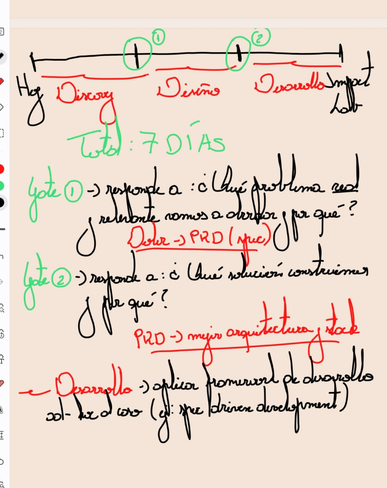
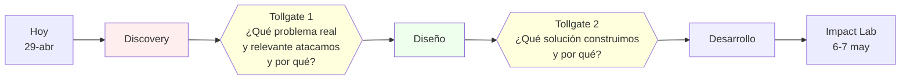

# Proceso y hoja de ruta — 7 días pre-lab

<!-- AUTO-BANNER -->
!!! success ":material-check-bold: Producido por el equipo"
    Documento generado por el equipo The Clauders. Es fuente primaria para este tema.

!!! info "Estado: propuesta de Jose"
    Recibida vía audio + diagrama el **29-abr-2026** (post-kickoff). Pendiente de feedback y aprobación formal del equipo. Si se acepta, se promueve a [ADR](../tu-plata-mipyme/especificaciones/adrs/index.md).

## Diagrama original

{ width="640" }

## La propuesta en una línea

> **Hoy → 6 de mayo (Impact Lab) = 7 días divididos en 3 etapas con 2 tollgates entre ellas.**

## Las 3 etapas

### 1. Discovery

**Objetivo:** entender el dolor real del usuario y zanjar **un problema** sobre el que vamos a trabajar.

**Trabajo:**

- Revisar el pool de dolores ya identificados (ver [Segmentos y dolores](../competencia/research/usuarios/segmentos-y-dolores.md)).
- Ponderar y priorizar.
- Validar con usuarios reales (entrevistas).
- Capturar el problema en un **PRD / spec**.

**Entregable:** documento PRD con

- Descripción del problema.
- Por qué es un problema.
- Quién tiene el problema (segmento concreto).
- Requerimientos funcionales.
- Requerimientos técnicos.
- Cualquier información que permita a alguien externo entender el alcance.

> Criterio de calidad: *"que cualquier persona externa al equipo lea esto y diga 'ya, ellos van a abordar este problema y van a considerar estas features'"*.

### 2. Diseño

**Objetivo:** llegar a la **mejor solución** posible al problema definido en Discovery.

**Trabajo:**

- Generar **2-3 propuestas de diseño** que ataquen el mismo PRD.
- Echarlas a competir entre sí con criterios de evaluación previamente definidos.
- Reducir a **una sola** propuesta ganadora.

**Entregable:** propuesta única con arquitectura y stack definidos.

### 3. Desarrollo

**Objetivo:** construir el MVP testeado para llegar al lab con margen de refinamiento.

**Trabajo:**

- Definir framework de trabajo **antes de teclear código**.
- Propuesta de Jose: **spec-driven development** — modular, iterativo, fácil de chequear contra el PRD para no desviarse.
- Construir.

**Entregable:** MVP funcional + demo + video de respaldo, listo para llegar al lab del 6-7 de mayo.

## Los 2 tollgates

### Tollgate 1 — entre Discovery y Diseño

> **¿Qué problema real y relevante vamos a abordar y por qué?**

Para pasar este tollgate hay que tener:

- [ ] Problema claramente formulado.
- [ ] Segmento usuario concreto (no "los chilenos en general").
- [ ] Evidencia de que es un problema real (cifras + entrevistas).
- [ ] **Documento PRD / spec aprobado por todo el equipo**.

> Plazo objetivo (según el audio): **hoy o mañana** (29-30 de abril, en el peor de los casos).

### Tollgate 2 — entre Diseño y Desarrollo

> **¿Qué solución construimos y por qué?**

Para pasar este tollgate hay que tener:

- [ ] 2-3 propuestas de solución comparadas con criterios explícitos.
- [ ] Una propuesta ganadora elegida y justificada.
- [ ] **Arquitectura** definida.
- [ ] **Stack técnico** definido.

## Estilo metodológico

Jose lo describe como una **mezcla de**:

- **PMO / gestión de proyectos clásica** — etapas, tollgates, entregables.
- **Cascada parcial** — orden secuencial de las 3 etapas.
- **Spec-driven development** (propuesta para la fase de desarrollo) — modular, iterativo, validado contra el PRD.

> *"Va a depender de la experiencia de nosotros en el equipo y de cuál sea la metodología más adecuada"*. Abierta a feedback.

## Implicancias para el resto de la wiki

Si esta propuesta se acepta:

- El [tablero de ideas](../competencia/ideas-evaluadas/index.md) deja de "competir entre todas" y queda como **insumo** para el Tollgate 1: el equipo elige la idea, escribe PRD, y *recién entonces* se diseña.
- La sección [Especificaciones · Prototipo](../tu-plata-mipyme/especificaciones/prototipo.md) es donde vivirá el PRD.
- Las [Especificaciones · Arquitectura](../tu-plata-mipyme/especificaciones/arquitectura.md) se llenan al final del Tollgate 2.
- El [tablero de Reuniones](../reuniones/index.md) gana 2 reuniones formales ancladas a los tollgates.

## Preguntas abiertas para el equipo

- ¿Aceptamos las 3 etapas tal cual o reordenamos? (ej: hacer un mini-Discovery iterativo vs uno solo upfront).
- ¿Spec-driven development es el framework para Desarrollo, o preferimos algo más ágil tipo cards/Kanban?
- ¿Quién escribe el PRD? (Jose como PM lo lidera, todos contribuyen).
- ¿Cómo decidimos en el Tollgate 1 si hay desacuerdo? (regla de votación, voto del Owner).
- ¿Qué herramienta para el PRD? (markdown en este repo es la opción default).

## Audio original

Click para expandir transcripción del audio de Jose

> *"Chiquillos, les mando un audio mejor porque lo más probable es que no entiendan mis jeroglíficos. Ya, lo que ahí les planteo en la imagen es una hoja de ruta a gran escala que mezcla, muy en resumidas cuentas, metodología de PMO, de gestión de proyectos, con una patita de cascada y spec-driven development, que lo dejo como una propuesta solamente. Ahí va a depender de la experiencia de nosotros en el equipo y de cuál sea la metodología más adecuada para hacer el desarrollo.*
>
> *Entonces, en resumen, tenemos una línea de tiempo: hoy día y el Impact Lab, que es el próximo miércoles 6 de mayo. Entonces lo divido en tres etapas: la etapa de discovery, la etapa de diseño y la etapa de desarrollo. Tenemos en total 7 días. Entre medio de estas tres etapas tenemos tollgates o puertas o hitos, como queramos llamarle.*
>
> *Entonces, después de la etapa de discovery, para poder pasar recién a la de diseño, nosotros tenemos que tener respondida la pregunta de: ¿qué problema real y relevante vamos a abordar y por qué? Que es un poco el ejercicio que estamos haciendo hoy día y que debiésemos zanjar, ojalá, entre hoy o mañana. Como en el peor de los casos.*
>
> *Y en la etapa de discovery, nosotros debiésemos tomar el dolor del usuario, que pueden haber muchos, eso es lo que hay que ponderar y que vamos a revisar en la noche. Y por otra parte, de ese dolor debiésemos llegar a un documento, que les propongo, y ahí depende y abro la conversación para ver qué documentación, qué metodologías han usado ustedes.*
>
> *Pero a mí al menos algo que me ha funcionado superbién es tener este documento de requerimiento, el PRD o el spec, como se le llama en muchos casos dentro del desarrollo. Entonces, en ese PRD nosotros debiésemos tener la descripción del problema, por qué es un problema, quién tiene el problema, cuáles son los requerimientos funcionales que debiese tener esta solución, los requerimientos técnicos, etcétera, etcétera.*
>
> *Es todo lo necesario para que cualquier persona que sea externa al equipo nuestro vea este proyecto y diga: 'Ah, ya, ellos van a abordar este problema y van a considerar esto, estas features o requerimientos para la solución que van a desarrollar'.*
>
> *Entonces, con eso okay, pasamos a la etapa de diseño donde lo que ahí les propongo es llegar a dos o tres propuestas y echarlas a pelear entre ellas, con variables que vayamos a definir, con criterios de evaluación que vayamos a definir. Esas soluciones, esos diseños de soluciones van, obviamente, a atacar el problema que quedó plasmado en el documento, en el PRD.*
>
> *Y de esas tres debiese salir una sola. Entonces, nosotros para pasar de la etapa de diseño a la del desarrollo debiésemos tomar el PRD, tomar esa mejor propuesta, y definir la arquitectura y el stack.*
>
> *Y de acuerdo a eso es que les pongo al final del mono este, como propuesta, es que en la etapa de desarrollo definamos, antes de comenzar a teclear cualquier cosa, definir los frameworks de trabajo que vamos a tener. Y ahí, como les había comentado, les propongo el spec-driven development por ser algo modular, algo iterativo y donde podemos ir haciendo un check rápido respecto al PRD, y así no nos desviamos y estamos todos alineados con respecto a eso.*
>
> *Entonces eso es chiquillos, lo que les propongo a grandes rasgos. Comenten qué les parece, qué otras ideas tienen para que vayamos haciéndolo más completo y de manera, lo más importante, es que nos acomode a todos. Y que nos sea fácil trabajar con la experiencia que cada uno de nosotros cuatro ya tiene."*

