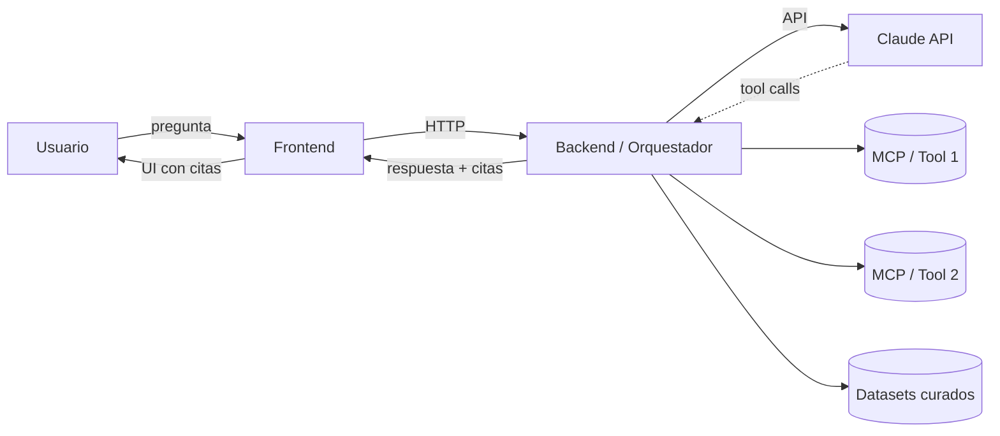

# Arquitectura

<!-- AUTO-BANNER -->
!!! abstract ":material-toy-brick: Plantilla / esqueleto inicial"
    Estructura generada al iniciar la wiki, sin datos del equipo. **Reemplazar el contenido antes de citarlo.** Convención: ver [Convenciones de contenido](../convenciones-de-contenido.md).

> :material-progress-clock: **Por definir** — se llena cuando se elija la idea.

## Diagrama de alto nivel (placeholder)

## Componentes

| Componente | Responsabilidad | Tecnología tentativa |
|---|---|---|
| Frontend | UI conversacional, mostrar citas | Next.js / Streamlit |
| Backend / Orquestador | Manejar sesiones, invocar agente | FastAPI / Hono |
| Agente Claude | Razonar, planear, invocar tools | Anthropic API + Agent SDK |
| MCPs / Tools | Acceso a datos externos | Python / TS |
| Datasets curados | Corpus indexado de leyes y FAQs | Markdown + vector store |

## Flujos clave

> Llenar uno por uno cuando se decida la idea.

### Flujo 1: pregunta + respuesta con citas
1. Usuario envía pregunta.
2. ...

### Flujo 2: ...

## Decisiones que la sustentan

- [ADR 0001 — Uso de ADRs](adrs/0001-uso-de-adrs.md)
- (Más ADRs por venir.)

## No-objetivos (qué la arquitectura **no** persigue)

- Escala más allá del demo.
- Multi-tenancy.
- Compatibilidad con múltiples LLMs.
- Producción al cierre del lab.
