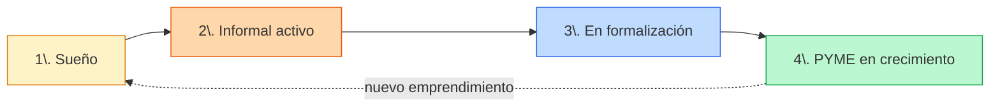
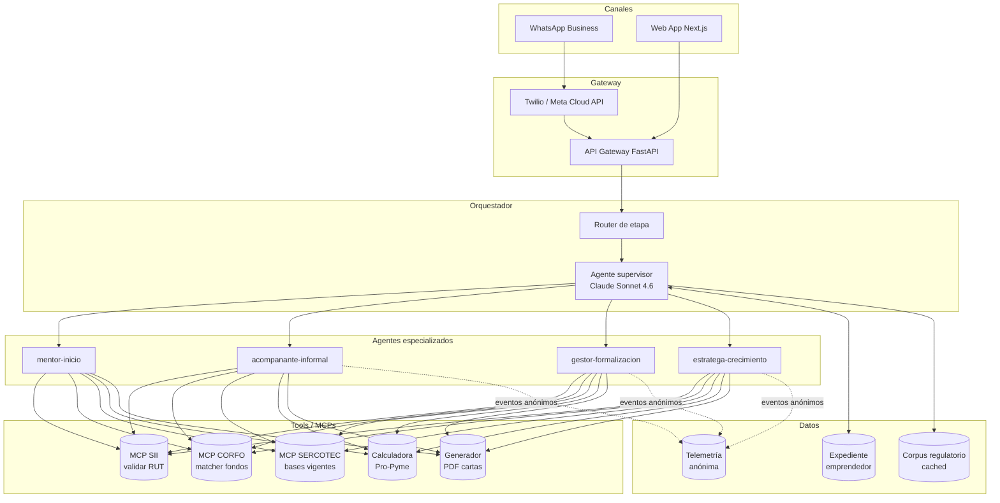

# Tu Plata Mipyme — Plan de implementación

!!! success ":material-check-bold: Producido por el equipo"
    Plan de implementación derivado de la conversación de definición del 2026-04-30. Sustituye al esqueleto genérico de [arquitectura.md](arquitectura.md) y [prototipo.md](prototipo.md) para esta idea concreta.

> **Pitch en una frase.** *Para la microemprendedora informal que no sabe cómo crecer, Tu Plata Mipyme es un co-piloto en WhatsApp + Web que la acompaña etapa por etapa con agentes IA especializados, gratis hasta que vale la pena pagar.*

---

## 1. Visión y principios de diseño

### 1.1 Visión

**"Claude co-work para el teléfono"** — democratizar el acceso a asesoría de gestión, tributaria y de fomento a lo largo de todo Chile, eliminando la dependencia geográfica de un contador, una OTEC o una sucursal de SERCOTEC.

### 1.2 Principios duros (no negociables)

Estos principios nacen de la realidad demográfica chilena y **rigen toda decisión de UX y producto**:

| Principio | Razón | Implicancia |
|---|---|---|
| **WhatsApp-first, Web complementaria** | 96 % de hogares chilenos tiene smartphone; WhatsApp es la app más penetrada (>90 %). | Toda funcionalidad core debe ser usable solo en WhatsApp. La web amplifica (visualización, formularios, descargas). |
| **Lenguaje 6° básico** | Comprensión lectora promedio nacional (PIAAC) está bajo nivel 3. | Mensajes ≤ 160 caracteres, 1 idea por mensaje, sin tecnicismos sin explicar, alternativa de audio. |
| **1 decisión por pantalla** | Tiempo de atención promedio en móvil < 8 segundos. | Botones (no menús). Máximo 3 opciones. "Continuar después" siempre visible. |
| **Funciona en 3G y con datos limitados** | Conectividad heterogénea en regiones y NSE D-E. | Sin imágenes pesadas, sin video autoplay, mensajes texto-primero. |
| **Asincrónico por default** | El emprendedor responde entre tareas, no en sesiones de 30 min. | Memoria persistente entre conversaciones, recordatorios pull/push, retomar conversación días después. |
| **Voz como primera clase** | Bajo alfabetismo digital en cohortes mayores. | Aceptar audio entrante (Whisper), responder con audio si lo solicitan. |
| **Cita la fuente, siempre** | Confianza es el cuello de botella en NSE D-E. | Cada respuesta normativa cita SII / CORFO / SERCOTEC con link verificable. |

### 1.3 Anti-objetivos

- **No** somos contadores. No firmamos declaraciones, no cargamos F29 en nombre del usuario.
- **No** somos banco. No otorgamos crédito ni recomendamos institución específica.
- **No** somos abogados. No representamos en disputas.
- **No** sustituimos a SERCOTEC/CORFO. Los **conectamos**.

---

## 2. Modelo de negocio — Freemium

### 2.1 Lógica del freemium

El emprendedor informal **no puede pagar nada** al inicio (es justamente el problema que resolvemos). Pero cuando ya formalizó y empieza a postular a subsidios reales — ahí el valor unitario justifica un cobro modesto. **El freemium no es marketing: es la única arquitectura comercial sostenible para este segmento.**

### 2.2 Tiers

| Tier | Precio | Para quién | Qué incluye |
|---|---|---|---|
| **Free — Brote** | $0 | Sueño / informal activo | Chat WhatsApp ilimitado, simulador Pro-Pyme básico, recordatorios, calculadora de margen, biblioteca de derechos en lenguaje simple. |
| **Pro — Crece** | ~$4.990 CLP/mes | Microemprendedor que decide formalizar | Todo lo anterior + asistencia a inscripción SII paso-a-paso, generación de boleta electrónica explicada, repositorio contable básico, 2 cartas de presentación a banco al mes. |
| **Plus — Postula** | Pago por evento (~$15.000-30.000 CLP) | PYME que postula a subsidio | Asistencia completa a una postulación CORFO/SERCOTEC: revisión de bases, generación de borrador, checklist de antecedentes, simulación financiera de impacto. |
| **Asesor humano** | Marketplace, comisión | PYME que necesita contador/abogado | Derivación a profesional certificado en su región. Cobramos comisión, no margen al usuario. |

### 2.3 Triggers de conversión (free → pago)

El sistema **detecta y propone el upgrade** en momentos de valor evidente:

1. Usuario completa simulación y descubre que pagaría $0 de impuesto en Pro-Pyme Transparente → *"¿Te ayudo a inscribirte? (Plan Crece)"*
2. Usuario pregunta por un fondo CORFO específico → *"Soy buena en orientarte gratis; cuando quieras postular en serio, el Plan Postula te arma el borrador."*
3. Usuario reporta venta superior a $X por 3 meses seguidos → *"Felicitaciones, ya estás en zona PYME. Hablemos de subsidios."*

### 2.4 Lo que el dato vale (sin venderlo)

Los datos agregados (ubicación, rubro, etapa, dolor declarado) tienen **valor para terceros legítimos** sin necesidad de vender datos personales:

- Reportes anonimizados a **SERCOTEC / CORFO / Subsecretaría de Economía** (insumo para política pública).
- **Investigación académica** (universidades de regiones).
- **Bancos y cooperativas** que quieran diseñar productos para microemprendedores reales.

---

## 3. Journey del emprendimiento — 4 etapas, 4 agentes

### 3.1 Mapa de etapas



### 3.2 Detalle por etapa

#### Etapa 1 — Sueño (free)

**Quién está aquí.** Persona con una idea, sin haber vendido nada. "Quiero hacer empanadas y venderlas en la feria."

**Agente: `mentor-inicio`**

- **Trabajo principal.** Validación rápida del concepto + estimación realista de capital de partida.
- **Outputs:** ficha de idea (1 párrafo), checklist de costos iniciales, calculadora de punto de equilibrio en lenguaje simple.
- **Métrica de éxito:** % de usuarios que pasan a Etapa 2 dentro de 30 días.

#### Etapa 2 — Informal activo (free)

**Quién está aquí.** Ya vende, no ha formalizado, no lleva cuenta sistemática. **El 54 % del universo (1,08 M de microemprendedores).**

**Agente: `acompanante-informal`**

- **Trabajo principal.** Llevar registro de ventas/gastos por WhatsApp, mostrar utilidad real, sembrar conciencia de formalización **sin presionar**.
- **Mecánica clave:** "Cuéntame cuánto vendiste hoy" → captura mínima → reporte semanal de utilidad real → comparación contra simulación Pro-Pyme.
- **Recordatorios:** "Hace 5 días no me cuentas cómo vas. ¿Vendiste algo?" (frecuencia adaptativa).
- **Trigger de upgrade:** cuando la simulación muestra que formalizar conviene → *"¿Te ayudo a dar el paso?"*

#### Etapa 3 — En formalización (Pro)

**Quién está aquí.** Decidió formalizar, está en proceso (Inicio de Actividades, Boleta Electrónica, primer F29).

**Agente: `gestor-formalizacion`**

- **Trabajo principal.** Acompañamiento paso-a-paso al trámite SII, explicación de cada formulario, alertas de plazos.
- **Tools:** `validar-rut-sii`, `simular-pro-pyme`, `generar-checklist-tramite`.
- **Output diferenciador:** "carta de presentación al banco" en PDF descargable.
- **Salida natural:** después de 6 meses formalizada → Etapa 4.

#### Etapa 4 — PYME en crecimiento (Plus + Marketplace)

**Quién está aquí.** Formalizada, factura, busca crédito o subsidio para crecer.

**Agente: `estratega-crecimiento`**

- **Trabajo principal.** Match con productos CORFO/SERCOTEC/FOGAPE/FSGarantía, postulación asistida, derivación a asesor humano cuando aplica.
- **Tools:** `matcher-fondos`, `generador-borrador-postulacion`, `marketplace-asesores`.
- **Repositorio contable:** ver §6.

### 3.3 Conversación entre agentes (multi-agente)

Los 4 agentes **no son silos**. Comparten un *expediente del emprendedor* y se pasan contexto en handoffs explícitos.

**Ejemplo de handoff Etapa 2 → 3:**

```
acompanante-informal → gestor-formalizacion:
{
  "perfil": { "rubro": "alimentos preparados", "comuna": "Quilicura", "edad": 35, "género": "F" },
  "ventas_promedio_mensual": 612000,
  "meses_operando": 8,
  "decisión_explícita": "quiero formalizar para acceder a banco",
  "régimen_recomendado": "Pro-Pyme Transparente",
  "siguiente_acción": "iniciar Inicio de Actividades en SII"
}
```

**Conversación entre agentes** ocurre cuando un caso es ambiguo:

> `gestor-formalizacion` → `estratega-crecimiento`: *"Esta usuaria califica para FOGAPE pero recién va a hacer Inicio de Actividades. ¿Le presento el producto ahora o espero 3 meses?"*
>
> `estratega-crecimiento`: *"Espera 3 meses de boletas; mientras tanto que vaya juntando antecedentes. Yo te aviso cuándo retomar."*

Esta lógica se implementa con **Agent SDK** y subagents (ver §5.3).

---

## 4. Arquitectura técnica

### 4.1 Diagrama de componentes



### 4.2 Componentes y tecnología

| Componente | Tecnología | Justificación |
|---|---|---|
| **WhatsApp gateway** | Meta WhatsApp Business Cloud API (directa) o Twilio | Cloud API directa = más barata; Twilio = más rápido para prototipo. **Decisión MVP: Twilio.** |
| **Web app** | Next.js 14 (App Router) + Tailwind | Mismo stack que ADR 0003. SSR para landing, CSR para chat embebido. |
| **API Gateway** | FastAPI (Python) | Mismo lenguaje que Agent SDK; tipado fuerte; deploy fácil en Cloud Run. |
| **Orquestador / Supervisor** | Claude **Sonnet 4.6** + Agent SDK | Sonnet 4.6 = mejor relación precio/calidad para conversación masiva. Opus solo en tareas críticas (revisión legal). |
| **Agentes especializados** | Claude Sonnet 4.6 con system prompts diferenciados + subagents Agent SDK | Cada uno tiene su system prompt, tools y memoria. |
| **Modelo de fallback** | Claude **Haiku 4.5** | Para clasificación de intención y respuestas FAQ — barato y rápido. |
| **Memoria persistente** | Postgres + `memory` tool de Agent SDK | El expediente del emprendedor vive en DB; el agente lo lee/escribe vía tool. |
| **Corpus regulatorio** | Markdown indexado + **prompt caching** | Caching de Anthropic = -90 % costo en lecturas repetidas. |
| **Audio entrante** | Whisper (OpenAI) o Anthropic con audio (cuando esté disponible) | Audio → transcripción → flujo normal. |
| **TTS para audio saliente** | ElevenLabs (voz cercana, español neutro chileno) | Solo cuando el usuario lo pide explícitamente. |
| **Generación de PDF** | WeasyPrint (Python) | Cartas a banco, checklists, reportes. |
| **Telemetría** | PostHog (autohospedado) o Mixpanel | Eventos anónimos, opt-in explícito. |
| **Hosting** | Google Cloud Run (API) + Vercel (web) | Pay-per-use, escala a 0 entre usos. |

### 4.3 Modelo de datos (núcleo)

```sql
-- Expediente del emprendedor (entidad central)
emprendedor (
  id uuid pk,
  whatsapp_e164 text unique,
  nombre_alias text,
  rut text nullable,           -- solo si formalizó
  comuna text,
  region text,
  rubro text,
  edad_rango text,             -- '18-25','26-35',...
  genero text,
  etapa enum('sueño','informal','formalizando','pyme'),
  fecha_alta timestamp,
  ultimo_contacto timestamp,
  tier enum('free','pro','plus'),
  consentimientos jsonb        -- ARCO, telemetría, marketing
)

-- Conversación: 1 por emprendedor, append-only
mensaje (
  id uuid pk,
  emprendedor_id uuid fk,
  agente text,                 -- cuál agente respondió
  rol enum('user','assistant','tool'),
  contenido text,
  tool_calls jsonb,
  costo_tokens int,
  ts timestamp
)

-- Hechos extraídos (para razonamiento del agente sin releer todo)
hecho (
  id uuid pk,
  emprendedor_id uuid fk,
  tipo text,                   -- 'venta_mes','gasto_recurrente','intencion_formalizar',...
  valor jsonb,
  fuente_mensaje_id uuid fk,
  ts timestamp
)

-- Recordatorios programados
recordatorio (
  id uuid pk,
  emprendedor_id uuid fk,
  trigger_at timestamp,
  plantilla text,
  contexto jsonb,
  enviado bool default false
)
```

### 4.4 Cumplimiento Ley 19.628 + Ley 21.719 (datos personales)

- **Consentimiento granular** al enrolar: WhatsApp, datos sensibles (ingresos), telemetría, marketing — cada uno opt-in separado.
- **Derecho ARCO** expuesto como comando en WhatsApp: `/mis-datos`, `/borrar-mis-datos`.
- **Minimización:** RUT solo se pide cuando el flujo lo requiere (Etapa 3+).
- **Encriptación at rest** (Postgres + KMS) y **in transit** (TLS 1.3).
- **Retención:** datos de telemetría agregados sin PII a los 90 días.

---

## 5. Sistema multi-agente — diseño detallado

### 5.1 Por qué multi-agente y no un solo prompt gigante

Tres razones operativas:

1. **System prompts gigantes degradan calidad** — separar permite prompts focalizados de < 2k tokens cada uno.
2. **Permite caching diferenciado** — el corpus tributario se cachea para `gestor-formalizacion`, no para `mentor-inicio`.
3. **Permite evaluar agente por agente** — testing y observabilidad mucho más manejables.

### 5.2 System prompts (esqueleto)

Cada agente comparte un **preámbulo común** + un **bloque especializado**.

**Preámbulo común (cacheable):**

```
Eres parte de Tu Plata Mipyme, un asistente para microemprendedores chilenos.

REGLAS DE COMUNICACIÓN (no negociables):
- Habla en español chileno cercano, sin tecnicismos sin explicar.
- Mensajes ≤ 160 caracteres, una idea por mensaje.
- Si la persona usa WhatsApp, no uses tablas ni markdown complejo.
- Si no sabes, di "no sé" y ofrece derivar a humano.
- Cita SIEMPRE la fuente normativa con link cuando hagas afirmación legal.

NUNCA:
- Recomiendes un banco específico.
- Garantices aprobación de subsidio.
- Sustituyas asesoría profesional cuando el caso lo requiera.

CONTEXTO DEL EMPRENDEDOR (lee siempre primero):
{expediente_resumen}
```

**Bloque especializado** (ejemplo `gestor-formalizacion`):

```
ROL: Eres el agente de formalización. La persona ya decidió formalizar.

OBJETIVOS:
1. Acompañar Inicio de Actividades en SII paso a paso.
2. Explicar Pro-Pyme Transparente vs Régimen General con números reales del usuario.
3. Generar checklist de antecedentes para banco al cierre.

TOOLS DISPONIBLES:
- validar_rut_sii(rut) → estado y régimen actual
- simular_pro_pyme(ventas_anuales, gastos_anuales) → utilidad neta
- generar_carta_banco(perfil) → URL de PDF

HANDOFF:
- Si la persona pregunta por subsidios CORFO/SERCOTEC, llama a `estratega-crecimiento`.
- Si pide asesor humano, deriva al marketplace.
```

### 5.3 Implementación con Agent SDK

```python
from anthropic import Anthropic
from anthropic.agent_sdk import Agent, Tool, Subagent

supervisor = Agent(
    name="supervisor",
    model="claude-sonnet-4-6",
    system=PREAMBULO + SUPERVISOR_BLOQUE,
    subagents=[
        Subagent("mentor-inicio", system=PREAMBULO + MENTOR_INICIO),
        Subagent("acompanante-informal", system=PREAMBULO + ACOMPANANTE),
        Subagent("gestor-formalizacion", system=PREAMBULO + GESTOR,
                 tools=[validar_rut_sii, simular_pro_pyme, generar_carta_banco]),
        Subagent("estratega-crecimiento", system=PREAMBULO + ESTRATEGA,
                 tools=[matcher_fondos, generador_borrador, marketplace_asesores]),
    ],
    memory_tool=PostgresMemory(table="hecho"),
)
```

El **supervisor** decide a qué subagente despachar según etapa + intención. La conversación entre subagentes se materializa como llamadas a subagent (no como mensajes en el hilo del usuario).

---

## 6. Repositorio contable (visión post-MVP)

> **Fuera del MVP del lab.** Documentado aquí para ordenar el roadmap.

Cuando el emprendedor pasa a Etapa 3-4, el sistema le ofrece un **repositorio Git-like de su contabilidad**:

- Estructura simple: carpeta por mes, archivos por boleta, JSON de cierre mensual.
- **Versionado** = trazabilidad para SII y banco.
- **Sincronización** desde WhatsApp: mandar foto de boleta → OCR → asentamiento → commit.
- **Export** a formatos que pide el banco (cuenta de resultados, balance simplificado).
- **Diferencial:** el emprendedor **es dueño** de sus datos contables, portables a cualquier contador.

Tecnología tentativa: **DVC** o **Git LFS** sobre **Cloud Storage**, con UI propia en la web.

---

## 7. Roadmap por fases

### Fase 0 — Demo del lab (7 días, hasta 2026-05-07)

**Alcance reducido:** *un agente, una etapa, un flujo dorado.*

- [ ] Bot WhatsApp con `acompanante-informal` (Etapa 2) — el de mayor universo (1,08 M).
- [ ] 1 tool funcional: simulador Pro-Pyme.
- [ ] 1 tool de generación: carta a banco PDF.
- [ ] Memoria persistente entre sesiones.
- [ ] Telemetría anónima básica.
- [ ] Web landing con embed del chat para el pitch.
- [ ] **Demo end-to-end de 90 segundos** (script en pitch).

### Fase 1 — Piloto cerrado (mes 1-3 post-lab)

- [ ] Los 4 agentes operativos.
- [ ] MCP SII real (validar RUT + estado).
- [ ] 50-100 emprendedoras reales reclutadas vía Fondo Esperanza / Hogar de Cristo.
- [ ] Marco de consentimiento ARCO + privacidad pulido con asesoría legal.

### Fase 2 — Apertura (mes 4-9)

- [ ] Tier Pro activado (Webpay / Mercado Pago).
- [ ] Marketplace de asesores en 3 regiones piloto (Metropolitana + 2).
- [ ] Reportes anonimizados a SERCOTEC.

### Fase 3 — Crecimiento (mes 10+)

- [ ] Repositorio contable (§6).
- [ ] Tier Plus (postulación asistida) generalizado.
- [ ] Integraciones bancarias vía Open Finance (Ley 21.521).

---

## 8. Métricas e impacto

### 8.1 KPIs producto (mensuales)

| Métrica | Definición | Objetivo Fase 1 |
|---|---|---|
| **MAU** | Emprendedores que mandan ≥ 1 mensaje en el mes | 50 → 500 |
| **Retención semana 4** | % que sigue activo a 4 semanas | > 40 % |
| **Tasa de avance de etapa** | % que pasa de etapa N a N+1 en el mes | 5 % E2→E3, 15 % E3→E4 |
| **Conversión free → Pro** | % que paga al ver el trigger | > 8 % |
| **NPS** | Encuesta WhatsApp | > 40 |

### 8.2 KPIs impacto (trimestrales, para reporte público)

| Métrica | Definición |
|---|---|
| **Formalizaciones inducidas** | Inicios de Actividades SII confirmados con código de referido |
| **Subsidios postulados** | Postulaciones CORFO/SERCOTEC asistidas con la plataforma |
| **Subsidios adjudicados** | De los anteriores, cuáles ganaron |
| **Distribución regional** | % de usuarios fuera de RM (proxy de descentralización) |
| **Brecha de género cerrada** | % de usuarias mujeres vs línea base 59 % informalidad femenina |

### 8.3 KPIs técnicos

| Métrica | Objetivo |
|---|---|
| Latencia p95 respuesta WhatsApp | < 4 s |
| Costo por usuario activo / mes | < $0,30 USD (con caching) |
| Cache hit rate (corpus regulatorio) | > 80 % |
| Uptime gateway WhatsApp | > 99,5 % |

---

## 9. Riesgos y mitigaciones

| Riesgo | Probabilidad | Impacto | Mitigación |
|---|---|---|---|
| **Cambio de bases CORFO/SERCOTEC sin aviso** | Alta | Alto | Pipeline de re-indexación semanal + revisión humana de diff. |
| **Alucinación en consejo tributario** | Media | Crítico | Toda respuesta normativa pasa por verificador con tool de cita; respuesta sin cita = bloqueada. |
| **Costo Anthropic explota con escala** | Media | Alto | Caching agresivo (>80 % hit), Haiku para clasificación, batch para reportes asíncronos. |
| **WhatsApp Business API limita templates** | Media | Medio | Mensajes iniciados por usuario no requieren template; usar templates solo en recordatorios push. |
| **No conseguir entrevistas con microemprendedoras reales en 7 días** | Alta | Medio | Tener Plan B con datos sintéticos + 1 entrevista que sea tipo "estrella" para el pitch. |
| **Acusación de "competir con SERCOTEC"** | Baja | Alto | Posicionar desde día 1 como **complementario**, buscar carta de apoyo de SERCOTEC en Fase 1. |

---

## 10. Decisiones que faltan (antes de cerrar Fase 0)

- [ ] **Equipo:** quién es AI Builder, quién Vibecoder, quién pitch lead. → ver [Roles](../equipo/roles.md).
- [ ] **Cuenta de WhatsApp Business para la demo:** ¿usamos número personal o sandbox de Twilio?
- [ ] **Diseño visual de la web** — landing minimalista, ¿quién la arma?
- [ ] **Presupuesto Anthropic para la demo** — estimar tokens y validar con el equipo.
- [ ] **3 emprendedoras reales para grabar testimonio del pitch** — gestión paralela.

---

## 11. Referencias

- Ficha de idea original: [ideas/tu-plata-mipyme.md](../ideas/tu-plata-mipyme.md).
- Definición canónica del producto: [definiciones/tu-plata-mipyme.md](../definiciones/tu-plata-mipyme.md).
- Glosario de términos: [definiciones/glosario.md](../definiciones/glosario.md).
- Línea temática: [Inclusión financiera](../lineas-tematicas/inclusion-financiera.md).
- Estrategia de pitch: [equipo/estrategia-pitch-lab.md](../equipo/estrategia-pitch-lab.md).
- ADR 0003 — Plataforma mobile-first: [adrs/0003-plataforma-web-mobile-first.md](adrs/0003-plataforma-web-mobile-first.md).
