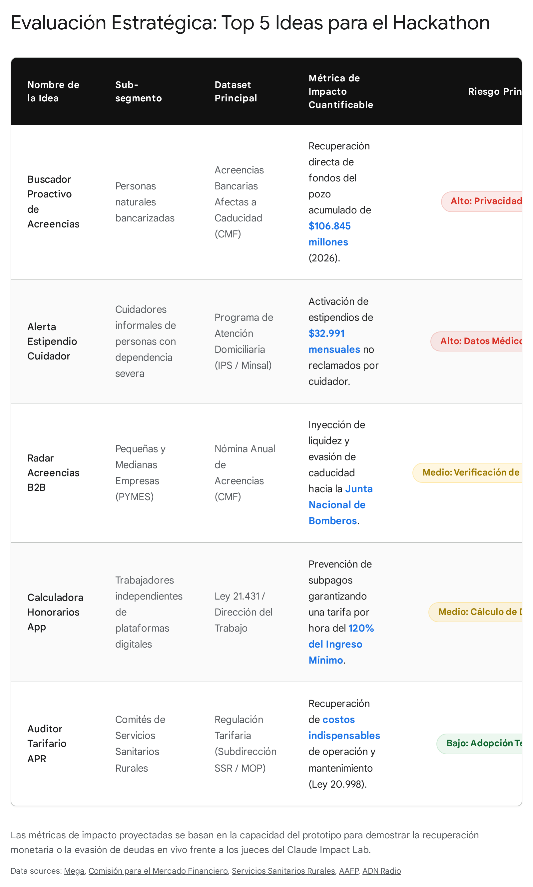

# Run Deep Research: Ideas fuera del radar para literacy regulatoria con IA en Chile

<!-- AUTO-BANNER -->
!!! info ":material-book-open-variant: Síntesis de fuentes externas"
    Output crudo del agente **Google Deep Research Max** (`deep-research-max-preview-04-2026`). Ejecutado el 2026-04-29 a partir del prompt `tools/deep-research/prompts/01-ideas-fuera-del-radar.md`. **Verificar citaciones antes de citar en el pitch.**

> **Objetivo del prompt:** Expandir el espacio de ideas más allá de las 9 candidatas actuales del equipo, buscando ángulos no obvios cruzando datasets sub-utilizados, eventos de vida poco atendidos, canales alternativos y sub-segmentos invisibles. Inspirarse en casos exitosos en otros países que no se han replicado en Chile.
>
> **Duración:** 0 s (0.0 min) ·
> **Interaction ID:** `v1_ChdOMmJ5YVpQOUdLZlF6N0lQX2Iyb3dRURIXTjJieWFaUDlHS2ZRejdJUF9iMm93UVE` ·
> **Tipo:** `ejecucion-aprobada`

## Reporte

# Ideas Fuera del Radar: Innovación en Literacy Regulatoria para Chile

## Executive Summary
Este reporte consolida un catálogo exhaustivo de 15 productos nativos en Inteligencia Artificial (IA) diseñados para el *Claude Impact Lab Chile 2026*, enfocados en mitigar la exclusión financiera y democratizar el acceso a derechos ciudadanos en Chile. A diferencia de soluciones genéricas basadas en el resumen de normativas, esta investigación adopta un enfoque quirúrgico: identifica asimetrías de información en "eventos de vida" críticos (como viudez, quiebra, y enfermedades graves), cruza bases de datos estatales subutilizadas (CMF, Superir, Ingresa) y prioriza canales de distribución alternativos (audio-first, WhatsApp) para poblaciones con baja alfabetización digital. Las ideas están estructuradas para maximizar el impacto en un *hackathon* de siete días, ofreciendo a los equipos rutas claras para sortear barreras técnicas como la inaccesibilidad de la ClaveÚnica y garantizando una diferenciación radical frente a los competidores.

**Aviso Legal y Médico:** *Este documento propone conceptos tecnológicos y prototipos para un evento de innovación (hackathon). Ninguno de los flujos de trabajo, asistentes o cálculos descritos constituye asesoría legal, tributaria, médica o financiera vinculante. Cualquier producto desplegado en la realidad debe incluir descargos de responsabilidad prominentes indicando que las sugerencias de la IA no reemplazan el criterio de un médico habilitado ni la representación de un abogado o contador.*

## Índice
1. [Executive Summary](#executive-summary)
2. [Categoría 1: Reclamación de Beneficios y Fondos Olvidados (Welfare Reclaim)](#categoría-1-reclamación-de-beneficios-y-fondos-olvidados-welfare-reclaim)
    * 1. CuidaDerechos: El Reclamador Silencioso para Cuidadoras
    * 2. Rescate Ciudadano / Bombero Pyme: El Reloj de Arena de las Acreencias
    * 3. GES-Claim: El Activador de Seguros de Salud Ocultos
3. [Categoría 2: Nuevas Relaciones Laborales y Plataformas](#categoría-2-nuevas-relaciones-laborales-y-plataformas)
    * 4. RutaJusta / Algoritmo Transparente: Auditor de la Ley Uber
    * 5. Talento Tributa: El Traductor para el Deporte Amateur y Artes
    * 6. Feria Legal: Regularización en la Vía Pública
4. [Categoría 3: Transiciones de Vida Críticas y Vulnerabilidad Absoluta](#categoría-3-transiciones-de-vida-críticas-y-vulnerabilidad-absoluta)
    * 7. Legado Claro / Herencia Bot: El Mapeo Post-Mortem
    * 8. EmancipIA / Despegue: El Simulador Post-SENAME
    * 9. Re-Inicia: Copiloto de Reinserción y Quiebra
    * 10. Viuda Protegida: El Puente hacia las Pensiones de Sobrevivencia
5. [Categoría 4: Herramientas Cívicas Comunitarias y Ruralidad](#categoría-4-herramientas-cívicas-comunitarias-y-ruralidad)
    * 11. Agua Comunitaria / APR-Bot: Tarificador para Comités
    * 12. Cosecha Justa / Sindicalismo IA: Derechos de Temporeros
6. [Categoría 5: Accesibilidad, Género y Justicia Económica](#categoría-5-accesibilidad-género-y-justicia-económica)
    * 13. Retención Alimentos: Ejecutor de Ley de Deudores
    * 14. Voz Financiera / InclusiBot: El Destructor de Letra Chica
    * 15. Respiro CAE: Línea de Tiempo de Deserción y Deuda
7. [Top 5 Ideas Más Prometedoras](#top-5-ideas-más-prometedoras-impacto--diferenciación--viabilidad)

---

La exclusión financiera y la falta de entendimiento regulatorio en Chile representan un desafío sistémico donde la asimetría de información perpetúa la desigualdad. Solucionar la brecha que afecta a más de 5 millones de chilenos requiere ir más allá de los chatbots tradicionales y adentrarse en los intersticios de la regulación pública. 
*   La evidencia sugiere que las intervenciones más efectivas ocurren en los "eventos de vida" críticos, donde la carga cognitiva del ciudadano es alta y la burocracia es menos intuitiva.
*   Es altamente probable que el uso de canales alternativos, como interfaces basadas exclusivamente en voz o integración con espacios físicos comunitarios, determine el éxito de la adopción tecnológica en poblaciones vulnerables.
*   El cruce entre conjuntos de datos subutilizados y modelos de lenguaje de gran tamaño (LLMs) permite, por primera vez, pasar de la entrega de información pasiva a la ejecución activa de derechos.

La presente investigación desarrolla un catálogo exhaustivo de 15 productos nativos en Inteligencia Artificial (IA) para el Claude Impact Lab Chile 2026. Al alejarse de soluciones obvias como el simple resumen de normativas, este reporte explora nichos de alto dolor, alto monto reclamable y baja digitalización. Estas propuestas buscan equilibrar la viabilidad técnica de un *hackathon* de siete días con un potencial de impacto social transformador, considerando siempre las limitaciones actuales del estado de los datos públicos en Chile.

## Categoría 1: Reclamación de Beneficios y Fondos Olvidados (Welfare Reclaim)

La desconexión entre el Estado, las instituciones financieras y la ciudadanía resulta en miles de millones de pesos no reclamados anualmente. Esta sección explora cómo la IA puede actuar como un buscador activo de fondos para poblaciones que ignoran ser beneficiarias.

### 1. CuidaDerechos: El Reclamador Silencioso para Cuidadoras

El trabajo de cuidados no remunerado en Chile recae desproporcionadamente sobre mujeres, quienes enfrentan un empobrecimiento sistemático debido a la imposibilidad de insertarse en el mercado laboral formal.

Para mitigar este impacto, el Estado chileno ofrece un estipendio mensual máximo de $32.991 (reajustable por IPC) para cuidadores de personas con dependencia severa [cite: 1, 2]. Sin embargo, la postulación no es directa; depende del equipo médico del Centro de Salud Familiar (CESFAM) o Centro Comunitario de Salud Familiar (CECOF) [cite: 1, 3]. El desconocimiento de este derecho, sumado al aislamiento del cuidador, crea una brecha gigante. **CuidaDerechos** resuelve este dolor estructural.
*   **1. Nombre tentativo:** CuidaDerechos.
*   **2. Problema concreto:** Cuidadoras ignoran que tienen derecho a un pago estatal. El proceso de reclamación es oscuro y depende del criterio clínico en la atención primaria, no de un formulario web simple.
*   **3. Sub-segmento prioritario:** Cuidadoras informales de adultos mayores o personas con discapacidad severa que pertenecen a los quintiles más bajos.
*   **4. Datasets chilenos requeridos:** Formularios de inscripción del Programa de Atención Domiciliaria a Personas con Dependencia Severa del Ministerio de Salud (MinSal, `https://www.minsal.cl`) e información de compatibilidad de beneficios del Instituto de Previsión Social (IPS). *Nota oficial: No existe una API pública en tiempo real de beneficiarios del IPS, por lo que el sistema operaría sobre la normativa pública (PDFs/Circulares extraídas y cacheadas en el prompt).*
*   **5. Demo imaginado (60s):** Una usuaria envía un audio por WhatsApp quejándose de lo difícil que es cuidar a su madre postrada y no tener ingresos. Claude procesa el audio, detecta la elegibilidad latente y responde con un mensaje de voz empático. Luego, genera un PDF estructurado, listo para imprimir, con el lenguaje médico-administrativo exacto que la cuidadora debe entregar en la ventanilla de su CESFAM local para solicitar la evaluación del equipo médico.
*   **6. Capacidades de Claude:** *Audio/Voice-first* para ingesta sin fricción; *Structured Outputs* para la generación precisa del formulario; *Prompt caching* para mantener el contexto del perfil de la madre.
*   **7. Gap local:** Nadie está traduciendo los lamentos informales de cuidadores en flujos de trabajo administrativos listos para presentar en un consultorio.
*   **8. Caso análogo:** *Benefits.gov* (EE.UU.) cruzado con *Propel Inc*, pero llevado a una interfaz conversacional proactiva.
*   **9. Riesgo principal:** Riesgo de alcance, ya que la decisión final de otorgar el estipendio recae en el criterio clínico del médico del CESFAM, no en la IA.
*   **10. Diferenciador en el Lab:** Aborda un segmento 100% invisible para el ecosistema Fintech tradicional (mujeres fuera de la fuerza laboral).

### 2. Rescate Ciudadano / Bombero Pyme: El Reloj de Arena de las Acreencias

La burocracia bancaria y los cierres de cuentas, especialmente tras quiebras o fallecimientos, dejan una estela de dinero abandonado. Si no se actúa rápido, este capital desaparece del patrimonio familiar o empresarial.

En Chile, las "Acreencias Bancarias" corresponden a fondos que no han tenido movimientos por dos años. Solo en 2026, la Comisión para el Mercado Financiero (CMF) reportó 94.654 acreencias que totalizan $106.845 millones de pesos chilenos [cite: 4, 5]. Si este dinero no se cobra en un plazo de tres años desde su publicación, es transferido irrevocablemente a la Junta Nacional de Cuerpos de Bomberos de Chile [cite: 4]. **Rescate Ciudadano** automatiza esta cacería de fondos.
*   **1. Nombre tentativo:** Rescate Ciudadano / Bombero Pyme.
*   **2. Problema concreto:** Miles de millones caducan porque las personas no revisan proactivamente los boletines del Estado.
*   **3. Sub-segmento prioritario:** Micro y pequeñas empresas (Mipymes) que han cambiado de banco o cesado operaciones, y adultos mayores herederos de cuentas inactivas.
*   **4. Datasets chilenos requeridos:** La base de datos pública anual de Acreencias Bancarias de la CMF (`https://acreencias.cmfchile.cl`) [cite: 6, 7]. *Nota: El buscador de la CMF a veces requiere validación manual CAPTCHA, por lo que para el hackathon se debe descargar el archivo CSV/volcado completo anual que la CMF publica vía Transparencia.*
*   **5. Demo imaginado (60s):** El dueño de un pequeño almacén sube una foto de su cédula de identidad o RUT de empresa. Claude (*Vision*) extrae mediante Optical Character Recognition (OCR) el nombre/RUT, consulta vía *Tool Use* la base de datos descargada de la CMF y descubre un vale vista de $450.000 de hace dos años. Inmediatamente, la IA genera un archivo `.ics` para Google Calendar con la fecha límite de caducidad y las instrucciones precisas para ir al banco específico a cobrarlo antes de que pase a Bomberos.
*   **6. Capacidades de Claude:** *Vision* (OCR de carnet/RUT), *Tool Use* (query a la base de datos local), *Structured Outputs* (generación de integraciones de calendario).
*   **7. Gap local:** Actualmente, revisar las acreencias requiere una acción proactiva en la web de la CMF. No existe un servicio "push" que cruce RUTs y genere alertas urgentes con plazos de expiración.
*   **8. Caso análogo:** *Stamford CARE* (Reino Unido) y plataformas de *welfare reclaim* que automatizan la búsqueda de fondos no reclamados.
*   **9. Riesgo principal:** Técnico, debido a la necesidad de mantener el dataset sincronizado anualmente si el sistema de la CMF bloquea consultas masivas (scraping).
*   **10. Diferenciador en el Lab:** Tiene una métrica de impacto ridículamente cuantificable: "Logramos que X usuarios descubrieran Y millones de pesos en vivo durante la demo".

### 3. GES-Claim: El Activador de Seguros de Salud Ocultos

Las enfermedades graves destruyen el patrimonio familiar. Paradójicamente, Chile cuenta con coberturas universales de salud, pero la asimetría de información y el estrés del diagnóstico hacen que muchos pacientes paguen de su bolsillo lo que el Estado ya cubre.

El sistema de Garantías Explícitas en Salud (GES) obliga al Fondo Nacional de Salud (FONASA) y a las Isapres a cubrir 90 patologías, asegurando tiempos máximos de espera y limitando el copago al 20% (Isapres) o 0% (FONASA) [cite: 8, 9]. Aunque la Superintendencia de Salud exige la notificación formal al paciente, muchos no comprenden cómo activarlo y terminan arruinándose financieramente. **GES-Claim** traduce la desesperación médica en activación financiera.
*   **1. Nombre tentativo:** GES-Claim.
*   **2. Problema concreto:** El usuario paga privadamente por tratamientos que el Estado garantiza, por incapacidad de leer su diagnóstico y cruzarlo con el decreto legal.
*   **3. Sub-segmento prioritario:** Familias de pacientes recién diagnosticados con enfermedades catastróficas (ej. cáncer, insuficiencia renal) atendidos en el sistema privado (Isapres) o público institucional.
*   **4. Datasets chilenos requeridos:** Decretos GES vigentes del Ministerio de Salud, formularios de notificación y compendios de la Superintendencia de Salud (`https://www.supersalud.gob.cl`) [cite: 10].
*   **5. Demo imaginado (60s):** Un usuario toma una foto a una epicrisis médica incomprensible y una boleta de clínica de alto costo. Claude usa *Vision* para identificar la terminología médica, cruza el diagnóstico con el Decreto GES vigente y alerta: "Este diagnóstico de cáncer de próstata tiene cobertura GES garantizada". Automáticamente, genera el borrador del "Formulario de Constancia de Información al Paciente GES" prellenado para que el usuario exija la activación retroactiva en su Isapre.
*   **6. Capacidades de Claude:** *Vision* (lectura de jerga médica y facturas), *Citations* (referenciando el decreto exacto de la Superintendencia de Salud).
*   **7. Gap local:** Los pacientes creen que el médico activa el GES automáticamente, lo cual es falso en muchos prestadores privados. Falta un puente entre el diagnóstico clínico y el derecho financiero.
*   **8. Caso análogo:** *SafeMortgage* o *MakeMyMoney* en UK, pero aplicado a la intersección de derechos de salud y finanzas personales.
*   **9. Riesgo principal:** Riesgo de responsabilidad civil/médica (alucinar una cobertura GES que resulta no ser aplicable por un detalle técnico del diagnóstico).
*   **10. Diferenciador en el Lab:** Sale de la regulación netamente financiera (CMF/Bancos) y entra a la salud financiera, un dolor universal y emocionalmente resonante.

## Categoría 2: Nuevas Relaciones Laborales y Plataformas

La flexibilización laboral ha creado una nueva clase de trabajadores que operan fuera de las redes tradicionales de seguridad social. Estos productos buscan equilibrar la balanza entre algoritmos de plataformas y derechos laborales.

### 4. RutaJusta / Algoritmo Transparente: Auditor de la Ley Uber

La economía "gig" promete libertad, pero a menudo entrega precarización. Los conductores de aplicaciones operan en una caja negra donde el empleador es un algoritmo, dificultando la reclamación de derechos laborales básicos.

En 2022, Chile promulgó la Ley 21.431 que regula a los trabajadores de plataformas digitales [cite: 11, 12]. Entre sus disposiciones, exige que el valor por hora pagado a los trabajadores independientes no sea inferior a 1,2 veces el Ingreso Mínimo Mensual (IMM) y obliga a las empresas a garantizar un tiempo de desconexión mínimo de 12 horas continuas [cite: 13, 14]. **RutaJusta** audita estas exigencias legales frente a la realidad empírica del trabajador.
*   **1. Nombre tentativo:** RutaJusta / Algoritmo Transparente.
*   **2. Problema concreto:** El conductor no sabe si la tarifa dinámica viola el piso legal del salario mínimo por hora establecido.
*   **3. Sub-segmento prioritario:** Trabajadores independientes de plataformas de reparto y transporte (Uber, Rappi, PedidosYa).
*   **4. Datasets chilenos requeridos:** Textos de la Ley 21.431 (`https://www.bcn.cl/leychile/navegar?idNorma=1173502`), dictámenes de la Dirección del Trabajo (DT) y circulares de la Superintendencia de Seguridad Social (SUSESO) [cite: 15].
*   **5. Demo imaginado (60s):** Un repartidor de Rappi toma capturas de pantalla de su historial de viajes de la semana (tiempos de conexión vs. ganancias). Sube las imágenes al bot de WhatsApp. Claude (*Vision*) extrae las horas logueado y los pagos, calcula si se cumplió el umbral del 120% del IMM legal [cite: 14] y verifica si la app respetó las 12 horas de desconexión. Si detecta infracción, genera un reporte estructurado para presentar ante la Dirección del Trabajo (DT).
*   **6. Capacidades de Claude:** *Vision* (procesar UIs complejas de apps), *Tool Use* (calculadora de horas vs IMM dinámico), *Prompt Caching* (larga jurisprudencia de la DT).
*   **7. Gap local:** La ley existe en papel, pero el Estado no tiene capacidad de auditar los algoritmos de las apps en tiempo real. La fiscalización depende de las denuncias de trabajadores que no saben calcular el prorrateo.
*   **8. Caso análogo:** *Worker Info Exchange* (Reino Unido), donde los conductores exigen sus datos algorítmicos.
*   **9. Riesgo principal:** Variabilidad en los formatos de las pantallas de las aplicaciones, lo que dificulta un OCR consistente vía *Vision*.
*   **10. Diferenciador en el Lab:** Pone a la IA de parte del trabajador para auditar a otra IA (el algoritmo de precios de Uber/Rappi), una narrativa fascinante para un panel de jueces técnicos.

### 5. Talento Tributa: El Traductor para el Deporte Amateur y Artes

El talento en Chile a menudo choca contra un muro de burocracia tributaria. Deportistas amateur, músicos emergentes y jugadores de e-sports generan ingresos esporádicos, pero quedan excluidos del sistema bancario por no saber formalizarse.

Estos individuos a menudo reciben premios en efectivo, patrocinios informales o *crowdfunding*. Cuando intentan bancarizarse para pedir un crédito hipotecario, el sistema los rechaza. **Talento Tributa** actúa como un gerente de negocios de bolsillo.
*   **1. Nombre tentativo:** Talento Tributa.
*   **2. Problema concreto:** Creativos y atletas generan dinero, pero como es irregular, la banca y el fisco los castigan y no logran armar un historial de ingresos formales.
*   **3. Sub-segmento prioritario:** Atletas de alto rendimiento sin contrato laboral, creadores de contenido emergentes y artistas de oficios esporádicos.
*   **4. Datasets chilenos requeridos:** Regímenes simplificados del Servicio de Impuestos Internos (SII, `https://www.sii.cl`), normativas del Ministerio del Deporte (becas Proddar) y exenciones fiscales del Ministerio de las Culturas.
*   **5. Demo imaginado (60s):** Una judoca amateur que recibe donaciones esporádicas y un pequeño auspicio de una marca local chatea con la IA: "Gané $1.000.000 en un torneo en Brasil, ¿cómo lo meto a mi cuenta sin que el SII me multe?". El asistente le diseña una hoja de ruta visual para emitir boletas de prestación de servicios por ingresos esporádicos y proyecta cuánto debe guardar para la retención anual.
*   **6. Capacidades de Claude:** *Structured Outputs* (para armar un dashboard financiero simple), *Citations* (a circulares específicas del SII sobre ingresos internacionales).
*   **7. Gap local:** Los contadores tradicionales desestiman a este nicho por bajo volumen. El SII tiene la información, pero su lenguaje es inescrutable para un deportista.
*   **8. Caso análogo:** *Catch.co* en EE.UU. (para beneficios de freelancers), adaptado a *literacy* tributaria pura.
*   **9. Riesgo principal:** Proveer asesoría tributaria que pueda considerarse legalmente vinculante y errónea.
*   **10. Diferenciador en el Lab:** Expande la definición de "trabajador informal", atrayendo atención por enfocarse en el *creator economy* y e-sports.

### 6. Feria Legal: Regularización en la Vía Pública

El comercio ambulante es una crisis nacional. Muchos vendedores desean formalizarse para evitar el decomiso de carabineros, pero el proceso cruza permisos municipales, sanitarios y tributarios.

**Feria Legal** ataca la desinformación en la base de la pirámide económica, simplificando la Ley de Comercio en la Vía Pública y las ordenanzas municipales.
*   **1. Nombre tentativo:** Feria Legal.
*   **2. Problema concreto:** Formalizar un puesto de venta ambulante es un trámite que requiere conocimientos que los vendedores callejeros no poseen.
*   **3. Sub-segmento prioritario:** Vendedores ambulantes ("toldos azules") y feriantes no regularizados.
*   **4. Datasets chilenos requeridos:** Ordenanzas municipales modelo (Asociación Chilena de Municipalidades), guías de formalización de SERCOTEC (`https://www.sercotec.cl`) y Ley de Rentas Municipales. *Limitación: Los datos municipales están fragmentados, por lo que el piloto requeriría centrarse en 2 o 3 comunas grandes de Santiago.*
*   **5. Demo imaginado (60s):** Un vendedor de sopaipillas interactúa por WhatsApp de voz: "Quiero sacar el permiso, pero me piden iniciación de actividades y no sé qué es eso". La IA le responde por audio explicándole el régimen de Microempresa Familiar (MEF), le genera la lista de requisitos y ubica la oficina de patentes de su municipalidad.
*   **6. Capacidades de Claude:** Interfaz *Voice-first* (crucial por barreras de alfabetización tradicional), *MCP (Model Context Protocol)* conectado a bases de datos municipales locales.
*   **7. Gap local:** El Estado ataca el comercio ambulante con policías, no con inclusión financiera proactiva en el lenguaje de la calle.
*   **8. Caso análogo:** Plataforma *mygov.in* de India, específicamente sus módulos de formalización para vendedores callejeros.
*   **9. Riesgo principal:** La alta fragmentación de las ordenanzas municipales (lo que aplica en Providencia no aplica en Maipú).
*   **10. Diferenciador en el Lab:** Saca el *hackathon* de la burbuja corporativa de "Sanhattan" y aborda un problema sociopolítico visible en cada esquina del país.

## Categoría 3: Transiciones de Vida Críticas y Vulnerabilidad Absoluta

Los derechos financieros no ejercidos son particularmente devastadores cuando el ciudadano atraviesa el luto, la prisión o el abandono estatal.

### 7. Legado Claro / Herencia Bot: El Mapeo Post-Mortem

El fallecimiento de un familiar desata una tormenta de trámites. Muchos seguros de vida, fondos de AFP y dineros bancarios quedan abandonados porque los deudos ignoran su existencia.

La CMF administra el portal "Conoce tu Seguro", diseñado para informar a familiares sobre los seguros contratados por un fallecido [cite: 16]. Sin embargo, acceder requiere conocer la plataforma e ingresar con ClaveÚnica [cite: 17]. **Legado Claro** consolida todo el patrimonio en la sombra.
*   **1. Nombre tentativo:** Legado Claro / Herencia Bot.
*   **2. Problema concreto:** El dolor agudo del luto se mezcla con plazos vencidos y burocracia ciega para reclamar herencias y seguros.
*   **3. Sub-segmento prioritario:** Familiares de personas recientemente fallecidas (viudas, hijos).
*   **4. Datasets chilenos requeridos:** Registro Civil (`https://www.registrocivil.cl` - Certificado de defunción), API de "Conoce tu seguro" de la CMF (`https://www.cmfchile.cl`) [cite: 17], Superintendencia de Pensiones (`https://www.spensiones.cl`).
*   **5. Demo imaginado (60s):** Una hija sube el certificado de defunción de su padre. La IA genera un cronograma (*timeline*) visual automatizado. Le indica: "Día 1: Solicitar Posesión Efectiva (este es el borrador). Día 15: Con la Posesión, ir al sistema 'Conoce tu Seguro' de la CMF para cobrar seguros de desgravamen. Día 30: Rescatar la cuota mortuoria en AFP Habitat". *Solución técnica Hackathon: Dado que la API de ClaveÚnica no es pública, el equipo construirá un mock o extensión de Chrome que simule la recuperación de estos datos o entregue una guía hiper-dirigida paso a paso para que el usuario actúe manualmente.*
*   **6. Capacidades de Claude:** *Vision* (extracción de datos del certificado de defunción), *Structured Outputs* (para la generación del diagrama de Gantt de trámites).
*   **7. Gap local:** El Estado chileno te notifica que alguien murió, pero no consolida proactivamente sus activos financieros distribuidos en el sistema mixto (público/privado).
*   **8. Caso análogo:** *LifeSG* (Singapur), que concentra los servicios gubernamentales por hitos de vida, con módulos específicos para herencias.
*   **9. Riesgo principal:** La privacidad y el manejo de datos de personas fallecidas; la fricción del inicio de sesión (ClaveÚnica).
*   **10. Diferenciador en el Lab:** Transforma un dolor emocional inmenso en un proceso mecánico y libre de ansiedad, demostrando empatía algorítmica.

### 8. EmancipIA / Despegue: El Simulador Post-SENAME

Al cumplir 18 años, los jóvenes bajo la tutela del Estado (SENAME/Mejor Niñez) son expulsados al mundo adulto sin redes de apoyo ni alfabetización financiera básica, convirtiéndose en presa fácil del sobreendeudamiento comercial.

**EmancipIA** es un entorno de simulación radical para aprender finanzas a golpes (virtuales) antes de recibir la primera tarjeta de retail.
*   **1. Nombre tentativo:** EmancipIA / Despegue.
*   **2. Problema concreto:** El analfabetismo financiero en jóvenes vulnerables sin red de apoyo se traduce automáticamente en quiebra y exclusión.
*   **3. Sub-segmento prioritario:** Jóvenes de 17-19 años egresando de residencias de protección estatal.
*   **4. Datasets chilenos requeridos:** Educación financiera de la CMF (CMF Educa, `https://www.cmfeduca.cl`), subsidios de arriendo MINVU, normativas del Sernac Financiero sobre cláusulas abusivas.
*   **5. Demo imaginado (60s):** El joven interactúa con un juego de rol conversacional. Claude asume el rol de un vendedor agresivo de retail ofreciéndole una tarjeta con un CAE (Carga Anual Equivalente) altísimo, cercano a la Tasa Máxima Convencional legal que roza el 40,59% - 40,90% anual para créditos menores a 50 UF [cite: 18, 19]. El usuario debe negociar o rechazar. Si cae en la trampa virtual, el sistema genera un "Estado de Cuenta" mostrándole cómo su sueldo mínimo acaba de desaparecer.
*   **6. Capacidades de Claude:** *Roleplay prompting* avanzado (Claude como adversario y luego como mentor), *Structured Outputs* (para crear facturas falsas hiper-realistas).
*   **7. Gap local:** La alfabetización financiera tradicional asume que el joven tiene un colchón familiar si se equivoca. Aquí, un error significa indigencia.
*   **8. Caso análogo:** Simuladores de riesgo financiero nórdicos, aplicados a jóvenes en riesgo.
*   **9. Riesgo principal:** Tono patronizante. Debe ser validado con trabajo social para no revictimizar.
*   **10. Diferenciador en el Lab:** Gamificación conversacional. No es un chatbot que responde preguntas, es un simulador que "ataca" al usuario para construir resiliencia.

### 9. Re-Inicia: Copiloto de Reinserción y Quiebra

Las personas privadas de libertad salen del sistema penitenciario enfrentando deudas acumuladas durante su encierro, lo que bloquea su acceso al mercado laboral formal.

Para micro-emprendedores que perdieron todo, la Ley 21.563 de Régimen Concursal ofrece vías de renegociación o liquidación, pero sus requisitos legales son de altísima complejidad técnica.
*   **1. Nombre tentativo:** Re-Inicia.
*   **2. Problema concreto:** La "muerte civil" por deudas es insuperable para ex-presidiarios o micro-emprendedores destruidos por Dicom.
*   **3. Sub-segmento prioritario:** Ex-convictos reinsertándose en la sociedad y ex-microemprendedores informales en cesación de pagos profunda.
*   **4. Datasets chilenos requeridos:** Formularios y guías de la Superintendencia de Insolvencia y Reemprendimiento (Superir, `https://www.superir.gob.cl`), información del boletín comercial.
*   **5. Demo imaginado (60s):** El usuario narra su situación (meses preso, deudas de multitienda infladas por intereses moratorios). La IA le mapea una ruta hacia la "quiebra" personal (Ley de Insolvencia), elaborándole el listado de bienes inembargables y preparándole un borrador de declaración jurada, explicándole que es un mecanismo legal para "borrar la pizarra".
*   **6. Capacidades de Claude:** *Citations* rigurosas de la Ley 21.563, *Document Generation* (PDF de declaraciones).
*   **7. Gap local:** Los abogados de quiebras cobran tarifas altas, con un precio promedio por hora que varía entre los $20.000 y $100.000 pesos chilenos, o cobran precios fijos/porcentajes de los activos que resultan prohibitivos para personas ya endeudadas [cite: 20]. Las fundaciones de reinserción no abarcan esto.
*   **8. Caso análogo:** *Upsolve* en EE.UU. (plataforma gratuita para declarar bancarrota).
*   **9. Riesgo principal:** El consejo legal inexacto en materia de insolvencia puede tener consecuencias penales (ocultamiento de bienes).
*   **10. Diferenciador en el Lab:** Es la aplicación más cruda de "Derechos financieros que no pueden ejercer". Aborda el estigma de la quiebra.

### 10. Viuda Protegida: El Puente hacia las Pensiones de Sobrevivencia

El sistema previsional chileno (AFP) es foco de críticas, pero sus beneficios de sobrevivencia son genuinamente inexplorados por mujeres que enviudan jóvenes (antes de los 65 años) y que no califican aún para la Pensión Garantizada Universal (PGU).

**Viuda Protegida** simplifica el laberinto de la Superintendencia de Pensiones.
*   **1. Nombre tentativo:** Viuda Protegida.
*   **2. Problema concreto:** Las viudas jóvenes se pierden en el choque entre las mutuales de accidentes laborales y el sistema de AFP de sobrevivencia.
*   **3. Sub-segmento prioritario:** Mujeres viudas menores de 65 años sin historial extenso de cotizaciones propias.
*   **4. Datasets chilenos requeridos:** Compendio de Normas del Sistema de Pensiones, normativas de la Superintendencia de Pensiones (`https://www.spensiones.cl`).
*   **5. Demo imaginado (60s):** Una usuaria escribe que su marido (cotizante de AFP) acaba de fallecer en un accidente laboral. La IA diferencia inmediatamente si corresponde pensión por ley de accidentes laborales (SUSESO) o pensión de sobrevivencia de AFP, calculando un aproximado del porcentaje del sueldo base que le corresponde a ella y a sus hijos menores de edad.
*   **6. Capacidades de Claude:** Razonamiento complejo de reglas de negocio (árbol de decisiones legales cruzado con el estado civil).
*   **7. Gap local:** La AFP no persigue a la viuda para pagarle. Ella debe ir a exigirlo enfrentando la burocracia.
*   **8. Caso análogo:** Formularios automatizados de viudedad de la Seguridad Social de los Países Bajos.
*   **9. Riesgo principal:** Cálculos actuariales erróneos que generen falsas expectativas sobre los montos de pensión a recibir.
*   **10. Diferenciador en el Lab:** Se aleja de la trillada "simulación de jubilación" y atiende una crisis repentina.

## Categoría 4: Herramientas Cívicas Comunitarias y Ruralidad

El ecosistema Fintech está obsesionado con el área metropolitana de Santiago. Estas ideas utilizan la regulación de servicios básicos y asociaciones locales para empoderar a la ruralidad.

### 11. Agua Comunitaria / APR-Bot: Tarificador para Comités

Más de dos millones de chilenos se abastecen mediante Servicios Sanitarios Rurales (APR), gestionados por comités comunitarios sin fines de lucro [cite: 21, 22]. La nueva Ley 20.998 ha profesionalizado el sector, obligando a estos comités a calcular tarifas complejas y aplicar leyes recientes de subsidios eléctricos [cite: 22, 23, 24].

Los dirigentes rurales carecen de conocimientos de ingeniería tarifaria. La ley indica que las tarifas deben ser aprobadas por la Superintendencia de Servicios Sanitarios (SISS) [cite: 24]. **Agua Comunitaria** es un copiloto para los tesoreros de estos comités.
*   **1. Nombre tentativo:** Agua Comunitaria / APR-Bot.
*   **2. Problema concreto:** Dirigentes vecinales son obligados legalmente a actuar como gerentes de servicios sanitarios bajo amenaza de multa.
*   **3. Sub-segmento prioritario:** Dirigentes y tesoreros de Comités y Cooperativas de Servicios Sanitarios Rurales (APR).
*   **4. Datasets chilenos requeridos:** Ley 20.998 (`https://www.bcn.cl/leychile/navegar?idNorma=1100062`) [cite: 23, 25], circulares tarifarias de la Subdirección de Servicios Sanitarios Rurales del Ministerio de Obras Públicas (MOP) [cite: 24].
*   **5. Demo imaginado (60s):** El tesorero de un APR en Azapa sube una foto de los gastos mensuales de cloro y electricidad. Claude (*Vision*) extrae los costos. Usando los principios de la Ley 20.998 [cite: 25], el bot genera un borrador del informe contable trimestral requerido para evitar la censura del directorio [cite: 23], calculando además si aplican al descuento de la tarifa eléctrica invernal [cite: 22].
*   **6. Capacidades de Claude:** *Vision* (extracción de boletas rudimentarias), *Data Analysis* (cálculo de tarifa óptima).
*   **7. Gap local:** Se le exige contabilidad de corporación a juntas de vecinos que manejan el agua del campo chileno.
*   **8. Caso análogo:** *Gov.br* módulo rural, simplificando regulaciones de infraestructura en Brasil.
*   **9. Riesgo principal:** Un mal cálculo tarifario sugerido por la IA podría desfinanciar un sistema de agua comunitario crítico.
*   **10. Diferenciador en el Lab:** 100% alejado de la banca tradicional. Aborda el nexo vital entre finanzas comunitarias y acceso al agua, impactando masivamente en territorio.

### 12. Cosecha Justa / Sindicalismo IA: Derechos de Temporeros

El trabajo agrícola de temporada es el motor exportador de Chile, pero opera en los márgenes de la ley laboral respecto a contratos por faena, condiciones de higiene y tiempos de traslado.
*   **1. Nombre tentativo:** Cosecha Justa / Sindicalismo IA.
*   **2. Problema concreto:** Trabajadores rurales carecen de capacidad real de fiscalizar cobros ilegales (como transporte y alimentación que el empleador descuenta abusivamente).
*   **3. Sub-segmento prioritario:** Trabajadores agrícolas temporeros y empacadores de fruta.
*   **4. Datasets chilenos requeridos:** Código del Trabajo (contratos por obra o faena) y dictámenes de la Dirección del Trabajo (DT, `https://www.dt.gob.cl`) sobre transporte agrícola.
*   **5. Demo imaginado (60s):** Un trabajador manda un audio de WhatsApp desde el campo: "Nos están cobrando el transporte en el bus hacia el predio". Claude cruza con la normativa y responde de inmediato que los gastos de traslado en trabajo de temporada deben ser asumidos por el empleador, generando un SMS de reporte anónimo hacia la Inspección del Trabajo local.
*   **6. Capacidades de Claude:** *Tool Use* (calculadora de descuentos) y *Structured Outputs* (para formatear el reclamo exacto al portal de la DT).
*   **7. Gap local:** El campo chileno sufre de extrema escasez de fiscalización presencial por parte del Estado.
*   **8. Caso análogo:** *Contratista-app* en México (que transparenta las comisiones abusivas en la agricultura).
*   **9. Riesgo principal:** Riesgo de represalias patronales; la plataforma requiere garantizar anonimato estricto.
*   **10. Diferenciador en el Lab:** Promueve canales de ultra-baja conectividad (SMS/WhatsApp), alejándose por completo de las "apps" convencionales de Santiago.

## Categoría 5: Accesibilidad, Género y Justicia Económica

Estas herramientas no buscan solo enseñar, sino accionar mecanismos legales frente a abusos flagrantes que tienen un monto de recuperación claro.

### 13. Retención Alimentos: Ejecutor de Ley de Deudores

La violencia intrafamiliar económica es la pandemia invisible de Chile. Las mujeres sufren la evasión sistémica de pensiones alimenticias. Aunque la ley creó el Registro Nacional de Deudores, las madres no saben cómo ejecutar los embargos a las cuentas bancarias o fondos del deudor.
*   **1. Nombre tentativo:** Retención Alimentos.
*   **2. Problema concreto:** El Estado creó una ley para castigar a deudores de alimentos, pero el tribunal no retiene fondos de oficio de manera expedita; la víctima debe impulsar procesalmente el embargo.
*   **3. Sub-segmento prioritario:** Madres con sentencias de alimentos impagas.
*   **4. Datasets chilenos requeridos:** Ley de Responsabilidad Parental y Pago Efectivo de Pensiones de Alimentos (Ley 21.484, `https://www.bcn.cl/leychile/navegar?idNorma=1181057`). Procedimientos del Poder Judicial (Oficina Judicial Virtual, `https://oficinajudicialvirtual.pjud.cl`).
*   **5. Demo imaginado (60s):** La usuaria indica que el padre de sus hijos debe $3.000.000 y aparece en el Registro de Deudores. Claude le explica la Ley 21.484 y le genera un borrador de "Escrito de solicitud de retención de fondos bancarios". *Solución técnica Hackathon:* El equipo creará una extensión web (*mock interface*) que guíe a la usuaria paso a paso sobre los botones exactos que debe presionar dentro de la Oficina Judicial Virtual, saltándose la barrera de la integración cerrada vía ClaveÚnica.
*   **6. Capacidades de Claude:** *Document Generation* (generar PDF del escrito legal) y *Prompt Caching* de la Ley 21.484.
*   **7. Gap local:** Los tribunales colapsados son lentos y los abogados privados cobran un porcentaje elevado de lo que pertenece a los hijos.
*   **8. Caso análogo:** Plataformas de *Child Support* digitalizadas en Estados Unidos que ayudan a la autogestión de embargos.
*   **9. Riesgo principal:** Intervención en el Poder Judicial y manejo de Información de Identificación Personal (PII) altamente sensible referente a menores de edad.
*   **10. Diferenciador en el Lab:** Toca la fibra del feminismo financiero. Empodera legalmente a la usuaria frente a la coacción económica mediante acción judicial directa.

### 14. Voz Financiera / InclusiBot: El Destructor de Letra Chica

Más de un millón de personas en Chile viven con algún grado de discapacidad visual. Para ellos, leer un contrato bancario o de tarjeta de crédito (con su infame "letra chica") es literalmente imposible, dejándolos vulnerables a ventas telefónicas engañosas.
*   **1. Nombre tentativo:** Voz Financiera / InclusiBot.
*   **2. Problema concreto:** Los contratos crediticios son cognitivamente impenetrables e inaccesibles visualmente, vulnerando la Ley del Consumidor.
*   **3. Sub-segmento prioritario:** Personas ciegas o con baja visión enfrentándose a contratos de crédito de consumo o automotriz.
*   **4. Datasets chilenos requeridos:** Reglamentos de SERNAC Financiero (Sello SERNAC, `https://www.sernac.cl`), Ley del Consumidor.
*   **5. Demo imaginado (60s):** El usuario recibe un PDF escaneado del contrato del banco. Lo reenvía al bot. La IA usa OCR, extrae la "Hoja Resumen" y la sintetiza mediante voz: "Hola Juan. Este crédito es de dos millones. La Tasa de Interés es X. Cuidado: te están incluyendo un seguro de desgravamen no obligatorio por $15.000 mensuales. Puedes pedir que lo quiten".
*   **6. Capacidades de Claude:** *Document parsing* de PDFs densos e imágenes escaneadas, integrando salida a texto-a-voz con síntesis emocional (enfatizando advertencias).
*   **7. Gap local:** Las iniciativas de "inclusión bancaria" suelen limitarse a rampas en las sucursales, ignorando que el contrato en sí mismo es una barrera para la neurodiversidad y discapacidad visual.
*   **8. Caso análogo:** *Be My Eyes* (en su integración multimodal con modelos de lenguaje), pero estrictamente enfocado en *literacy* contractual financiero.
*   **9. Riesgo principal:** Fallos severos en la extracción de texto (OCR alucinado) si el documento aportado es una fotocopia de muy baja resolución.
*   **10. Diferenciador en el Lab:** Diseño universal genuino. Aborda el requerimiento del hackathon desde una vertiente de accesibilidad pura, no solo de simplificación lingüística.

### 15. Respiro CAE: Línea de Tiempo de Deserción y Deuda

Los egresados con Crédito con Aval del Estado (CAE) son un nicho explotado, pero los *desertores* universitarios (quienes abandonaron la carrera sin título) enfrentan el peor escenario: la deuda completa se acelera, no hay título para generar ingresos, y el Estado retiene su devolución de impuestos del SII cada año.
*   **1. Nombre tentativo:** Respiro CAE.
*   **2. Problema concreto:** El estudiante desertor es aplastado por el peso del Estado (Tesorería) que embarga sus impuestos antes de que entienda la programación de su deuda universitaria.
*   **3. Sub-segmento prioritario:** Estudiantes que desertaron de la educación superior con deuda CAE en mora.
*   **4. Datasets chilenos requeridos:** Manuales de Comisión Ingresa (`https://portal.ingresa.cl`), normativas de la Tesorería General de la República (TGR, `https://www.tgr.cl`) sobre retención de impuestos.
*   **5. Demo imaginado (60s):** El usuario reporta desesperado que la Tesorería (TGR) le retuvo su devolución de impuestos y no sabe por qué. Claude cruza los plazos y explica la ejecución de la garantía estatal del CAE. Le muestra un *timeline* exacto de los plazos de reprogramación que abre "Ingresa" una vez al año para poder reducir la cuota al 10% de su renta, salvándolo de Dicom.
*   **6. Capacidades de Claude:** Razonamiento temporal complejo (*Prompt chaining*) para deducir fechas de deserción vs. fechas legales de ejecución del aval del banco.
*   **7. Gap local:** Toda la literatura bancaria asume que el deudor CAE está titulado y trabajando; las soluciones ignoran el infierno de la deserción académica.
*   **8. Caso análogo:** Portales del *StudentAid.gov* en Estados Unidos que orientan sobre planes IDR (*Income-Driven Repayment*).
*   **9. Riesgo principal:** Las políticas del CAE son altamente dinámicas y están a punto de cambiar estructuralmente debido a proyectos de ley en curso (como el reciente anuncio del FES).
*   **10. Diferenciador en el Lab:** En vez de atacar a "todos los endeudados", se enfoca en el dolor más agudo (shock anual con el SII).

---

## Top 5 Ideas Más Prometedoras (Impacto × Diferenciación × Viabilidad)

Considerando que el Claude Impact Lab Chile 2026 dura 7 días y la mayoría de los 200 participantes optará por un bot genérico sobre la Ley Fintech, la siguiente matriz consolida las cinco opciones tácticas con mayor potencial de ganar la competencia por su viabilidad comprobable.

| Nombre de la Idea | Sub-segmento | Dataset Principal | Métrica de Impacto Cuantificable | Riesgo Principal |
| :--- | :--- | :--- | :--- | :--- |
| **1. Rescate Ciudadano / Bombero Pyme (Idea 2)** | Mipymes quebradas y adultos mayores | Acreencias Bancarias CMF (Volcado anual) | Descubrimiento de **$CLP recuperados en vivo** al escanear cédulas durante la demo (Total sistema: $106.845 MM). | *Técnico:* Limitaciones anti-bot de la CMF para consultar en masa. |
| **2. Agua Comunitaria / APR-Bot (Idea 11)** | Dirigentes de APRs rurales | Ley 20.998 y Circulares Tarifarias del MOP | **Reducción de % en multas** de la SISS y subsidios eléctricos de invierno (Ley 21.472) aprovechados. | *Operativo:* Error algorítmico podría sugerir tarifas que desfinancien a la comunidad. |
| **3. RutaJusta (Idea 4)** | Repartidores / Conductores Gig Economy | Ley 21.431 de Plataformas (BCN) | Horas de desconexión legal (12h) detectadas como vulneradas vs **IMM restituido**. | *Técnico:* Alta variabilidad del OCR al analizar pantallazos de la UI de Uber/Rappi. |
| **4. CuidaDerechos (Idea 1)** | Mujeres cuidadoras informales | IPS / Normativa Estipendio MinSal | **$32.991 mensuales (ajustables)** en nuevos ingresos formales activados para mujeres vulnerables. | *De Alcance:* El pago final siempre requerirá validación del médico del CESFAM. |
| **5. GES-Claim (Idea 3)** | Familias con diagnósticos catastróficos | Decretos GES (Supersalud) | **Deuda evitada en clínicas ($CLP)** al forzar la activación retroactiva de la cobertura GES (0% a 20% de copago máximo). | *Responsabilidad Médica:* Falsa activación o interpretación errada de un diagnóstico letal. |

**Justificación de la Selección Táctica:**
*Rescate Ciudadano* es la apuesta más segura para el hackathon por su capacidad de generar un momento *wow* (una persona del público recuperando dinero real en 60 segundos). Por otro lado, *Agua Comunitaria* garantiza desmarcarse temáticamente del resto de los participantes al llevar las finanzas al contexto de la infraestructura rural y la sustentabilidad, mientras que *RutaJusta* explota las capacidades multimodales más avanzadas de los LLMs contemporáneos auditando las interfaces cerradas de otras corporaciones.

**Sources:**
1. [mega.cl](https://vertexaisearch.cloud.google.com/grounding-api-redirect/AUZIYQHgd7KgTnUkIGvoI-ASi35eND8Y2i42HhW6JSIYKGvW9BoR_l0DEOC5zIEVjHVn-HW0i25gAOeFO9vefnATG1FBUGL6HVTHPPMEasaxWk3TFmdKE5HCDfY-sP5l74T2k22o5W0Rvv8TGPMJCNsNj_tdbGAdZeGUKzhZdw0xBXr80B6P7zZc1h0uHlsS6hUkla7GkQ==)
2. [meganoticias.cl](https://vertexaisearch.cloud.google.com/grounding-api-redirect/AUZIYQGc9mkcKoMGqRIBcepy6fTiPNG-NDcnciWZ7wrA_mNyk8IaDdWgzOsE5jDlD5hkttBuVWMWwMLcRe96vDJvCFEeoAeI3mNmK9fsY67VdQNB9iyzh4uXv8I5NPprnZII3TvHKU7xuq9SOJQ_ZYjQY42ihBHjAGFUv1fb_Zn47XO6xYwfYq6tXqgordlSNLtM)
3. [mega.cl](https://vertexaisearch.cloud.google.com/grounding-api-redirect/AUZIYQEwEsxsT-1gx_c41JtUw_hoRMUETR4O4A0DJi97etmIvu7LSju3TA-IW-UKze2PoQIVkqnQD3jkINuIvvBbkJxp9-oU4rMwxKovp6POzdrVu76WmM1YvVklR1Kr1ky9htjbajTEAQkeCEsCmpPbri-a1ehI57yHJRktL0Rri-VXIU4-siGo3JPVWwArdgg1iqdEtwpBeAO32A==)
4. [cmfchile.cl](https://vertexaisearch.cloud.google.com/grounding-api-redirect/AUZIYQGnMY_ZqU4CFGimGgf8kn5Uih-_NM3P8XD6Uo5POFlVVT5PeT36vlyejHMK37ODjG-LIW9Hxi4oS9odiQ1Jpf8NvECV18IdHXC3E1X4cjSLuyOdzL6es2ca4tQS4EZa7SJV1ByEHNgX2VZ2ddd6B-F-KuE6cvQ=)
5. [adnradio.cl](https://vertexaisearch.cloud.google.com/grounding-api-redirect/AUZIYQGGIsXTpawbFr3tsP5694SULm-HOFFtq6eukyYOOPmlePbOro836uJSapsLtyb3Na01u-40SHVQzMNyHznZpwBhD9sz0iiG8TihtvxGDe40FB3R6Ui04Orx4ypUUOAQi0RRRBqd65u3sk8otWuCdEZWlgm3RsnWhuqN0pK050Z8Lhqjj-I0NERM1Lj0BpGZi77z4dAJm4bYkIp23Y8Y6QDCyf9MLM0=)
6. [cmfchile.cl](https://vertexaisearch.cloud.google.com/grounding-api-redirect/AUZIYQHDC2PwK9OTgUUzhXxuCb3XVy4NapXJZ3kxNEfH75mRgwwMBuneu8NeBnmMsyT1242hh4CpbxsZ_XZzqUQP8y9K4Da1tnCDEJkwnDDf4QCM4gqNStIv0mGnhOtx6kchnXqbuYoR5sydoMOQfNCS4vGsb8VIgw==)
7. [cmfchile.cl](https://vertexaisearch.cloud.google.com/grounding-api-redirect/AUZIYQGBuRJjHGL9bv_4zaKYHCNcOBUHE-cE-34OgoSEmKAcSY2hD80FSTbfWj1lOyNV6CoEsEIAzlLqw03rbE5p1SKuRB16MEvhAO-AmfBVZiKjfMcvgJUiSi6_InoDOwZSR5DYCCPKVt-jw_kgNKkA9ShW5g2VYw==)
8. [superdesalud.gob.cl](https://vertexaisearch.cloud.google.com/grounding-api-redirect/AUZIYQFF_eXI4Nqz7w0TjO4yVHm-B5_NQibKE_mfyIHm22BOLKhKXuJy6ZCvnJmW1Lx8qLnQKTegaEYqSqXOr5rWwOoNS2S5KfuXJnVTXsAlNqWBxEVkdP1rM6winrjQQxk7g9-8PbHIKxh6gbpVv2EbYhX7sTVi_Xg_uD4t-auUeNA885TTzOAfr87C4lph5-1M-BgjAcy1fw==)
9. [consalud.cl](https://vertexaisearch.cloud.google.com/grounding-api-redirect/AUZIYQHj23M9nnZ5w9XRvaK7keuG7IMHKiDD8OZmUAOxVcn25NqMRC5lDnsuNMdcdRGn9VcemOUKct8axf3J4QN8mf0HTeFkHQYIMDcCXr5fBHR_iIDvQfFPOLjbPEPKA5-7)
10. [superdesalud.gob.cl](https://vertexaisearch.cloud.google.com/grounding-api-redirect/AUZIYQFPzbOrLVkv4hhDs6TJ6RyYxxdFL8I-BZLKL0eIzIiXPkRAGcwXm9ONwYuK3XzZFv3sWEdNclicaNqWOr_f0eroxohc24Dyybh6_Eg4KWu7QdD6_F5Q)
11. [dlapiper.com](https://vertexaisearch.cloud.google.com/grounding-api-redirect/AUZIYQHIbvowfSA1UdOmT-haHhfdHozKg4RWg3QNzIoGdj5mk6fW32xO__zh3d0nBM_MdRjkL77E9LLyXfEgU1lDUTzVxqmiexiNaDYardwDJBnL8g1dzkh999WhcoAVbJfh4uL1cFhV6Ii4omZMZ09__Yj05G3wDVHQLXfsa6UdZpjId16-KTpivyOwblHgnUJvuHIF7DaUZycmru1LpSG_wWTD)
12. [iadb.org](https://vertexaisearch.cloud.google.com/grounding-api-redirect/AUZIYQHPu_dcPt1b8Kw81UdMoJZxs6nvL3qRM43pNEvmGLQbVLdfl1tgwMvIU22o_msOPK7wkdWEqmgkGl51gaFZC1Tn6ymLLb6eOm2DAmsTlyyK_6qrnxWfX3qW-EtbKOQhMaROv4eiyrsh1MpZObFTKmz3CRNvrZPd_D2RsHPOmdgggMbW1gnhBoHxIndf533bS36OYoA6DVeXWiKJiNTtB8j4dsZsHBwcrRBsEbSHUJJ2bqKajyr7ig==)
13. [rialnet.org](https://vertexaisearch.cloud.google.com/grounding-api-redirect/AUZIYQGClNcMkJBHXyOi3Nmlp2L3v8kYF-OO6KqoBNbESIA8cyhHH3EthMw5SG76aZd99LQcQLNVaMO7ysQEsmbJFj2zG-dsOa8KxLYpIL5Yb2ZGSnD4Vtd98gk2UQwgAbwGWTBYlfpVVv5m0R8MemkdVLuOIg==)
14. [aafp.cl](https://vertexaisearch.cloud.google.com/grounding-api-redirect/AUZIYQEAPnXDelM6MZKz_DdTZwZ3O_vgjTyNChQHVlzuMKulcIRJTFfjl6auB51O92mtHPceXR-3pIgRGhKKZSIz7iJIH-QYgJuhN9HCvhqPsCiQe9TV2OFuT6zKfFNoLGGv8nQrgigK_4r0o9RJng==)
15. [mintrab.gob.cl](https://vertexaisearch.cloud.google.com/grounding-api-redirect/AUZIYQGouISpLdHj0MDr3XcMCnP19sYZfvjsCj-eW08KjQsX6BDMmHCtS5060aEuhs0QON8phEcyLwGAMJJxbvYQyr5FkqfJSHB2MHG56ywVCEcSvtzAdbKA3LvH2Befxhg9mHtCQX6Mn0hWKd4aYavNodDTdrUwRKyXZ1vajNkSlXraA-c=)
16. [conocetuseguro.cl](https://vertexaisearch.cloud.google.com/grounding-api-redirect/AUZIYQHjiGoZaelRL-hxpFqMsgIfLt-UcaxpTB_MxlH2ZajO35-m9cKxyLqbISDJCy4uM7S-NDsxK3a7_eub8jLS38g775ZEF-Wiscktb1QDef-pZ7bPjg==)
17. [conocetuseguro.cl](https://vertexaisearch.cloud.google.com/grounding-api-redirect/AUZIYQGMShZAx5iPVr2hjAI7274XkD-r2X5XD-PsVil6P8sO0vGNdCLb09JYLM8pg3SqkSvxjIFM2P_RaNk-PI6MrQyeZT0rAgyc9uTUZilkeV5dxO-GNiHmedt_L_Uh7EWhNx-Q6nRAbCrSWQ7XvrKFZ1CSAQ==)
18. [cmfchile.cl](https://vertexaisearch.cloud.google.com/grounding-api-redirect/AUZIYQEPG62CgxRUZsn8iU23tLJeRD_UwjQPeHqvgzdbqrvhQjBK-Ra7ionLBrpgUEU-3vwvYZcocwMPsIUXof2tlZySMdrbHu2NDP9_1_YL4uPikZMr9gEiTYygLIwcjg2wnWCpKFvsHSJZBNh7GViUjiAd-e0kY5FyNkEhnKlg6-FCaaQ=)
19. [elmostrador.cl](https://vertexaisearch.cloud.google.com/grounding-api-redirect/AUZIYQEvGXl7csnQz-ahINDGc24OGPJfgQJKHWpfNh8CeSeYNJamuOZwfNNuU9Ih2p81-OoSqbVdHPMoxpO6H0PK7aQwFo0LkYiCnYCk0IMuTPySVDos4Pvt0o17QOlU7mwdMieJWiMlgx7PKhie2hrB8cGdIQazBzq6QeS2pKwqC0qZ4j1ayui96QFIuoXj5K6U6HgXyHE9mbAd9kKjkuzTMA==)
20. [2x3.cl](https://vertexaisearch.cloud.google.com/grounding-api-redirect/AUZIYQGz1Gt6f4CsI7LS_Kuvp9VtTSvJEij6aoh3KnRIeaUwGa3Xac7yC-3t5qBG7TJU2bvygMMCm58K_ddrVUU0t2YvT10gRHZ6Kym7GSBkNNnoSRF4GLkxmYX1hyF0_9tT5TCDNO3zXMlI7glbQQn8Jw==)
21. [sistemanacionalapr.com](https://vertexaisearch.cloud.google.com/grounding-api-redirect/AUZIYQEIW6dL7KYTkEt1tghNE-WyG_jJpOeN93lflSGUgLVKdK4X0SoVWiGrks2a2FRU7d6NUkKqHgeTEjns5PTyLjdv-qFsb3orp1zDVFEJUmddA7YME57R1ZypEInXOHKextnYYb7xgz-jPzigr6Ju)
22. [energia.gob.cl](https://vertexaisearch.cloud.google.com/grounding-api-redirect/AUZIYQFZiyZ5Vda2BLCjybY78T9RoxUmKVksC1ZITcI9LbwVxJhxdKFhNjiRNKAdiydJPgGEGcVSnuQiviWZQDVcnmXPA5q_aoum2lgDPHWCFB8CZXl3KiEvhX0uAOFbGIwXcbOrpPmUVbr-omdLgo2AhCLV7TsJn60iFh_ZM775qNPODs_hLscfCuvwS-i6aVRW2RdNSPMgsLNg7UyG1SnrjVfQKxTCu0mbHgeDv4u5lN5smA==)
23. [bcn.cl](https://vertexaisearch.cloud.google.com/grounding-api-redirect/AUZIYQE16pnQf1Z78RPd26ZnMPnJYJ8rL5lprrFdMSVlvgWWAEwXd7FcjDbLUS_fmr2UK8zS1MW3Sh5ns2GnUFNTGZ-IrRU-eMJxNUcOmdfFD5Dn7O3RvSgp_SqrYBj38nLs4GpvDg6YcJeJzw==)
24. [mop.gob.cl](https://vertexaisearch.cloud.google.com/grounding-api-redirect/AUZIYQH0KNVH2f5t3BFNNwjnALziUocnZpIzZujmtBTPRX91W6ik5YLYTaXTlYdhmwldZBz87l-TxkKFIvXlJkU94tNVtuXCP3u_CaIhB2PkBBruuqdS8v_-SF8RV_dgcqAVWtzQlGXyulcgN-3mCUhSioHcx5tZXHpl0X7KONmP7n6tjXBWVxa3E7D0O3C7BpWZTQ8=)
25. [ssrchile.cl](https://vertexaisearch.cloud.google.com/grounding-api-redirect/AUZIYQFP3yNCap9wrfexWQIIG6gqnnW_mgbmxGhBLuKEZd_JKi6c-We8JL9r0ngXovRYqgI-RwsjZZog0-V2HhZO8lxUU1BWMJFiXqIiiRD4ZSnrwiicpuf1elODDaQxhVmIiIiHrIlx4uq2H8ACzd7_bfu3)

## Visualizaciones

---

*Próximo paso recomendado: revisar este reporte y promover los hallazgos accionables a notas estructuradas en `docs/research/<categoria>/<slug>.md`. No usar como fuente primaria sin verificar las citaciones.*
