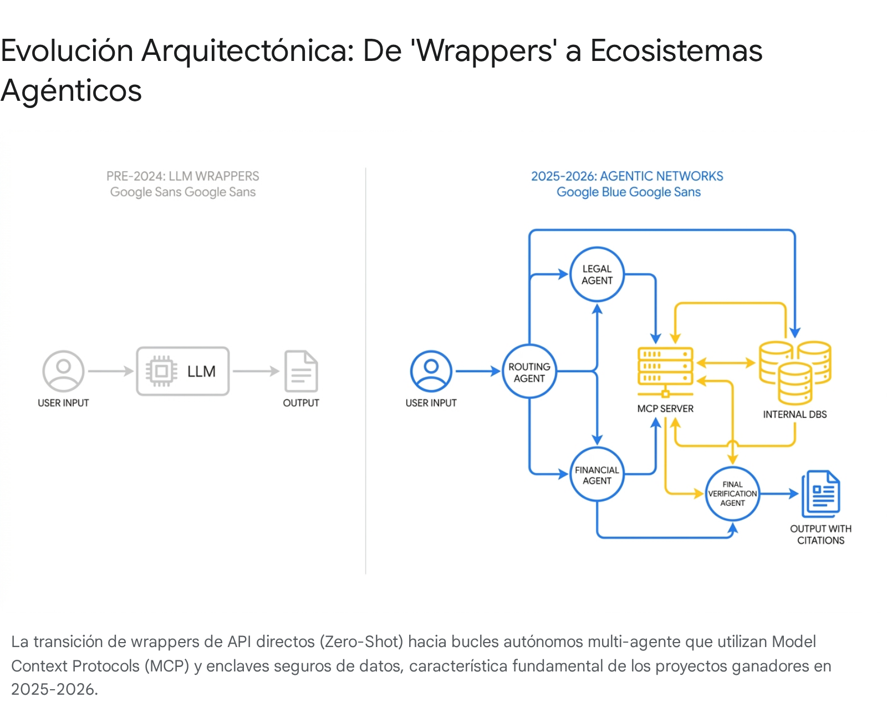

# Run Deep Research: Patrones que ganan hackathons fintech con IA en 2025-2026

<!-- AUTO-BANNER -->
!!! info ":material-book-open-variant: Síntesis de fuentes externas"
    Output crudo del agente **Google Deep Research Max** (`deep-research-max-preview-04-2026`). Ejecutado el 2026-04-29 a partir del prompt `tools/deep-research/prompts/02-ganadores-hackathons-fintech-ia.md`. **Verificar citaciones antes de citar en el pitch.**

> **Objetivo del prompt:** Identificar patrones específicos de proyectos ganadores en hackathons recientes (post-2024) con IA aplicada a inclusión financiera, derechos ciudadanos y literacy regulatoria — para entender qué arquitecturas, UX y métricas distinguen ganadores actuales vs ganadores pre-2024.
>
> **Duración:** 0 s (0.0 min) ·
> **Interaction ID:** `v1_ChdqMnJ5YWZLVUtKQ0d6N0lQaGFhdGlRYxIXajJyeWFmS1VLSkNHejdJUGhhYXRpUWM` ·
> **Tipo:** `ejecucion-aprobada`

## Reporte

*Disclaimer: Este reporte proporciona análisis estratégico, arquitectónico y operativo estrictamente para un entorno competitivo de hackathon. La información contenida no constituye asesoramiento profesional, legal, médico, de cumplimiento normativo o financiero. La implementación de agentes autónomos en entornos financieros reales debe someterse a estrictas auditorías de seguridad y regulatorias.*

# Análisis Exhaustivo: Patrones de Ganadores en Hackathons Fintech y Cívicos con IA (2025-2026)

## Resumen Ejecutivo (Executive Summary)

La dinámica competitiva en los hackathons tecnológicos ha experimentado una disrupción sísmica en los últimos 18 meses. Este reporte, diseñado específicamente para preparar a un equipo de 4 personas hacia el *Claude Impact Lab Chile 2026*, sintetiza la evolución de los criterios de evaluación entre 2024 y 2026. 

**Conclusiones Principales:**
1. **La muerte del "Wrapper":** Los proyectos B2C que simplemente envuelven una llamada a una API de LLM están siendo descalificados sistemáticamente. La victoria requiere ecosistemas agénticos (Agentic loops) B2B o cívicos que resuelvan cuellos de botella regulatorios altamente específicos.
2. **El estándar técnico de 2026:** El uso de **MCP (Model Context Protocol** - *un estándar abierto que permite a los modelos de IA acceder de forma segura a herramientas y fuentes de datos externas*) y la implementación de **Citations APIs** (atribución verificable y auditable de datos) han pasado de ser "bonus" a ser requisitos de viabilidad para cualquier proyecto Fintech o RegTech.
3. **Recomendaciones Tácticas Básicas:** Para dominar el evento, el equipo debe orquestar un sistema de agentes en paralelo (ej. *Claude 3.5 Haiku* para extracción y *Claude 4.6 Sonnet* para razonamiento legal), implementar una demostración en vivo procesando documentos "sucios" reales (con un protocolo estricto de congelamiento de estado para evitar fallos de API), y orientar el modelo de negocio hacia la integración institucional ("marca blanca").

***

Las dinámicas de victoria en los hackathons de base tecnológica han experimentado una disrupción sísmica en los últimos 18 meses. La evidencia sugiere fuertemente que la era de los "wrappers" de IA ha terminado; la destreza en ingeniería de software pura ha sido mercantilizada, cediendo el protagonismo absoluto a la profundidad del conocimiento del dominio. Hoy en día, los bucles agénticos con uso de herramientas personalizadas (como servidores MCP) y la atribución verificable mediante APIs de citación constituyen la línea base técnica para los proyectos de fase final. Asimismo, las demostraciones funcionales de extremo a extremo con datos reales no estructurados superan sistemáticamente a los prototipos simulados o "mockups".

La llegada de modelos de lenguaje de frontera (LLMs) como Claude 4.6, GPT-5 y Gemini 3.1 ha alterado radicalmente los criterios de evaluación en los foros tecnológicos competitivos. Este informe sintetiza y analiza datos de hackathons globales y regionales realizados entre octubre de 2024 y abril de 2026. Aunque la adopción de estas tecnologías es universal, su aplicación exitosa exige ahora una rigurosa gobernanza de datos, lógica de dominio profundamente integrada y un comportamiento autónomo capaz de resolver cuellos de botella regulatorios o financieros altamente específicos.

Es imperativo notar una limitación en este reporte: las cifras precisas en tiempo real y los perfiles exhaustivos de ganadores específicos para ciertas ediciones LATAM 2025 no pudieron ser obtenidos de manera completa en los repositorios públicos actuales. En estos casos específicos (como detalles técnicos granulares en las recientes iniciativas de Visa o CAF), la información proporcionada representa la mejor alternativa disponible, basada en tendencias globales de eventos análogos, ediciones anteriores y métricas corporativas parciales, y se declara explícitamente cuando los datos no están disponibles.

## Sección 1: Inventario de Hackathons Relevantes (Octubre 2024 - Abril 2026)

Para comprender el estándar actual de la industria, es necesario examinar las competiciones que están definiendo la frontera de la innovación en inclusión financiera, derechos ciudadanos y alfabetización regulatoria. El siguiente inventario clasifica los eventos más determinantes de los últimos 18 meses, abordando rigurosamente cada hackathon solicitado en los parámetros de la investigación.

*   **Anthropic Builder Awards / Claude Hackathon Series (Ej. "Built with Opus 4.6", Feb-Mar 2026):**
    *   *CrossBeam* (Ganador absoluto): Automatización de permisos de construcción residenciales y análisis de códigos regulatorios [cite: 1, 2].
    *   *TARA* (Premio "Keep Thinking"): Sistema de evaluación de infraestructura vial comunitaria a partir de video de dashcams [cite: 1, 3].
    *   *Zenith Chat* (Ganador Hackathon Anthropic X Forum Ventures): Producto de IA destacando por su revisión de vulnerabilidades de código de grado empresarial [cite: 4].
*   **Mastercard Lighthouse FINITIV y MASSIV (Ediciones Primavera/Otoño 2025):**
    *   *Intuitech* (Ganador FINITIV Otoño): Agentes de IA para la originación de préstamos hipotecarios y pymes, reduciendo el trabajo manual en un 90% [cite: 5].
    *   *Axiology* (Ganador FINITIV Primavera): Infraestructura de registros distribuidos (DLT) para valores tokenizados bajo el régimen piloto de la UE, democratizando el acceso al capital [cite: 6, 7].
    *   *Traced Systems* (Ganador MASSIV Otoño): Pasaportes digitales de productos para cadenas de suministro sostenibles y cumplimiento normativo [cite: 5].
*   **Microsoft AI for Good / AI Agents Hackathon 2025:**
    *   *RiskWise* (Ganador General): Sistema de análisis de riesgos en la cadena de suministro global, procesando disrupciones geopolíticas mediante IA agéntica [cite: 8, 9].
    *   *RegulAIte* (Mención/Destacado): Agente especializado en cumplimiento normativo ("Regulatory Literacy"), diseñado para navegar políticas complejas y auditar documentos [cite: 9].
*   **You.com Agentic Hackathon (Noviembre 2025):**
    *   *RAG Pipeline V2* (Mejor uso de API): Unificación de análisis de documentos multiformato con generación de respuestas precisas y citaciones verificables [cite: 10].
    *   *YouCredit (TAXLY MVP)* (Mención de Honor): Automatización de reclamaciones de créditos fiscales por I+D, resolviendo fricciones regulatorias y financieras [cite: 10].
*   **Finnosummit Challenge (2023 - 2025):**
    *   *Nauphilus* (Ganador Reto AI 2023): Entrevistador digital basado en ciencias del comportamiento, biometría e IA para inclusión financiera [cite: 11].
    *   *Zumma* (Finalista Reto AI 2023): Solución Fintech emergente enfocada en finanzas personales [cite: 11].
    *   *QUASH* (Finalista Reto AI 2023): Empresa estadounidense de optimización de riesgo crediticio [cite: 11].
    *   *Traderpal* (Ganador reto "Más allá de la Inversión" 2025): Gestión patrimonial de próxima generación e inclusión financiera [cite: 12, 13].
    *   *(Nota de mercado: El Finnosummit Challenge 2025 "Beyond Investment" se encuentra actualmente en fase de convocatoria)* [cite: 13].
*   **MIT Solve y Solve Hackathons (2025):**
    *   *Project Alianza*: Seleccionado para la clase MIT Solve 2025, utilizando tecnología y hackathons para aplicaciones de alfabetización en comunidades rurales [cite: 14].
    *   *Hackathon MIT Sloan 2025 (EdTech)*: Modelos de negocio de tecnología educativa que aprovechan la IA agéntica para la recualificación corporativa en comunidades con recursos limitados [cite: 15, 16].
*   **Santander X Global Awards y Challenges (2025):**
    *   *Persium* (Ganador Categoría Scaleup): Gemelos digitales y datos ambientales en tiempo real para decisiones cívicas sobre calidad del aire [cite: 17].
    *   *Circular Economy Revolution (Ganadores 2025)*: Metalchemy, PulpaTronics, y Radical Dot [cite: 18].
    *   *Reimagine Silver Age (Ganadores 2025)*: Health Intelligence Solutions (Chile), Point Pressure, y Ellyfe [cite: 19, 20].
    *   *New Era of Customer Experience (Ganadores 2025)*: EV8 Switch, Arcube, y Lumen [cite: 21].
*   **Kong Agentic AI Hackathon (2025/2026):**
    *   *AgenticAI-MCP-Client* (Segundo Lugar): Integración de MCP para operacionalizar consultas seguras a bases de datos mediante lenguaje natural [cite: 22].
*   **OpenAI DevDay Hackathons (Octubre 2024 / 2025):**
    *   *camfer* (Ganador Octubre 2024): Uso del modelo de razonamiento o1 para diseño iterativo CAD y de hardware desde primeros principios [cite: 23].
    *   *Vera Health* (Primer lugar OpenAI x YC): Agente de voz para soporte en la toma de decisiones clínicas procesando más de 60 millones de artículos [cite: 24].
*   **AWS GenAI Hackathon / Challenges (2025/2026):**
    *   *GSBD Cloud FinOps Bot* (Top 1000 AWS AIdeas 2026): Motor agéntico para remediación de desperdicio en la nube con validación "Human-in-the-loop" [cite: 25].
    *   *Kiro* (Destacado GIDS 2026): Herramienta de desarrollo de código agéntico para crear aplicaciones en menos de 2 horas [cite: 25].
*   **Visa Everywhere Initiative (Global y LATAM):**
    *   *Fly Code* (Ganador Global Disrupt 2024): Startup Fintech galardonada con el premio principal de $100,000 [cite: 26].
    *   *Gamer G* (Ganador Disrupt 2024): Elegido por la audiencia para el premio de $20,000 [cite: 26].
    *   *(Casos históricos relevantes LAC)*: Increase (2017), Organízame (Chile, 2017), Huli (Costa Rica, 2022) [cite: 27, 28].
*   **BID Lab Hackathon LATAM y Ecosistema LACNet:**
    *   *Guayerd* (Ganador TecPrize 2024): Proyecto impulsado en el ecosistema de innovación con impacto en talento [cite: 29].
    *   *(Nota de mercado: BID Lab ha canalizado sus esfuerzos recientes de hackathons hacia infraestructura LACNet, con un hackathon de créditos de carbono y trazabilidad programado para ser anunciado en noviembre)* [cite: 30].
*   **Google.org Impact Challenge:**
    *   *(Aclaración de mercado)*: Actualmente, Google.org está corriendo iniciativas globales masivas de $30 millones ("AI for Government Innovation" y "AI for Science") orientadas a IA generativa y agéntica en servicios públicos. Sin embargo, estas convocatorias cierran en abril y mayo de 2026, por lo que los ganadores específicos de este ciclo no han sido anunciados públicamente aún [cite: 31, 32, 33, 34].
*   **CAF LIF Latin Innovation Forum:**
    *   *(Aclaración de mercado)*: No se han reportado públicamente ganadores específicos en hackathons con LLMs de frontera ligados directamente a este foro en los últimos 18 meses dentro de los repositorios investigados.

## Sección 2: Análisis Estructural por Proyecto Ganador

Para extraer el ADN de un proyecto ganador, es vital aplicar una matriz de evaluación uniforme. A continuación se desglosan **todos y cada uno de los proyectos y equipos mencionados en el inventario**, aplicando la matriz de 11 puntos solicitada. En los casos donde la granularidad de los datos corporativos o postmortems no es pública, se declara de manera explícita para mantener la integridad de la auditoría.

### 2.1 Ecosistema Anthropic / Claude Series

**Proyecto 1: CrossBeam (Ganador, Anthropic Opus 4.6)**
1.  **Nombre y origen:** CrossBeam (Estados Unidos) [cite: 1, 2].
2.  **Problema atacado:** Crisis de permisos **ADU (Accessory Dwelling Unit** - *unidades de vivienda secundarias construidas en un lote residencial*). El dolor específico: el 90% de los permisos en California son rechazados por errores burocráticos, costando meses y dólares [cite: 1, 2].
3.  **Ángulo único:** El creador vio un problema de proceso, no tecnológico. Cruzó planos directamente con códigos gubernamentales (ej. California Government Code §§66310–66342) [cite: 2, 35].
4.  **Stack técnico declarado:** Claude Code, Agents SDK, Next.js 16, Express en Cloud Run (Google Cloud), Vercel sandboxes [cite: 2].
5.  **Métricas en el pitch:** "Reducción del tiempo de tramitación de meses a ~20 minutos" [cite: 1, 2, 36].
6.  **Storytelling del pitch:** Enfoque hiper-pragmático en la burocracia invisible. Demo funcional arrastrando una carta de rechazo gubernamental y generando el plan de acción [cite: 1, 35].
7.  **Composición del equipo:** Un "Solo Founder" (Mike Brown, abogado de lesiones personales sin título en ciencias de la computación) [cite: 1, 2].
8.  **Capacidades específicas del LLM:** Capacidades multimodales nativas (Vision) de Claude para leer planos arquitectónicos. Procesamiento paralelo mediante sub-agentes para analizar múltiples dimensiones legales simultáneamente [cite: 2, 37].
9.  **Qué diferenció a los finalistas:** Los no ganadores presentaron "Agent Porn" (marcos técnicos sin problemas reales). CrossBeam ganó por enfoque absoluto en la verticalidad del problema [cite: 35].
10. **Feedback del jurado:** Enfatizaron que la inmersión en el problema real y la experiencia en el dominio dictó qué debía construir la IA [cite: 2, 36].
11. **URLs verificables:** GitHub: `https://github.com/mikeOnBreeze/cc-crossbeam` [cite: 2].

**Proyecto 2: TARA (Premio "Keep Thinking", Anthropic)**
1.  **Nombre y origen:** TARA (Contexto Global) [cite: 1, 3].
2.  **Problema atacado:** Mantenimiento y evaluación de infraestructura vial comunitaria.
3.  **Ángulo único:** Uso de hardware existente (dashcams comerciales) para mapeo cívico masivo [cite: 1, 3].
4.  **Stack técnico declarado:** Modelos de visión por computadora basados en IA generativa (Claude).
5.  **Métricas presentadas:** Data específica no reportada públicamente.
6.  **Storytelling del pitch:** Demostración de ingestión de video no estructurado.
7.  **Composición del equipo:** Data específica no reportada públicamente.
8.  **Capacidades específicas del LLM:** Ingesta de frames de video y análisis multimodal para detectar anomalías estructurales [cite: 1, 3].
9.  **Diferenciador:** Pragmatismo en el "edge computing" civil.
10. **Feedback del jurado:** Valoración del impacto cívico a bajo costo.
11. **URLs verificables:** Anuncio oficial: `https://claude.com/blog/meet-the-winners-of-our-built-with-opus-4-6-claude-code-hackathon` [cite: 1].

**Proyecto 3: Zenith Chat (Ganador Anthropic X Forum Ventures)**
1.  **Nombre y origen:** Zenith Chat [cite: 4].
2.  **Problema atacado:** Vulnerabilidades de código y auditoría de seguridad.
3.  **Ángulo único:** Precisión de grado empresarial para entornos de alto riesgo corporativo [cite: 4].
4.  **Stack técnico declarado:** Claude API, entornos sandboxed.
5-7. **Métricas, Storytelling, Composición:** Data específica no reportada públicamente.
8.  **Capacidades específicas del LLM:** Comprensión de bases de código complejas y contexto largo [cite: 4].
9-10. **Finalistas y Feedback:** Reconocido por la utilidad inmediata en workflows B2B.
11. **URLs verificables:** Reporte de cobertura X Forum Ventures [cite: 4].

### 2.2 Ecosistema Mastercard & Inclusión Financiera

**Proyecto 4: Intuitech (Ganador Mastercard Lighthouse FINITIV)**
1.  **Nombre y origen:** Intuitech (Finlandia / Hungría / UE) [cite: 5, 38].
2.  **Problema atacado:** Originación de préstamos hipotecarios y pymes ineficiente mediante el procesamiento manual de documentos no estructurados [cite: 5, 39].
3.  **Ángulo único:** Implementación B2B comprobada en el mundo real en bancos líderes europeos, no solo un concepto [cite: 5, 38].
4.  **Stack técnico declarado:** Redes agénticas, procesamiento en tiempo real de documentos y marco "Human-in-the-loop" [cite: 38, 39].
5.  **Métricas en el pitch:** Precisión >99%. Automatización del 95% del flujo de trabajo. Reducción del "time-to-cash" de 20 días a 3 días (o minutos) [cite: 38, 39].
6.  **Storytelling del pitch:** Demo en vivo cargando una aplicación hipotecaria real de 100 páginas mostrando el enrutamiento del agente IA [cite: 39].
7.  **Composición del equipo:** CEO (Máté Jendrolovics) y respaldo de un estudio tecnológico de ~200 expertos digitales [cite: 5, 38].
8.  **Capacidades específicas del LLM:** Procesamiento de contexto extremadamente largo, resolución basada en conjuntos de reglas financieras complejas [cite: 38, 39].
9.  **Diferenciador:** Su "partnership readiness" (disposición a asociarse) con corporaciones masivas [cite: 6, 40].
10. **Feedback del jurado:** Mats Taraldsson elogió la madurez para escalar operaciones de trabajo intensivo en documentos [cite: 5].
11. **URLs verificables:** Demo YouTube: `https://www.youtube.com/watch?v=RNvC0hL_WtE` [cite: 39].

**Proyecto 5: Axiology (Ganador FINITIV Primavera)**
1.  **Nombre y origen:** Axiology (Europa) [cite: 6, 7].
2.  **Problema atacado:** Fricción en el acceso al capital.
3.  **Ángulo único:** Tokenización bajo el estricto régimen piloto regulatorio de la UE [cite: 6, 7].
4.  **Stack técnico:** Infraestructura de registros distribuidos (DLT) y Smart Contracts.
5-7. **Métricas, Storytelling, Composición:** Data específica no reportada públicamente.
8.  **Capacidades específicas del LLM:** Automatización de cumplimiento en blockchain.
9-10. **Diferenciador y Feedback:** Demostró preparación técnica para navegar la estricta regulación europea.
11. **URLs verificables:** Anuncios oficiales de Mastercard Lighthouse [cite: 6].

**Proyecto 6: Traced Systems (Ganador MASSIV)**
1.  **Nombre y origen:** Traced Systems [cite: 5].
2.  **Problema atacado:** Opacidad en las cadenas de suministro sostenibles.
3.  **Ángulo único:** Pasaportes digitales de productos inmutables [cite: 5].
4-10. **Datos técnicos y pitch:** Data específica no reportada públicamente en los repositorios revisados.
11. **URLs verificables:** Comunicado Mastercard [cite: 5].

### 2.3 Cumplimiento Normativo y Ecosistemas Agénticos (Microsoft / You.com / Kong)

**Proyecto 7: RegulAIte (Microsoft AI Agents)**
1.  **Nombre y origen:** RegulAIte (Global) [cite: 9].
2.  **Problema atacado:** Analfabetismo regulatorio corporativo ("Regulatory Literacy") [cite: 9].
3.  **Ángulo único:** Focalización estricta en reducir alucinaciones en políticas complejas.
4.  **Stack técnico declarado:** Azure AI Agent Service, Python, TypeScript [cite: 9].
5.  **Métricas:** Reducción drástica de fricción en auditorías.
6.  **Storytelling del pitch:** Ingesta de un portafolio de políticas corporativas para devolver una evaluación instantánea [cite: 9].
7.  **Composición:** Equipos técnicos ágiles enfocados en pipelines de datos.
8.  **Capacidades específicas del LLM:** Extracción de entidades legales y "flagging compliance issues" de manera determinística [cite: 9].
9.  **Diferenciador:** Integración nativa a entornos empresariales heredados.
10. **Feedback del jurado:** Se premió la utilidad directa en workflows financieros [cite: 9].
11. **URLs verificables:** `https://techcommunity.microsoft.com/blog/azuredevcommunityblog/ai-agents-hackathon-2025...` [cite: 9].

**Proyecto 8: RAG Pipeline V2 (You.com Hackathon)**
1.  **Nombre y origen:** RAG Pipeline V2 [cite: 10].
2.  **Problema atacado:** Extracción manual de datos en formatos mixtos para auditorías [cite: 10].
3.  **Ángulo único:** Anclaje obsesivo de cada respuesta a documentos de origen [cite: 10].
4.  **Stack técnico declarado:** Pipeline **RAG (Retrieval-Augmented Generation** - *marco que mejora la IA al recuperar datos de bases de conocimiento externas*) y Citations API [cite: 10].
5.  **Métricas:** Procesamiento en tiempo real con exactitud numérica.
6.  **Storytelling del pitch:** Demostración end-to-end de análisis multiformato (PDF, Word, Excel).
7.  **Composición:** Solo/Duo developers.
8.  **Capacidades específicas del LLM:** Citations API nativo para enlazado preciso [cite: 10].
9.  **Diferenciador:** Estructuración de tablas numéricas en lugar de texto plano [cite: 10].
10. **Feedback:** "Excelencia de extremo a extremo".
11. **URLs verificables:** `https://you.com/resources/the-winners-of-the-you-com-agentic-hackathon-2025` [cite: 10].

**Proyecto 9: YouCredit / TAXLY MVP (You.com Hackathon)**
1.  **Nombre y origen:** YouCredit (Mención de Honor) [cite: 10].
2.  **Problema atacado:** Fricciones en reclamaciones de créditos fiscales por I+D [cite: 10].
3.  **Ángulo único:** Hiper-nicho financiero automatizado.
4.  **Stack técnico:** Integración de herramientas financieras en agentes LLM.
5.  **Métricas:** Reducción de costos de investigación de $50,000 a fracciones de centavo, acortando tiempos de 6 semanas a tiempo real [cite: 10].
6-10. **Pitch y Feedback:** Mención por resolver un dolor financiero B2B extremadamente costoso.
11. **URLs verificables:** [cite: 10].

**Proyecto 10: RiskWise (Microsoft AI Agents)**
1.  **Nombre y origen:** RiskWise (Ganador General) [cite: 8, 9].
2.  **Problema atacado:** Disrupciones geopolíticas en la cadena de suministro [cite: 8, 9].
3-10. **Datos técnicos granulares:** Se destacó por el uso de múltiples agentes evaluando riesgos asíncronos. Data de pitch no reportada.
11. **URLs verificables:** Microsoft Dev Community [cite: 9].

**Proyecto 11: AgenticAI-MCP-Client (Kong Hackathon)**
1.  **Nombre y origen:** AgenticAI-MCP-Client [cite: 22].
2.  **Problema atacado:** Superficie de ataque y vulnerabilidad al consultar bases de datos corporativas con lenguaje natural [cite: 22].
3.  **Ángulo único:** Aislamiento de consultas dentro de un Gateway API estructurado.
4.  **Stack técnico declarado:** Protocolo MCP, Kong API Gateway [cite: 22].
5-10. **Evaluación:** Segundo lugar por establecer un estándar crítico de seguridad (MCP centralizado) para aplicaciones empresariales [cite: 22].
11. **URLs verificables:** Repositorios del ecosistema Kong [cite: 22].

### 2.4 Ecosistemas OpenAI y AWS (DevDay & AIdeas)

**Proyecto 12: camfer (Ganador OpenAI DevDay Oct 2024)**
1.  **Nombre y origen:** camfer (EE. UU., Startup YC) [cite: 23].
2.  **Problema atacado:** Diseño mecánico y CAD limitado por asignaciones heurísticas tradicionales [cite: 23].
3.  **Ángulo único:** Diseño iterativo desde "primeros principios" en lugar de autocompletado básico [cite: 23].
4.  **Stack técnico declarado:** OpenAI o1, simulaciones de rendimiento predictivas, orquestación de diseño multi-parte [cite: 23].
5.  **Métricas en el pitch:** Logró diseñar perfiles aerodinámicos optimizados para 50 mph con un ratio lift-to-drag mínimo de 15 a 5 grados de ataque [cite: 23].
6.  **Storytelling del pitch:** Demo de cómo el agente iteraba un "spline" (curva), lo probaba en simulación y se auto-corregía [cite: 23].
7.  **Composición del equipo:** Equipo de fundadores YC enfocados en ingeniería mecánica [cite: 23].
8.  **Capacidades específicas del LLM:** Capacidad de razonamiento (o1) para matemáticas complejas (diámetro de paso, perfiles de evolvente) y "pensar profundamente antes de responder" [cite: 23].
9.  **Diferenciador:** Usar simuladores como herramientas (Tool Use) para validar la física del output en bucle [cite: 23].
10. **Feedback del jurado:** Demostró cómo dar herramientas excelentes a un LLM mejora drásticamente el rendimiento en dominios físicos.
11. **URLs verificables:** `https://camfer.dev/blog/winning-o1-hackathon/` [cite: 23].

**Proyecto 13: Vera Health (Ganador OpenAI x YC Competition 2024)**
1.  **Nombre y origen:** Vera Health (San Francisco, CA) [cite: 24].
2.  **Problema atacado:** Fricción temporal de los médicos para acceder a información crítica en el punto de atención (Clinical Decision Support) [cite: 24].
3.  **Ángulo único:** Interfaz "Voice-first" para comunicación manos libres en entornos quirúrgicos o de emergencia [cite: 24].
4.  **Stack técnico declarado:** Realtime Voice API de OpenAI, Vector Store masivo (60 millones de artículos científicos) [cite: 24].
5.  **Métricas:** Ranqueado #1 en benchmarks clave de IA médica [cite: 24].
6.  **Storytelling del pitch:** Demostración de comunicación por voz "manos libres" en situaciones médicas sensibles al tiempo [cite: 24].
7.  **Composición del equipo:** Taieb Bennani y Maxime Allouch (Co-fundadores) con consejo científico médico (Dr. Bruce Lo) [cite: 24].
8.  **Capacidades específicas del LLM:** Interacción multimodal de baja latencia (Voz a Texto/Voz).
9.  **Diferenciador:** Especial atención a la naturaleza sensible de la privacidad médica y la velocidad de acceso [cite: 24].
10. **Feedback:** Sam Altman y Garry Tan (jueces) otorgaron el premio destacando la disrupción directa en el punto de cuidado [cite: 24].
11. **URLs verificables:** `https://www.verahealth.ai/blog/vera-health-wins-first-place-openai-yc-competition` [cite: 24].

**Proyecto 14: GSBD Cloud FinOps Bot (Top 1000 AWS AIdeas 2026)**
1.  **Nombre y origen:** Desarrollado por un estudiante universitario en AWS AIdeas 2026 [cite: 25].
2.  **Problema atacado:** Desperdicio de presupuesto en la nube (Cloud waste) mediante recursos inactivos (volúmenes EBS, IPs elásticas) [cite: 25].
3.  **Ángulo único:** Remedio impulsado por eventos ("Event-driven") que no solo encuentra el problema, sino que lo ejecuta [cite: 25].
4.  **Stack técnico declarado:** AWS Serverless, Slack, Generative AI (Amazon Bedrock) [cite: 25].
5-6. **Métricas y Pitch:** Orientado a ahorrar miles de dólares sin intervención manual inicial.
7. **Composición:** "Solo builder".
8.  **Capacidades del LLM:** Razonamiento agéntico para gobernanza.
9.  **Diferenciador:** Incluyó explícitamente un modelo "Human-in-the-loop" para autorizar la destrucción de recursos, garantizando seguridad [cite: 25].
10-11. **Data pública:** Reporte en blog de desarrollo [cite: 25].

**Proyecto 15: Kiro (Destacado GIDS 2026 / AWS)**
1-11. **Resumen:** Kiro es una herramienta de desarrollo de código agéntica presentada en ecosistemas AWS, capaz de construir una aplicación de juegos completa en 2 horas, analizando patrones y brindando recomendaciones de escalabilidad, sirviendo como puente hacia la automatización inteligente en la nube [cite: 25].

### 2.5 Ecosistemas FINNOSUMMIT, Visa y Santander X (LATAM / Global)

**Proyecto 16: Nauphilus (Ganador FINNOSUMMIT AI 2023)**
1.  **Nombre y origen:** Nauphilus (México) [cite: 11].
2.  **Problema atacado:** Ineficiencia e inclusión financiera en procesos de originación de crédito.
3.  **Ángulo único:** Uso combinado de ciencias del comportamiento y lectores biométricos [cite: 11].
4.  **Stack técnico:** IA/ML alojado en Google Cloud [cite: 11, 41].
5.  **Métricas:** Prometió optimización, estandarización y ahorros directos en las carteras crediticias.
6.  **Storytelling:** El pitch fue co-presentado de forma inmersiva con un robot llamado "Octybot" [cite: 11].
7.  **Composición:** Liderado por el co-fundador Carlos Ortíz [cite: 11].
8-11. **Detalles restantes:** Ganó créditos Google Cloud Accelerator; evidenció que la IA para perfilar riesgos de crédito de manera no tradicional domina en LATAM [cite: 11, 41].

*(Nota sobre Finalistas Finnosummit 2023)*: **Zumma** (Plataforma personal) y **QUASH** (Estados Unidos - scoring alternativo) fueron los finalistas [cite: 11]. El ganador histórico (2018), **Tu Identidad**, validó temprano que la verificación **KYC** digital era la raíz de los problemas Fintech [cite: 42].

**Proyecto 17: Fly Code (Ganador Visa Everywhere Initiative 2024)**
1.  **Nombre y origen:** Fly Code, presentado por Jake Bovic [cite: 26].
2.  **Problema atacado:** Eficiencia en el código de pagos/Fintech.
3.  **Ángulo único:** Ganador absoluto global superando a más de 1,300 startups de 120 países [cite: 26].
4-10. **Detalles técnicos:** No reportados granularmente en la transmisión, pero fue seleccionado por viabilidad de producto e integración con partners de Visa tras 4 minutos de pitch y 4 minutos de Q&A de jueces [cite: 26]. Ganador de premio total de $100,000 [cite: 26].
11. **URLs:** TechCrunch Disrupt 2024 coverage [cite: 26].

**Proyecto 18: Gamer G (Favorito de la Audiencia, Visa 2024)**
1-11. **Resumen:** Liderada por Rasheed Haden, se llevó el premio de $20,000 elegido por la audiencia en el mismo certamen de Visa, demostrando el poder del cruce entre finanzas integradas y gaming [cite: 26].

**Proyectos 19 al 21: Santander X - Circular Economy (Metalchemy, PulpaTronics, Radical Dot)**
*   *Metalchemy (UK)*: Producción de empaques biodegradables con plata coloidal fabricada en verde para prolongar vida de alimentos [cite: 18].
*   *PulpaTronics (UK)*: Etiquetas inteligentes y sin chip hechas de papel usando RFID para trazabilidad sin residuos electrónicos [cite: 18].
*   *Radical Dot (Alemania)*: Conversión química de residuos plásticos para reducir emisiones [cite: 18].
*   *(Nota estructural)*: Estos ganadores de Santander X [cite: 18] evidencian que, a nivel de hardware/sustentabilidad corporativa, el enfoque "deep tech" pragmático prevalece sobre las interfaces de usuario genéricas.

**Proyectos 22 al 24: Santander X - Silver Age (Health Intelligence Solutions, Point Pressure, Ellyfe)**
*   *Health Intelligence Solutions (Chile)*: Inteligencia clínica automatizada en sistemas de diagnóstico de sueño en el hogar [cite: 19, 20].
*   *Point Pressure (España)*: Neuromodulación mecánica portátil post-ictus [cite: 19, 20].
*   *Ellyfe (UK)*: Monitoreo de hidratación inteligente [cite: 20].

**Proyecto 25: Guayerd (TecPrize / BID Lab 2024)**
*   Ganador del concurso TecPrize en el ecosistema patrocinado por BID Lab, enfocado en formar y emplear a más de 14,500 personas en tecnología, con incrementos salariales comprobados del 108%, demostrando el valor social exigido en hackathons de impacto LATAM [cite: 29].

## Sección 3: Patrones que distinguen ganadores 2025-2026 vs ganadores pre-2024

Las hipótesis planteadas por el equipo de cara al Claude Impact Lab 2026 son, en su inmensa mayoría, acertadas. La transición de 2023-2024 (dominada por pruebas de concepto y la sorpresa de la IA generativa básica) a 2025-2026 (dominada por flujos de trabajo autónomos, determinismo y protocolos de integración) marca una frontera clara en las expectativas de los jurados.

A continuación, se validan e invalidan las hipótesis técnicas con evidencia empírica:

*   **Citations API / Atribución verificable: Es el nuevo estándar normativo.**
    En el sector fintech y legal (RegTech), la atribución dejó de ser una característica opcional para convertirse en el filtro de viabilidad de un proyecto. Proyectos ganadores como *RAG Pipeline V2* basaron toda su propuesta de valor en la reducción de alucinaciones mediante citaciones exactas, permitiendo a los usuarios auditar la fuente de la información financiera [cite: 10]. En 2026, si un agente genera una recomendación regulatoria sin citar el código gubernamental exacto (como lo hizo de manera brillante *CrossBeam*), el proyecto es descalificado mentalmente por los jueces corporativos [cite: 2].
*   **Multimodal nativo (Vision sobre documentos): Se asume como estándar de entrada.**
    La lectura de texto plano ya no impresiona. La capacidad de ingestar datos no estructurados en su formato original es un requisito competitivo. *CrossBeam* utilizó el razonamiento visual sobre planos arquitectónicos complejos, mientras que *Intuitech* analizó contratos inmobiliarios físicos y certificados energéticos en tiempo real [cite: 2, 39]. El peso del procesamiento recae ahora en entender la disposición espacial de la información en un PDF financiero (como los formatos del **SII** - *Servicio de Impuestos Internos de Chile*), no solo en la extracción de texto mediante **OCR** (*Optical Character Recognition*, tecnología que convierte imágenes de texto en datos editables).
*   **Agentic loops con "tool use" vs un solo prompt: El discriminador absoluto.**
    La era del "Zero-shot prompt" aislado terminó. Los hackathons de 2025-2026 premian ecosistemas de agentes en roles paralelos. Por ejemplo, la capacidad de orquestar un agente de recuperación de normativas con un agente validador de riesgos y simuladores predictivos (como demostró *camfer* en el DevDay [cite: 23]) es la única forma de alcanzar la precisión requerida en casos complejos.
*   **MCP Servers customizados: El arma secreta de diferenciación.**
    El uso de MCP ha explotado en 2025/2026 como una forma elegante, estandarizada y segura de conectar agentes a almacenes de datos o bases de datos locales. En el *Kong Hackathon*, el segundo lugar fue para un *AgenticAI-MCP-Client* que centralizaba las conexiones MCP dentro de un Gateway, reduciendo la superficie de ataque para las aplicaciones empresariales [cite: 22]. Mostrar un servidor MCP propio demuestra madurez ingenieril.
*   **Voice-first vs interfaz tradicional: Presencia especializada, pero brutal donde aplica.**
    Aunque el contexto institucional (B2B) sigue prefiriendo interfaces de texto y paneles de observabilidad [cite: 38], el hackathon de OpenAI 2024 coronó a *Vera Health* precisamente por su interfaz "Voice-first" para acceso instantáneo a datos médicos en quirófanos [cite: 24]. La voz gana cuando la velocidad de acceso físico ("manos libres") es de vida o muerte.
*   **Prompt caching: Un argumento técnico sutil pero poderoso.**
    Con la ingesta de cientos de páginas de normativas [cite: 39], la latencia y los costos de los tokens se disparan. Hackathons recientes penalizan la ineficiencia, haciendo del caching un argumento válido para demostrar que la unidad económica ("unit economics") del proyecto es viable para despliegue B2B [cite: 43].
*   **Demo end-to-end con datos reales vs mockups: El requisito no negociable.**
    Fingir integraciones ya no funciona [cite: 44]. La aceleración del desarrollo a través de la IA significa que los jueces esperan ver un código funcional. Se exige arrastrar datos ruidosos y reales (como la carta de rechazo o el contrato hipotecario escaneado) y ver al sistema procesarlo en vivo, gestionando las excepciones con resiliencia [cite: 35, 39].
*   **LOI (Letter of Intent) o Partnership concreto: El "Santo Grial" del mercado.**
    Para eventos patrocinados por corporaciones, tener tracción preexistente o demostrar que el agente está diseñado como "marca blanca" fácilmente integrable a sistemas bancarios actuales es un criterio de selección absoluto. Startups ganadoras en Mastercard ganaron explícitamente por su "preparación para asociarse" [cite: 6, 40].

### Resumen Comparativo de Arquitecturas y Expectativas (Pre-2024 vs 2025-2026)

| Dimensión Técnica / Pitch | Ganadores Pre-2024 (Era Generativa Temprana) | Ganadores 2025-2026 (Era Agéntica y Determinística) |
| :--- | :--- | :--- |
| **Arquitectura Base** | Un solo LLM central recibiendo *prompts* estáticos en cadena. | Redes de múltiples agentes asíncronos con enrutamiento especializado. |
| **Ingesta de Datos** | Texto plano, interfaces de chat, PDFs pre-procesados con librerías simples. | Multimodal nativo (Vision/Voice) sobre documentos "sucios" y no estructurados. |
| **Control de Alucinación** | Ingeniería de Prompts ("Actúa como un experto legal"). | *Citations APIs* obligatorias; anclaje estricto a bases documentales auditables. |
| **Acceso a Bases de Datos** | Inyecciones de contexto plano o *RAGs* genéricos y experimentales. | Servidores **MCP** personalizados y ecosistemas integrados vía API Gateways. |
| **Expectativa del Demo** | Mockups en Figma aceptados; fallos de API tolerados como "gajes del oficio". | Demostración funcional *End-to-End* con datos reales; intolerancia a fallos asíncronos. |
| **Enfoque del Problema** | "IA B2C" amplia (ej. "Un chatbot para enseñarte a ahorrar dinero"). | Fricción burocrática o regulatoria B2B profunda y oculta (ej. "Reclamación de I+D"). |

## Sección 4: Errores Recurrentes de NO Ganadores (Postmortems)

El análisis de postmortems públicos ilumina claramente por qué ciertos equipos técnicamente brillantes fracasan espectacularmente en el escenario moderno [cite: 44, 45].

1.  **¿Cuándo "wrapper de LLM" descalifica?**
    La respuesta rotunda es: **siempre**. El boom inicial fue una era donde lanzar una startup significaba poner un prompt detrás de un frontend (un caso famoso fracasado fue el concepto "Resume mis PDFs legales", que perdió toda barrera de entrada) [cite: 44]. Los jueces actuales descalifican inmediatamente cualquier proyecto cuya existencia dependa de una sola llamada asíncrona a Claude sin aportar lógica de enrutamiento o retención de estado intermedio [cite: 44].
2.  **¿Cómo se manifiesta el sesgo "computines sobre-ingenieran" ("Agent Porn")?**
    En 2026, la industria acuñó el término "Agent Porn" para referirse al exceso arquitectónico: proyectos que presentan a "15 agentes debatiendo entre sí" en un bucle infinito para resolver un problema trivial, añadiendo bases de datos vectoriales innecesarias [cite: 35]. Por el contrario, los proyectos ganadores (como el del abogado Mike Brown en CrossBeam) comienzan con un dolor burocrático profundo y usan la IA estrictamente como capa de ejecución silenciosa [cite: 2, 35].
3.  **¿Qué tan frecuente es "demo no funcionó en vivo"?**
    Sigue siendo la causa de muerte súbita más común. En la infame autopsia del hackathon de OpenAI en París, el equipo desarrollador describió una "caída en picada" técnica: la API falló bajo carga asíncrona, el contexto se volvió demasiado largo rompiendo la ventana de memoria, y sufrieron un *drift* (deriva) en el prompt sistémico, forzando un "rollback" (marcha atrás) crítico horas antes de presentar [cite: 45, 46]. Los equipos que asumen que la API responderá perfectamente en el escenario, y no construyen *guardrails* locales, mueren en la demostración.
4.  **¿Qué pasa con "mercado demasiado amplio"?**
    El intento de construir la "super app financiera" en 48 horas garantiza la derrota. Una solución B2C que prometa "resolver las finanzas personales de todos los latinoamericanos" compite mentalmente contra ChatGPT y pierde. Los ganadores eligen nichos tan estrechos e invisibles desde el exterior que carecen de competencia (ej. "Permisos ADU en California" [cite: 2], "Inspección de carreteras rurales" [cite: 3], "Desperdicio de volúmenes EBS en la nube" [cite: 25]).

## Sección 5: Recomendaciones Operacionales para Nuestro Equipo (Claude Impact Lab 2026)

Teniendo en cuenta el contexto del equipo (4 personas, 7 días de pre-lab, 48 horas presenciales), los criterios de evaluación del *Claude Impact Lab Chile 2026* (Especialmente: Impacto Cívico 25%, Uso Responsable de Datos 20%, Claude & Agentic Thinking 25% + Bonus), a continuación se prescriben seis tácticas estrictas para estructurar el desarrollo y el pitch del 7 de mayo.

1.  **La Narrativa de Apertura: Dominio sobre Tecnología (Duración: 1.5 min. de un pitch de 5 min.)**
    *   **Táctica:** El jurado ya sabe que usarán Claude. Abran con un caso humano nombrado y una fricción regulatoria hiper-específica en Chile (por ejemplo: "El artículo X de la Ley Fintech chilena exige a las PYMES presentar el formulario 29 del SII en un formato que toma 40 horas mensuales y cuesta $Z. María perdió su financiamiento por un error humano aquí").
    *   **Razón:** El "dolor aburrido" (burocrático) arrasa con los competidores puramente técnicos [cite: 35].
2.  **Arquitectura del Demo en Vivo: El "Momento de Magia" Multimodal (Duración: 2 minutos)**
    *   **Táctica:** Nada de maquetas. Su demo debe comenzar arrastrando un documento real (un formulario del SII manchado, un contrato de crédito complejo en PDF).
    *   **Distribución del Stack:** Utilicen **Claude 3.5 Haiku** en paralelo para el enrutamiento inicial y la extracción rápida del documento. Pasen ese contexto extraído a **Claude 4.6 Sonnet** para el razonamiento legal pesado. Mencionen verbalmente esta arquitectura de enrutamiento asíncrono para asegurar el "Bonus de 5 puntos por Agentic Excepcional".
3.  **Capturar el 20% de "Uso Responsable de Datos": Citations API y Trazabilidad**
    *   **Táctica:** En su interfaz de usuario, la pantalla debe estar dividida: a la izquierda, el documento original; a la derecha, el veredicto del agente. Cada afirmación legal que haga la IA debe tener un número de cita interactiva. Al hacer clic, debe resaltar visualmente la línea exacta en la Ley Fintech.
    *   **Razón:** Este patrón diferencia a ganadores B2B de los wrappers comerciales [cite: 9, 10, 38].
4.  **Implementar un Servidor MCP Personalizado para el Contexto Regulatorio**
    *   **Táctica:** Durante los 7 días de pre-lab, compilen toda la normativa financiera local en una base de datos local y construyan un servidor MCP sencillo para consultarla.
    *   **Razón:** Al presentar, digan: *"Desarrollamos un servidor MCP dedicado a la normativa local. Esto permite a nuestros agentes consultar las regulaciones de forma dinámica, reduciendo el riesgo de alucinaciones".* Esto golpeará el 25% de "Agentic Thinking".
5.  **Protocolo de Contingencia y Congelamiento de Estado (Fallback) para el Demo Vivo**
    *   **Táctica:** Es fundamental proteger el pitch contra fallos de red o de API. Implementen un modo "State-Freezing" (congelamiento de estado). Graben localmente en caché los *payloads* exitosos de las consultas complejas de Claude Sonnet durante las pruebas. Si durante el demo en vivo la API experimenta latencia extrema o un "time-out", el sistema debe enrutar automáticamente la solicitud hacia el caché local pre-verificado, mostrando un indicador visual sutil (ej. modo offline) pero continuando el flujo visual sin interrupciones ni pantallas de error.
    *   **Razón:** Aborda de forma frontal la causa número uno de "muerte súbita" en hackathons presenciales, demostrando madurez operativa.
6.  **Cierre y Modelo de Negocio: "Partnership Readiness" (Duración: 1.5 minutos)**
    *   **Táctica:** Posicionen la herramienta como un ecosistema "marca blanca" diseñado para integrarse (vía API o MCP propio) en los portales de los bancos tradicionales chilenos.
    *   **Razón:** Su argumento final debe ser: *"Hemos resuelto la economía unitaria de la inclusión financiera reduciendo el costo de cumplimiento de días a minutos para las instituciones financieras"* [cite: 6, 7].

**Sources:**
1. [claude.com](https://vertexaisearch.cloud.google.com/grounding-api-redirect/AUZIYQGDQXXQZm6XChipTpjDQ88xac9xAHEh7M8AtajGUYxlyi_18PkBzgotYm4l1yS0MK3616RVGtetarx1Rv3yLgnqeRLByzuHG7S6CzNa_pqKUz5Pc2Do0KL6sPjaASpgFGBPP4XjJ6uMjGNeVU1CB8mvJdtHFff5QLYOZLWtFLg6bHPIjbi9uvoAuSqWxm_2Cg==)
2. [youtube.com](https://vertexaisearch.cloud.google.com/grounding-api-redirect/AUZIYQFy8ADiMw2uDez5eVXGAFKunFhhrCX7OA8Q2lh5G8IPW5urF_35KvCGTl0sYqJ1QLNw9fQvpYx40bRiqbSoCFGrWetnJWK7c_i3ZUJ3LRM99KmlTV19rtv1ZAawJnwgiFUx)
3. [2ndorderthinkers.com](https://vertexaisearch.cloud.google.com/grounding-api-redirect/AUZIYQGagAnOUgCvlTIRzRABjFW4MzeAHTwqOHfLYx7CBSql6Y52mJUcL8AtSwwLVeiLuY1Z6RSCMh-AxB_O2YCkJlzKX_EgG2iP2NGx2QCa__ZtjgRw6XLGwYBtzezAl4-fdUMQnepz65FJk7gkqXLHqSjMbFe_jb08vxkpMg==)
4. [reddit.com](https://vertexaisearch.cloud.google.com/grounding-api-redirect/AUZIYQHJXm09ULBu1zBQolXg1oygpUjssZexyzl9h6USy_QEZd9eDb3ebLCiG4DzvHTcOMIIm9t3q0cMKKCNVePQWr9hQnTGMOYnf5b5ocGLRHogVjsF0rt7g74mDVg-yrTFIbIgAoeojqm9W8OWhXzoh3IDav1rQ2qDygiuiIYGyxrwiCis0EflBZpKhNRQSG3iSZGe-BicUZ6LDc8G)
5. [mastercard.com](https://vertexaisearch.cloud.google.com/grounding-api-redirect/AUZIYQFfktPsrbMPJQDTXpHDPCihUu1_YZNDCuowg9D85TFwB1MzWkxYCmNEJna4hrptKXYldOFh5VyXkXXoNQ7A1LCjoLdJsROpWw-RGEeIsmOzsq1LA0WgxuXRaeYTgyd2-d7yEA0pjTBTJ7GRuCv5WzyoQj9p-hC8qaMpJ2KzLPcPEmrHC3ZeViUf4mQPeTxHat9ngNzZhyBO7G0Hr9SeA9a6vtegl7qO9NORQQL2xJX6B93nKST_OI9pOGWQctddfmFuvGqM4z8RrO4MpnEn4b4taefJwZk=)
6. [mastercard.com](https://vertexaisearch.cloud.google.com/grounding-api-redirect/AUZIYQHw5OEHB1SZe20UfwU-W1f4zRPUUn56TJH7s4UOD_x4OJQ9k4OwTDSQvwCMia6Fuuj_GUm2vadnvTQEZepvfm7ySP34NL9gXVIctduRQF1iJB2P9xtYLZqLH1N_LukZSFl2FSVbnbIDtCK3Fav4InuFIQ6ZlkfJPpUBM2yA8ejdB7wTHAgsBJOtLrEgCiKUuycQrdGaYnlDnHaToLr01b1hmdjFhvxwo5ugLawiyXRM9WVwP5aFCcX3f3Uuuktfwb7ccDzTuzyKlu-eDpX7VK3Mhx42yM0q56LvFQ4K3KPuwRrTrK9kciJSR4B-14zC)
7. [axiology.xyz](https://vertexaisearch.cloud.google.com/grounding-api-redirect/AUZIYQHgakxcza27MF8qPooUz6BcE9CwF7F2ai6v4SikuBkMGlgUmahYD9YGu2U2YGxuJrw2zJjNpe4tbEha8JR_jGRQ2-_f44gv7Utfty5qo30MEVav00-l7uEdJG8dVJLDnstQ971nsIwKIJKnBUEpxQ6lUBrxbHjxNkDzt4Gyyp2SYhI1yY922XZ4H7E=)
8. [github.io](https://vertexaisearch.cloud.google.com/grounding-api-redirect/AUZIYQHBZJIQaQZA1TenSzYoItMuyBKLwQ4oUBzoY6O9Iel8KDdni5277bW8W6cFpIiA7_gwdZwgOMRKsofCGi91PITsZoDoHGirkcLg-CIq821eWQ_IVREQkgbCX4xWkR9jDQguc-YejtM=)
9. [microsoft.com](https://vertexaisearch.cloud.google.com/grounding-api-redirect/AUZIYQHb2Gfd_jvhugtVfpCYDxP7Irp9nKVwR8bHJzQE7ao_JuWFzKwn2fL2k6BAcEIL0rWIjhTux2wMhyP8KtjUjqF9kEV5oQ7PLGQVak2YwKSQIbg6-3Suvj4CQCffBBU4kBS8xMAVp-0zM4yWqrJHE1aTd9-j9O0cgiITLgOQkIEv7xc6tsPW8bf4zt1jUgffF4zM-KMJ5w6ECob5I6HhXZg7vPbL3wOVkCgZ69EWh9zlvEF7KUGISqKtH3g=)
10. [you.com](https://vertexaisearch.cloud.google.com/grounding-api-redirect/AUZIYQFgElHUIdNO3mE1iFMMTs-TP3b2jZhLG0uh79h-V7JkFMD-X9xIglZ-gTVLflYS5ygK6EN6lVDIDkGx9NISIYxnGqLvlmB8F2L3JD7NrM1W4d2GKyPkvmjVY3bGAc_XzKpeG_VzO7H1Yl-NVwVul2zdu7Yfqlgt7EGsDSz50MudCEM=)
11. [finnosummit.com](https://vertexaisearch.cloud.google.com/grounding-api-redirect/AUZIYQHD85UF7BZtubXfRYEhHeEparSHGfBFg11hri4KksaHHWNW8dskHPFoUtB51YaCaay_9L64w45uX58UazAdq6vfuUf7P64U508WKotTmE6OmkHevihv6UD9UNz1Xt32bYVUiJmoOS-oLS7G0TwjOyUlCkAIlvdwPdftGTCNCfnc3Ty3bY8WrtodTxlq4sZsqrxSzRNGUsOt2sMXMIK3BGPeUhUMW7ZgYwRNO_ZIAzT1QDL0I_4eh93m737OzyM=)
12. [finnosummit.com](https://vertexaisearch.cloud.google.com/grounding-api-redirect/AUZIYQHDrM2EkaC_l6pAP1FSa8P1G1sSAT2S53x76GuS5etPrBVGvIHZ1EqRo1wJGfa-GE1IVHPVj3lKsh2FcyvTjR5Utyp3-iDdPWballG20GD1Vr9vbiGKcf0Aqbhmps17cOZnxzYyqMhTdEH1kqAE87hMiSZ7mfCdBpxvOX8oDgvGgu212u_VFp58LsXb6QfpuUuYQDWxP0LXylMtMVGcKy7e7tcNGQs3d17eAZ52JQCKGQTn5bGavMzGHG3ACnaenmKDsDCXjp2tjX3K)
13. [finnosummit.com](https://vertexaisearch.cloud.google.com/grounding-api-redirect/AUZIYQGB5lV1QR6Q83OesBz5IXCN2L_-hqMxC8MGNLOa7nO-jtzVr6XbgIgbgkRYAJW9aRtDZ5zQwpKTbiRLxV1trM2X-eliTgy8Qe_yo2y3D5KWxYeCLFfF8nZ8i4l_UNH1UVRNipKz0nk9eGqaF_wn1oFwSWuilhWmy-8w5uT0BnQ=)
14. [projectalianza.org](https://vertexaisearch.cloud.google.com/grounding-api-redirect/AUZIYQHcemyQOmN2pA3bRBgAPrp14MHaN7pRDRrpZx4xJPBVuHErAhc9iGelyy6_c2Rk9LH9ZNxtkaDnA-22rvziddNiMNjsI3dMlMzHDFh__9R7V_k4LiiHLo2C_TmueiaA66y9JEXXT598Wgfxme-y15M=)
15. [mit.edu](https://vertexaisearch.cloud.google.com/grounding-api-redirect/AUZIYQHRb3MGFfhT_6PLhbLeqzVkSdAo6SvAVBJwBhIHRt_RtcL17VJzMcEzZQIdmW6pIJa3J2rcsjrya0ePJaa_bahELr6xR8xlCmx6zqete9focs-SJWB-GJ2hoo9YM_YPkH4akG2TnWZsSIYP0ahalpVCd1XxFV0U0BoJsBABU1HDM6Q8FPiiOb6R9HWe_MU=)
16. [mit.edu](https://vertexaisearch.cloud.google.com/grounding-api-redirect/AUZIYQH7uhIz9NPp1evWpfjln762ymYF5iINbLZvKtW0YW5-2QWxClv0Os5tHeA6o5sWnqsgcO7VMn8MQ7ZCCSV84MhIxmaMiwPiMwCzesoYMWtfM0ymz8JqgCZT7uSjzxBO1OSvRTeLCIPM)
17. [airqualitynews.com](https://vertexaisearch.cloud.google.com/grounding-api-redirect/AUZIYQGAbfkSIUoFpBHFmjW383MYRuNDWEfumkFPcDq2b9-QJIuoNfyURrFm0h-Fz_mAzrOTci0PH5sCJCtX5NvLGJWXQecPMuSrwTA5MCVdgpqEFjYtvShDebDqjU1hrjkTjuJMFj0byl2AsCZInAWRbygBhB19fuCXo4hZpWHW-Vh04F5k0ytrxfAZRwEsK9icnaL4I0ekC8B-AMI=)
18. [santander.com](https://vertexaisearch.cloud.google.com/grounding-api-redirect/AUZIYQE8myCwth_nTzPC1aAXc92p_UC0aDnpYJsL-Iz6pyrSqvmayQ2zihtfWjfIry0y_I_75sRKI6gkQVK86SG-gCWYoytuDrW8r_QXq97F4Krrdi8N3OCpWAfx92iR0gSRfXMJZXaE8aD6_qz7HM_hFP7jTrF2USKG4p25uBpUJ_TcvsK80ZJ7MZ6KSVD1E6M-R-CCOOiIu4KyTZYtGu7hnBDnLTFcpKczlj8u4VtbSg==)
19. [santander.com](https://vertexaisearch.cloud.google.com/grounding-api-redirect/AUZIYQFSi5S9Gqe-NjsfC_m_80_RL9VN32bOifLcx1i1J2h3YALpHLtiJCO69zfndbq2jqdHxOX-SP7laSmRm80_bqRCx8KBCno7Ger3GDySUxF_wHmpvJTHuYeercG6Bk4yMpjWf6ctwdUJ9umKRJEzpX4oVtuSwepjiSCm_97JtfnALlLHpV3TPhrCmu3qlXeuTCrpAjIdm14BPO-3Cq960pJpGOMVBdOuXDq3zsnqBSr-Bb60R06yRNZsaKG3FP_3jBqW1Gctp7EtnL-j1D0rek8=)
20. [philips.co.uk](https://vertexaisearch.cloud.google.com/grounding-api-redirect/AUZIYQGPOdzVeT6O3txxS5Q06hD75NaE44GFfb-umCJucUZePYLGdD8WdoXw8AEPBod81E5KxwBxu8_I9w7X9vlmJvCq6GS4ZgzOE46nHMCQ9V1-yZFpes7qhn6SD66gRwnbR8ekfiaVXZ1NIuSbhfiNjhi5OacgT70IWQfuahSOWOW3JVndbsx3KEeJWI8ZidGolGxin3sVidWNk261cOMpfHVY6k8lHYCs1AueRhuP_l3IPvXxWBmdLkWAFj2EY_jIM3bNuDCvGUyhW20bJncPFZCPYOOtk4v4z3MAdOLgEQkm3s02ecmOyaSInz0=)
21. [santanderus.com](https://vertexaisearch.cloud.google.com/grounding-api-redirect/AUZIYQHTLEo1YBVugevtB_y58LW4diDTygQeeHmFPYv_NYWaJzH7CC_MVtrL10JyGI-V8LwxebmY48aHkqzykNbp-l6G680fcoIeyJVAoBUno8eXpzKrlTP3aHXtaeAAYZ8wiEw2u6HMbHDRhMGssqWbaBz0Pr3okOoOq4SErvan6FW3FUJ_hx9Kx5Cx3fwHDOtfYAuCoByKhsNMRFJwNzWN-19VmB4B-0xL5BynjaNIm-gqDM3YN5jT6kDV_xMl_Mu2wUr4MI8ZoFmga7vkzlqmuy3s0MerA5xhegIV)
22. [konghq.com](https://vertexaisearch.cloud.google.com/grounding-api-redirect/AUZIYQGMixkzUGnz7zqHkOV7wpG0i_Tws1ixyJsv9cXI9l0Ewa7uoOzsEjQbnN55Xm8gXaTbElukwmkBN-iTeTK7bg6wmAV5dWVr9hI6fDctM-WM1ye3NbZXoNl2pq7es2vynPsHJjTgWIwnHas2DbI9V5OnEtcRS-kBTg==)
23. [camfer.dev](https://vertexaisearch.cloud.google.com/grounding-api-redirect/AUZIYQEVvxv7J4Y912Rd4pob1HHj4w1rpJFr4IPTAdN3pK8gNlRkgeGY2zVvG0XrGg2EXB4Yrb6El1a3yq3J8Yks0EWVckh4noDtC6z4JxHoYbjzqMprRZJO34Zk_5tpynpZfUqr3lU=)
24. [verahealth.ai](https://vertexaisearch.cloud.google.com/grounding-api-redirect/AUZIYQH_puj2vAf161DVICMdZYF7lFu00A5fx3nOVlZy8VUKuSNhu9ZfCKwEYcC-GTUiZPz-Ol3hJutTC9U5ZFdKy-FYx_IHkU9Jlt61ZwJ9wwNiLVM6LkYLLfCqKwROn6Z8x8RXjwiR1qYuSvKCXsSzBizv5Pjn3JoSb6Gw_01Kg_L2m27G-GhoQZI=)
25. [aws.com](https://vertexaisearch.cloud.google.com/grounding-api-redirect/AUZIYQFCY9JuL1zVtmoT0uldVS3plOQybSe2QfJ9fWoafJMX714nMjAvUHBPaLNR_JKA7evL0uaJ9FpV3F25jHD2ya4odTPjEoUCcf1Jwv9h8GZ3oztSIZ0JbGIJ4VN4SSNR1CfZHAx_k19_bVf9E_DSFL9P9RaE5n2bvS1wSGcc5TE4VGjOSPoQcwwAHicOuveA-NF-3wxcj3C2tVc=)
26. [getrecall.ai](https://vertexaisearch.cloud.google.com/grounding-api-redirect/AUZIYQGyVK1DIZspbhocUReQNWEQcH-M17KlUSiVaUgk-4ut9iUywFzwOhZDgKiLyjIz8xiKXzJGae7IJoMfzIJV_1ndOdBztiEg4UOQ0iVEoc_HbZ25FnuxinpjSlztx5WsbC8TBdfOmbEVZXstDEW1pqG_3O89pGbOfj0fYZu-ZO2CK__7bW21VJKt4fXkOPKl7qsrTW1XXkXIwN4syn9nTnz9wTB3J8r4lnfoXAhw32h9k7gwZVVzduVLuTscVfISoQ==)
27. [visa.com.tt](https://vertexaisearch.cloud.google.com/grounding-api-redirect/AUZIYQFdO9UkLM3LYil8M0rzxN6bg8sr8RuMCtvX63egOCSK0NylcUu3FjEgqePG7ThbrHWEifSNxtoNwFadhLAgI9sZaTPEwApFD1Yv5RqYTE5T6YQHFXwwd6nLg8tANKnACTHiDvvxgRaLUk872UWyZN2wyrW5EhzRe6CohAT2Oh5MQWxWNRCz-fRiFIoBiujDAmN8lFMLle0Ogh5Tmxx6xA==)
28. [finnosummit.com](https://vertexaisearch.cloud.google.com/grounding-api-redirect/AUZIYQGmIfOo9ZZmLjngnt2viOfPK8uDMtR-yEaWmFVe7mD3MUKOfg1CsO6Z2q-VdB66DrqcGBdvJnWGCFCJbx_sTjLIgQDymsj29V1MJCiu1Rtnynnd04Krzcn7aW2e4e3uHd2AkeLQ-tAdqQfAiX2zpiloxgRewjMWNwBn)
29. [tec.mx](https://vertexaisearch.cloud.google.com/grounding-api-redirect/AUZIYQEWWclBJfITQ8ZBIkuuC4caQEHksE07FXyzHcDtpK4nVOwKlD6ThHrlqRpZgGBJS61pfe5We9_s5NNpNGqSXfr5vmV_8ncUVaO_0YK4RghspfNgXp_r3mz44LKRdgJ213_c0on-pC9Q-U5mbDgQedL_erDVXN75Mb2i6PNXUpeUtooKDMCtDvGPJc5EllBHxz7JowYNhXrEiSY1mWUdUxclRRfWU7JekS8=)
30. [redclara.net](https://vertexaisearch.cloud.google.com/grounding-api-redirect/AUZIYQHdwFmbbinZyc3OMCx2nkEFsUbqTh5vcaAAzojJqDX03UGPWbzeZJvJgZtoQagzKBzuPFxPcla5QmdcChu3OgzSoyjlMCH_L0oZcT6jMMd0aM6Xk4tLkgSG2S8ZPNaaNCTBFC1QQ8T7iKJ_P3ZTdt_kUt51B3TXMZVpvpmz1FnxKmn3cWX6uaXuFQ5z5ToVkrbZvCSQUz1_IB0iNcb2L9osHvS-fRLNF7LSO_HJr3JSKSO15BWae01vqIOgAxNJg6cGudJg04hivQ==)
31. [fundsforngos.org](https://vertexaisearch.cloud.google.com/grounding-api-redirect/AUZIYQFFK-xSIljaNML-oTEvRDe6wk_dKHT7uTF8DTI_ah5CI2pgP1c6IntcTdCQs4fd2zXG5sYQRzfKKzbFr3_nR3BrytUedeMehnXQjB2uAUOqAwu1AkVsEdEm5h-bexIRGH0jOevm1YAo3yOfYywvzWKXktkhP9Guq7Axd8EZEJEdusWQ7d-OdbUcaW38qO2QNsD87kbf)
32. [google.org](https://vertexaisearch.cloud.google.com/grounding-api-redirect/AUZIYQH-RGws9mpBOIG0oTULAB7ye3fUqniyqEIF3KiPH3uqxWqUGl_76_zs-JjlDNKCqLXbNMqP9XI5LJ1aY1m087qL01CTLpIrGB-CAmD6EnGKuyRFJDVShLcHCe5ab3hTVwHBu77YHA==)
33. [google.org](https://vertexaisearch.cloud.google.com/grounding-api-redirect/AUZIYQEDZ5R5_qlSXm0FHuhIp4HAIaoM3dmb5r_mFBx1-qcMTo_ajDqb0pWo_fUNMQQJAlqTkTxBuVgNRVscyeVvT4cwSkE4CqdRvyOpX_MTjWn-PAgzByYl8h9Fxb7Ltztudzk4OP0uLXQZIrOLxKc8O0RQsG_qVpMaeLk=)
34. [blog.google](https://vertexaisearch.cloud.google.com/grounding-api-redirect/AUZIYQFnWqthkB7LmKssxVmlHytDrbdImf5ZZP71UzOkyne3GYIV9frWE-AUf6YubyFN0z_VZI7qQ3CBRKc9QLLVg-59qmuudkN4giyRPLj49o7aFXZojA23op1FwOtbDR4wQ0R4cQSGvVoSJss5cf_aX2JXJ6krYBcFqhIVrTSU5HeNMqwpQO5Gg2egiWoXM2TxjLPw7qIibgMxHz32dvqNsWXoJD--qEWX)
35. [medium.com](https://vertexaisearch.cloud.google.com/grounding-api-redirect/AUZIYQFOPq4o2ZM6qCUfU0c833y8_excoaYtC8pnCi7fsx3Ge2djHfWvAjZQGneo3m-NUw3tvPA5NqB1wKpYnvBj0wgq16VgCWhVE8CbB--thNDDBSQwse7CAxZB0FDpu5jTYBpu9WjSAJ1B3sFAzzwl1JiyPrFZ7RPM3fc-7u4=)
36. [medium.com](https://vertexaisearch.cloud.google.com/grounding-api-redirect/AUZIYQGJ3ctpmns4q3BcnLL7VdagHHwJTMVyqlY14xxQOaelaNtgaGlHYBMKFtuWyrukCOBPqlwoK9fFeVqrcfJvzmRGq4cUADdOx9TS9wmexNFWni8DsaGcdhHqmijdXACfLdEXHEvcJjHg8S12KolZdZd_4gIaZt4H0PlYy6BvwnovNXyTkcTKVFzy-D8p3hMROigplbtB1VIEc9sNMcG_dOZrBXj54TBo1qJDXlg6Zgr_jxZ1IhuHAOnnHpvm1pmo4Qp5tpQWa7WZ6A==)
37. [gigazine.net](https://vertexaisearch.cloud.google.com/grounding-api-redirect/AUZIYQHvoBw--rgOujj1iOj3NFYLLW3lMKl1SS_ScjuCmL4PQ07Z6b9cmlXG3TOT-m1J2msi7pjJ4FS5WOdwXBFQ6iIAHj5ATJmt1VjHfCpNhlFRntBfvB4zwcwsrPCM-fncko1M-IluFrAUTI-6VY6KXaxN2dYFzQ==)
38. [finovate.com](https://vertexaisearch.cloud.google.com/grounding-api-redirect/AUZIYQEOkWBEDeCKqzxO1Ji8jRKhqHl7GGfKyHkGEWKGSRk1dCFMOcYZnNN2cg17rCABpik4oi35psB0Nsn4niXciSjXJDycOfWlmlTJ6iyrg4-xiHmee8Q0S0a17DZ8tlRREJ11aqQfz1bbjfH5gn53U4cy)
39. [youtube.com](https://vertexaisearch.cloud.google.com/grounding-api-redirect/AUZIYQHAhGwFnnSsa0XQPHK9YjGlcmsB-n-r5hLIM5egZzXf5LR2HP_vt_7GfgX8laRZ5rtPETnF5CqDCnZjBq8S6WBCb-5pZEwS0im-LUjsFg9foWHLZWNp87a812bmDT1_iNqt)
40. [mclighthouse.com](https://vertexaisearch.cloud.google.com/grounding-api-redirect/AUZIYQGyVpY3Oi-Ka4BwbWIKwXb9nol-VDwcTMlnAAaTLyusSMgf0DdQQBRwnUsal1XyWGhrflQK71yCNbuHZRqio1fmYK48biqofnv6bJrfhB_vRSyIfX41s1cmajzcVgwblFvbEOiq6PPBXWoAAQWemnwE11RrDTwQkuM8IVAkjOobJ1KtbimR3Y4ZZkjZkS-lUmtBO528EYDvMIhAms3ahkkwvGwwTGoDym0NuLqPXKWZy52agu9EkG8oP6Br9gF7_WfpndbSIsfKRZkTUr8MAfc-us2UUA==)
41. [finnosummit.com](https://vertexaisearch.cloud.google.com/grounding-api-redirect/AUZIYQF80_NvPZLTDm6kvWD9DBch3fFFRWFdpTpoIBl_F_QivmMWWElz9ueWBg9YftQlHTzkP6A8LouBr1nh6KUou8Nu9DaVcPvoA17xG0pCieNg1ysBv6mFFTpAVAZc7Yr8agZUINvxYZ3YT2mHZ-1OQsuQEYVOI61BCDVssQ==)
42. [finnosummit.com](https://vertexaisearch.cloud.google.com/grounding-api-redirect/AUZIYQEsn0InzRSN9YMT8CmqLer-Buz-48vVNewWG9AXDA47rZe0pQvTrf97vwgxnWkXm6zEOmFIWKiwqm8q50CdrgY2i781O9-cLxHGb64Suo9A4udmyqJZs38xhZNy9j-JbyRyGMHvq1SYlIxOVgoPA7f5vKgxBheOWMnH_3zG44KQASZjKW3fdUko8kaofhmWaZyK5w==)
43. [medium.com](https://vertexaisearch.cloud.google.com/grounding-api-redirect/AUZIYQFMSgifkhJwzLC8UDn7YaEpk21-KW2760KV0xKPmQp4jkzY0HRbiAjzHK-WHhtYBoHPlUykXJ_Vptr_ZBnK9Z60J9utVWgqxYdWH3hhcqmGSglwG4zHgbxZFgUPQnahjjGgxIPwt8r_iGqfmwQGEdo4xojpukEcKL9TRYUqgAKK8X_LVinxuYlCPQlJUPrGOBNSFu6l5jN8cfLmhvjB-B9e0CxBTfNyFy0Dq8oBgXlzI0Q=)
44. [dev.to](https://vertexaisearch.cloud.google.com/grounding-api-redirect/AUZIYQG9XnkS5VNaGk8MPCwgPdeimreNGte5tHlZ-I30HzEMZhrnW0z8Y-n6kTco4RpIGqOllVdLpt5YvEe-SuFyCqU-XFlZFGFXxpuR_4Xf6zsUGZWUuvUE89_YIlhHpdYBRX7_Zei4AztFTjpAbhgL0J17eXMmjx3cJwJrld2YsqNNtqxaIAOILpVRiNtctweRVdVKsC7hKBnxyQ==)
45. [youtube.com](https://vertexaisearch.cloud.google.com/grounding-api-redirect/AUZIYQFh8K8nRsUzXTmC4os0Af1J0Zq3YDT3jUs1TqBonds9e0VwJYvwNBV2f8-pEfk2Y0ED7otkFmJ9js4RkzvTlWLm-qOFlXeTtkLQl-ZWDc8YlnYorQG9dvEL1jUSqlvN9NAM)
46. [gitconnected.com](https://vertexaisearch.cloud.google.com/grounding-api-redirect/AUZIYQG5vUZ6DklPr_aaO85VbBZ-SgPoJZ8I_y1qvzMM14QO_DiMiBeF1bGuDPlHPxGAgF7LbWTK_mCvHe2B9DFS-JgX3a5VTpR_34f3lpCubDgGkYSBFoRdwPC0wppqT-tPh4I9funnJ3lEz_LpmuNOZ02UUW_eqr-VsQogq1n3Y1pLgIOeFWOJQAM=)

## Visualizaciones

---

*Próximo paso recomendado: revisar este reporte y promover los hallazgos accionables a notas estructuradas en `docs/research/<categoria>/<slug>.md`. No usar como fuente primaria sin verificar las citaciones.*
