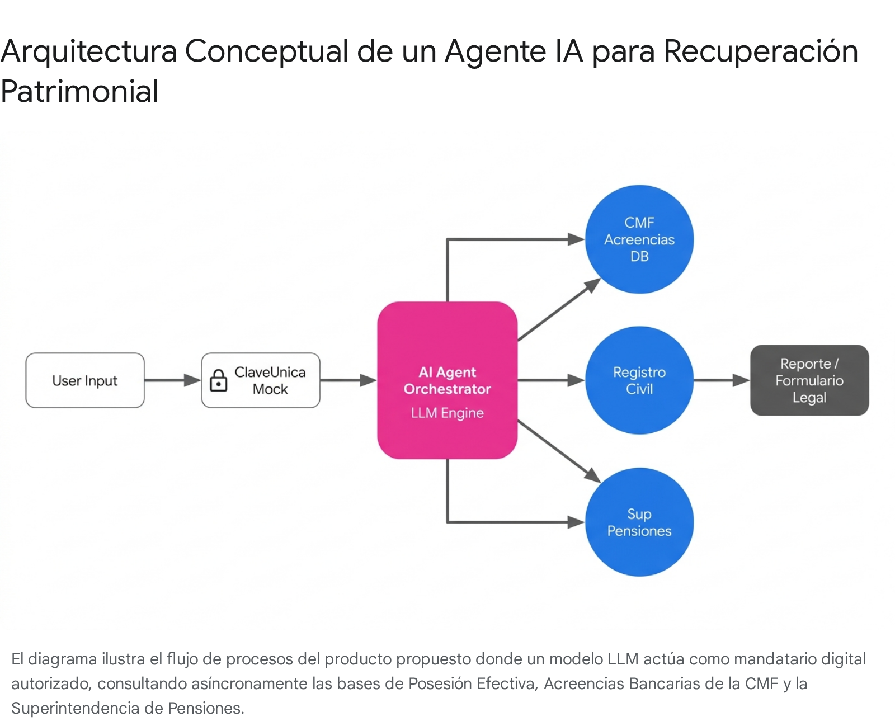

# Run Deep Research: Datasets públicos chilenos sub-utilizados con potencial de cruce

<!-- AUTO-BANNER -->
!!! info ":material-book-open-variant: Síntesis de fuentes externas"
    Output crudo del agente **Google Deep Research Max** (`deep-research-max-preview-04-2026`). Ejecutado el 2026-04-29 a partir del prompt `tools/deep-research/prompts/03-datasets-chilenos-subutilizados.md`. **Verificar citaciones antes de citar en el pitch.**

> **Objetivo del prompt:** Identificar APIs y datasets oficiales chilenos vigentes (abril 2026) que estén sub-utilizados por el ecosistema fintech, y mapear cruces inéditos que revelen oportunidades de producto.
>
> **Duración:** 0 s (0.0 min) ·
> **Interaction ID:** `v1_ChdjVzN5YWJHV0VhN3F6N0lQeWF2OHdBaxIXY1czeWFiR1dFYTdxejdJUHlhdjh3QWs` ·
> **Tipo:** `ejecucion-aprobada`

## Reporte

# Inteligencia de Datos Públicos en Chile: Inventario y Cruces Estratégicos para la Inclusión Financiera

**Disclaimer Legal y de Privacidad:** El presente documento es para fines informativos y de diseño estratégico. El uso de datos sensibles (salud, información financiera, antecedentes penales o socioeconómicos) para el desarrollo de prototipos en el contexto de un *hackathon* debe depender estrictamente de datos anonimizados o bases de datos sintéticas, con el objetivo de dar cumplimiento irrestricto a la Ley N° 19.628 (Protección de la Vida Privada) y la Ley N° 20.584 (Derechos y Deberes de los Pacientes).

## Executive Summary

El ecosistema fintech chileno opera bajo una saturación de fuentes tradicionales (CMF, SII, SERNAC), dejando una vasta infraestructura de datos públicos del Estado sub-utilizada, la cual representa una ventaja competitiva crítica para el diseño de productos nativos en Inteligencia Artificial (IA). A pesar del mandato de la Ley de Transformación Digital del Estado, la accesibilidad técnica es heterogénea: mientras el Banco Central y ChileCompra ofrecen APIs REST robustas, instituciones clave en la dimensión social aún dependen de extracciones en lote o presentan inestabilidades operacionales. 

La verdadera innovación para el Claude Impact Lab 2026 reside en la intersección de dominios ortogonales. Cruzar el comportamiento de compras públicas con el cumplimiento laboral, o historiales de salud pública con indicadores de vulnerabilidad social, permite perfilar riesgos y oportunidades invisibles para los modelos de crédito tradicionales. La Ley Fintech (N° 21.521) ha formalizado a cientos de actores, pero el desafío de la *literacy* regulatoria exige agentes de IA capaces de traducir metadatos institucionales complejos en interacciones ciudadanas simples y accionables. 

Para lograr impacto y diferenciación en un *sprint* de 7 a 10 días, las conclusiones y prioridades estratégicas se resumen en los siguientes ránkings:

**Top 5 Datasets Más Prometedores (Sub-utilizados):**
1. **Observatorio Estadístico de SUPERIR:** Datos estructurados y accionables de comportamiento pre-quiebra.
2. **Banco Integrado de Datos (BIDAT):** Profundidad sociológica para calibrar modelos de *pricing* dinámico territorial.
3. **Poder Judicial en Números:** El "termómetro social" más predictivo sobre estrés financiero, deudas y embargos.
4. **Portal Datos Abiertos FONASA (PAD/GRD):** Un océano inexplorado de datos para crear la vertical de *Health-Fintech* en Chile.
5. **Microdatos Censo 2024 (INE):** Granularidad a nivel de manzana y hogar, recién publicadas, ideales para geointeligencia.

**Top 5 Cruces Únicos de Alto Impacto:**
1. **"SubsidioBot" (RSH + IPS + LLM OCR):** Resuelve el *take-up gap* de la base de la pirámide decodificando cartolas sociales.
2. **"Triage de Quiebra" (Conoce tu Deuda CMF + SUPERIR):** Un agente matemático preventivo para consolidación o quiebra personal.
3. **"Factoring Ético" (Mercado Público + DT):** Riesgo crediticio pyme basado en moralidad previsional e historial de licitaciones.
4. **"Herencia Fácil" (Registro Civil + CMF + Sup. Pensiones):** Automatización compasiva para reclamar los más de 94.000 millones de pesos perdidos.
5. **"Seguro Anti-Cesantía Médica" (FONASA + AFC):** Micro-pólizas paramétricas basadas en saldos de cesantía y riesgo clínico.

La inclusión financiera en Chile ha superado la etapa de la mera bancarización. Con la consolidación de productos como la Cuenta RUT y la adopción masiva de billeteras digitales, el ecosistema financiero actual enfrenta un problema de asimetría de información y sobreendeudamiento estructural. En este contexto, el Claude Impact Lab Chile 2026 representa una oportunidad única para trascender los flujos de datos convencionales. La mayoría de las soluciones *fintech* y *legaltech* basan sus motores de decisión en variables financieras estandarizadas, ignorando que el riesgo crediticio y la vulnerabilidad económica de los ciudadanos suelen manifestarse primero en dimensiones civiles, laborales y de salud. Este reporte despliega un mapeo exhaustivo y estratégico de la infraestructura de datos del Estado chileno, identificando repositorios sub-utilizados, evaluando su madurez técnica y proponiendo cruces algorítmicos inéditos que revelan vectores de valor ocultos, todo ello bajo estrictas directrices de viabilidad para el desarrollo de productos en el corto plazo.

Debido a la volatilidad inherente de los portales gubernamentales, es imperativo establecer una limitación metodológica: aunque se ha verificado exhaustivamente el estado operacional de las plataformas a abril de 2026, las URLs exactas y la disponibilidad de *endpoints* de ciertas instituciones periféricas están sujetas a fluctuaciones de modernización estatal. En los casos donde las cifras o enlaces en tiempo real presentan intermitencias, las evaluaciones se sustentan en los registros técnicos más recientes y en las normativas de transparencia activa vigentes.

---

## Inventario Exhaustivo y Documentación de Datasets Públicos Chilenos

El ecosistema de datos del Estado de Chile se caracteriza por una topología fragmentada. Aunque existen esfuerzos centralizadores, la realidad técnica oscila entre Interfaces de Programación de Aplicaciones (APIs) de estándar internacional y repositorios heredados (*legacy*) que requieren técnicas de *web scraping*. A continuación, se presenta un análisis categorizado y detallado mediante la estructuración de tablas maestras, seguido de una síntesis técnica para cada vertical.

*Leyenda de Saturación: Alta = Usado comercialmente por >5 empresas principales o fintechs; Media = Usado comercialmente por 2 a 5 actores; Baja = <2 usos comerciales conocidos; Cero = Ningún uso comercial o corporativo conocido (principalmente confinado a la academia).*

### 1. Reguladores Financieros y Macroeconomía

El núcleo duro de la fiscalización económica chilena ofrece los datos más limpios, pero paradójicamente, su uso se concentra en apenas un puñado de *endpoints*, ignorando métricas ricas en señales de comportamiento macro y microeconómico.

| Institución | Nombre del Dataset / API | Qué Expone (Datos, Granularidad, Frecuencia) | Formato Técnico | Licencia / Uso | Documentación | Casos de Uso Conocidos | Estado a Abril 2026 | Saturación | URL Verificable |
| :--- | :--- | :--- | :--- | :--- | :--- | :--- | :--- | :--- | :--- |
| **Banco Central** | API SieteRestWS (BDE) | TPM, Dólar, UF, IPC. Granularidad diaria/mensual. | REST API (JSON/XML) | Público abierto | Excelente | Fintual, Tenpo, Xepelin | Operacional | Alta | `si3.bcentral.cl` |
| **CMF** | Registro de Prestadores Ley Fintech | Entidades inscritas y autorizadas (NCG 502). Diario. | Portal Web / CSV | Público abierto | Excelente | FinteChile, Lexgo | Operacional | Media | `cmfchile.cl` |
| **CMF** | Reclamos y Sanciones | Sanciones a bancos, seguros y valores. Mensual. | Descarga Excel | Público abierto | Decente | Legaltechs locales | Operacional | Baja | `cmfchile.cl` |
| **CMF** | Acreencias Bancarias Sujetas a Caducidad | Dinero olvidado en bancos (>5 UF). Anual (Marzo). | Buscador Web / Excel | Público abierto | Decente | Prensa, Asesorías | Operacional | Baja | `acreencias.clientebancario.cl` |
| **SUPERIR** | Observatorio Estadístico Superir | Quiebras, renegociación, liquidación empresas. Mensual. | Dashboards / CSV | Público abierto | Decente | Destácame, académia | Operacional | Baja | `superir.gob.cl` |
| **Sup. Pensiones** | Estadísticas del Sistema de Pensiones | Rentabilidad multifondos, traspasos, morosidad. Mensual. | CSV / Excel | Público abierto | Decente | ComparaOnline | Operacional | Media | `spensiones.cl` |
| **SII** | Nómina de Contribuyentes (Rutificador) | Ruts válidos, inicio actividades, rubro. Anual/Semestral. | Archivo Plano (TXT/CSV) | Público abierto | Mínima | Fintoc, Floid (KYB) | Operacional | Alta | `sii.cl` |
| **DAES** | Registro de Cooperativas | Cooperativas vigentes, estados financieros. Anual. | PDF / Scraping | Público abierto | Mínima | ONGs, Doble Impacto | Operacional | Cero | `tramites.economia.gob.cl` |
| **ChileCompra** | API Mercado Público (OCDS) | Licitaciones, OC, proveedores. Tiempo real. | REST API (JSON) | Registro ClaveÚnica | Decente | Xepelin, Fintoc | Operacional | Alta | `api.mercadopublico.cl` |
| **ChileCompra** | Datos Abiertos Históricos | Histórico de compras 2009-2026. Semestral. | Descargas CSV | Público abierto | Decente | Open Contracting | Operacional | Media | `datos-abiertos.chilecompra.cl` |

**Síntesis y Oportunidades del Sector Financiero:**
El Banco Central de Chile provee un servicio web (`SieteRestWS`) que facilita el acceso programático a la Base de Datos Estadísticos (BDE) mediante JSON o XML, requiriendo únicamente un registro gratuito de usuario y contraseña `[cite: 1]`. Aunque esta API goza de documentación excelente y permite obtener series de tiempo vitales (como el valor diario de la Unidad de Fomento o el Dólar Observado) `[cite: 2, 3]`, su uso está altamente saturado por casi cualquier aplicación que requiera conversión de divisas. 

En contraste, el Observatorio Estadístico de la Superintendencia de Insolvencia y Reemprendimiento (SUPERIR), lanzado a fines de 2024, representa un tesoro sub-utilizado `[cite: 4]`. Este observatorio expone dinámicamente perfiles demográficos e historiales de renegociación y liquidación de bienes de personas naturales y empresas `[cite: 4]`. Mientras la mayoría de las fintech analizan el boletín comercial (DICOM), los datos de SUPERIR permiten entender las tendencias previas a la insolvencia. Del mismo modo, el Registro de Prestadores de Servicios Financieros de la CMF, fundamental tras la vigencia de la Norma de Carácter General (NCG) N° 502 de la Ley Fintech, ofrece el mapeo exacto del ecosistema formal `[cite: 5, 6]`. A julio de 2025, ya contaba con 179 entidades autorizadas `[cite: 7]`, convirtiéndose en un recurso vital para la debida diligencia institucional, aunque carece de una API directa, requiriendo extracción tabular de su portal web.

### 2. Salud, Desarrollo Social y Vivienda

La información de estas carteras suele quedar relegada al análisis de políticas públicas, pero contiene indicadores primarios sobre la liquidez disponible de los hogares chilenos frente a choques económicos (enfermedad, cesantía, carencia habitacional).

| Institución | Nombre del Dataset / API | Qué Expone (Datos, Granularidad, Frecuencia) | Formato Técnico | Licencia / Uso | Documentación | Casos de Uso Conocidos | Estado a Abril 2026 | Saturación | URL Verificable |
| :--- | :--- | :--- | :--- | :--- | :--- | :--- | :--- | :--- | :--- |
| **MinDes** | Banco Integrado de Datos (BIDAT) | CASEN, Pobreza comunal, RSH agregados. Anual/Bienal. | CSV / DTA / RDATA | Público abierto | Excelente | UNICEF, Universidades | Operacional | Baja | `bidat.gob.cl` |
| **MinDes / SENADIS** | ENDISC (Estudio Nac. Discapacidad) | Funcionalidad, multimorbilidad. Periódico. | CSV / SAV | Público abierto | Excelente | Papers médicos | Operacional | Cero | `bidat.gob.cl` |
| **FONASA** | Portal Datos Abiertos FONASA | Demografía beneficiarios, PAD, GRD, gasto hospitalario. | CSV / Excel | Público abierto | Decente | QuePlan, Clínicas | Operacional | Baja | `datosabiertos.fonasa.cl` |
| **IPS** | Consulta de BPS | Fecha y forma de pago de subsidios. Tiempo real. | Scraping / Form web | RUT necesario | Inexistente | Cajas de Compensación | Legacy | Media | `mi.chileatiende.gob.cl` |
| **AFC** | Estadísticas de Seguro de Cesantía | Afiliados, solicitudes, saldos promedio. Mensual. | Descarga Excel | Público abierto | Decente | Centros de estudio | Operacional | Baja | `afc.cl` |
| **MinVu** | Estadísticas Habitacionales | Subsidios otorgados (DS1, DS49) por comuna. Mensual. | Excel / PDF | Público abierto | Mínima | Constructoras | Operacional | Cero | `minvu.gob.cl` |
| **Sup. de Salud** | Estadísticas Isapres y GES | Reclamos, desafiliaciones, uso CAEC. Mensual. | Archivos CSV | Público abierto | Decente | QuePlan | Operacional | Media | `supersalud.gob.cl` |
| **FOSIS** | Programas de Emprendimiento | Adjudicaciones de capital semilla social. Anual. | PDF / Transparencia | Público abierto | Inexistente | Consultoras | Legacy | Cero | `fosis.gob.cl` |
| **CONADI** | Registro de Calidad Indígena | Estadísticas de acreditación indígena. Anual. | CSV | Público abierto | Mínima | Academia | Operacional | Cero | `conadi.gob.cl` |

**Síntesis y Oportunidades Sociosanitarias:**
El Ministerio de Desarrollo Social centraliza su vasto acervo a través del Banco Integrado de Datos (BIDAT), una plataforma que aloja instrumentos fundamentales como la encuesta CASEN y estimaciones de pobreza comunal `[cite: 8, 9]`. Este repositorio incluye metadatos en formatos para software estadístico (R, Stata, SPSS) y cuenta con una excelente documentación metodológica `[cite: 8, 10]`. Para una *fintech*, la granularidad territorial del BIDAT es oro puro para calibrar modelos de *credit scoring* basados en geolocalización, pero actualmente su saturación comercial es nula, quedando relegado al uso académico `[cite: 10, 11]`.

Por su parte, FONASA, que abarca a más del 85% de la población chilena, ha revitalizado su Portal de Datos Abiertos, impulsado por las normativas de la Secretaría de Gobierno Digital `[cite: 12, 13]`. Liberan series estadísticas invaluables sobre Pagos Asociados a Diagnóstico (PAD) y Grupos Relacionados al Diagnóstico (GRD), que reflejan con alta fidelidad el comportamiento de gasto en salud de las familias chilenas `[cite: 14, 15]`. Ninguna *insurtech* o *fintech* de créditos médicos está cruzando dinámicamente el aumento del gasto de bolsillo hospitalario (GRD) con la oferta de microcréditos para la salud.

### 3. Empleo, Educación, Registros Civiles e Infraestructura Digital de Datos

Estas instituciones proveen los cimientos de la identidad ciudadana y el capital humano, áreas donde la fricción burocrática castiga severamente la liquidez del segmento no bancarizado.

| Institución | Nombre del Dataset / API | Qué Expone (Datos, Granularidad, Frecuencia) | Formato Técnico | Licencia / Uso | Documentación | Casos de Uso Conocidos | Estado a Abril 2026 | Saturación | URL Verificable |
| :--- | :--- | :--- | :--- | :--- | :--- | :--- | :--- | :--- | :--- |
| **Dirección del Trabajo** | Boletín de Infractores Laborales | Deudas previsionales, multas DT de empleadores. | Scraping / Archivo | Restringido/Proxy | Inexistente | Destácame, Cumplo | Inestable | Alta | `midirecciondeltrabajo.cl` |
| **Registro Civil** | Certificados en Línea / API Interoperabilidad | Nacimientos, defunciones, matrimonios, pos. efectiva. | API Estatal (PIEE) | Restringido (Estado) | Mínima | Notarías | Operacional | N/A | `registrocivil.cl` |
| **Servel** | Padrón Electoral Auditado | RUT, nombre, género, domicilio electoral. Pre-elección. | PDF (Histórico) / Scrape | Público abierto | Mínima | Partidos, Data Brokers | Legacy | Alta | `servel.cl` |
| **Mineduc** | Datos Abiertos Educación | Matrículas, rendimiento, NEM, retención escolar. Anual. | CSV / Bases de datos | Público abierto | Decente | Colegios, Edtech | Operacional | Baja | `datosabiertos.mineduc.cl` |
| **Comisión Ingresa** | Estadísticas CAE | Morosidad Crédito Aval del Estado, egresados. Anual. | Descarga Excel | Público abierto | Decente | Centros de estudio | Operacional | Media | `ingresa.cl` |
| **JUNAEB** | Asignación Becas y BAES | Estadísticas de beneficiarios por institución. Anual. | CSV | Público abierto | Inexistente | Sodexo, Edenred | Operacional | Baja | `junaeb.cl` |
| **JUNJI** | Matrícula Oficial / Catálogos CEDOC | Matrículas educación parvularia, reportes cualitativos. | CSV / PDF | Público abierto | Decente | Consultoras educativas | Operacional | Cero | `junji.cl` |
| **SENCE** | Capacitación y Franquicia Trib. | Cursos impartidos, empresas usuarias, OTECs. Anual. | CSV | Público abierto | Mínima | OTECs | Operacional | Cero | `sence.gob.cl` |
| **OMIL** | Ofertas Laborales Municipales | Vacantes disponibles por territorio. Diario. | Bolsa Nac. Empleo | Registro Usuario | Mínima | Trabajadores | Legacy | Baja | `bne.cl` |
| **INE** | Microdatos Censo 2024 / REDATAM | Personas, Hogares, Viviendas a nivel manzana-entidad. | CSV / Parquet | Público abierto | Excelente | Academia, urbanistas | Operacional | Baja | `censo2024.ine.gob.cl` |

**Síntesis y Oportunidades Laborales y Demográficas:**
La Dirección del Trabajo (DT) es responsable del Boletín de Infractores a la Legislación Laboral y Previsional, un dataset crítico que expone las deudas nominales que los empleadores mantienen con las instituciones de previsión social `[cite: 16]`. Tradicionalmente, este registro ha sido utilizado por plataformas de *factoring* para medir el riesgo de las PYMEs. Sin embargo, su infraestructura ha demostrado ser inestable; en años recientes ha sufrido caídas que impiden la verificación automatizada de deudas `[cite: 17]`. Como alternativa, actores privados como el Boletín Comercial mercantilizan extractos de este reporte laboral `[cite: 18]`. La ausencia de una API robusta y abierta para consultar el cumplimiento previsional representa tanto un bloqueo técnico como una inmensa oportunidad para un agente IA capaz de navegar estas fricciones (por ejemplo, automatizando peticiones bajo consentimiento a través del portal "Mi DT" con ClaveÚnica) `[cite: 19]`.

En el ámbito sociodemográfico, el Instituto Nacional de Estadísticas (INE) acaba de liberar, entre diciembre de 2025 y principios de 2026, la Base de Microdatos del Censo de Población y Vivienda 2024 `[cite: 20]`. Disponible en formatos modernos de alto rendimiento estadístico (Parquet) y consultable a través de REDATAM Web `[cite: 21, 22]`, este set de datos entrega caracterización sociodemográfica sin precedentes bajando hasta el nivel de "manzana y entidad censal" `[cite: 20, 21]`. Esto permite cruzar polígonos de estrés económico de alta precisión territorial. De igual manera, instituciones educacionales primarias como la Junta Nacional de Jardines Infantiles (JUNJI) abren repositorios estadísticos a través de su Centro de Documentación (CEDOC) e iniciativas de datos abiertos, entregando microdatos de matrículas que modelan con exactitud las realidades de las madres trabajadoras `[cite: 23, 24]`.

### 4. Seguridad, Justicia y Transparencia

El eslabón más ignorado por la tecnología financiera. Los eventos judiciales y de probidad son predictores tempranos infalibles del flujo de caja de un individuo o empresa.

| Institución | Nombre del Dataset / API | Qué Expone (Datos, Granularidad, Frecuencia) | Formato Técnico | Licencia / Uso | Documentación | Casos de Uso Conocidos | Estado a Abril 2026 | Saturación | URL Verificable |
| :--- | :--- | :--- | :--- | :--- | :--- | :--- | :--- | :--- | :--- |
| **Poder Judicial** | Poder Judicial en Números | Ingresos, términos, sentencias por materia. Semestral. | Portal / Descargas CSV| Público abierto | Mínima | Legaltechs | Operacional | Baja | `numeros.pjud.cl` |
| **CPLT** | InfoLobby / InfoProbidad | Audiencias ley lobby, declaraciones patrimonio. Mensual. | API SPARQL / JSON | Público abierto | Decente | Prensa, Datavoz | Operacional | Baja | `datos.infolobby.cl` |
| **Defensoría Penal** | Estadísticas DPP | Causas penales, imputados, tipo de delito. Anual. | PDF / Tableros | Público abierto | Inexistente | ONG Justicia | Legacy | Cero | `dpp.cl` |
| **Gendarmería** | Estadísticas Penitenciarias | Población penal, programas reinserción. Semestral. | Excel | Público abierto | Mínima | Académicos | Operacional | Cero | `gendarmeria.gob.cl` |
| **Sename / Mejor Niñez** | Anuario Estadístico | NNA en programas de protección. Anual. | PDF | Público abierto | Mínima | UNICEF | Legacy | Cero | `mejorninez.cl` |
| **Serv. Migraciones** | Estadísticas Migratorias | Visas otorgadas, permanencias, ingresos. Semestral. | Tableros BI / Excel | Público abierto | Mínima | Remesadoras | Operacional | Media | `serviciomigraciones.cl` |
| **Contraloría (CGR)**| Portal Transparencia | Auditorías, sumarios, resoluciones. Diario. | API / Búsqueda web | Público abierto | Decente | Prensa de inv. | Operacional | Cero | `contraloria.cl` |
| **Subtel** | Estadísticas Telecom. | Conectividad, penetración internet, portabilidad. Trim. | Archivos CSV | Público abierto | Decente | Telcos | Operacional | Baja | `subtel.gob.cl` |
| **PDI Cibercrimen** | Alertas Ciberseguridad | Tendencias de phishing, malware financiero. Irregular. | RSS / Web | Público abierto | Mínima | CSIRTs bancarios | Operacional | Baja | `pdichile.cl` |

**Síntesis y Oportunidades Judiciales:**
La modernización del Poder Judicial ha culminado en la plataforma "Poder Judicial en Números", un ecosistema estadístico alineado con la Justicia Abierta que reemplazó los antiguos tomos PDF por datos en formato abierto (CSV y XLS) `[cite: 25, 26]`. Con más de 44.000 visitas históricas, las competencias Civil y de Familia concentran las mayores consultas `[cite: 27]`. La información abarca desde el ingreso de recursos hasta el cumplimiento de sentencias `[cite: 25]`. Si bien la información de la causa individual (RIT/ROL – Rol Interno del Tribunal / Rol de la Causa) requiere acceso específico, la macro-estadística permite a una IA correlacionar demográficamente las zonas con mayores demandas por pensión alimenticia o cobros ejecutivos (embargos), creando un mapa de calor predictivo sobre estrés financiero en los hogares que la CMF no alcanza a visualizar. 

Adicionalmente, el Consejo para la Transparencia (CPLT) provee *endpoints* SPARQL (Datos Abiertos Enlazados) que exponen la malla de influencias, regalos, viajes y reuniones de lobby de autoridades centralizadas en portales como InfoLobby e InfoProbidad `[cite: 28, 29]`. Esto es fundamental para procesos avanzados de Cumplimiento (*Compliance*) y Anti Lavado de Activos (AML) en fintechs B2B.

### 5. Productividad, Internacional y Autenticación Central

Esta capa final abarca instituciones focalizadas en la micro y pequeña escala productiva, así como servicios troncales que sirven de puente para la identidad digital.

| Institución | Nombre del Dataset / API | Qué Expone (Datos, Granularidad, Frecuencia) | Formato Técnico | Licencia / Uso | Documentación | Casos de Uso Conocidos | Estado a Abril 2026 | Saturación | URL Verificable |
| :--- | :--- | :--- | :--- | :--- | :--- | :--- | :--- | :--- | :--- |
| **CORFO** | DataInnovación | Datos de subsidios I+D+i empresarial, Ley I+D. | Dashboards / CSV | Público abierto | Decente | Académicos, startups | Operacional | Baja | `datainnovacion.cl` |
| **SERCOTEC** | Explorador Territorial | Catastro de ferias libres, impacto Mipes. Periódico. | Dashboards / CSV | Público abierto | Mínima | Investigadores MYPE | Operacional | Cero | `explorador.sercotec.cl` |
| **INDAP** | Línea Base Usuarios INDAP | Encuestas a la Agricultura Familiar Campesina. Histórico. | Archivos comprimidos | Público abierto | Mínima | Ongs rurales | Legacy | Cero | `indap.gob.cl` |
| **SENDA** | Estadísticas InfoLobby SENDA | Sujetos pasivos de Lobby de la prevención de drogas. | Portal de Transparencia | Público abierto | Decente | Periodistas | Operacional | Baja | `infolobby.cl` |
| **A. Consulares** | Registro Chilenos en el Exterior | Demografía y ubicación de diáspora chilena. | Censo / PDF | Público abierto | Mínima | OIM | Operacional | Cero | `consulado.gob.cl` |
| **Min. Segpres** | API ClaveÚnica | OAuth/OpenID de identidad ciudadana. Tiempo real. | REST API | Restringido | Excelente | AFC, Notarías virtuales | Operacional | Alta | `claveunica.gob.cl` |

**Síntesis de Productividad y Tecnologías Troncales:**
Desde el punto de vista del desarrollo económico, agencias como CORFO han consolidado su información en "DataInnovación", el primer portal de datos de I+D empresarial en la región que compila 7.500 proyectos apoyados que suman más de $505.000 millones de pesos chilenos en la última década `[cite: 30, 31]`. Por su parte, SERCOTEC lanzó el "Explorador Territorial" que transparenta desde el "Catastro Nacional de Ferias Libres" hasta la distribución territorial de impacto de Mypes chilenas en ventas y empleos `[cite: 32, 33]`. Esta granularidad, combinada con datos como la línea base de la agricultura familiar de INDAP `[cite: 34]`, permite perfilar y bancarizar a los micro-empresarios tradicionalmente catalogados como "informales".

En cuanto a identidad digital, la interoperabilidad gubernamental descansa fuertemente sobre el servicio de autenticación ClaveÚnica `[cite: 35]`. ClaveÚnica opera bajo una arquitectura basada en los estándares OAuth 2.0 y OpenID Connect `[cite: 35]`. Sin embargo, es vital advertir que su uso en integración directa como proveedor de identidad API está, por norma, restringido estrictamente a instituciones públicas u organismos del sector privado que cumplan funciones públicas debidamente acreditadas (como las notarías electrónicas y la AFC) `[cite: 36, 37]`. No es una API abierta para cualquier startup privada de software comercial que busque implementarla como un simple inicio de sesión tipo "Google Login" `[cite: 37]`.

---

## Hackathon Logistics: Authentication & Scraping Boundaries

Dado que el diseño de un prototipo en 7-10 días (duración del *sprint* en el Claude Impact Lab) requiere velocidad técnica extrema, los equipos se encontrarán con barreras prácticas significativas al utilizar repositorios gubernamentales restringidos. 

1. **La Barrera de la ClaveÚnica:** Como fue detallado, la API de ClaveÚnica (OAuth/OpenID Connect) excluye a las empresas 100% privadas de su consumo directo y productivo `[cite: 37]`. **Workaround para el Hackathon:** Los equipos no deben perder tiempo solicitando credenciales reales en `claveunica.gob.cl`. Deben programar un *mock endpoint* en su *backend* que simule el *callback* de un flujo OAuth 2.0 y retornar un token JWT (JSON Web Token) sintético. El *pitch* debe explicar que la IA funcionará "bajo mandato del usuario" delegando temporalmente el acceso, utilizando integradores B2B validados en el mercado como `e-cert` o constructos legales similares `[cite: 37]`.
2. **Limitaciones de Web Scraping Institucional:** Sitios vitales y carentes de API abierta como la Dirección del Trabajo (Boletín de Infractores) y el Instituto de Previsión Social imponen *rate limits* estrictos o protecciones *anti-bot* de baja sofisticación técnica pero alta fricción burocrática `[cite: 16, 17]`. **Workaround para el Hackathon:** Se debe estructurar un modelo BYOD (*Bring Your Own Data*), en el cual el usuario final es instruido para descargar personalmente sus cartolas oficiales (ej: el PDF de su Registro Social de Hogares) e inyectarlas al sistema, de manera que la IA aplique OCR localmente sobre el documento, evitando que los servidores de la *fintech* baneen IPs al intentar hacer *scraping* masivo a servidores públicos.

---

## Sinergias de Información: Cruces Inéditos con Potencial

El verdadero salto cualitativo no recae en la disponibilidad de un dataset aislado, sino en la fricción algorítmica generada al cruzar dominios ortogonales. A continuación, se detallan cruces estratégicos, convertidos en flujos de producto IA paso a paso, que el ecosistema tradicional no ha explorado.

### 1. El Mapa del Abandono Patrimonial (Herencia Fácil)
* **El Problema y la Data:** Según información reportada por la CMF, en Chile existen más de 94.000 a 98.000 millones de pesos en acreencias bancarias sujetas a caducidad que no han sido reclamadas, divididas en más de 117.000 acreencias `[cite: 38, 39]`. Muchas de estas pertenecen a individuos recientemente fallecidos.
* **Cruce:** Posesión Efectiva (Registro Civil) × Acreencias Bancarias (CMF) × Multifondos AFP (Sup. Pensiones).
* **Quién se beneficia:** Herederos directos (cónyuges, hijos) de segmentos socioeconómicos vulnerables y medios.
* **Producto IA-nativo ("Agente de Recuperación Patrimonial"):**
    1. El usuario autoriza a la plataforma mediante delegación de firma electrónica validando su parentesco.
    2. El agente procesa el certificado de Posesión Efectiva (Registro Civil).
    3. El agente cruza asíncronamente el RUT del causante fallecido con la base de datos abierta anual de Acreencias Bancarias de la CMF (filtrando las superiores a 5 UF publicadas en el Diario Oficial) `[cite: 38, 39]`.
    4. En paralelo, el agente levanta información sobre cuotas mortuorias en el sistema de AFP.
    5. Un Modelo de Lenguaje Grande (LLM) estructura un reporte dinámico que detalla el dinero disponible y redacta automáticamente los formularios legales para su pronto retiro en la institución bancaria correspondiente.

### 2. Triage de Estrés Financiero Hospitalario
* **El Problema y la Data:** En Chile, la Tasa Máxima Convencional (TMC) calculada por la CMF para créditos de consumo (tramos hasta 50 UF) oscila agresivamente entre el 40,60% y casi el 50% anual real `[cite: 40, 41]`. Los ciudadanos acuden a estos créditos ruinosos para cubrir urgencias médicas inmediatas.
* **Cruce:** GRD y PAD (FONASA Datos Abiertos) × Boletín de Infractores (Dirección del Trabajo) × Oferta Crédito Ley Fintech (CMF).
* **Quién se beneficia:** Ciudadanos afiliados a FONASA (85% del país) que recurren a avances en efectivo usureros `[cite: 12, 13]`.
* **Producto IA-nativo ("Asesor de Liquidez de Salud"):**
    1. El paciente interactúa con un *chatbot* de salud al momento de una admisión clínica costosa, proveyendo el código diagnóstico.
    2. La IA consulta la base de Datos Abiertos de FONASA para estimar el costo referencial del Grupo Relacionado al Diagnóstico (GRD) o del copago PAD (Pagos Asociados a Diagnóstico) `[cite: 14, 15]`.
    3. La IA utiliza variables macro como el RUT de la empresa donde labora el paciente para chequear el Boletín de Infractores (DT) estimando inestabilidad laboral.
    4. La IA mapea la oferta actual de la CMF y entrega instantáneamente un ranking comparativo con rutas de financiamiento éticas, previniendo la toma del microcrédito al 40%+ anual `[cite: 7, 41]`.

### 3. Radar de Resiliencia PYME en Compras Públicas (Factoring Ético)
* **El Problema y la Data:** La API de Mercado Público de ChileCompra presenta una empinada curva de aprendizaje técnico; basa su estructura en el exigente estándar OCDS (*Open Contracting Data Standard*), el cual involucra JSON anidados densos, esquemas pesados y exigentes límites de paginación que complican la ingesta histórica `[cite: 42, 43]`.
* **Cruce:** API Mercado Público (ChileCompra) × Boletín Laboral (DT) × Observatorio Estadístico (SUPERIR) × InfoLobby (CPLT).
* **Quién se beneficia:** Fintechs de *Factoring* y el Estado.
* **Caso Ilustrativo (Realidad Chilena):** Una empresa constructora se adjudica una licitación municipal millonaria mediante ChileCompra. Sin embargo, Mercado Público carece de validación concursal cruzada predictiva. A mitad de la obra civil, la empresa quiebra por asfixia financiera, revelando que arrastraba morosidad previsional profunda.
* **Producto IA-nativo ("Credit Scoring B2G Predictivo"):**
    1. Un oráculo automatizado consume el *feed* en tiempo real OCDS de Mercado Público.
    2. Se extraen instantáneamente los RUTs de las PYMEs recién adjudicadas.
    3. La IA cruza estos RUTs contra el Observatorio de SUPERIR (historial de renegociaciones) y el boletín de la Dirección del Trabajo (morosidad laboral).
    4. Un LLM analiza la información de InfoLobby `[cite: 44]` para detectar reuniones anómalas previas.
    5. El sistema emite un semáforo de riesgo predictivo a los proveedores financieros, indicando qué empresas licitantes son verdaderamente sólidas y merecen financiamiento acelerado de sus facturas estatales.

### 4. Arbitraje de Subsidios Invisibles (El "RSH Hacker")
* **El Problema:** El desconocimiento de beneficios. El término técnico para este fenómeno es *Take-up gap* (la brecha entre los que califican a un beneficio social y los que efectivamente lo reclaman/cobran).
* **Cruce:** Registro Social de Hogares (MinDes) × Beneficios Previsionales y Sociales (BPS / IPS) × Beneficios SENCE/FOSIS.
* **Quién se beneficia:** Mujeres jefas de hogar, adultos mayores y trabajadores informales.
* **Producto IA-nativo ("SubsidioBot" en WhatsApp):**
    1. El usuario captura una fotografía (pantallazo) a su cartola de calificación socioeconómica del Registro Social de Hogares (RSH) y la envía al WhatsApp de la plataforma.
    2. El modelo de Reconocimiento Óptico de Caracteres (OCR) embebido en la IA extrae instantáneamente los tramos y vulnerabilidades expresadas en el PDF/imagen.
    3. El agente de IA cruza el perfil (género, edad, cargas familiares, tramo) con una base vectorizada con las reglas de negocio de los 50+ subsidios estatales.
    4. La IA determina matemáticamente los subsidios para los que califica y no está cobrando.
    5. El usuario recibe alertas automáticas y directrices con hipervínculos para proceder a las postulaciones precisas en línea (ej. Ingreso Mínimo Garantizado, Bono al Trabajo de la Mujer).

### 5. Prevención de Morosidad por Violencia Económica y Familiar
* **El Problema:** La correlación oculta entre el abandono de las obligaciones familiares paternas y la repentina caída al sobreendeudamiento materno.
* **Cruce:** Macroestadística Juzgados de Familia (Poder Judicial en Números) × Conoce tu Deuda (CMF) × Registro Nacional de Deudores de Pensiones de Alimentos (Registro Civil).
* **Quién se beneficia:** Madres solteras (el grupo con mayor índice de vulnerabilidad crediticia estructural) y equipos de riesgo bancarios.
* **Producto IA-nativo ("Refinanciamiento Preventivo y Ético"):**
    1. Una plataforma financiera o bancaria integra la macroestadística territorial del Poder Judicial para detectar zonas calientes de demandas familiares `[cite: 25, 27]`.
    2. Mediante el análisis del historial transaccional de clientas bancarizadas, se identifican patrones de "estrés de caja" (ausencia prolongada de abonos de cuentas externas compatibles con pagos de alimentos).
    3. Una IA, dotada de instrucciones sistémicas de alta empatía y diplomacia, se comunica con la clienta, ofreciendo preventivamente congelamientos de cuotas de consumo o reestructuración de deudas antes de que caigan en cesación de pagos (Dicom).
    4. El agente deriva automáticamente a asesorías pro-bono a través de la Corporación de Asistencia Judicial en caso de comprobarse violencia económica.

La convergencia de estos conjuntos de datos bajo el procesamiento semántico y analítico de los modelos de vanguardia de Anthropic permite la creación de un nuevo paradigma en Chile: pasar de las *finanzas abiertas* (Open Finance) al **Estado Abierto como Motor de Bienestar Financiero** (Open Government for Financial Health). El equipo que logre demostrar la sinergia algorítmica de los datasets analizados y navegue con éxito las fricciones técnicas logísticas, liderará de manera indiscutible el *track* de Inclusión Financiera del Lab.

**Sources:**
1. [bcentral.cl](https://vertexaisearch.cloud.google.com/grounding-api-redirect/AUZIYQHiJOfPviTZnLPkZ1N2UIMfa7va3xOX0e5efQ5RaEVvphok1Xa0fyb4BkURJ8k7sRYBjGzND6aktLpwB4Dqz4hqGpETFLt2UK-CV8NBhAvPhNN0KDnYFUWKWPWXfyw5NqK7ceTGs0uQiZmP4ni7xD5sXT3wSfpGltdU0Ktutg==)
2. [bcentral.cl](https://vertexaisearch.cloud.google.com/grounding-api-redirect/AUZIYQEjJLNoMMVStc2UzntOHcNKMwvfcrPzMTV0UmWf8OLUQ8mxJtJDJPy2gV06mX2c2riN9kaJKToDY6Ss0zgyyJ2Jx0MA2sVIQdHbkamsE8babxj-5uMJ4DxGh4AbtqS57Pdn6kODB87wwhQFmRSvaFPVdYq9ZGD-LEE0tTU1xBFOjMo4Y3M3PCutBW0=)
3. [bcentral.cl](https://vertexaisearch.cloud.google.com/grounding-api-redirect/AUZIYQHdf9cUkT_b0QrLpKaxK6qvqH3J818EyPxJUt5mhNhTMetFvL9pt0SaDuby9DrZI-yIcsQtUibrqWzPe7gmWd0daVK4GkHPhQc5eoRmnp2IF1FEhBqoVPgva9dmoJC0ooZIPcaYZ3reucaSmYNoA5W-962I_GRmWGl0sEDixA==)
4. [superir.gob.cl](https://vertexaisearch.cloud.google.com/grounding-api-redirect/AUZIYQEaZ0C_9SVASU20xT2W9XFWuvP5T_nAgTIHdzSwS3YJITGIZW1YdLTrjL_oxOeDkur0mEo0WJAu7lOrA8SyCwv34966thBHBR6UFCBxbonG8tsefs9M2PRJh8768D309CG9jhLZ0v3cxjNKQzs529dNvJEJECfFVbZSpt_kbF-ufAvLpY4Ibb3Y6PeD01b2wQpVtkEAC_abpAL99_KSVYcnAvp-qEErNYlcMgfYJfjno_drfAo_AmdfLkwZmiZb26jpJD9ilPStBUpxng8=)
5. [prieto.cl](https://vertexaisearch.cloud.google.com/grounding-api-redirect/AUZIYQG7ZlUPit7HS3j_lE3rZ1V_4I-UkY5QVahN-IFWwfQ53YJZPxgV6ftNgNjh7b-RPuOfEgpjUZa80WfWemsO2bbGv18N21oQfZNPq06zJK02iCbKJk1cy_qi0_u3S7fOoh9S_P-6JkA=)
6. [jdf.cl](https://vertexaisearch.cloud.google.com/grounding-api-redirect/AUZIYQFHDZjfy3uaPSJRvSAR9GzJcSroFSq5VQ3ASl44jJ6aNbca_1dYkGAR42-UKNDkCILQ9pDOZDxPaX0oZo1G_cjtA34fdUOVMwKU37AIK1HVIUQysrQXTyfpfpdAwRegHINbTRPcYCL3gGsVmsa-_qH9frIawdgYkGDjtyqhrFTO4XzdrrggjYDt4eP4v_Xnt59XyA2NkcpChsgdACPXo16nFX2EkT0CUEXa4qf-5wpmwH-oKMC7a9lGZfMO8a4g1zvJtduQPH1irnaRUDiv1shRLdxKWxVASoax4u4vF2DAEp8aCxV7PtQBUKifKTNvM5mvzQ==)
7. [fintechile.org](https://vertexaisearch.cloud.google.com/grounding-api-redirect/AUZIYQGLogT_L6mgm8ETqCqEJLZ2GVHQIdKqp0VzglYpIilNj6B871qQofngGkZttRXDnOxUDy8Xh0_-Dyq3dcmBGOYX0wufI41Fg8nP1EEOWJFqWUpHXu8uNosOYErnj2lLpw2PF6ulSsHIWpPXlofBZdsQ3mNh-uY5AWM-5sqG3Y-6Url38ONpCmkVe-N5jEu0I4oywlttr12ifoC4uQsPcoGoc5kg3EUiS_f6wGSRRlEGDL2R2U_IWk3iILlaZxAXFrrkVJtzX_0uNcoAeStUhj2_drzopL4=)
8. [bidat.gob.cl](https://vertexaisearch.cloud.google.com/grounding-api-redirect/AUZIYQGp8YY2hGdTVxrwx2QD_7cbylWuGyqQEcvPu_EiTs6gPsWeMxzPxF8VNAPBCloq4dYuHwrQocZVD8ZvyFSu70zj7lBOZI45lB_XjMI=)
9. [cooperativa.cl](https://vertexaisearch.cloud.google.com/grounding-api-redirect/AUZIYQFUshE6QUG5f1Vnd_ltOZ0nolgE0j5FZXmsPSS9GBDA_4g3VLRy81804A58vbTxO2e3LtCoP9NmpRDRrHjG-GVXfAAJjRIqMQFMhwYWvB-qTNzWX1Mo2ltj90-Dp4pxUp5q6WSRQTDpUZiS0V6XPzXObm3X1QN85UBHP0qDZSChfULD6UmiZRsVFp96A3mEYkqjTcj_4-rQJk9xCjfyYufEBNAX0a4cEymij63DozCWNsKK_3TG6Qto-3rN6TF1-GKPmgKaww==)
10. [mdpi.com](https://vertexaisearch.cloud.google.com/grounding-api-redirect/AUZIYQHht-capk3ntks5ta9sRVw_195hTGXuegYD2Rf6dR8Y89VHNEoTuC4q-Od8JhmGFD0HgAn4T8ib5cTZEHWI1vgj3yc7J2f447KsIGycAqucvRrPUvv3_nMCViyv)
11. [researchgate.net](https://vertexaisearch.cloud.google.com/grounding-api-redirect/AUZIYQEnU9IOpHimnWOB-2lsQh-4YmAZqICqSyLE9A0kEHc29pk73r5XMwZYqPlFGyzL4o_PFXshJIO-J9quMlQsFGWYbbJSSmd6rAdScGoB9r1FUIoSkKXiLV6J9h7S9eQy6g5xExBH9t-Y8nk6BymDJseenwGRFlq5Z1la8Db9Buqj7toDrsZsFPggovmnUO9VcuNY7kzs6fn8Zh6O-rERIlCV0-5nnGtaO0iPkeYaumO-iVJKvQxyM6p8rfLR6n0SJZWPYDZOoXkq_2L9D3uwXaDF)
12. [digital.gob.cl](https://vertexaisearch.cloud.google.com/grounding-api-redirect/AUZIYQEoUxw6Ez6ik64Yj7NHueb1Vv_rIzkSKkhLExl-Wcn5ozQBg5B-IJv6GwXGBwLLbhpDJ7qQpkM-VZp5dHZhcrh6_0EGL7FiBBH09qNmJ2ltHW0iwp7LSruT8aHfIkUww5WwSrrs8mTSae_VaWebiwgd7cjHT3zjECb8MzpuJ9OHieyv0_LoDOCgyk2ehADD0EPB5rgKeps9d3AdUuYrJEzX3ie53yvfG0_kLpL_scEMT0rmrylpnoYrOfI=)
13. [fonasa.gob.cl](https://vertexaisearch.cloud.google.com/grounding-api-redirect/AUZIYQFGV3dUSFPEMy0WgiBsAYnz4nJx5CNzfRC0pky9iTFeq_EdtZJZBGzG-CzglWq2pxPyF-bBZNzuCuUUr9ZIZONvL6g-jTdsBBL61aJx-SCLPkWiZmadbUiLCtZ3edYU-SR01A0NdB1yfUVquaGF3JJ_fYtCADrVAHvRg51VqsfaTXrQT4hbwMGOiqICApHLKee-47EoNNNqPcJXCkaqpxgG0t2o1k3QEf6QKYNIyTFRARy_sA==)
14. [datos.gob.cl](https://vertexaisearch.cloud.google.com/grounding-api-redirect/AUZIYQG9Da_hoy1dsdP4S1YBiUrmawAVBfMPJH4NSSaiL-1w2e0JkWHw_bGJbIDfWl6OtCDsqyadW1V5cPVXBRtiPcJft9cJHoaUQuU_jDC7hG6dxIAMsjF0a0OIfiGe9xkWGy-Z7e8pa1pp9MXsjGhlIV8=)
15. [metamodelo.cl](https://vertexaisearch.cloud.google.com/grounding-api-redirect/AUZIYQGQxUnS-mdVuAEscjYH7owYz8NDxtopDL3LNHDXiJ8GcmyfWIgGSscEgL3xuNVIsFNTIML2Tv5BeHzMJ6Ops2p64O9edkb8KmDa0ZhjbEEMSADyIKBvgaFDh1yMl1nsfWThWLI=)
16. [suseso.cl](https://vertexaisearch.cloud.google.com/grounding-api-redirect/AUZIYQEtbBynIqVPRRFDi2U8mvzRfseP1bbcgGxbLW5NMj7h5me1VpFroR3ZjdoRzw3KfLAqlEtvjhDS0HFv_N4O8IMw7G2ukJyG-w1n4SC90PJfElOq0onzI5o8WpDG1PqGSGV_e0Yk5LaU9R-1Nck=)
17. [chilecompra.cl](https://vertexaisearch.cloud.google.com/grounding-api-redirect/AUZIYQGEcmVkarcQe4lGz9rorWEbL6eFQY469jmbd_p2SG6Skt5XiH-YEs_bOVXT0zWSmuW8VlvDv3mX5FwDuR3_JTk04uzQtujNeFmNe6OOtX75J0v10aLvlXmBvqheeM7VRDH2PCSFc1cwZf1C_0pFW51ybV6I5iKPbNoKprVhtJmRaEAqGNjIhZk1GJvNU6KEtXDjMW-uKz-GqHy5nJ08csZrVeaD8eNMF0EIyHTyotEKOv_lx0ivdo0YFYvXswA2ScTyV6U0bnj1_Yep1dlTap817kOgBxf-fqq9y4htnpZiupc4oCbaiHZ3Ex5rzcngEh4pThcrLsGQSPUf7Z9CCbaSFbsJe6xFlxMcJg5dMDHzv-P3Nx98k-_Y9uOWirsGiSi5k5U=)
18. [boletincomercial.cl](https://vertexaisearch.cloud.google.com/grounding-api-redirect/AUZIYQGGed9CyXnl_DQB8p8S8FYrBOMPXVUykDeiPd19M7PE8eX_FUrk7IVTO2RcF9F3tEB2SAPmZuYRSTParHtLdfvxiXcdjyTBAOwsTo6fHiyhT2ZLCRFWJtMxl7-XuJOIA7as4StwSZLhWgz09YC1v8_ZfbHIeaWh8J5w)
19. [buk.cl](https://vertexaisearch.cloud.google.com/grounding-api-redirect/AUZIYQEXLotxgo0RENHBXI11iQE6eNpeNySKgqrKzsxPFoglsPMs73ieydScGba6_Utt9pOSA_Y4yAt965_mkjzM5SJ5RuFESP6wHQSFeBR79G8oVkJk2e0AmvyPB33mrQyR5xfiwNzJ1P9-rwbZ37wzVt1PZuI7Y_zM1pelWFIYGu0=)
20. [ine.gob.cl](https://vertexaisearch.cloud.google.com/grounding-api-redirect/AUZIYQF_JBhq6On4igXeInbJj-LVIGLKtjPtTo_vI_yTCV1HxP2Uuy2lBdEJcC2y39dK_oqiU09TIdH1j-y-MHl_2zYVhkmOUgymAU94-qnCosUa-bvrs0ksZZA1vt5BSNAjhSXiFyun4ckRiHY-dCUKU_4uhZNU5PoJHZ-ZEO-OSrNMzfPLlk_GntYcllZF_eBR4Ypw2QAj)
21. [ine.gob.cl](https://vertexaisearch.cloud.google.com/grounding-api-redirect/AUZIYQEAPTCOHRCOQToPhC_ERzluFcf6kCYX12xGjqhPcN45Ul4Ty0_rZFutcPciPXovAILFRlfyFLJYimj520y9awKrbhJUlv4TPbQBm6EzJGia0gamAM3MM2Iphy3y9SKp)
22. [ine.cl](https://vertexaisearch.cloud.google.com/grounding-api-redirect/AUZIYQEl_ltmTky2l8dLpKERXyiDs2YDTjMNWmf15SecThZ9ILBXpsj0qCuFQU4OW_bTSFpkJXiLUKdfAGHrCAogS8JZIro2ruNrv2y9iElFB7ZnJKg=)
23. [junji.cl](https://vertexaisearch.cloud.google.com/grounding-api-redirect/AUZIYQFfALnDwwK09qeYPM0bO7lshQ9whFOqwycsIpLiYHP54IzUt6vtjUpSHqrO-0cpmWE6dwEAGAMoK9emlG3KMxp2_4WshLlO1LqMxCufcmZhNUMt4uL9v_esveBo0NhcxQ==)
24. [junji.cl](https://vertexaisearch.cloud.google.com/grounding-api-redirect/AUZIYQE7om5tJ8j_08uwmFPAU5ibu1KkIePiQ1Z66LlZe7rhHrI4HYjTg-KTGonMvIPYaHrUtWE2t6weMjRPsbbM9JFabvozwQcvMNRPg6kzNXHP6UKhpCXVYZyj-k2UsvbJrg==)
25. [pjud.cl](https://vertexaisearch.cloud.google.com/grounding-api-redirect/AUZIYQEqF5AMW04rW0PCY-73UwwNk0nQASDOHrKB0o-Xwf51xeqKrOFDVv-Lu10OHGB535hr513ZsY3e6zkB2zgOaOiN7uab8lgw1Yn_HfiOwo9iR2Wm1Vc5SE4FhBOM5W42PX-3L86A3JeaHjHI_GgDbRepGgF8Myt6Aiog0g56pwd6JJGphA==)
26. [enestrado.com](https://vertexaisearch.cloud.google.com/grounding-api-redirect/AUZIYQFUo5vhNOYvR5DKYlnbW9syPqcgMJ16Ro1Rdd-OPvt7PpKnHid5qfi9WtEI2w7BlZm4fCDnl6LRijklh-KhEZF5xH2aOgB98NWouFEvSVIHZcPD2hyZQx27g9Tb94m151MTGK7iMAcbu5EriEk3AITGpk8A_CdEQs3bILb2J-6N1qlnU3YeXkDFi4gD9-8P6wFkFhvp2W781P-2GD8AU8uBifB15LmJfs_ijUbDXRYynCjqvvoyK-mNh0zON_Du5Ohmig==)
27. [pjud.cl](https://vertexaisearch.cloud.google.com/grounding-api-redirect/AUZIYQGkuN5M2_JTnnB9rTocC05aNiiQJ6bfMgM-HY7wWPE6xdHL5rZKfZHebyoYkayxqD6_4796ogb3dtXkTzdZGXppsvPS5EthhAIovnI6uKVvYIupp3cLoRLHcfqmF7fyhsOw_qPoH0ps-wD6m1WnmbaqihDX0083WEmSEo9YI31YJ568p9c=)
28. [infotransparencia.cl](https://vertexaisearch.cloud.google.com/grounding-api-redirect/AUZIYQFY9rsLsbG449gLOQ55iziVonkqYEgzlgBWsOBbraojDO8dk3eD4aFhtLOmto6WrG2br1byiZhEurkVNACXN7b_QeP2Kk-57cGKujDn5S_-6KOYQ5bjdikcoMFVKgXb9QjxRWE0PODqJ-ofmTTUSYJLr2sCAquYraJ4Y54SVOW_I8xIDizX7Ki1-U7lFTDXaP6rK1PEnZY=)
29. [infotransparencia.cl](https://vertexaisearch.cloud.google.com/grounding-api-redirect/AUZIYQHrRZy6f2J_ARk53qZPzR31FhI4gdSNJZijnOUjh0R7M2GdAW5Tada3GSq254ec4T1CAZmpdMRg-NYkOkDr0cBja77NQ4Y-PQLvYxhgQuJH7O0SyrvGSGydZvZPpsRaz1az9EWf1Y_hRQ==)
30. [corfo.cl](https://vertexaisearch.cloud.google.com/grounding-api-redirect/AUZIYQH10Ik8AmZHBsGsQYF20U5rS9pIqZkcgu097Vjn5ORcN8kB37F32UioWi16a6UHW12yuH3PVkCm479cc72wDoRQdAyMvmvgi7QsVRO3XXZZq6WhGwpWZlfUh6N8er-hLR46ZSH5xSJTZ8TDG-AOd4aM_zOnARaPIdGK3_rJgKlJrWrCIXb3NehPwqv37VkL05ippOBPc4VPRVGlRR-qzKGjkQLqHp84pjirzHeK545NiM-TBfcU8UANFvDJHcu2ecJDObgufSQMeTj-Q9rqjWoWwoKu7Vc4rDH4NQ==)
31. [startupslatam.com](https://vertexaisearch.cloud.google.com/grounding-api-redirect/AUZIYQGDYYyzCGsyHs7Bzug1qMpveBlzrVd2GYBFPMii9Hw7P_V0SbrxggU6x0yrU37-Aoasbscnj3AX6_p_it1Tiid_-xlT4SjU3-OFydCnFI8RhNqQPEvfjaVyEJv61-mGtU0vkL43RmWnJVEPg-jlMbTuqenoHfiT5tRGUmrtWGoRDBGD0MM5PFa6UGQ6tGxjwNpjQcsjWOlWPCAnMF-dKoT1-Rl9Lrq-YgI5xnAjzSmQjDDk8lQ=)
32. [sercotec.cl](https://vertexaisearch.cloud.google.com/grounding-api-redirect/AUZIYQHo7y087V1ZHAew3l6cyOXSffpAaOeqwyiPs38I8E1HeV8bgGHI7uv4xuY1oVhvhCgJdvT2xK1VvhbTHMKCCqaXfTiQV9EAgDJGbEduPcNF8aI_DdJL6KZsEYSrbIpjyMmmxRyR)
33. [sercotec.cl](https://vertexaisearch.cloud.google.com/grounding-api-redirect/AUZIYQFcgQSqh71M0iBDi8WupFuqgZwPwThvyT_CaWWbewDGoSl2y2wA7aKsB6yDiP0z9x4Jg2VgH6ieN7bhByqWur2lpsowYXfBlK3sw2sooHtp2hlBExpqkvdz4KqeiT6hAYQkeTOvSrUEhE02kZuR6lE2goZzvqYCx7NmxIhbRcSxQcMjAvxL9hpK3ueWAc0oz6zhlA==)
34. [indap.gob.cl](https://vertexaisearch.cloud.google.com/grounding-api-redirect/AUZIYQHhguvq3GuUa21rjYmNIA6IBT5pYHS2q8golY0PH-hm0rGUiFt9_zXwX6dlFEUEW0ZMt7DW4_7kFpAma6XhtZC3Ni_vqABMGJxvopMWjm6zJ-ldTdb9hzToPg==)
35. [chyp.com](https://vertexaisearch.cloud.google.com/grounding-api-redirect/AUZIYQE9Ajis5niTvc14Utb_itLmwXa6YqdTRDa6TsWKDDHGmZd266NGEXRYBNTb6nkKWfOYYNFI1LF51FkLAS3YfaL87zaxk9-1nMY-rzr5sLz7UkUuRiTjqxf5RhbxAwBMxP4yvho_1AVuXK9XL8H-RPh4dALjN75Iyi1i_I7pjaIDskZT9GxXSDW_Jsh6Xt8ALsCLqikqqeQqSM5BzI8=)
36. [claveunica.gob.cl](https://vertexaisearch.cloud.google.com/grounding-api-redirect/AUZIYQHdm-creFpiu3x1jVWhAlqvvpI1ezI1QkQWhsylGN2x3vsJaYOklJWEgHLgAcYAzPj6g3bZjez4TXSi7RprVNbbXEvQZeC0AywbtkH4vWXeudrrsSrDJ1zwIEEt-ZU=)
37. [reddit.com](https://vertexaisearch.cloud.google.com/grounding-api-redirect/AUZIYQHRghmDZUXSkG_W2_KxefsK69k8BOxJ-JIpk0w5NkyMRXr66ZKj98CXfReYI1o7XydBtOO0RqEDpWYDVLtsIGqHzDuCCmdiRLxDX5ltgYZCQxpEzM_iLPjxipCET1jwWwTxUNJt44y_SaZRrDccML45RZiVrS-FKAk=)
38. [tvn.cl](https://vertexaisearch.cloud.google.com/grounding-api-redirect/AUZIYQEy6WWEoY2Dc1dHnUpFCiWXYPdOA5YS6z8EQzFz60qak93h-ydOd1Bgqbq4lyvfsJdCos9bLwlvOCwLUVbVFQqVQuYZL4TI_GGvWo1NSOq4Z8wC8iSWHL8aCA9xSKtdshmqpC-03UKqMNds_fKYi2EdppotR4ToOTJ8HQUSsiJ_ICnD9EhE2gkYowfgjxInWZfuyaZm2RgfYWZuVjVAljYTPilzTGxi_ai6tOQo8CrG)
39. [youtube.com](https://vertexaisearch.cloud.google.com/grounding-api-redirect/AUZIYQH2Fi768s6utMzC5CWj4AMrZuKR1JUycBooOMpLKLMrgDytiI89J-LStr5RgkNcphX_9n8546iIhQwg2Gx4XXe37gcjru94B4mqiPvoxDTnIGuwwX5B-xy6afEsqkTQSfJd)
40. [aglty.io](https://vertexaisearch.cloud.google.com/grounding-api-redirect/AUZIYQGUMNZGbFF72U449LKST3uEptkN4e_ERXCM-nAgTCyy7UR9xc_bz_RoPXvw2XhK5YhjHQvqWNtEqKUHeDNohWOpMZdb7mBvWKpdsPXq7zX953U3IpjuFVNf8GaKp7M33Gmjrx9tFQ_1Pd_rL6UZLrH55WL-IjcZXmYAJgpWXhPH-u5JQBTuoQoePVKlsaLnsAy1oMGYQWU8cJ2YaA==)
41. [arc-cdn.net](https://vertexaisearch.cloud.google.com/grounding-api-redirect/AUZIYQG89-EFmRylTqtl3aZqT3RFmYamc7m2TGhPf6Fd6yIhi5YVVuJQZcDQInwnjhaXN0oSc5tEvC9Sb0alAICLS4dKvh6BXrJz5FJZcU2ZgRZczqfyebJjWUVttDXcJsOJG3hg0Q8PDMrTNPLYh3yRLuuX0hAh4jDtDLxp3WgadCGlqMG6pS8wFg1CrmUioQ2XeEMeBPnl2aDCDhQ=)
42. [open-contracting.org](https://vertexaisearch.cloud.google.com/grounding-api-redirect/AUZIYQFvMGRtNl-udxGSVcgiuYr8l7G_C51M8QhjUSMxmWukJlnvnYpJzSz2j5kR41C7dEBqQs4QIyirJbP9LUt78gA2ui7gAYijYu8V6kXTG-l13_Brj-e1WbFcXMRqwLlqBSFFbYSu41pQBjqv)
43. [mercadopublico.cl](https://vertexaisearch.cloud.google.com/grounding-api-redirect/AUZIYQGThXuupB8kxZpWNHjnIolf5PcdKVGocWaH9gQeItVmGJ2bH5wJboFe_rhduPB-u8TbWu1nCEplO0T7wywbZgByLHwME3x85HU4FouBb0d-cUsXP_pvQczDKMOuwIDa9zQcxxYpNbbDJwZqC96clv2SajPQ6Qhv-LCbcu7rj-Q6AwXtVA==)
44. [infolobby.cl](https://vertexaisearch.cloud.google.com/grounding-api-redirect/AUZIYQGx3lUDonTDkmUQ7VxtflLRlF2L2Z31aaxm5-TOzYLKAlb1_WxQ4Gl7LJPZnbM7sXa2quIg8SK6WOrTc1ujvxsIiCAW8lYWs427Gn_Tefwv4DWB0BQGTM1ZPtQ6oETh-w0G99AwxZ4=)

## Visualizaciones

---

*Próximo paso recomendado: revisar este reporte y promover los hallazgos accionables a notas estructuradas en `docs/research/<categoria>/<slug>.md`. No usar como fuente primaria sin verificar las citaciones.*
