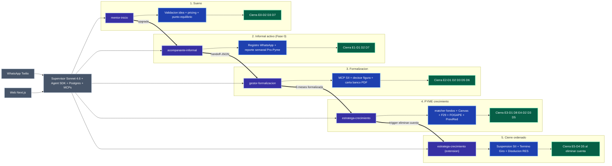

# PRD — Tu Plata Mipyme

<!-- AUTO-BANNER -->
!!! success ":material-check-bold: Producido por el equipo"
    Documento de Requerimiento de Producto consolidado a partir de research, definiciones del producto, ADRs, plan técnico, backlog y reuniones del equipo The Clauders.

> **Tu Plata Mipyme** es un copiloto freemium en WhatsApp + Web que acompaña al microemprendedor chileno desde el sueño hasta la PYME, con agentes IA especializados por etapa que hablan en su idioma y citan la norma.

| | |
|---|---|
| **Versión** | 1.0 |
| **Fecha** | 2026-04-30 |
| **Equipo** | The Clauders (Felipe · Jose · Cristian · Anahi) |
| **Competencia** | Claude Impact Lab Chile 2026 — *El puente al ciudadano* |
| **Línea temática** | Inclusión Financiera ([ADR 0002](especificaciones/adrs/0002-linea-tematica-inclusion-financiera.md)) |
| **Producto** | Tu Plata Mipyme ([Tollgate 1 cerrado](especificaciones/adrs/0004-whatsapp-first-freemium-multiagente.md)) |
| **Canal principal** | WhatsApp-first + Web complementaria ([ADR 0004](especificaciones/adrs/0004-whatsapp-first-freemium-multiagente.md)) |
| **Modelo de negocio** | Freemium (Free · Pro · Plus · Marketplace) |
| **Pitch final** | 7 de mayo de 2026 · 12:00 · Espacio Riesco |

> **Relación con otros documentos:** este PRD da el *frame de producto* (qué problema, para quién, qué éxito). Para el detalle técnico ver [Plan de implementación](plan.md). Para las 60 features categorizadas y decisiones del equipo ver [Backlog](backlog.md). Para la definición canónica del producto ver [Qué es y para quién](que-es.md).

---

## 1. Problema

### 1.1 Descripción del problema actual

En Chile hay aproximadamente **1,08 millones de microemprendedores informales** (INE EME8) *(Fuente: [que-es.md](que-es.md))* que sostienen su actividad sin registro tributario, sin contabilidad sistemática y sin acceso real a los instrumentos de fomento que el Estado ya tiene diseñados para ellos. **El 59 % de los informales son mujeres** y en regiones como **la Araucanía la informalidad alcanza el 38 %** *(Fuente: [que-es.md](que-es.md))*; en Los Ríos la brecha de ingresos entre mujeres y hombres microemprendedores llega a **-43,7 %** *(Fuente: [research run #06](../competencia/research/_runs-deep-research/2026-04-30-06-entrepreneur-journey-backlog.md))*. La asesoría de gestión, tributaria y de fomento existe — vive en SII, CORFO, SERCOTEC, contadores y OTECs — pero está geográfica, lingüística y económicamente fuera del alcance del segmento que más la necesita.

#### Journey actual del microemprendedor (AS-IS)

El siguiente diagrama sintetiza, etapa por etapa, los dolores arquetípicos del segmento informal y las instituciones-barrera que hoy operan como muro de contención. Cada dolor lleva el código del [run #06 de deep research](../competencia/research/_runs-deep-research/2026-04-30-06-entrepreneur-journey-backlog.md) y una glosa que explica el arquetipo.

```mermaid
%%{init: {'securityLevel': 'loose'}}%%
flowchart LR
    classDef pain fill:#991b1b,stroke:#fca5a5,color:#ffffff,stroke-width:2px
    classDef barrier fill:#475569,stroke:#cbd5e1,color:#ffffff,stroke-width:2px
    classDef abandon fill:#374151,stroke:#9ca3af,color:#f3f4f6,stroke-width:1px

    subgraph E1["1. Sueno"]
        D1A["Miedo SII E0-D2"]:::pain
        D1B["No sabe pricing E0-D3"]:::pain
        D1C["Mezcla finanzas E0-D7"]:::pain
    end

    subgraph E2["2. Informal activo"]
        D2A["Sin RUT pierde B2B E1-D1"]:::pain
        D2B["CuentaRUT alerta lavado E1-D2"]:::pain
        D2C["Crecimiento invisible E1-D7"]:::pain
    end

    subgraph E3["3. Formalizacion"]
        D3A["Figura juridica erronea E2-D2"]:::pain
        D3B["Abismo RES-SII E2-D3"]:::pain
        D3C["4-6 tramites desconectados"]:::pain
    end

    subgraph E4["4. PYME crecimiento"]
        D4A["F29 ansiedad E3-D1"]:::pain
        D4B["50 por ciento rechazo CORFO E4-D2"]:::pain
        D4C["FOGAPE desinformacion E4-D3"]:::pain
        D4D["PreviRed Ley Bustos E4-D5"]:::pain
    end

    subgraph E5["5. Cierre ordenado"]
        D5A["Empresa zombi SII E5-D4"]:::pain
        D5B["Sociedad fantasma RES E5-D5"]:::pain
    end

    SII["SII"]:::barrier
    BCO["Bancos"]:::barrier
    GOV["CORFO/SERCOTEC"]:::barrier

    AB1["queda en idea"]:::abandon
    AB2["nunca formaliza"]:::abandon
    AB3["abandona tramites"]:::abandon
    AB4["estancamiento"]:::abandon
    AB5["empresa zombi"]:::abandon

    E1 -.-> AB1
    E1 ==> E2
    E2 -.-> AB2
    E2 ==> E3
    E3 -.-> AB3
    E3 ==> E4
    E4 -.-> AB4
    E4 ==> E5
    E5 -.-> AB5

    SII -.-> E1
    BCO -.-> E2
    GOV -.-> E4
    SII -.-> E5

    click E1 "https://theclauders.netlify.app/tu-plata-mipyme/plan/#etapa-1-sueno-free" "Etapa Sueno" _blank
    click E2 "https://theclauders.netlify.app/tu-plata-mipyme/plan/#etapa-2-informal-activo-free" "Etapa Informal" _blank
    click E3 "https://theclauders.netlify.app/tu-plata-mipyme/plan/#etapa-3-en-formalizacion-pro" "Etapa Formalizacion" _blank
    click E4 "https://theclauders.netlify.app/tu-plata-mipyme/plan/#etapa-4-pyme-en-crecimiento-plus-marketplace" "Etapa PYME" _blank
```

> **Lectura del diagrama.** Cada etapa concentra dolores arquetípicos respaldados por el run #06; las **flechas punteadas** muestran los puntos de abandono típicos en los que el emprendedor queda atrapado o retrocede. Las **cajas grises** son las instituciones que hoy son barrera —no enemigas— pero cuyo lenguaje, costo o lógica de operación expulsa al segmento NSE D-E. La trayectoria sólida E1 → E2 → E3 → E4 es la que ocurre en el papel; en la práctica, la mayor parte del universo se atasca entre E1 y E2.
>
> **Navegación.** Los nodos de etapas y dolores son **clickables**: abren en nueva pestaña la sección correspondiente del plan técnico o la ficha del dolor en `dolores.md`. Si el click no funciona en tu navegador (algunos bloquean handlers de mermaid), usa la tabla de abajo:

??? abstract "Tabla de navegación rápida — AS-IS"

    **Etapas (en `plan.md` §3.2):**

    - [Etapa 1 — Sueño](plan.md#etapa-1-sueno-free)
    - [Etapa 2 — Informal activo](plan.md#etapa-2-informal-activo-free)
    - [Etapa 3 — En formalización](plan.md#etapa-3-en-formalizacion-pro)
    - [Etapa 4 — PYME en crecimiento](plan.md#etapa-4-pyme-en-crecimiento-plus-marketplace)

    **Fichas de dolores (en `dolores.md`):**

    - [Etapa 0 — Idea / Sueño](dolores.md#etapa-0-idea-sueno) (E0-D2 miedo SII · E0-D3 pricing · E0-D7 finanzas mezcladas)
    - [Etapa 1 — Validación Informal](dolores.md#etapa-1-validacion-informal) (E1-D1 sin RUT · E1-D2 CuentaRUT · E1-D7 crecimiento invisible)
    - [Etapa 2 — Formalización](dolores.md#etapa-2-formalizacion) (E2-D1 RES · E2-D2 figura jurídica · E2-D3 abismo F4415 · E2-D5 patente · E2-D6 SEREMI)
    - [Etapa 3 — Operación Formal](dolores.md#etapa-3-operacion-formal) (E3-D1 F29)
    - [Etapa 4 — Crecimiento](dolores.md#etapa-4-crecimiento) (E4-D2 subsidios Sercotec/Corfo · E4-D3 FOGAPE · E4-D5 PreviRed)
    - [Etapa 5 — Recuperación / Cierre](dolores.md#etapa-5-recuperacion-cierre-o-pivot) (E5-D4 suspensión SII · E5-D5 disolución RES)

### 1.2 Causas principales

- **Mercado de asesores con barrera económica de entrada.** Los contadores, OTECs y oficinas SERCOTEC operan con tarifas y presencia geográfica que excluyen al segmento informal — el costo de transporte, espera y honorarios por hora supera la disposición/capacidad de pago en NSE D-E rural *(Fuente: [que-es.md](que-es.md))*.
- **Lenguaje técnico-legal como barrera.** La normativa relevante (Ley 21.521, circulares CMF, reglamentos SII, bases CORFO/SERCOTEC) está escrita en registro denso. El segmento objetivo es predominantemente NSE D-E con escolaridad baja y comprensión lectora bajo nivel 3 PIAAC; en palabras del equipo: *"estamos pensando en una persona que tiene escolaridad baja, poco tiempo para leer, y lo que lee le cuesta mucho entenderlo"* *(Fuente: [reunión 29-abr](../reuniones/2026-04-29-definicion-problema-setup.md))*.
- **Canal equivocado: el canal donde el segmento ya vive no es donde llegan las soluciones digitales actuales.** Las soluciones existentes asumen que el usuario "buscará un sitio web" o instalará una app. La penetración mobile en Chile es 95,3 % *(Fuente: [comportamiento digital Chile 2026](../competencia/research/usuarios/comportamiento-digital-chile-2026.md))* pero el modo natural de uso del segmento NSE D-E es la conversación asincrónica por WhatsApp, no la navegación web ni el llenado de formularios *(Fuente: [ADR-0004](especificaciones/adrs/0004-whatsapp-first-freemium-multiagente.md))*.
- **Sin tier gratuito viable en el mercado de asesoría existente.** Los proveedores de asesoría (contadores, consultoras, OTECs) requieren pago al primer contacto, lo que excluye estructuralmente al segmento que aún no tiene flujo de ingresos suficiente. La disposición a pagar emerge solo en puntos de inflexión (formalizar, postular a subsidio) — pero hoy nadie acompaña gratis hasta ese punto *(Fuente: [plan.md](plan.md))*.
- **Corpus regulatorio fragmentado y cambiante.** La formalización no es un acto: es un flujo de 4 a 6 sub-trámites en agencias que no conversan entre sí (RES, SII, Municipalidad, SEREMI). **El 35-40 % de los borradores en Tu Empresa en Un Día (RES) no se firma** por dudas técnicas *(Fuente: [research run #06](../competencia/research/_runs-deep-research/2026-04-30-06-entrepreneur-journey-backlog.md))*.

### 1.3 Impactos observables

Los impactos del problema están separados en **cuantitativos** (con métrica de tiempo, dinero o tasa) y **cualitativos** (efectos sobre confianza, autonomía y capacidad de delegación que no son monetarios pero son observables).

#### 1.3.1 Cuantitativos

| # | Impacto | Métrica | Magnitud | Fuente |
|---|---|---|---|---|
| I-Q1 | Borradores RES (Tu Empresa en Un Día) abandonados | % de borradores no firmados | **35-40 %** del total iniciado | [run #06](../competencia/research/_runs-deep-research/2026-04-30-06-entrepreneur-journey-backlog.md) |
| I-Q2 | Postulaciones CORFO/SERCOTEC rechazadas | % de rechazo | **>50 %** por mala formulación o inadmisibilidad | [run #06](../competencia/research/_runs-deep-research/2026-04-30-06-entrepreneur-journey-backlog.md) |
| I-Q3 | Emprendedores con acceso a financiamiento como barrera principal | % del segmento | **44 %** declara financiamiento como barrera #1 | [run #06](../competencia/research/_runs-deep-research/2026-04-30-06-entrepreneur-journey-backlog.md) |
| I-Q4 | Sobrepago tributario por desconocer Pro-Pyme Transparente (14 D N°8) | Diferencial de tasa primera categoría | Pagan **27 %** cuando calificarían a **0 %** | [run #04 money-left-on-the-table](../competencia/research/_runs-deep-research/2026-04-29-04-money-left-on-the-table.md) |
| I-Q5 | Ventas B2B perdidas por no poder facturar | Pérdida mensual estimada | **~$200.000 CLP/mes** por caso (Felipe — cuñada vende tortas) | [run #06](../competencia/research/_runs-deep-research/2026-04-30-06-entrepreneur-journey-backlog.md) |
| I-Q6 | Multas municipales por decomiso de fiscalizadores | Sanción por evento | **1 a 3 UTM** ($68.000 a $204.000 CLP, abril 2026) | [run #06](../competencia/research/_runs-deep-research/2026-04-30-06-entrepreneur-journey-backlog.md) |
| I-Q7 | Sub-trámites desconectados para formalizar | # de agencias distintas | **4 a 6** sub-trámites (RES, SII F4415, boleta/factura, patente municipal, SEREMI) | [run #06](../competencia/research/_runs-deep-research/2026-04-30-06-entrepreneur-journey-backlog.md) |
| I-Q8 | Mortalidad temprana de ideas informales | % que cierra antes de la 1ª venta | **~60 %** de las ideas mueren antes de vender | [run #06](../competencia/research/_runs-deep-research/2026-04-30-06-entrepreneur-journey-backlog.md) |
| I-Q9 | Brecha de ingresos por género en microemprendedores | Diferencia mujer vs. hombre, Los Ríos | **-43,7 %** ingreso de la microemprendedora vs. el microemprendedor | [run #06](../competencia/research/_runs-deep-research/2026-04-30-06-entrepreneur-journey-backlog.md) |
| I-Q10 | Universo total expuesto al problema | Microemprendedores informales en Chile | **1,08 M (INE EME8)** · 59 % mujeres · 38 % informalidad Araucanía | [que-es.md](que-es.md) |

#### 1.3.2 Cualitativos

| # | Impacto | Manifestación observable | Fuente |
|---|---|---|---|
| I-C1 | **Miedo irracional al SII** que paraliza antes de empezar | El emprendedor descarta formalizar "porque me van a multar" sin haber hecho nada — bloqueo psicológico transversal a todo el journey | [run #06 §E0-D2](../competencia/research/_runs-deep-research/2026-04-30-06-entrepreneur-journey-backlog.md) (CRÍTICO transversal) |
| I-C2 | **Soledad operativa del emprendedor** sin red de apoyo | Decisiones financieras tomadas solo, sin contraparte que valide; ausencia de mentor por costo o por geografía | [run #06 §E0-D6](../competencia/research/_runs-deep-research/2026-04-30-06-entrepreneur-journey-backlog.md) |
| I-C3 | **Crecimiento invisible** — el emprendedor no sabe si gana o pierde plata | Sin contabilidad sistemática, sin balance real; el negocio existe pero no se puede demostrar al banco ni al usuario mismo | [run #06 §E1-D7](../competencia/research/_runs-deep-research/2026-04-30-06-entrepreneur-journey-backlog.md) |
| I-C4 | **Mezcla de finanzas familiares y del negocio** | Cuenta única, sin separar plata de la casa de plata del negocio — base para que I-Q3 (no acceder a banca) y I-Q5 (no facturar B2B) ocurran | [run #06 §E0-D7](../competencia/research/_runs-deep-research/2026-04-30-06-entrepreneur-journey-backlog.md) |
| I-C5 | **Lenguaje técnico-legal como barrera cognitiva** | Comprensión lectora bajo nivel 3 PIAAC en NSE D-E; los reglamentos SII/CORFO requieren registro de lectura que el segmento no maneja — la información existe pero es inaccesible | [reunión 29-abr](../reuniones/2026-04-29-definicion-problema-setup.md) |
| I-C6 | **Dependencia de un asesor humano caro** | Cuando la persona logra superar I-C1 e I-C5, queda dependiente de un contador/abogado que cobra por hora — sin tier gratuito en el mercado | [plan.md §1.2](plan.md) |

### 1.4 Costo de no actuar

Cada mes que el segmento informal sigue operando sin acompañamiento accesible se traduce en formalizaciones que no ocurren, postulaciones a subsidios que se rechazan por errores de formulario, y regímenes tributarios favorables que no se aprovechan — capital público asignado que no llega a quien debía llegar. Cada cohorte que abandona en el borrador RES o que nunca postula a CORFO/SERCOTEC consolida la informalidad como estado permanente y reproduce la brecha regional y de género que el sistema ya tiene medida.

---

## 2. Resultado esperado

### 2.1 Estado futuro deseado

Habilitar que cualquier microemprendedor chileno —desde el momento en que tiene una idea hasta que opera como PYME formalizada que postula a subsidios— pueda **conversar por WhatsApp con un copiloto que lo entienda en su idioma, lo acompañe al ritmo asincrónico de su día y lo derive al instrumento estatal correcto cuando corresponda**. El sistema funciona en el smartphone que el usuario ya tiene, gratis hasta el punto en que el siguiente paso (formalización o postulación a subsidio) genera valor monetario evidente que justifica un cobro modesto. La web complementa con visualización (gráficos de utilidad), formularios largos y descargas (carta a banco, checklists de trámites) — nunca exclusiviza *(Fuente: [ADR-0004](especificaciones/adrs/0004-whatsapp-first-freemium-multiagente.md))*.

El acompañamiento se entrega vía **cuatro agentes especializados por etapa del journey** (`mentor-inicio`, `acompanante-informal`, `gestor-formalizacion`, `estratega-crecimiento`) coordinados por un supervisor que enruta por etapa+intención y comparten un expediente único del emprendedor. Cada respuesta cita la norma chilena verificable (SII, CORFO, SERCOTEC) y cada cálculo ejecuta la regla *"no te calculo, te enseño lo que debes saber"* — el copiloto orienta y deriva, no reemplaza al contador ni al abogado *(Fuente: [plan.md](plan.md))*. En palabras del equipo: *"Es ofrecer la ayuda a que este gallo deje de pensar y se dedique a emprender"* *(Fuente: [reunión 30-abr](../reuniones/2026-04-30-revision-dolores-backlog.md))*.

#### Journey con Tu Plata Mipyme (TO-BE)

El siguiente diagrama mapea, etapa por etapa, **qué agente y qué tools** asume cada conjunto de dolores del journey AS-IS, y **sobre qué stack técnico** se ejecuta. Cada etapa cierra con el listado de dolores resueltos referenciados por su código (E0-D2, E1-D1, etc.), preservando la trazabilidad con el AS-IS de §1.1.

> **Lectura del diagrama.** Las **cajas verdes** son los canales (WhatsApp principal · Web complementaria). Las **cajas grises** son los componentes técnicos compartidos: el supervisor en Sonnet 4.6 enruta a 4 subagentes vía Agent SDK; Haiku 4.5 clasifica intención (más barato, más rápido); Postgres persiste el expediente del emprendedor entre sesiones; los MCPs propios sobre SII/CORFO/SERCOTEC habilitan tools que **citan la fuente y no alucinan números**. Las **cajas violetas** son los agentes; las **azules** son sus tools; las **verdes claras** muestran qué dolores específicos del AS-IS se cierran en cada etapa. Las **flechas gruesas** entre agentes son los **handoffs explícitos** con contexto JSON estructurado (no historia conversacional cruda) que mantienen la continuidad del journey sin perder al usuario entre etapas.
>
> **Navegación.** Todos los nodos del diagrama son **clickables** y abren en nueva pestaña la sección correspondiente del plan técnico, ADR-0004 o las fichas de dolores. Si el click no funciona en tu navegador, usa la tabla de abajo:

??? abstract "Tabla de navegación rápida — TO-BE"

    **Canales y stack técnico:**

    - [WhatsApp + Web (ADR-0004)](especificaciones/adrs/0004-whatsapp-first-freemium-multiagente.md) — decisión arquitectónica del canal y modelo
    - [Componentes técnicos (plan.md §4.2)](plan.md#42-componentes-y-tecnologia) — Sonnet 4.6 · Haiku 4.5 · Twilio · FastAPI · Postgres · MCPs
    - [Sistema multi-agente (plan.md §5)](plan.md#5-sistema-multi-agente-diseno-detallado) — supervisor + handoffs JSON
    - [Modelo de datos (plan.md §4.3)](plan.md#43-modelo-de-datos-nucleo) — expediente del emprendedor en Postgres

    **Etapas y agentes (en `plan.md` §3.2):**

    - [Etapa 1 · agente `mentor-inicio`](plan.md#etapa-1-sueno-free)
    - [Etapa 2 · agente `acompanante-informal`](plan.md#etapa-2-informal-activo-free) — foco Fase 0 demo del lab
    - [Etapa 3 · agente `gestor-formalizacion`](plan.md#etapa-3-en-formalizacion-pro)
    - [Etapa 4 · agente `estratega-crecimiento`](plan.md#etapa-4-pyme-en-crecimiento-plus-marketplace)

    **Tools (en `backlog.md` por etapa, columna E0-E5):**

    - [Backlog completo de 60 features](backlog.md) — categorizado E0-E5 con marcadores ✅/❌/💡/⏳

    **Dolores cerrados (en `dolores.md`):**

    - [E0 cerrados por mentor-inicio](dolores.md#etapa-0-idea-sueno)
    - [E1 cerrados por acompanante-informal](dolores.md#etapa-1-validacion-informal)
    - [E2 cerrados por gestor-formalizacion](dolores.md#etapa-2-formalizacion)
    - [E3-E4 cerrados por estratega-crecimiento](dolores.md#etapa-4-crecimiento)

**Cambio neto frente al AS-IS.** Donde antes había instituciones-barrera y abandono entre etapas, ahora hay un único punto de entrada (WhatsApp) con cuatro especialistas que se relevan, citan la norma y derivan a humano cuando corresponde. La fricción que el segmento experimenta no se elimina —los trámites siguen existiendo— pero deja de operar como muro: el copiloto traduce, ordena, recuerda y acompaña.

### 2.2 Beneficios esperados

Los beneficios están separados en **cuantitativos** (con métrica medible y meta) y **cualitativos** (capacidad habilitada que no se cuantifica directamente pero sostiene la adopción real). Cada beneficio cuantitativo mapea a un impacto del problema actual (§1.3.1) — la columna *Cierra impacto* hace explícito ese 1:1.

#### 2.2.1 Cuantitativos

| # | Beneficio | Métrica | Meta a 12 meses post-lab | Cierra impacto | Fuente |
|---|---|---|---|---|---|
| B-Q1 | Cobertura del segmento por su canal natural | % del 1,08 M alcanzable vía WhatsApp | **95,3 % penetración mobile**; objetivo Fase 1: **MAU 50 → 500** | I-Q10 | [plan.md §8.1](plan.md) · [comportamiento digital Chile 2026](../competencia/research/usuarios/comportamiento-digital-chile-2026.md) |
| B-Q2 | Reducción del rechazo en SERCOTEC/CORFO por mala formulación | % rechazo evitado vía borrador asistido + matcher | Reducir **>50 %** de rechazo a **<25 %** en cohorte asistida | I-Q2 | [run #06](../competencia/research/_runs-deep-research/2026-04-30-06-entrepreneur-journey-backlog.md) · [plan.md §3.2 E4](plan.md) |
| B-Q3 | Mayor tasa de cierre de borradores RES | % borradores firmados | Subir **60-65 % firma actual** a **>80 %** en cohorte asistida | I-Q1 | [run #06](../competencia/research/_runs-deep-research/2026-04-30-06-entrepreneur-journey-backlog.md) |
| B-Q4 | Ahorro tributario por activar Pro-Pyme Transparente | Diferencial de tasa primera categoría | Llevar a la cohorte de **27 %** a **0 %** cuando califique | I-Q4 | [run #04 money-left-on-the-table](../competencia/research/_runs-deep-research/2026-04-29-04-money-left-on-the-table.md) |
| B-Q5 | Ingresos B2B recuperados al poder facturar | $ CLP/mes recuperados por caso formalizado | **~$200.000 CLP/mes/caso** habilitado para emitir factura | I-Q5 | [run #06](../competencia/research/_runs-deep-research/2026-04-30-06-entrepreneur-journey-backlog.md) |
| B-Q6 | Reducción de multas municipales por decomiso | Multas evitadas vía checklist anticipado de patente y SEREMI | Evitar **1-3 UTM/evento** ($68.000-$204.000 CLP) | I-Q6 | [run #06](../competencia/research/_runs-deep-research/2026-04-30-06-entrepreneur-journey-backlog.md) |
| B-Q7 | Cierre del abismo entre 4-6 sub-trámites | # agencias coordinadas por el copiloto | 1 hilo conductor en lugar de 4-6 trámites desconectados | I-Q7 | [plan.md §3.2 E3](plan.md) |
| B-Q8 | Reducción de mortalidad temprana de ideas | % de ideas que llegan a 1ª venta | Subir **~40 % actual** a meta Fase 1 (medido en cohorte) | I-Q8 | [run #06](../competencia/research/_runs-deep-research/2026-04-30-06-entrepreneur-journey-backlog.md) · [plan.md §3.2 E1](plan.md) |
| B-Q9 | Reducción brecha de género en cohorte | % usuarias mujeres vs línea base 59 % informalidad femenina | Mantener **≥ 59 %** mujeres en MAU, con foco regional | I-Q9 | [plan.md §8.2](plan.md) |
| B-Q10 | Costo unitario sostenible para Free indefinido | Costo Anthropic por usuario activo/mes | **< $0,30 USD** con caching >80 % | viabilidad del modelo | [plan.md §8.3](plan.md) |
| B-Q11 | Latencia en canal asincrónico real | p95 respuesta WhatsApp | **< 4 s** | adopción real | [plan.md §8.3](plan.md) |
| B-Q12 | Conversión Free → Pro en triggers contextuales | % que paga al ver el trigger | **> 8 %** | sostenibilidad | [plan.md §8.1](plan.md) |

> **Lectura de los 3 escenarios.** Los rangos del plan técnico permiten construir un escenario Conservador (metas Fase 1 al cierre del piloto, mes 3), Optimista (+20 % sobre meta, adopción acelerada por endorsement de SERCOTEC) y Pesimista (-20 %, dependencia mayor a entrevistas reales que el lab no permite alcanzar). Detalle del mapeo a impacto público y capital activado en [PITCH §3](PITCH.md).

#### 2.2.2 Cualitativos

| # | Beneficio | Capacidad habilitada (no la tecnología) | Cierra impacto | Fuente |
|---|---|---|---|---|
| B-C1 | **Confianza con el SII desmitificada** | El emprendedor entiende qué le piden y por qué — el SII deja de ser un fantasma punitivo y pasa a ser un trámite ordenado por etapa | I-C1 | [plan.md §3.2 E1](plan.md) · [dolores.md §E0-D2](dolores.md#etapa-0-idea-sueno) |
| B-C2 | **Sale de la soledad operativa** | El acompañamiento asincrónico genera una contraparte estable — no reemplaza al mentor humano pero ocupa el espacio cuando no hay | I-C2 | [run #06 §E0-D6](../competencia/research/_runs-deep-research/2026-04-30-06-entrepreneur-journey-backlog.md) |
| B-C3 | **Hace visible el crecimiento del negocio** | Reporte semanal de utilidad real con simulación Pro-Pyme — el emprendedor pasa de "no sé si gano" a "veo cuánto y por qué" | I-C3 | [plan.md §3.2 E2](plan.md) |
| B-C4 | **Separa finanzas familiares de las del negocio** | Pregunta diagnóstica al onboarding + acompañamiento de hábito — no es una herramienta financiera, es un orden operativo | I-C4 | [run #06 §E0-D7](../competencia/research/_runs-deep-research/2026-04-30-06-entrepreneur-journey-backlog.md) |
| B-C5 | **Traduce el lenguaje técnico-legal** | Mensajes ≤ 160 chars, una idea por mensaje, español chileno cercano sin tecnicismos sin explicar — la información que existe deja de ser inaccesible | I-C5 | [plan.md §1.2 principios duros](plan.md) |
| B-C6 | **Reduce dependencia económica de asesoría humana** | Free indefinido cubre acompañamiento; el cobro solo aparece en eventos de valor monetario evidente — sin reproducir la barrera de pago al primer contacto | I-C6 | [ADR-0004](especificaciones/adrs/0004-whatsapp-first-freemium-multiagente.md) |
| B-C7 | **Trazabilidad normativa con cita verificable** | Cada respuesta tributaria/legal lleva link a la fuente oficial — diferenciador estructural frente a los RAG estáticos del lab y mitigación del riesgo descalificante de alucinación legal | mitiga R-02 | [estrategia de pitch](../equipo/estrategia-pitch-lab.md) |
| B-C8 | **Asesoría especializada por etapa** | 4 agentes con system prompts <2k tokens (vs. >8k monolíticos que degradan calidad), handoffs JSON estructurados — un soñador no recibe el mismo trato que una PYME postulando a CORFO | sostiene B-Q3, B-Q8 | [plan.md §5](plan.md) |

### 2.3 Indicadores de éxito

#### 2.3.1 Producto (mensuales)

| # | Indicador | Definición | Meta Fase 1 |
|---|---|---|---|
| 1 | MAU | Emprendedores con ≥ 1 mensaje en el mes | 50 → 500 |
| 2 | Retención semana 4 | % activo a 4 semanas | > 40 % |
| 3 | Tasa avance de etapa | % que pasa de etapa N a N+1 en el mes | 5 % E2→E3 · 15 % E3→E4 |
| 4 | Conversión Free → Pro | % que paga al ver el trigger contextual | > 8 % |
| 5 | NPS | Encuesta WhatsApp post-interacción | > 40 |

*(Fuente: [plan.md §8.1](plan.md))*

#### 2.3.2 Impacto (trimestrales, reporte público)

| # | Indicador | Definición | Meta |
|---|---|---|---|
| 6 | Formalizaciones inducidas | Inicios de Actividades SII confirmados con código de referido | Reportado trimestral |
| 7 | Subsidios postulados | Postulaciones CORFO/SERCOTEC asistidas con la plataforma | Reportado trimestral |
| 8 | Subsidios adjudicados | Postulaciones asistidas que ganaron | Reportado trimestral |
| 9 | Distribución regional | % usuarios fuera de RM (proxy descentralización) | Crecimiento sostenido |
| 10 | Brecha de género cerrada | % usuarias mujeres vs línea base 59 % informalidad femenina | ≥ 59 % |

*(Fuente: [plan.md §8.2](plan.md))*

#### 2.3.3 Técnicos

| # | Indicador | Meta |
|---|---|---|
| 11 | Latencia p95 respuesta WhatsApp | < 4 s |
| 12 | Costo por usuario activo / mes | < $0,30 USD (con caching) |
| 13 | Cache hit rate (corpus regulatorio) | > 80 % |
| 14 | Uptime gateway WhatsApp | > 99,5 % |

*(Fuente: [plan.md §8.3](plan.md))*

#### 2.3.4 Específicos al pitch del lab

| # | Indicador | Meta |
|---|---|---|
| 15 | Auto-score interno vs criterios oficiales | ≥ 85 / 100 *(Fuente: [criterios-evaluacion](../competencia/criterios-evaluacion.md))* |
| 16 | Demo end-to-end del agente `acompanante-informal` (E2 — universo 1,08 M) | < 90 s en mobile *(Fuente: [plan.md §7](plan.md))* |
| 17 | Cita verificable en respuesta tributaria/regulatoria de la demo | 100 % de respuestas con link a fuente oficial (SII/CORFO/SERCOTEC/CMF) *(Fuente: [estrategia de pitch](../equipo/estrategia-pitch-lab.md))* |

---

## 3. Alcance

### 3.1 Fase 0 — Alcance del demo del lab (in scope)

La Fase 0 cubre los 7 días del lab (cierre 7 de mayo) y aplica el principio *un agente, una etapa, un flujo dorado*. El alcance funcional es deliberadamente reducido para llegar al pitch con un demo end-to-end que funciona, no con una superficie amplia a medio terminar *(Fuente: [plan.md §7](plan.md))*.

- **Bot WhatsApp con un único agente operativo: `acompanante-informal`** (Etapa 2 del journey — el de mayor universo: 1,08 M de microemprendedores informales). El resto de los agentes existen como diseño documentado pero no se construyen en Fase 0 *(Fuente: [plan.md §7](plan.md))*.
- **1 tool funcional:** simulador Pro-Pyme básico (régimen tributario simplificado para microempresarios, con disclaimer "no te calculo, te enseño lo que debes saber") *(Fuente: [plan.md §7](plan.md))*.
- **1 tool de generación:** carta de presentación a banco en PDF descargable, como output diferenciador del flujo dorado *(Fuente: [plan.md §7](plan.md))*.
- **Memoria persistente entre sesiones** (Postgres + memory tool del Agent SDK) que materializa el expediente del emprendedor para que la conversación retome el contexto día a día *(Fuente: [plan.md §7](plan.md))*.
- **Telemetría anónima básica** (eventos opt-in, sin PII) para medir flujo dorado y latencia p95 *(Fuente: [plan.md §7](plan.md))*.
- **Web landing con embed del chat** para usar como soporte visual durante el pitch (mitigación del riesgo "demo en vivo de WhatsApp es menos espectacular que UI rica") *(Fuente: [plan.md §7](plan.md))*.
- **Demo end-to-end de 90 segundos** con script ensayado al menos 2 veces antes del pitch del 7 de mayo *(Fuente: [plan.md §7](plan.md))*.

### 3.2 Usuarios y stakeholders in scope

**Usuario primario para Fase 0:** mujer microemprendedora de **30 a 50 años, NSE D-E, regiones del sur de Chile** — segmento priorizado por concentración del dolor (**Araucanía 38 % de informalidad**, **59 % de los informales son mujeres** según INE EME8) *(Fuente: [que-es.md](que-es.md))*. El demo se ensaya con un caso humano nombrado en el sur (microemprendedora de mermeladas en Pucón) para anclar la narrativa del pitch *(Fuente: [estrategia de pitch](../equipo/estrategia-pitch-lab.md))*.

**Stakeholders del demo (audiencia del 7 de mayo):**

- **Equipo del proyecto** — Felipe Abarca (AI Builder + Tech lead), Jose Foncea (PM + Comercial/Producto), Cristian Astorga (AI Builder de apoyo), Anahi Gonzalez (UX/UI + Vibecoder) *(Fuente: [reunión 29-abr](../reuniones/2026-04-29-definicion-problema-setup.md))*.
- **Jurado y panel evaluador** del lab — evalúa con los 5 criterios oficiales (Impacto cívico 25 %, Uso responsable de datos 20 %, Claude & Agentic Thinking 25 %, Funcionalidad 15 %, Calidad del pitch 15 %) más bonus +5 puntos por *agentic thinking* excepcional *(Fuente: [criterios-evaluacion.md](../competencia/criterios-evaluacion.md))*.
- **Mentores** del lab disponibles durante los 2 días del venue para feedback técnico y de pitch *(Fuente: [timeline.md](../competencia/timeline.md))*.
- **Organizadores** — Anthropic, BenditaIA, FinteChile (organización del Claude Impact Lab Chile 2026) *(Fuente: [reglas](../competencia/reglas.md))*.

**Stakeholders del producto post-lab (Fases 1-3, contexto):**

- **Microemprendedores en las 4 etapas del journey** — soñador con idea (E1), informal activo (E2 — foco Fase 0), recién formalizado (E3), PYME que postula a subsidio (E4) *(Fuente: [ADR-0004](especificaciones/adrs/0004-whatsapp-first-freemium-multiagente.md))*.
- **SII, CORFO, SERCOTEC, CMF, SERNAC** — receptores institucionales de reportes anonimizados sin PII a partir de Fase 2; fuentes de datos oficiales preferidas por las reglas del lab *(Fuente: [reglas](../competencia/reglas.md))*.
- **ONGs partner para reclutamiento del piloto** — Fondo Esperanza y Hogar de Cristo, contempladas para reclutar 50-100 emprendedoras reales en Fase 1 *(Fuente: [plan.md §7](plan.md))*.
- **Asesores humanos certificados** — contadores y abogados regionales que entrarán al marketplace en Fase 2 con comisión 10-15 % por derivación *(Fuente: [que-es.md](que-es.md))*.

### 3.3 Sistemas y datasets in scope

**Stack obligatorio del lab.** Las reglas del Claude Impact Lab Chile 2026 fijan: uso de Claude API obligatorio (es lo que evalúan en el criterio "Claude & Agentic Thinking"), datos preferentemente desde fuentes públicas (CMF, SII, SERNAC) o datasets provistos por la organización, y no se exige un lenguaje o framework específico. La Fase 0 además se apoya en Claude Code, Agent SDK y MCPs para capturar el bonus +5 puntos por *agentic thinking* *(Fuente: [reglas](../competencia/reglas.md))*.

**Stack del producto Fase 0.** La elección concreta para los 7 días del lab es:

- **WhatsApp gateway:** Twilio (más rápido para prototipo; migración a Meta WhatsApp Business Cloud API directa diferida a ADR-0005) *(Fuente: [plan.md §4.2](plan.md))*.
- **API gateway / orquestación:** FastAPI (Python), mismo lenguaje que Agent SDK, deploy fácil en Cloud Run *(Fuente: [plan.md §4.2](plan.md))*.
- **Modelos:** Claude Sonnet 4.6 como motor de conversación y razonamiento; Claude Haiku 4.5 como fallback para clasificación de intención y respuestas FAQ *(Fuente: [plan.md §4.2](plan.md))*.
- **Memoria y datos:** Postgres + memory tool del Agent SDK para el expediente del emprendedor *(Fuente: [plan.md §4.2](plan.md))*.
- **Web:** Next.js 14 (App Router) + Tailwind para landing con embed del chat (Astro vs Next.js sigue abierto en ADR-0006 pendiente) *(Fuente: [plan.md §4.2](plan.md))*.
- **Hosting:** Google Cloud Run para la API y Vercel/Netlify para la web; ambos pay-per-use con escala a 0 entre usos *(Fuente: [plan.md §4.2](plan.md))*.

**Datasets oficiales del lab.** Reunión 30-abr aclara que los organizadores curan APIs/MCPs sobre fuentes legales/regulatorias y esperan que conectemos un MCP de Claude a sus fuentes *(Fuente: [reglas](../competencia/reglas.md))*. Para Tu Plata Mipyme aplican:

- **SII (crítico):** F29, F22, F4415 inicio actividades, Pro-Pyme Transparente, RCV, Carpeta Tributaria, e-Boleta. Es la fuente regulatoria principal del flujo dorado y del simulador Pro-Pyme *(Fuente: [plan.md](plan.md))*.
- **SERNAC (parcial, tangencial):** SERNAC Financiero como referencia para reclamos de cobranza en el journey post-MVP *(Fuente: [reglas](../competencia/reglas.md))*.
- **CMF (opcional, agregados):** educación financiera básica y Open Banking Ley 21.521 quedan diferidos a Fase 3; en Fase 0 solo se usan agregados públicos sin integración transaccional *(Fuente: [plan.md](plan.md))*.

### 3.4 Roadmap post-lab (Fases 1-3)

El roadmap post-lab está definido a alto nivel en `plan.md` y será refinado durante la fase de Diseño de Solución (post-Tollgate 1) y la **aceleración AI Fintech Sandbox** (60 días desde junio 2026 para los equipos ganadores del lab) *(Fuente: [timeline.md](../competencia/timeline.md))*.

| Fase | Ventana | Alcance |
|---|---|---|
| **1 — Piloto cerrado** | mes 1-3 post-lab | Los 4 agentes operativos (`mentor-inicio`, `acompanante-informal`, `gestor-formalizacion`, `estratega-crecimiento`) · MCP SII real (validar RUT + estado) · 50-100 emprendedoras reclutadas vía Fondo Esperanza / Hogar de Cristo · marco ARCO/privacidad pulido con asesoría legal |
| **2 — Apertura** | mes 4-9 | Tier Pro activado (Webpay / Mercado Pago) · marketplace de asesores humanos en 3 regiones piloto (RM + 2) · reportes anonimizados a SERCOTEC |
| **3 — Crecimiento** | mes 10+ | Repositorio contable Git-like · Tier Plus (postulación asistida) generalizado · integraciones bancarias vía Open Finance (Ley 21.521) |

*(Fuente: [plan.md §7](plan.md))*

### 3.5 Out of scope (exclusiones explícitas)

Esta sección lista lo que **no** entra en el alcance — separado en (a) funcionalidades fuera del demo del lab pero en roadmap post-lab, (b) ideas no priorizadas del Tollgate 1 que siguen vigentes como referencia o roadmap, y (c) exclusiones de producto y temáticas que se mantienen fuera de alcance de forma permanente.

#### a) Funcionalidades fuera del demo del lab (pero en roadmap)

- **Los 3 agentes que no son `acompanante-informal`** (`mentor-inicio`, `gestor-formalizacion`, `estratega-crecimiento`) — diseñados y documentados, pero no construidos en Fase 0 *(Fuente: [ADR-0004](especificaciones/adrs/0004-whatsapp-first-freemium-multiagente.md))*.
- **Cobro Tier Pro/Plus.** La lógica freemium queda implementada conceptualmente pero **sin pasarela de pago activa** en Fase 0 *(Fuente: [plan.md §7](plan.md))*.
- **Marketplace de asesores humanos** (contadores y abogados certificados con comisión 10-15 %) — se activa en Fase 2 *(Fuente: [plan.md §7](plan.md))*.
- **Repositorio contable Git-like** (visión post-MVP de Fase 3) *(Fuente: [plan.md §7](plan.md))*.
- **TTS y Whisper de salida.** Fase 0 = solo texto. La voz saliente vía ElevenLabs y el audio entrante vía Whisper quedan diferidos *(Fuente: [plan.md §4.2](plan.md))*.

#### b) Ideas no priorizadas del Tollgate 1

Las siguientes 24 ideas evaluadas en el catálogo del equipo NO son parte del alcance de Tu Plata Mipyme. Siguen vigentes como referencia o roadmap post-lab; sus fichas individuales viven en `docs/competencia/ideas-evaluadas/`. *(Fuente: [ideas-evaluadas/index.md](../competencia/ideas-evaluadas/index.md))*

- [agua-comunitaria-apr](../competencia/ideas-evaluadas/agua-comunitaria-apr.md)
- [antiestafa-pillo](../competencia/ideas-evaluadas/antiestafa-pillo.md)
- [confiaconmigo-migrantes](../competencia/ideas-evaluadas/confiaconmigo-migrantes.md)
- [cosecha-justa-temporeros](../competencia/ideas-evaluadas/cosecha-justa-temporeros.md)
- [cuidaderechos-cuidadoras](../competencia/ideas-evaluadas/cuidaderechos-cuidadoras.md)
- [defensor-dicom](../competencia/ideas-evaluadas/defensor-dicom.md)
- [emancipia-egresados-sename](../competencia/ideas-evaluadas/emancipia-egresados-sename.md)
- [feria-legal-ambulantes](../competencia/ideas-evaluadas/feria-legal-ambulantes.md)
- [ges-claim-salud-retroactiva](../competencia/ideas-evaluadas/ges-claim-salud-retroactiva.md)
- [legado-claro-herencias](../competencia/ideas-evaluadas/legado-claro-herencias.md)
- [letra-chica-cae](../competencia/ideas-evaluadas/letra-chica-cae.md)
- [mi-pension](../competencia/ideas-evaluadas/mi-pension.md)
- [mi-plan-b-sobreendeudamiento](../competencia/ideas-evaluadas/mi-plan-b-sobreendeudamiento.md)
- [mis-datos-arcop](../competencia/ideas-evaluadas/mis-datos-arcop.md)
- [open-finance-explainer](../competencia/ideas-evaluadas/open-finance-explainer.md)
- [re-inicia-quiebra-personal](../competencia/ideas-evaluadas/re-inicia-quiebra-personal.md)
- [rescate-ciudadano-acreencias](../competencia/ideas-evaluadas/rescate-ciudadano-acreencias.md)
- [respiro-cae-desertores](../competencia/ideas-evaluadas/respiro-cae-desertores.md)
- [retencion-alimentos](../competencia/ideas-evaluadas/retencion-alimentos.md)
- [rutajusta-ley-uber](../competencia/ideas-evaluadas/rutajusta-ley-uber.md)
- [sabiduria-ciudadana](../competencia/ideas-evaluadas/sabiduria-ciudadana.md)
- [talento-tributa-creadores](../competencia/ideas-evaluadas/talento-tributa-creadores.md)
- [viuda-protegida-pension](../competencia/ideas-evaluadas/viuda-protegida-pension.md)
- [voz-financiera-accesibilidad](../competencia/ideas-evaluadas/voz-financiera-accesibilidad.md)

#### c) Exclusiones de producto y temáticas

- **No recomendamos bancos ni productos crediticios específicos.** Es un anti-objetivo del producto: orientamos y derivamos pero no comparamos instituciones financieras *(Fuente: [ADR-0004](especificaciones/adrs/0004-whatsapp-first-freemium-multiagente.md))*.
- **No sustituimos asesoría profesional cuando el caso lo requiere.** El copiloto enseña y orienta; no firma declaraciones, no presenta F29, no representa en disputas, no emite dictámenes legales — esos casos se derivan al asesor humano del marketplace o al profesional certificado correspondiente *(Fuente: [plan.md §1.3](plan.md))*.
- **No cargamos declaraciones tributarias en nombre del usuario** (no presentamos F29 ni F22 en su lugar; lo acompañamos a llenarlos) *(Fuente: [plan.md §1.3](plan.md))*.
- **No vendemos datos personales.** Los datos agregados sin PII pueden compartirse con SERCOTEC, academia o reguladores bajo opt-in explícito; los datos personales del usuario nunca se venden *(Fuente: [ADR-0004](especificaciones/adrs/0004-whatsapp-first-freemium-multiagente.md))*.
- **Líneas temáticas del lab no elegidas.** **Ciberseguridad ciudadana** y **Protección de datos personales** son las otras dos líneas oficiales del lab; quedan fuera del alcance de Tu Plata Mipyme. La línea elegida es **Inclusión Financiera** *(Fuente: [ADR-0002](especificaciones/adrs/0002-linea-tematica-inclusion-financiera.md))*.

---

## 4. Requerimientos

### 4.1 Requerimientos de negocio

Lo que el sistema debe hacer expresado desde dos perspectivas: la del **microemprendedor informal** (usuario primario de Fase 0) y la del **equipo The Clauders** durante el pitch del 7 de mayo.

**Para el microemprendedor informal (Etapa 2 del journey):**

1. **Registrar ventas y gastos diarios por WhatsApp** mediante mensajes en lenguaje natural y recibir cada semana el cálculo de utilidad real comparado contra la simulación del régimen Pro-Pyme Transparente. La conversación respeta el formato ≤ 160 caracteres con 1 idea por mensaje, alineado con comprensión lectora bajo nivel 3 PIAAC del segmento NSE D-E *(Fuente: [plan.md §1.2](plan.md))*.
2. **Recibir recordatorios contextuales con frecuencia adaptativa** (no agresiva) que rompan la invisibilidad del crecimiento sin presionar a formalizar antes de que el cálculo de utilidad lo justifique *(Fuente: [plan.md §3.2](plan.md))*.
3. **Recibir derivaciones explícitas a humanos o instituciones** ("no sé, te derivo") cuando la consulta excede el scope del asistente, en lugar de respuestas alucinadas — regla dura del equipo: *"No te calculo, te enseño lo que debes saber"* *(Fuente: [plan.md §1.2](plan.md))*.
4. **Verificar la fuente de cualquier respuesta normativa** con link verificable a SII, CORFO, SERCOTEC o CMF, sin tener que confiar a ciegas en el bot *(Fuente: [ADR-0004](especificaciones/adrs/0004-whatsapp-first-freemium-multiagente.md))*.
5. **Pasar a la Etapa 3 (formalización) con handoff explícito** al `gestor-formalizacion` cuando la utilidad calculada justifica el paso, conservando el expediente del emprendedor para que la conversación retome sin re-pedir datos básicos *(Fuente: [plan.md §3.2](plan.md))*.
6. **Ejercer derechos ARCO desde el mismo canal** mediante los comandos `/mis-datos` y `/borrar-mis-datos` operativos por WhatsApp, en cumplimiento de Ley 19.628 + Ley 21.719 *(Fuente: [plan.md §4.4](plan.md))*.

**Para el equipo The Clauders durante el pitch del 7 de mayo:**

7. **Mostrar una conversación end-to-end en mobile en menos de 90 segundos** que recorra el flujo dorado del `acompanante-informal` (registro de venta → reporte semanal → simulación Pro-Pyme → carta a banco) *(Fuente: [plan.md §7](plan.md))*.
8. **Mostrar lo que el agente está "pensando"** (handoffs entre subagents, tools llamadas, citas resueltas) en un panel paralelo de la web — captura el bonus +5 puntos por *agentic thinking* y mitiga el riesgo "demo en vivo de WhatsApp es menos espectacular que UI rica" *(Fuente: [estrategia de pitch](../equipo/estrategia-pitch-lab.md))*.
9. **Tener fallback offline pre-grabado para los 2 casos demo principales** (registro de venta + carta a banco) si la API de Claude o el gateway WhatsApp fallan en vivo, con indicador visual sutil de "modo offline" sin interrupción del flujo *(Fuente: [estrategia de pitch](../equipo/estrategia-pitch-lab.md))*.

### 4.2 Requerimientos operativos

Lo que el sistema y el equipo deben sostener para que la Fase 0 sea reproducible, auditable y conforme al marco regulatorio chileno.

1. **Demo reproducible end-to-end desde cualquier laptop del equipo.** Felipe, Jose, Cristian o Anahi pueden levantar la demo desde su laptop sin pasos manuales fuera del repo (variables documentadas, secretos en `.env.example`, README con quickstart) *(Fuente: [deliverables.md](../competencia/deliverables.md))*.
2. **Recuperación ante fallo en vivo.** Para los 2 casos demo principales existe fallback pre-grabado o cacheado localmente que se activa si Claude API o el gateway WhatsApp fallan, sin que el jurado lo perciba como ruptura *(Fuente: [estrategia de pitch](../equipo/estrategia-pitch-lab.md))*.
3. **Trazabilidad de consultas.** Cada respuesta del demo guarda un log local con prompt, tools llamadas, citas resueltas y respuesta final — auditable a posteriori por el equipo y por el jurado si lo solicita *(Fuente: [plan.md §4.4](plan.md))*.
4. **Cumplimiento Ley 19.628 + Ley 21.719.** Consentimiento granular al enrolar (opt-in explícito por categoría de dato), comandos `/mis-datos` y `/borrar-mis-datos` operativos en la demo, encriptación at-rest y in-transit (TLS 1.3), retención de telemetría agregada sin PII a 90 días *(Fuente: [plan.md §4.4](plan.md))*.
5. **Repo del equipo como única fuente de verdad.** El equipo opera el lab desde la wiki (PRD, plan, backlog, ADRs, reuniones) sin herramientas externas no conectadas. Filosofía consensuada en kickoff: *"Repositorio como fuente de la verdad — ambiente productivo todo por excelencia"* *(Fuente: [reunión 29-abr](../reuniones/2026-04-29-definicion-problema-setup.md))*.

### 4.3 Tabla de Requerimientos Funcionales (Fase 0)

Cada RF es derivable del backlog ✅ Incluir, del plan técnico (`plan.md` §3 journey por agente, §4 stack) o del ADR-0004. La prioridad usa la escala **Must Have · Should Have · Nice to Have**. Los RF marcados Must Have deben estar funcionales y demostrables en el pitch del 7 de mayo.

| ID | Requerimiento | Prioridad | Criterio de aceptación breve | Fuente |
|---|---|---|---|---|
| RF-01 | Iniciar conversación por WhatsApp con mensaje en lenguaje natural | Must Have | Mensaje del usuario al número del bot genera respuesta en < 4 s p95 | [plan.md §4.2](plan.md) · [plan.md §8.3](plan.md) |
| RF-02 | El supervisor clasifica al usuario en su etapa del journey y rutea al agente correcto (Fase 0: solo `acompanante-informal`) | Must Have | Mensaje del tipo "vendí 30 mil" → rutea a Etapa 2 con expediente cargado | [plan.md §3.2](plan.md) · [plan.md §5.3](plan.md) |
| RF-03 | El bot responde con mensajes ≤ 160 caracteres y 1 idea por mensaje, en lenguaje B1 / 8° básico | Must Have | 100 % de mensajes del demo cumplen el formato; revisión manual por Anahi | [plan.md §1.2](plan.md) · [reunión 30-abr](../reuniones/2026-04-30-revision-dolores-backlog.md) |
| RF-04 | Registrar venta del día por NLP desde texto ("vendí $X") y por audio (post-MVP) | Must Have | Sistema confirma la venta y actualiza el expediente en Postgres | [backlog E1-OPER-09](backlog.md) |
| RF-05 | Memoria persistente del expediente del emprendedor entre sesiones | Must Have | Sesión 2 retoma el contexto sin re-pedir datos básicos al usuario | [plan.md §4.2](plan.md) |
| RF-06 | Reporte semanal de utilidad real vs simulación Pro-Pyme Transparente | Must Have | Mensaje semanal automático con utilidad calculada y comparación contra régimen Pro-Pyme | [plan.md §3.2](plan.md) |
| RF-07 | Tool `simular-pro-pyme` que acepta ventas y gastos anuales y devuelve utilidad neta | Must Have | Tool retorna número en CLP + explicación simple + disclaimer "no te calculo, te enseño" | [plan.md §3.2](plan.md) |
| RF-08 | Tool `generar-carta-banco` que produce carta de presentación a banco en PDF descargable | Must Have | URL de PDF entregada en chat; PDF abre y es legible en mobile | [plan.md §3.2](plan.md) · [backlog E2-FORM-24](backlog.md) |
| RF-09 | Toda respuesta normativa cita su fuente con link verificable a SII / CORFO / SERCOTEC / CMF | Must Have | 100 % de respuestas tributarias o regulatorias del demo incluyen link a fuente oficial | [plan.md §1.2](plan.md) · [estrategia de pitch](../equipo/estrategia-pitch-lab.md) |
| RF-10 | Manejar "no sé, te derivo" cuando la consulta excede el scope, sin alucinar | Must Have | Caso de prueba con prompt fuera de dominio devuelve derivación explícita (no respuesta inventada) | [plan.md §1.2](plan.md) · [reunión 30-abr](../reuniones/2026-04-30-revision-dolores-backlog.md) |
| RF-11 | Comandos ARCO `/mis-datos` y `/borrar-mis-datos` operativos por WhatsApp | Must Have | Demo de cada comando devuelve respuesta esperada (export JSON / confirmación de borrado) | [plan.md §4.4](plan.md) |
| RF-12 | Web pública con landing y embed del chat para soporte visual del pitch | Must Have | URL accesible durante el pitch; embed funcional en mobile y desktop | [plan.md §4.2](plan.md) · [plan.md §7](plan.md) |
| RF-13 | Panel paralelo en la web que muestra handoffs, tools llamadas y citas resueltas en tiempo real | Must Have | Durante la demo el jurado ve simultáneamente la conversación WhatsApp y el "thinking" del agente | [estrategia de pitch](../equipo/estrategia-pitch-lab.md) |
| RF-14 | MCP propio sobre corpus regulatorio chileno (markdown indexado con prompt caching) | Must Have | Cache hit rate del corpus regulatorio > 80 % medido con telemetría local | [plan.md §4.2](plan.md) · [estrategia de pitch](../equipo/estrategia-pitch-lab.md) |
| RF-15 | Fallback offline pre-grabado para los 2 casos demo principales | Must Have | Si Claude API o WhatsApp gateway fallan, la demo continúa desde caché con indicador "modo offline" | [estrategia de pitch](../equipo/estrategia-pitch-lab.md) |
| RF-16 | Stack obligatorio del lab presente y verificable en el repo | Must Have | Repo evidencia uso de Claude API + Agent SDK + ≥ 1 MCP propio; README lo declara | [reglas](../competencia/reglas.md) · [criterios-evaluacion](../competencia/criterios-evaluacion.md) |
| RF-17 | Telemetría anónima básica con eventos opt-in (sin PII) | Must Have | Eventos del flujo dorado registrados; el repo evidencia configuración opt-in | [plan.md §4.4](plan.md) |
| RF-18 | Pitch de ~5 minutos con narrativa Hook → Usuario real → Solución → Demo en vivo → Por qué Claude / agentic → Impacto y próximos pasos | Must Have | Estructura visible y cronometrada; ensayo completo ≥ 2 veces antes del 7-may 12:00 | [deliverables.md](../competencia/deliverables.md) · [estrategia de pitch](../equipo/estrategia-pitch-lab.md) |
| RF-19 | Recordatorio asincrónico ("Hace N días que no me cuentas...") con frecuencia adaptativa | Should Have | Demo muestra el recordatorio activado con regla de frecuencia ajustable | [plan.md §3.2](plan.md) · [backlog E1-OPER-09](backlog.md) |
| RF-20 | Aceptar input de audio entrante por WhatsApp (transcripción vía Whisper) | Nice to Have | Audio WhatsApp se transcribe automáticamente y se procesa por el flujo normal | [plan.md §4.2](plan.md) |
| RF-21 | TTS de salida con voz neutra chilena (vía ElevenLabs MCP) cuando el usuario lo pide | Nice to Have | Bot responde con audio adjunto si el usuario solicita "audio" o "léelo" | [plan.md §4.2](plan.md) · [reunión 30-abr](../reuniones/2026-04-30-revision-dolores-backlog.md) |

> **Total Fase 0:** 21 RF (18 Must Have · 1 Should Have · 2 Nice to Have). La tabla es expandible — pueden agregarse RF nuevos si emergen durante el spike técnico de los 7 días del lab. Los RF no resueltos en Fase 0 se trasladan a Fase 1 del roadmap.
>
> **Cobertura del backlog (alcance V1 cerrado el 30-abr):** el equipo cerró el alcance del producto V1 con **25 dolores ✅ Incluir** (de 48), tras la sesión complementaria del 30-abr que sumó 6 dolores nuevos a los 19 originales: E3-D8 multas SII, E4-D2 subsidios Sercotec/Corfo, E4-D3 FOGAPE, E4-D5 PreviRed, E5-D4 suspensión SII (trigger eliminar cuenta), E5-D5 disolución RES. Los 22 ❌ Excluir quedan documentados con justificación en [dolores.md](dolores.md). Los RF de la tabla son la slice Fase 0 (registro ventas, simulador Pro-Pyme, handoff a contador, carta a banco, ARCO); las features de los otros 24 dolores ✅ Incluir se entregan en Fases 1-3 del roadmap.

---

## 5. Criterios de aceptación

### 5.1 Tabla de criterios

Cada criterio (CA) se ancla a un RF de la Sección 4.3 (excepto los CA transversales finales, que cubren auto-score, demo end-to-end y verificabilidad de citas). Los responsables se distribuyen entre los 4 miembros según los roles declarados en [miembros.md](../equipo/miembros.md): **Felipe** (AI Builder + Tech lead), **Jose** (PM + Comercial/Producto + Pitch lead potencial), **Cristian** (AI Builder de apoyo) y **Anahi** (UX/UI + Vibecoder + análisis de datos). Estado inicial: todos **Pendiente** hasta que el responsable los marque verificados antes del 6 de mayo.

| ID | Criterio (RF asociado) | Método de verificación | Responsable | Estado |
|---|---|---|---|---|
| CA-01 | RF-01 — bot WhatsApp responde a mensaje en lenguaje natural en < 4 s p95 desde mobile | 10 mensajes cronometrados desde mobile real; registrar p95 en log de demo | Felipe | Pendiente |
| CA-02 | RF-02 — supervisor rutea correctamente a `acompanante-informal` con expediente cargado | Set curado de 10 prompts de Etapa 2; auditoría manual del rutado y del expediente entregado | Cristian | Pendiente |
| CA-03 | RF-03 — 100 % de mensajes del demo respetan ≤ 160 caracteres y 1 idea por mensaje en B1 / 8° básico | Revisión manual de transcripción del demo por Anahi con checklist de legibilidad | Anahi | Pendiente |
| CA-04 | RF-04 — registro de venta por NLP desde texto ("vendí $X") confirmado y persistido en Postgres | 5 mensajes de prueba con variaciones de monto y formato; verificar fila en tabla `ventas` | Cristian | Pendiente |
| CA-05 | RF-05 — sesión 2 retoma contexto sin re-pedir datos básicos | Cerrar sesión, abrir nueva conversación con mismo número, verificar que el bot saluda con expediente cargado | Felipe | Pendiente |
| CA-06 | RF-06 — reporte semanal automático con utilidad real vs simulación Pro-Pyme | Ejecutar cron del reporte en ambiente demo y verificar mensaje recibido con ambos números | Cristian | Pendiente |
| CA-07 | RF-07 — tool `simular-pro-pyme` retorna número en CLP + explicación + disclaimer | 3 casos de prueba con ventas/gastos distintos; verificar respuesta completa y disclaimer "no te calculo, te enseño" | Felipe | Pendiente |
| CA-08 | RF-08 — tool `generar-carta-banco` produce PDF descargable y legible en mobile | Generar carta para 2 perfiles distintos; abrir PDF en iPhone y Android, verificar legibilidad | Anahi | Pendiente |
| CA-09 | RF-09 — 100 % de respuestas normativas del demo incluyen link verificable a SII / CORFO / SERCOTEC / CMF | Auditoría manual de transcripción del demo: cada respuesta normativa contrastada contra link clickeable | Jose | Pendiente |
| CA-10 | RF-10 — derivación explícita "no sé, te derivo" ante prompt fuera de scope, sin alucinación | Set de 5 prompts fuera de dominio (medicina, política, deportes); verificar que ninguna respuesta inventa contenido | Cristian | Pendiente |
| CA-11 | RF-11 — comandos `/mis-datos` y `/borrar-mis-datos` operativos por WhatsApp | Demo en vivo: enviar cada comando y verificar export JSON / confirmación de borrado | Felipe | Pendiente |
| CA-12 | RF-12 — landing y embed del chat accesibles durante el pitch en mobile y desktop | Abrir URL pública desde 3 dispositivos (laptop, iPhone, Android); verificar embed funcional | Anahi | Pendiente |
| CA-13 | RF-13 — panel paralelo en la web muestra handoffs, tools y citas en tiempo real durante la demo | Ensayo del demo con panel visible; verificar latencia < 2 s entre evento del agente y render en panel | Felipe | Pendiente |
| CA-14 | RF-14 — MCP propio sobre corpus regulatorio chileno con cache hit rate > 80 % | Telemetría local del MCP durante 30 consultas variadas; reportar hit rate medido | Cristian | Pendiente |
| CA-15 | RF-15 — fallback offline pre-grabado activo para registro de venta y carta a banco si Claude API o WhatsApp gateway fallan | Simular caída forzada de cada dependencia; verificar continuidad del demo con indicador "modo offline" | Felipe | Pendiente |
| CA-16 | RF-16 — repo evidencia Claude API + Agent SDK + ≥ 1 MCP propio; README lo declara | Inspección del repo `Hatt3rPi/impactlab_the_clauders` por Jose contra checklist de [criterios-evaluacion](../competencia/criterios-evaluacion.md) | Jose | Pendiente |
| CA-17 | RF-17 — telemetría anónima opt-in con eventos del flujo dorado, sin PII | Inspección de eventos generados durante un demo completo; verificar ausencia de PII en payload | Anahi | Pendiente |
| CA-18 | RF-18 — pitch de ~5 min con narrativa Hook → Usuario → Solución → Demo → Claude/agentic → Impacto, ensayado ≥ 2 veces antes del 7-may 12:00 | Cronometrar 2 ensayos completos el 5 y 6 de mayo; registrar duración y feedback en bitácora | Jose | Pendiente |
| CA-19 | **Transversal** — auto-score interno ≥ 85/100 según los 5 criterios oficiales (Impacto 25 % · Datos 20 % · Claude/Agentic 25 % · Funcionalidad 15 % · Pitch 15 %) más bonus *agentic thinking* | Auto-evaluación del equipo completo el 6-may en la noche, cruzando contra [criterios-evaluacion](../competencia/criterios-evaluacion.md) | Equipo completo (Jose facilita) | Pendiente |
| CA-20 | **Transversal** — demo end-to-end del flujo dorado en mobile real en < 90 s | Cronómetro + grabación de video de 2 corridas consecutivas; ambas deben quedar bajo el umbral | Felipe | Pendiente |
| CA-21 | **Transversal** — 100 % de respuestas del demo con afirmación normativa traen cita verificable a SII / CORFO / SERCOTEC / CMF | Doble revisión: Anahi audita la transcripción, Jose verifica que cada link abre la página oficial | Anahi + Jose | Pendiente |

*(Fuente: [criterios-evaluacion](../competencia/criterios-evaluacion.md), [plan.md](plan.md), [miembros.md](../equipo/miembros.md))*

> **Asignación tentativa.** Los responsables se asignaron a partir de los roles declarados en `miembros.md` el 30 de abril. El equipo confirma o ajusta la distribución en la reunión del **5 de mayo** (cierre de formación de equipos). Cualquier reasignación queda registrada en bitácora antes del primer ensayo del pitch.

### 5.2 Responsable de validación final

**Jose Foncea** — Project Manager + Comercial/Producto del equipo, según [miembros.md](../equipo/miembros.md) — es el responsable de validar que cada CA de la Sección 5.1 está cumplido antes del pitch del **7 de mayo de 2026 · 12:00**. La validación final ocurre la noche del **6 de mayo** durante el lab, en una sesión dedicada de revisión cruzada con los 4 miembros. Cualquier CA que quede en estado **Pendiente** después de esa sesión bloquea el sign-off del pitch y obliga a una de tres acciones: (a) cerrarlo antes de las 12:00 del 7-may, (b) marcarlo como conocido y mitigado con fallback offline (RF-15), o (c) excluir el flujo afectado del demo.

*(Fuente: [miembros.md](../equipo/miembros.md), [timeline](../competencia/timeline.md))*

---

## 6. Supuestos, dependencias y restricciones

### 6.1 Supuestos del proyecto

Los siguientes supuestos deben mantenerse verdaderos para que el plan de Fase 0 funcione. Si alguno se rompe antes del 6 de mayo, el equipo activa la mitigación correspondiente o ajusta el alcance del demo.

1. **Las fuentes públicas SII / CORFO / SERCOTEC / CMF / SERNAC siguen accesibles vía web pública o scrape pre-lab durante los 7 días previos y los 2 días del lab.** Es la base del corpus regulatorio del MCP propio (RF-14). El equipo asume que ninguna de estas fuentes cierra o cambia su esquema de URL antes del pitch *(Fuente: [reglas](../competencia/reglas.md))*.
2. **El stack obligatorio del lab (Claude API, Agent SDK, MCPs) tiene cuotas y rate limits suficientes para los 7 días pre-lab + 48 h del lab.** El supuesto incluye disponibilidad de Sonnet 4.6 para conversación y Haiku 4.5 para clasificación de intención sin throttling agresivo durante ensayos y pitch *(Fuente: [plan.md §4.2](plan.md))*.
3. **Los 4 miembros de The Clauders están full-time durante las 48 h del lab (6-7 mayo en Espacio Riesco).** Felipe declaró disponibilidad limitada por familia pero con entrada/salida flexible; Jose, Cristian y Anahi confirman alta disponibilidad *(Fuente: [miembros.md](../equipo/miembros.md))*.
4. **Tu Plata Mipyme se mantiene como producto del equipo hasta el pitch sin re-apertura del Tollgate 1.** ADR-0004 cierra la decisión WhatsApp-first + freemium + multi-agente; el equipo no re-discute producto ni canal entre el 30 de abril y el 7 de mayo *(Fuente: [ADR-0004](especificaciones/adrs/0004-whatsapp-first-freemium-multiagente.md))*.
5. **El sandbox de WhatsApp Business de Twilio es configurable con un número del equipo y permite probar el flujo dorado end-to-end durante los ensayos.** Si Twilio no es viable, el supuesto alterno es Meta WhatsApp Business Cloud API directa (decisión diferida a ADR-0005 pendiente) *(Fuente: [plan.md §4.2](plan.md))*.
6. **Espacio Riesco provee internet estable durante el pitch del 7 de mayo.** El equipo asume conectividad funcional para Claude API y gateway WhatsApp; el plan de contingencia es el fallback offline pre-grabado de RF-15 *(Fuente: [estrategia de pitch](../equipo/estrategia-pitch-lab.md))*.
7. **El segmento usuario primario (mujer microemprendedora 30-50 años NSE D-E sur de Chile) es simulable con perfiles sintéticos defendibles si el equipo no completa 5-10 entrevistas reales antes del 5 de mayo.** Los perfiles sintéticos se construyen sobre datos INE EME8 + research run #06 y se nombran explícitamente como tales en el pitch *(Fuente: [que-es.md](que-es.md))*.
8. **El alcance reducido *un agente, una etapa, un flujo dorado* es suficiente para capturar el bonus +5 puntos por *agentic thinking* en los 5 criterios oficiales del lab.** El equipo apuesta a calidad de un flujo end-to-end por sobre amplitud de funcionalidades *(Fuente: [criterios-evaluacion](../competencia/criterios-evaluacion.md))*.

### 6.2 Dependencias

#### Externas

1. **Anthropic Claude API operativa** con Sonnet 4.6 (motor de conversación) y Haiku 4.5 (clasificación de intención + FAQ) durante los 7 días pre-lab y las 48 h del lab *(Fuente: [plan.md §4.2](plan.md))*.
2. **Gateway WhatsApp Business** en una de dos modalidades: Twilio (decisión MVP del equipo) o Meta WhatsApp Business Cloud API directa (alterno, ADR-0005 pendiente) *(Fuente: [plan.md §4.2](plan.md))*.
3. **Datasets oficiales SII / CORFO / SERCOTEC / CMF / SERNAC** vía web pública o scrape pre-lab. Los datasets curados por la organización del lab (APIs/MCPs) son la fuente preferida cuando estén disponibles *(Fuente: [reglas](../competencia/reglas.md))*.
4. **Hosting:** Google Cloud Run para la API gateway (FastAPI) y Vercel o Netlify para la web pública con embed del chat *(Fuente: [plan.md §4.2](plan.md))*.
5. **Bendi** — agente de soporte 24/7 con contexto regulatorio activo desde el 2 de mayo, provisto por la organización del lab *(Fuente: [timeline](../competencia/timeline.md))*.

#### Internas

6. **Spike técnico del supervisor multi-agente con `acompanante-informal` cerrado antes del 5 de mayo.** Sin spike validado, RF-02 y RF-13 no son demostrables al pitch *(Fuente: [plan.md §4.2](plan.md))*.
7. **Decisión de gateway WhatsApp (Twilio vs Meta Cloud API directa) cerrada antes del 5 de mayo** mediante ADR-0005 pendiente; el equipo no entra al lab con ambigüedad de canal *(Fuente: [hub index](index.md))*.
8. **Diseño visual de la web pública (landing + embed del chat + panel de *agentic thinking*) entregado por Anahi antes del 6 de mayo,** alineado con la paleta sobria definida en la reunión del 30 de abril *(Fuente: [reunión 30-abr](../reuniones/2026-04-30-revision-dolores-backlog.md))*.
9. **5-10 entrevistas reales con microemprendedoras NSE D-E del segmento prioritario, o en su defecto perfiles sintéticos defendibles**, listos antes del 5 de mayo para anclar la narrativa del pitch en un caso humano nombrado *(Fuente: [estrategia de pitch](../equipo/estrategia-pitch-lab.md))*.
10. **Confirmación con la organización del lab sobre admisibilidad del modelo freemium** (Free / Pro / Plus / Marketplace). La decisión está en duda desde la reunión del 30 de abril; sin confirmación, el equipo prepara una variante "gratuidad total" del pitch *(Fuente: [hub index](index.md))*.

### 6.3 Restricciones técnicas

1. **Stack obligatorio del lab.** Uso de Claude API obligatorio (es lo que evalúan en el criterio "Claude & Agentic Thinking"); datos preferentemente desde fuentes públicas (CMF, SII, SERNAC) o datasets provistos; no se exige un lenguaje o framework específico *(Fuente: [reglas](../competencia/reglas.md))*.
2. **Canal principal: WhatsApp.** Toda funcionalidad core debe ser usable solo en WhatsApp; la web complementa con visualización y descargas pero nunca exclusiviza *(Fuente: [ADR-0004](especificaciones/adrs/0004-whatsapp-first-freemium-multiagente.md))*.
3. **Datasets: solo fuentes públicas en Fase 0.** Sin integración transaccional con bancos, sin Open Banking (Ley 21.521 entra en Fase 3 del roadmap), sin scraping de fuentes con paywall *(Fuente: [plan.md §7](plan.md))*.
4. **Modelo dual: Sonnet 4.6 para conversación y razonamiento; Haiku 4.5 para clasificación de intención y FAQ.** Opus se reserva para tareas críticas post-MVP; no se usa en el demo del lab *(Fuente: [plan.md §4.2](plan.md))*.
5. **Caching de Anthropic con objetivo > 80 % hit rate** en el corpus regulatorio chileno indexado como markdown — restricción de costo y latencia, base del KPI técnico #13 *(Fuente: [plan.md §4.2](plan.md))*.
6. **Lenguaje de respuesta:** mensajes ≤ 160 caracteres, 1 idea por mensaje, español chileno B1 / 8° básico, párrafos cortos, dibujos sobre texto largo cuando aplique *(Fuente: [reunión 30-abr](../reuniones/2026-04-30-revision-dolores-backlog.md))*.
7. **Anti-alucinación con regla dura.** La IA **no** hace cálculos numéricos directos en respuestas críticas. Solo entrega teoría + rango + disclaimer, bajo el principio del equipo *"no te calculo, te enseño lo que debes saber"* *(Fuente: [reunión 30-abr](../reuniones/2026-04-30-revision-dolores-backlog.md))*.
8. **Tiempo de desarrollo acotado.** Ventana fija de 48 h durante el lab (6-7 mayo) + lo que el equipo construya entre el 30 de abril y el 5 de mayo en repo privado de transición. El repo "oficial" del lab arranca el 6 de mayo sin commits previos para no entrar en el descalificador "trabajo pre-existente" *(Fuente: [reglas](../competencia/reglas.md))*.
9. **Tamaño del equipo: 4 personas** (regla del lab: equipos de 2 a 4 personas o solo). Sin posibilidad de sumar miembros después del 5 de mayo *(Fuente: [reglas](../competencia/reglas.md))*.
10. **Arquitectura multi-agente con supervisor + 4 subagents,** no un único system prompt monolítico. Cada subagent con system prompt < 2 k tokens (umbral medido en evals internos del equipo) *(Fuente: [ADR-0004](especificaciones/adrs/0004-whatsapp-first-freemium-multiagente.md))*.

### 6.4 Restricciones del lab y de negocio

1. **Línea temática elegida: Inclusión Financiera.** Las otras dos líneas oficiales del lab (Ciberseguridad ciudadana y Protección de datos personales) quedan fuera del alcance de Tu Plata Mipyme *(Fuente: [ADR-0002](especificaciones/adrs/0002-linea-tematica-inclusion-financiera.md))*.
2. **Modalidad: equipo de 4 personas presenciales** los días 6 y 7 de mayo (regla del lab: equipos de 2 a 4 personas o solo, asistencia presencial obligatoria) *(Fuente: [reglas](../competencia/reglas.md))*.
3. **Pitch: ~5 minutos máximo el 7 de mayo a las 12:00, formato presencial en Espacio Riesco.** Es la única deadline fija del lab; cualquier deliverable faltante a esa hora descalifica al equipo *(Fuente: [deliverables.md](../competencia/deliverables.md))*.
4. **Deliverables obligatorios al cierre del lab:** prototipo funcional, demo / pitch presentado al panel evaluador, y documentación para adopción post-lab por reguladores u otros equipos *(Fuente: [deliverables](../competencia/deliverables.md))*.
5. **Modelo de negocio freemium (Free / Pro / Plus / Marketplace) con admisibilidad pendiente de confirmación con la organización del lab.** El equipo mantiene una variante "gratuidad total" del pitch como contingencia *(Fuente: [hub index](index.md))*.
6. **Cumplimiento Ley 19.628 (protección de datos personales) + Ley 21.719** desde Fase 0: consentimiento granular al enrolar, comandos ARCO `/mis-datos` y `/borrar-mis-datos` operativos, encriptación at-rest e in-transit (TLS 1.3), retención telemetría agregada sin PII a 90 días *(Fuente: [plan.md §4.4](plan.md))*.
7. **Anti-objetivos del producto.** Tu Plata Mipyme **no** firma declaraciones tributarias, **no** otorga ni recomienda crédito específico, **no** representa al usuario en disputas, y **no** sustituye a SERCOTEC ni a CORFO — es complementario, orienta y deriva *(Fuente: [que-es.md](que-es.md))*.

### 6.5 Fecha límite y hitos críticos

| Fecha | Hito | Estado al 30/04/2026 |
|---|---|---|
| 30 abr 2026 · 23:59 | Cierre de inscripción individual al lab | :material-check-bold: Cumplido |
| 30 abr 2026 | PRD redactado y commitado | En curso |
| 5 may 2026 | Cierre formación de equipos · spike técnico del supervisor multi-agente cerrado · 5-10 entrevistas reales o perfiles sintéticos defendibles · ADR-0005 (gateway WhatsApp) cerrado | Pendiente |
| 6 may 2026 · mañana | Inicio del lab + keynote oficial · arranque del repo "oficial" del prototipo | Pendiente |
| 6 may 2026 · noche | Validación final de los 21 CA de la Sección 5.1 + auto-score interno ≥ 85/100 | Pendiente |
| **7 may 2026 · 12:00** | **Pitch final ante el panel evaluador en Espacio Riesco — fecha inamovible** | Pendiente |
| junio 2026+ | Acelera AI Fintech Sandbox (60 días) para los equipos ganadores del lab | Roadmap |

*(Fuente: [timeline](../competencia/timeline.md), [deliverables](../competencia/deliverables.md))*

> **Fecha inamovible.** El **7 de mayo de 2026 a las 12:00** es la única deadline fija del lab. Cualquier deliverable faltante a esa hora descalifica al equipo según las reglas oficiales *(Fuente: [reglas](../competencia/reglas.md))*.

---

## 7. Riesgos

Riesgos identificados con probabilidad, impacto y mitigación. Los marcados
*(plan.md §9)* vienen del plan técnico ya documentado por el equipo; los marcados
*(PRD)* fueron identificados al redactar este documento y requieren validación
del equipo en la próxima reunión técnica.

| # | Riesgo | Prob | Impacto | Mitigación | Owner |
|---|---|---|---|---|---|
| R-01 *(plan.md §9)* | Cambio de bases CORFO/SERCOTEC sin aviso durante el lab | Alta | Alto | Pipeline de re-indexación semanal + revisión humana de diff | Cristian |
| R-02 *(plan.md §9)* | Alucinación en consejo tributario | Media | Crítico | Toda respuesta normativa pasa por verificador con tool de cita; respuesta sin cita = bloqueada | Cristian |
| R-03 *(plan.md §9)* | Costo Anthropic explota con escala | Media | Alto | Caching agresivo (>80 % hit), Haiku para clasificación, batch para reportes asíncronos | Felipe |
| R-04 *(plan.md §9)* | WhatsApp Business API limita templates | Media | Medio | Mensajes iniciados por usuario no requieren template; usar templates solo en recordatorios push | Felipe |
| R-05 *(plan.md §9)* | No conseguir entrevistas con microemprendedoras reales en 7 días | Alta | Medio | Plan B con datos sintéticos + 1 entrevista tipo "estrella" para el pitch | Anahi |
| R-06 *(plan.md §9)* | Acusación de "competir con SERCOTEC" | Baja | Alto | Posicionar desde día 1 como **complementario**, buscar carta de apoyo SERCOTEC en Fase 1 | Jose |
| R-07 *(PRD)* | Falla de Claude API durante el pitch en vivo | Media | Crítico | Fallback offline pre-grabado para los 2 casos demo principales | Felipe |
| R-08 *(PRD)* | Latencia p95 > 4s rompe la experiencia de "WhatsApp normal" | Media | Alto | Caching + clasificación rápida en Haiku + tools optimizados | Felipe |
| R-09 *(PRD)* | Otro equipo presenta una idea similar en inclusión financiera | Media | Medio | Diferenciador claro: "WhatsApp-first + multi-agente real con handoffs" | Jose |
| R-10 *(PRD)* | Sobreestimación del alcance — 4 agentes no caben en 48h | Alta | Alto | Fase 0 explícita: solo `acompanante-informal`; otros 3 quedan en Fase 1 | Jose |
| R-11 *(PRD)* | Falla de internet en Espacio Riesco durante el pitch | Baja | Crítico | Hotspot personal de respaldo + fallback pre-grabado | Felipe |
| R-12 *(PRD)* | Pitch deck no transmite la narrativa en 5 minutos | Media | Crítico | Ensayo cronometrado con mentores el 5 de mayo | Jose |
| R-13 *(PRD)* | Modelo freemium choca con expectativa de gratuidad total del lab | Media | Medio | Confirmar con organización antes del 5 de mayo; preparar narrativa "Free es indefinido para acompañamiento" | Jose |
| R-14 *(PRD)* | Costo de cumplimiento Ley 19.628 + Ley 21.719 frena la demo | Baja | Medio | Implementar lo mínimo legal para Fase 0 (consentimiento + ARCO + encriptación); profundizar en Fase 1 con asesoría legal | Cristian |

---

## 8. Anexos — Trazabilidad al repo

Cada sección del PRD se construyó a partir de las siguientes fuentes del repo.
Si una fuente cambia, evaluar si el PRD requiere actualización.

| Sección PRD | Fuentes principales |
|---|---|
| 1. Problema | [que-es.md](que-es.md) · [research run #06](../competencia/research/_runs-deep-research/2026-04-30-06-entrepreneur-journey-backlog.md) · [run #04](../competencia/research/_runs-deep-research/2026-04-29-04-money-left-on-the-table.md) · [línea inclusión financiera](../competencia/lineas-tematicas/inclusion-financiera.md) · [comportamiento digital Chile 2026](../competencia/research/usuarios/comportamiento-digital-chile-2026.md) |
| 2. Resultado esperado | [que-es.md](que-es.md) · [plan.md §1, §8](plan.md) · [criterios-evaluacion](../competencia/criterios-evaluacion.md) |
| 3. Alcance | [plan.md §7](plan.md) · [backlog.md](backlog.md) · [deliverables](../competencia/deliverables.md) · [reglas](../competencia/reglas.md) · [ideas-evaluadas/index.md](../competencia/ideas-evaluadas/index.md) |
| 4. Requerimientos | [backlog.md](backlog.md) · [plan.md §3, §4, §5](plan.md) · [ADR-0004](especificaciones/adrs/0004-whatsapp-first-freemium-multiagente.md) |
| 5. Criterios de aceptación | [criterios-evaluacion](../competencia/criterios-evaluacion.md) · RF de Sección 4 · [miembros.md](../equipo/miembros.md) |
| 6. Supuestos / restricciones | [reglas](../competencia/reglas.md) · [timeline](../competencia/timeline.md) · ADR 0001-0004 · [plan.md §4.4](plan.md) |
| 7. Riesgos | [plan.md §9](plan.md) · [reuniones del equipo](../reuniones/) · análisis al redactar |

### 8.1 Versión y revisiones

| Versión | Fecha | Cambios |
|---|---|---|
| 1.0 | 2026-04-30 | Versión inicial — consolidación de research, ADRs, plan técnico, backlog y reuniones |

### 8.2 Documentos relacionados en el hub

- [Tu Plata Mipyme — Hub](index.md) — overview y atajos.
- [Qué es y para quién](que-es.md) — definición canónica del producto.
- [Plan de implementación](plan.md) — arquitectura técnica end-to-end.
- [Backlog (60 features)](backlog.md) — catálogo categorizado E0-E5.
- [Decisiones (ADRs)](especificaciones/adrs/index.md) — 4 ADRs registrados.
