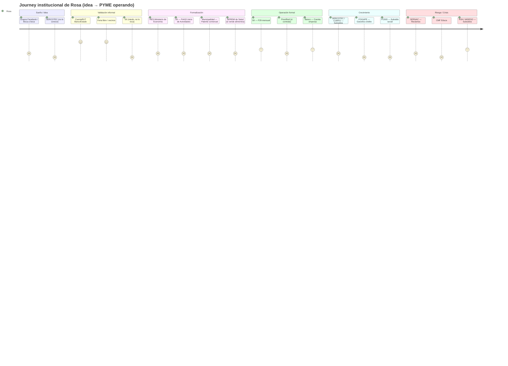

# Perfil Persona

<!-- AUTO-BANNER -->
!!! success ":material-check-bold: Producido por el equipo"
    Documento canónico de Design Thinking. Sintetiza el research de [Segmentos y dolores](../competencia/research/usuarios/segmentos-y-dolores.md), el mapa de [Dolores del journey](./dolores.md) (48 dolores, 6 etapas) y el análisis de [Stakeholders](./definiciones/stakeholders.md). Antecede al [PRD](./PRD.md) por diseño: el problema justifica el producto, no al revés.

---

## Por qué este documento existe antes del PRD

El Impact Lab evalúa impacto cívico con un 25 % de peso. Ese criterio exige responder cuatro preguntas antes de escribir una sola línea de código:

1. **¿Quién es el ciudadano específico al que ayudamos?**
2. **¿Qué problema concreto resuelve y cómo era su vida sin la solución?**
3. **¿Hay evidencia de que ese problema existe?**
4. **¿Cuál es la magnitud del beneficio?**

Este documento responde las cuatro. Es el resultado de las etapas **Empatizar** y **Definir** del Design Thinking aplicadas al research acumulado del equipo.

---

## El ciudadano al que servimos

### Rosa, 38 — Microemprendedora informal, jefa de hogar

> *Persona primaria. Sub-segmento priorizado por el PDF de estrategia de Literacy Regulatoria (2026-04-29). Pendiente de validación con entrevistas reales.*

| Dimensión | Detalle |
|---|---|
| **Edad / contexto** | 38 años. Jefa de hogar, 2 hijos (8 y 14 años). Pareja con trabajo informal esporádico. |
| **Ubicación** | Región del sur de Chile (Araucanía, Los Lagos o Los Ríos). Zona urbana periférica o semi-rural. |
| **Negocio** | Vende comida casera (empanadas, cazuelas, pasteles) o artesanías por WhatsApp y en la feria semanal del barrio. Factura estimada: 300.000–600.000 CLP/mes. |
| **Situación financiera** | NSE D-E. Recibe subsidio habitacional (RSH tramo medio). Mezcla cuentas personales (CuentaRUT) con los cobros del negocio. Sin historial crediticio formal. |
| **Tecnología** | Smartphone Android de gama baja. WhatsApp como canal central de ventas, cobros y comunicación. Usa Instagram para mostrar fotos del producto. Sin computador propio. |
| **Relación con el Estado** | Sabe que el SII existe y le da miedo. Asocia «formalización» con «perder subsidios» y «pagar más». Ha oído hablar de SERCOTEC pero nunca postuló. No conoce FOGAPE, FOSIS ni ChileAtiende. |
| **Validada** | :x: false — pendiente de 5+ entrevistas reales |

#### Job-to-be-done principal

> *«Cuando mi negocio crece y un colegio me pide factura, quiero entender exactamente qué tengo que hacer para formalizarme sin perder mis beneficios, para poder vender a clientes más grandes y dejar de depender solo del barrio.»*

#### Dolores nucleares (síntesis del journey)

- **Miedo paralizante al SII:** cree que formalizar es sinónimo de auditorías, multas y pérdida de subsidios. La información que consume (grupos de Facebook, boca a boca) amplifica el miedo con mitos.
- **Barrera de lenguaje regulatorio:** los trámites del SII, el RES y la Municipalidad usan términos («objeto social», «inicio de actividades», «crédito fiscal IVA») que le resultan incomprensibles y la llevan a abandonar a mitad del proceso.
- **Journey fragmentado entre agencias que no conversan:** para formalizar debe tocar al menos 4 ventanillas distintas (RES → SII → Municipalidad → SEREMI de Salud) que no se sincronizan. Nadie le explica el orden correcto ni los pasos pendientes.
- **Soledad total:** no tiene contador (cuesta 30.000–80.000 CLP/mes), no conoce a nadie en su red que haya formalizado, y los programas de SERCOTEC le quedan lejos geográfica y cognitivamente.
- **Costo de oportunidad invisible:** pierde clientes B2B (colegios, restaurantes, empresas) que le piden factura. Cada mes de informalidad es dinero que no entra.

#### Un día en la vida de Rosa (sin la solución)

Las 6:00 AM Rosa hornea para entregar a las 9:00. Cobra por transferencia a su CuentaRUT personal. Un director del colegio del barrio le dice que podría comprarle 50 empanadas semanales «pero necesito que me hagas factura». Rosa le dice que lo va a averiguar. Busca en Google «cómo hacer factura en Chile» y llega al sitio del SII. Lee sobre el Formulario 4415, el Inicio de Actividades y el sistema DTE. No entiende. Cierra la pestaña. Le dice al director que «todavía no puede» y pierde el cliente. Ese mismo día recibe un mensaje de SERNAC que no entiende. Lo ignora. En la noche revisa el grupo de Facebook «Emprendedoras del Sur» y alguien escribe: *«nunca se formalicen, el SII te cobra todo»*. Rosa lo toma como consejo experto.

#### Frase representativa

> *«Yo sé que debería formalizarme, pero tengo miedo a que me lleguen problemas con el SII y además pierda el subsidio. Mejor así, aunque no pueda facturar.»*

---

## Persona secundaria: Felipe, 29 — Microemprendedor digital informal

> *Segmento secundario: jóvenes con negocio online que crecen rápido y choca contra la barrera de facturación B2B.*

| Dimensión | Detalle |
|---|---|
| **Contexto** | Vende streetwear propio por Instagram. Opera desde Santiago. Factura ~800.000 CLP/mes. |
| **Dolor específico** | Una tienda multimarca le quiere comprar stock al por mayor, pero necesita factura. Tiene el dinero para formalizarse, pero no sabe cómo ni cuánto tarda. |
| **Tecnología** | Alto dominio digital. El problema no es tecnológico: es de literacy regulatoria. |
| **Job-to-be-done** | *«Cuando un negocio más grande me quiere comprar, quiero formalizarme en días y sin contratar un contador, para no perder esa oportunidad.»* |
| **Validada** | :x: false |

---

## Mapa de stakeholders institucionales en el journey de Rosa

El journey de Rosa no es solo un proceso lineal: es una red de actores estatales, privados y comunitarios con los que debe interactuar. Muchos de ellos generan fricción sin saberlo.



### Tabla de actores y rol en el journey

| Actor | Tipo | Rol en el journey de Rosa | Fricción actual | Oportunidad Tu Plata Mipyme |
|---|---|---|---|---|
| **SII** | Regulador tributario | Requisito de formalización (F4415, F29, DTE) | Lenguaje técnico, miedo, multas por desconocimiento | RAG con normativa SII; recordatorios F29; desmitificación |
| **RES** (Min. Economía) | Plataforma estatal | Constitución de sociedad | 35-40 % abandona el borrador por dudas técnicas | Asistente paso a paso para completar campos |
| **Municipalidad** | Gobierno local | Patente comercial; permisos de funcionamiento | Cero API; variedad entre comunas; tramitación presencial | Dataset de top-50 comunas + handoff humano |
| **SEREMI de Salud** | Regulador sanitario | Resolución sanitaria (venta de alimentos) | Requisitos infraestructurales desconocidos | Checklist conversacional previo al trámite |
| **BancoEstado / CuentaRUT** | Banco público | Canal de cobro y pagos | Bloqueo por actividad sospechosa (Ley 21.713) | Warning proactivo sobre umbral 50/100 transferencias |
| **SERCOTEC** | Fomento productivo | Subsidios Capital Semilla, Crece, Mujer Emprendedora | >50 % rechazo por postulaciones mal formuladas | Entrevistador Canvas + guion pitch asistido |
| **CORFO** | Fomento | Garantías FOGAPE, Subsidio Semilla Inicia | Desconocimiento total en NSE D-E | Desmitificador FOGAPE + eligibility checker |
| **FOSIS** | Social | Subsidios Emprendamos Semilla (350K-750K CLP) | Requiere RSH específico; Rosa no sabe que aplica | Cruce de perfil RSH con convocatorias abiertas |
| **RSH / MIDESO** | Beneficios sociales | Tramo de vulnerabilidad; impacta subsidios | Rosa teme perder beneficios al formalizarse | Información factual sobre impacto real de la formalización |
| **CMF Educa** | Educación financiera | Información sobre productos financieros | No llega al segmento D-E por canal web | Contenido traducido al idioma de Rosa vía WhatsApp |
| **SERNAC** | Defensa del consumidor | Derechos de Rosa como consumidora y proveedora | Rosa no conoce que puede reclamar | Derivación cuando corresponde |
| **ChileAtiende** | Portal trámites | Centraliza requisitos de trámites | API con access token; no llega a nivel comunal | MCP ChileAtiende para fichas de trámites |

---

## Cadena Causa → Problema → Producto

La siguiente cadena convierte el contexto social en justificación del producto:

```
CAUSA RAÍZ
Chile bancarizó al 91 % de los adultos (CuentaRUT: 14,6 M titulares).
El acceso resolvió la exclusión financiera de primera capa.
                    │
                    ▼
BRECHA ESTRUCTURAL
Bancarizar ≠ incluir financieramente.
1,08 M microemprendedores informales (INE EME8) tienen acceso al sistema
pero no comprenden las normas que lo rigen.
59 % son mujeres. 38 % de informalidad en la Araucanía.
                    │
                    ▼
CONSECUENCIA CONCRETA
Rosa no puede vender a clientes B2B porque no puede facturar.
Pierde entre 200.000–500.000 CLP mensuales en oportunidades B2B.
No postula a SERCOTEC porque no entiende los formularios.
No usa FOGAPE porque cree que es un regalo, no un aval.
Teme formalizarse porque cree que perderá subsidios (mito).
                    │
                    ▼
AMPLIFICADOR DEL PROBLEMA
El sistema de información disponible para Rosa:
  - Sitios del SII/Municipalidad: lenguaje técnico, acceso por PC
  - Grupos de Facebook: mitos y desinformación
  - Contador: 30.000-80.000 CLP/mes que Rosa no puede pagar
  - SERCOTEC: presencia geográfica limitada al sur
Resultado: Rosa toma decisiones críticas sobre su negocio
con información incorrecta o nula.
                    │
                    ▼
OPORTUNIDAD
WhatsApp tiene >95 % de penetración en el segmento.
Rosa ya lo usa para vender, cobrar y comunicarse.
La IA conversacional puede traducir norma a lenguaje cotidiano,
mantener contexto entre etapas del journey, y estar disponible
24/7 donde ninguna sucursal llega.
                    │
                    ▼
SOLUCIÓN: Tu Plata Mipyme
Co-piloto freemium en WhatsApp + Web que acompaña a Rosa
desde el sueño hasta la PYME, con agentes IA especializados
por etapa que hablan en su idioma y citan la norma.
```

---

## Evidencia: magnitud del problema

> Fuentes: [Segmentos y dolores](../competencia/research/usuarios/segmentos-y-dolores.md) — verificar cifras antes de citar en el pitch.

| Métrica | Valor | Fuente |
|---|---|---|
| Microemprendedores informales Chile | **1,08 M** (54 % del total microempresas) | INE EME8 |
| Proporción mujeres en informalidad | **59 %** | INE EME8 |
| Tasa informalidad Araucanía | **38 %** | INE |
| Rechazo crédito microempresa | **19 %** | Encuesta CMF |
| Tasa rechazo subsidios SERCOTEC | **>50 %** por postulaciones mal formuladas | Sercotec Cuenta Pública |
| Alfabetización financiera Chile | **45 %** (vs 58 % promedio OCDE) | OECD/INFE 2023 |
| Reclamos SERNAC 2024 | **682.000** | SERNAC Cuenta Pública 2024 |
| Morosos en Chile | **4,01 M** (25,2 % adultos) | USS-Equifax Q1 2026 |
| Costo contador mensual | **30.000–80.000 CLP/mes** — inaccesible para NSE D-E | Research equipo |
| Pérdida mensual estimada por no facturar (B2B) | **200.000–500.000 CLP** por microemprendedor | Proyección equipo |

### Impacto potencial de Tu Plata Mipyme

Si el producto logra que **1 de cada 100** microemprendedores informales dé el salto a la formalización con información correcta:

- **10.800 personas** dejan de perder oportunidades B2B
- Acceden a subsidios SERCOTEC/FOSIS que hoy desconocen
- Reducen riesgo de multas SII por informalidad no gestionada
- Generan historial tributario que habilita acceso a crédito formal

Si logra que **1 de cada 10** postule correctamente a SERCOTEC (vs el >50 % de rechazo actual):

- **108.000 postulaciones** mejor formuladas
- Aumento real de la tasa de adjudicación de fondos productivos
- Impacto en empleo y formalización a nivel regional

---

## Lo que Rosa NO necesita (scope guard)

Definir el scope negativo es tan importante como el positivo. Tu Plata Mipyme **no** reemplaza:

| Lo que Rosa necesita | Quién lo resuelve | Tu Plata Mipyme |
|---|---|---|
| Firmar declaraciones tributarias (F29) | Rosa lo hace en el SII | Recuerda, explica, guía — no firma |
| Asesoría contable compleja (F22 anual) | Contador del Marketplace | Deriva con contexto |
| Representación en disputas legales | Abogado del Marketplace | Deriva con contexto |
| Certificar capacitaciones (SENCE/OTEC) | OTEC certificadas | Fuera del scope |
| Reemplazar a SERCOTEC | SERCOTEC | Complementa y deriva |
| Competir con BancoEstado | Banco | Orienta sobre productos existentes |

---

## Implicancias de diseño (de la persona al producto)

Estos insights de Rosa deben traducirse en decisiones de diseño no negociables:

1. **WhatsApp es ciudadano de primera clase.** Rosa no tiene PC. Toda la experiencia crítica debe funcionar desde móvil con conectividad intermitente.
2. **Lenguaje sin jerga.** Cada respuesta que mencione «F4415», «DTE» o «crédito fiscal IVA» debe venir acompañada de su traducción al lenguaje de Rosa.
3. **Citar la norma siempre.** La confianza de Rosa se construye demostrando que la IA no improvisa: «según el Art. 8 bis del Código Tributario, el SII presume tu buena fe».
4. **El miedo al SII es el enemigo #1.** Cada interacción en etapas E0–E2 debe desmitificar proactivamente antes de que Rosa lo pregunte.
5. **Freemium real.** El trigger para pagar debe aparecer solo cuando hay valor monetario claro («con esto puedes ganar 200K más al mes»). Cero upsell agresivo.
6. **Gratis y anónimo.** Cualquier fricción de registro antes de la primera respuesta mata la adopción. Rosa no se va a registrar para «ver si sirve».
7. **Contexto entre etapas.** El expediente del usuario debe viajar entre los agentes: lo que Rosa dijo en E1 debe recordarse en E2 sin pedirle que repita.
8. **Derivación con contexto, no con abandono.** Cuando el problema supera a la IA (abogado, contador), Rosa recibe una derivación al Marketplace *con su contexto ya preparado*, no un «consulta a un profesional».

---

## Backlog de validación (Design Thinking — etapa Empatizar)

- [ ] **5–10 entrevistas** con mujeres microemprendedoras informales del sur (familia, redes, grupos Facebook «Emprendedoras del Sur», ferias libres). Guion en [PDF de estrategia](../assets/research/2026-04-29-estrategia-literacy-regulatoria.pdf), p. 9.
- [ ] Al menos **2 quotes-impacto** textuales para el pitch («en sus propias palabras»).
- [ ] Encuesta corta para validación cuantitativa (≥30 respuestas).
- [ ] Mostrar el demo a Rosa o alguien equivalente en día 5 y grabar reacción en video.
- [ ] Confirmar o refinar el sub-segmento priorizado con evidencia de entrevistas.
- [ ] Actualizar `validada: true` en este documento y en [Personas](./definiciones/personas.md) cuando haya evidencia.

---

## Referencias cruzadas

| Documento | Relación |
|---|---|
| [Segmentos y dolores](../competencia/research/usuarios/segmentos-y-dolores.md) | Fuente primaria de datos macro y sub-segmento priorizado |
| [Dolores del journey (48 dolores)](./dolores.md) | Detalle de cada dolor por etapa, con decisión del equipo |
| [Stakeholders](./definiciones/stakeholders.md) | Mapa de actores a nivel producto |
| [Personas](./definiciones/personas.md) | Fichas de personas (incluir aquí las validadas con entrevistas) |
| [PRD](./PRD.md) | El producto que justifica este perfil |
| [Qué es y para quién](./que-es.md) | Definición canónica del producto |
| [Línea temática Inclusión Financiera](../competencia/lineas-tematicas/inclusion-financiera.md) | Contexto del Impact Lab |
